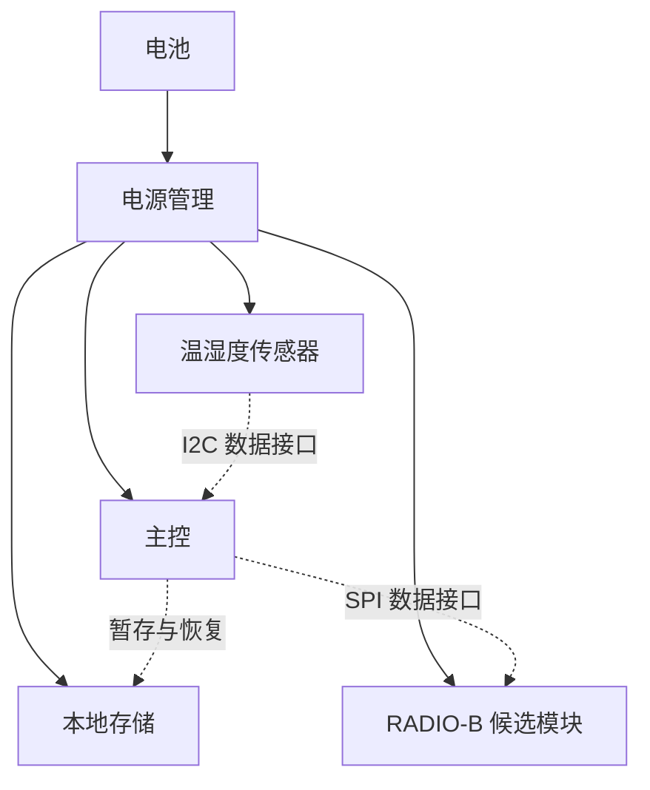

# W2：从企业资料形成一份硬件设计草案

> 创造类贯穿示例：为仓储场景设计温湿度记录器，交付一份有依据、可复算、可评审的设计成果。

澄川设备是一家虚构的仓储监测硬件企业。团队准备在 W1 基础上开发 W2，希望沿用既有外壳与安装方式，减少电池更换，并控制单台材料成本。研发负责人委托 Agent 准备方案评审材料。

企业背景是向已有监测点位的仓储客户出售设备，探索通过兼容升级减少现场维护负担。W2 开发是实现这一目的的一项举措，需要低功耗设计、产品验证和供应保障等能力，由产品、硬件、测试和采购角色共同承担。企业背景及角色安排均为教学设定，统一记录在 [BRIEF-W2@r1](https://github.com/LENSHOOD/enterprise-context-book/blob/main/examples/hardware-design/enterprise-brief.md)。

业务效果与设计性能分别验证。两年续航和沿用安装位置可以支持减少维护的设想，但客户实际少跑了多少次现场，还需要维护记录、明确的统计口径和可比条件。材料预算也只约束一部分成本，不能单独说明产品是否盈利。第八章会把这条从客户价值到工程要求、再到实际反馈的联系逐步建模。

这里的成果是一份新设计草案 W2-D0：它决定采用怎样的硬件结构、工作节奏和候选模块，给出预算，并将需求关联到后续验证。所有器件代号、价格和电量数值都是教学设定，没有对应真实报价或样机实测。草案进入评审，尚未成为可采购、可生产的产品设计。

## 1. 先明确要交付什么

任务要求是：“基于 W1 的复用约束，为 W2 形成硬件方案草案。正常联网时每分钟采样、每五分钟上报，连续工作目标为两年，单台材料预算不超过 80 元。给出框图、候选 BOM、功耗预算、接口说明、需求追踪与验证计划，并列出尚未确认的事项。”

BOM 是物料清单。本例预算覆盖主控、传感器、电源管理、存储、PCB、电池、外壳及无线模块，不包含研发、认证、税费和物流。两年按 2×365 天折算为 17,520 小时。测量范围与误差指标尚待产品负责人确认，这个缺口必须随草案交付。

需求编号分别为 R-SAMPLE、R-UPLOAD、R-LIFE、R-BOM、R-MECHANICAL 和 R-MEASUREMENT。前四项用于时序配置与数值初筛，后两项用于结构复用及测量验证的追踪。计算通过不会把未确认需求或待做试验自动变成合格。

## 2. 上下文中准备哪些材料

| 来源及版本 | 提供什么 | 在本例中的证据状态 |
|---|---|---|
| REQ-W2@r1 | 采样、上报、续航、预算和待确认需求 | 教学需求设定 |
| MECHANICAL-W1@r1 | 复用外壳与安装孔的约束 | 教学约束，未提供实际 CAD |
| W1-POWER@r1 | 待机与采样阶段的电量输入 | 模拟输入，全部折算到电池输入端 |
| CAPACITY@r1 | 可分配电量预算 1,680 mAh | 教学规划假设，尚未验证真实电池可用容量 |
| BOM-BASE@r1 | 不含无线模块的共同材料估值 48 元 | 教学估值 |
| RADIO-A@r1、RADIO-B@r1 | 两个虚构同接口候选的增量电量与材料估值 | 教学候选数据，驱动与电气条件仍待评审 |

这些材料固定为输入快照 w2-inputs-r1。设计记录同时绑定快照名和内容散列；即使快照名字没有改，输入数值变化也会使旧草案的检查失败。真实项目中，还应绑定需求发布版、原理图与结构版次、器件规格及替代料记录。

企业背景 BRIEF-W2@r1 单独管理，不属于上述工程计算快照。它提供目标、能力、责任和拟建应用的建模依据，目前由读者人工核对；预算检查器不读取该文件，也没有部署其中的 PLM、物料、测试或售后系统。改变商业目标后，需要先评审是否修改工程要求，再形成相应的新输入与草案。

需求到设计、验证及变更的追踪，是系统工程中的一项基础工作。可以参考 NASA 对需求识别、分配、双向追踪和基线变更的说明；本例仅采用其中的追踪思路。[需求管理方法](https://www.nasa.gov/reference/6-2-requirements-management/)

## 3. Agent 形成的设计草案

W2-D0 提出采用 RADIO-B，并将每次采样与每次上传分开安排：主控每 60 秒唤醒采样并暂存，正常联网时每 300 秒批量上传此前的样本，其他时间进入待机。出现连接失败时记录状态并限制重试，重试电量须在后续工况模型中补充，不能无限重发。



实线表示供电关系，虚线表示数据接口。图中的电平、启动顺序、掉电行为、信号时序和天线位置都需要在下一轮接口与原理图评审中确定。框图使各专业可以讨论同一方案，不能据此认定电路已可工作。

| 草案组成 | W2-D0 的内容 |
|---|---|
| 硬件结构 | 主控连接传感器、存储和无线模块，复用 W1 结构约束 |
| 工作节奏 | 60 秒采样、300 秒上传，采样与通信分开唤醒 |
| 候选 BOM | 共同材料包加 RADIO-B，保留 RADIO-A 比较结果 |
| 接口说明 | 传感器采用 I2C，无线模块采用 SPI；电气与时序待核对 |
| 需求追踪 | 每条需求关联设计章节和验证项 |
| 验证计划 | 时序、功耗、成本、装配、测量及后续专项检查 |

这一结果把分散输入组合成了此前不存在的结构、节奏和验证安排。选择无线模块只是其中一步；交付物是可以被讨论、修改和验证的整份方案。

## 4. 用预算检查推动设计

本例把功耗统一到电池输入端，两种候选的整机待机电流均按 20 μA 设定。待机电流持续计入；采样和上传使用相对待机增加的单次电量，避免把同一段待机消耗重复相加。采样电量包含本例假定的采样与暂存活动，上报电量是名义工况下的固定输入。

| 参数 | 教学输入 |
|---|---:|
| 待机电流 | 20 μA |
| 每次采样增量电量 | 0.02 μAh |
| RADIO-A 每次上传增量电量 | 8 μAh |
| RADIO-B 每次上传增量电量 | 3 μAh |
| 每小时采样次数 | 60 |
| 每小时上传次数 | 12 |

平均电流为：待机电流 + 单次采样增量电量 × 每小时采样次数 + 单次上传增量电量 × 每小时上传次数。μAh 乘以每小时的事件次数，得到 μA。目标期间所需电量为平均电流 × 17,520 小时，再从 μAh 换算为 mAh。

| 候选 | 平均电流 | 目标期间估算耗电 | 材料估值 | 初筛结果 |
|---|---:|---:|---:|---|
| RADIO-A | 117.2 μA | 2,053.344 mAh | 48 + 16 = 64 元 | 超过 1,680 mAh 电量预算 |
| RADIO-B | 57.2 μA | 1,002.144 mAh | 48 + 24 = 72 元 | 通过教学功耗与材料预算初筛 |

不能为使 RADIO-A 通过而偷偷将上报周期延长到十分钟，那会违反 R-UPLOAD。需求、计算和方案必须一起检查。脚本也包含这一反例：即使延长周期降低了估算电量，只要上报配置超出要求，草案检查仍不通过。

真实寿命还受负载、温度、老化、自放电、脉冲、电源转换、数据包和重试等因素影响。改变工况后，要取得新的输入再计算。厂商功耗计算器也以特定器件及使用场景参数形成估算，例如 TI 的低功耗无线计算工具；本例数值没有取自该工具。[功耗与寿命估算工具](https://www.ti.com/tool/BT-POWER-CALC)

## 5. 需求、设计和验证怎样连接

| 需求 | 草案中的对应内容 | 验证项及当前状态 |
|---|---|---|
| R-SAMPLE、R-UPLOAD | 工作节奏与缓存安排 | V-TIMING：计划在样机核对正常及异常联网时序 |
| R-LIFE | 功耗预算与工作节奏 | V-POWER：计划测量电流波形并核对电池可用容量 |
| R-BOM | 候选物料与材料预算 | V-COST：计划核实数量、报价和供应条件 |
| R-MECHANICAL | W1 外壳与安装孔复用 | V-FIT：计划进行结构、天线空间与装配核对 |
| R-MEASUREMENT | 待确认范围与误差 | V-MEASUREMENT：先确认需求，再安排参考设备测试 |

软件检查目前证明的是预算计算和引用覆盖。它没有执行电路仿真、样机测试、环境试验或量产验证。检查输出的 physical_verified 和 production_release_allowed 均为 false，设计状态保持 draft。

硬件、固件、测试、采购和结构负责人据此分别提出评审意见。若某项源数据变化，先更新输入快照并形成新的设计修订，再重跑相关计算及追踪检查；如果评审批准试制，还要另行确定采购、制造和试验权限。

## 6. 亲自复算

在仓库根目录运行，不需要模型服务或第三方 Python 依赖：

```bash
python3 examples/hardware-design/check_design.py
python3 -m unittest discover -s examples/hardware-design/tests -v
```

默认结果为 draft_ready_for_review，所选 RADIO-B 的预算通过，但物理验证和生产发布仍为 false。将输入中的可分配电量改小而不更新草案绑定，检查器先拒绝使用已变化的上下文；重新建立匹配输入后，再计算是否仍满足预算。这个例子演示的是“生成草案—核对依据—检查约束—带着未决项评审”。

配套文件：[输入快照](https://github.com/LENSHOOD/enterprise-context-book/blob/main/examples/hardware-design/inputs.json)、[结构化草案](https://github.com/LENSHOOD/enterprise-context-book/blob/main/examples/hardware-design/design.json)、[检查器](https://github.com/LENSHOOD/enterprise-context-book/blob/main/examples/hardware-design/check_design.py)、[运行说明](https://github.com/LENSHOOD/enterprise-context-book/blob/main/examples/hardware-design/README.md)。

## 7. 在全书中怎样跟随这个例子

第 1 章用 W2 引出创造类问题，第 3 章说明资源如何进入新设计。第 4 章准备企业背景和工程来源，第 5 章查找依据，第 6 章从续航要求追查企业目标，第 7 章形成产品与能力阅读视图；第 8 章建立客户价值、目标、能力、组织、应用与运行的联系，再展开需求、设计、器件及验证对象；第 9 章组织设计任务的上下文。第 10—13 章继续讨论草案工作空间、版本变化、发布权限和创造任务的验收。这里集中保存完整样例，便于对照各章。
