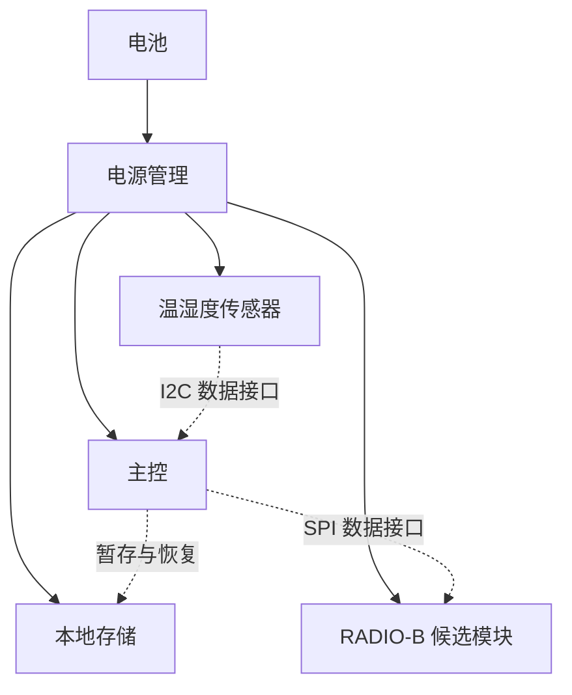

# W2：从企业资料形成一份软硬件协同设计草案

> 创造类贯穿示例：为仓储场景设计温湿度记录器，交付一份有依据、可复算、可评审的设计成果。

澄川设备是一家虚构的仓储监测设备企业，同时研发设备硬件和嵌入式软件。团队准备在 W1 基础上开发 W2，希望沿用既有外壳与安装方式，减少电池更换，并控制单台材料成本。研发负责人委托 Agent 准备方案评审材料。

企业背景是向已有监测点位的仓储客户出售设备，探索通过兼容升级减少现场维护负担。W2 开发需要低功耗设计、嵌入式软件研发、产品验证和供应保障等能力，由产品、硬件、固件、测试和采购角色共同承担。企业背景及角色安排均为教学设定，统一记录在 [BRIEF-W2@r2](https://github.com/LENSHOOD/enterprise-context-book/blob/main/examples/hardware-design/enterprise-brief.md)。

业务效果与设计性能分别验证。两年续航和沿用安装位置可以支持减少维护的设想，但客户实际少跑了多少次现场，还需要维护记录、明确的统计口径和可比条件。材料预算也只约束一部分成本，不能单独说明产品是否盈利。第八章会把这条从客户价值到工程要求、再到实际反馈的联系逐步建模。

这里的成果是一份新设计草案 W2-D1：它规定硬件结构、软件模块、工作节奏、候选物料和故障处理方式，给出预算，并将需求关联到验证。配套代码可复算预算，也可在电脑上运行软件行为模型。所有器件、报价和测量输入都是教学设定；行为模型不含真实驱动和可刷写固件，草案也尚未成为可采购、可生产的产品设计。

## 1. 先明确要交付什么

任务要求是：“基于 W1 的复用约束，为 W2 形成软硬件协同方案草案。正常运行和联网时每分钟采样、每五分钟上报，连续工作目标为两年，单台材料预算不超过 80 元。给出硬件框图、候选 BOM、功耗预算、软件模块和接口约定，说明断网、传感器错误和重启时怎样处理数据，并提供需求追踪与验证计划。”

BOM 是物料清单。本例预算覆盖主控、传感器、电源管理、存储、PCB、电池、外壳及无线模块，不包含研发、认证、税费和物流。两年按 2×365 天折算为 17,520 小时。测量范围与误差指标尚待产品负责人确认，这个缺口必须随草案交付。

需求编号分别为 R-SAMPLE、R-UPLOAD、R-LIFE、R-BOM、R-MECHANICAL 和 R-MEASUREMENT。前四项用于时序配置与数值初筛，后两项用于结构复用及测量验证的追踪。计算通过不会把未确认需求或待做试验自动变成合格。

同一要求会同时分配给硬件和软件。每分钟采样要求传感器和总线能及时给出结果，也要求固件正确调度；两年续航既依赖器件耗电，也依赖休眠和重试策略。Agent 需要把两侧的设计放在一起评审，避免硬件预算按低频通信计算，固件却在断网时不断重发。

## 2. 上下文中准备哪些材料

| 来源及版本 | 提供什么 | 在本例中的证据状态 |
|---|---|---|
| REQ-W2@r1 | 采样、上报、续航、预算和待确认需求 | 教学需求设定 |
| MECHANICAL-W1@r1 | 复用外壳与安装孔的约束 | 教学约束，未提供实际 CAD |
| W1-POWER@r1 | 待机与采样阶段的电量输入 | 模拟输入，全部折算到电池输入端 |
| CAPACITY@r1 | 可分配电量预算 1,680 mAh | 教学规划假设，尚未验证真实电池可用容量 |
| BOM-BASE@r1 | 不含无线模块的共同材料估值 48 元 | 教学估值 |
| RADIO-A@r1、RADIO-B@r1 | 两个虚构同接口候选的增量电量与材料估值 | 教学候选数据，驱动与电气条件仍待评审 |
| FW-W2@r1 | 队列、重试、确认和恢复约定 | 教学软件策略，部分行为已有主机测试，目标板尚未验证 |

这些材料固定为输入快照 w2-inputs-r2。设计记录同时绑定快照名和内容散列；即使快照名字没有改，输入数值变化也会使旧草案的检查失败。真实项目中，还应绑定需求发布版、原理图与结构版次、器件规格及替代料记录。

企业背景 BRIEF-W2@r2 单独管理，不属于上述工程计算快照。它提供目标、能力、责任和拟建应用的建模依据，目前由读者人工核对；预算检查器不读取该文件，也没有部署其中的 PLM、物料、测试或售后系统。改变商业目标后，需要先评审是否修改工程要求，再形成相应的新输入与草案。

需求到设计、验证及变更的追踪，是系统工程中的一项基础工作。可以参考 NASA 对需求识别、分配、双向追踪和基线变更的说明；本例仅采用其中的追踪思路。[需求管理方法](https://www.nasa.gov/reference/6-2-requirements-management/)

在真实研发中，还需要取回固件代码提交、板级配置、传感器驱动、消息协议、历史缺陷和构建测试记录。它们必须与原理图、器件版本相匹配。W2 没有提供真实 W1 固件，软件约定保存在 [FW-W2@r1](https://github.com/LENSHOOD/enterprise-context-book/blob/main/examples/hardware-design/firmware-contract.md)，不能把教学模型当成从旧产品验证过的代码复用。

## 3. Agent 形成的设计草案

W2-D1 提出采用 RADIO-B，并将每次采样与每次上传分开安排：主控每 60 秒唤醒采样并暂存，正常联网时每 300 秒批量上传此前的样本，其他时间进入待机。出现连接失败时记录状态并限制重试，重试电量须在后续工况模型中补充，不能无限重发。



实线表示供电关系，虚线表示数据接口。图中的电平、启动顺序、掉电行为、信号时序和天线位置都需要在下一轮接口与原理图评审中确定。框图使各专业可以讨论同一方案，不能据此认定电路已可工作。

| 草案组成 | W2-D1 的内容 |
|---|---|
| 硬件结构 | 主控连接传感器、存储和无线模块，复用 W1 结构约束 |
| 工作节奏 | 60 秒采样、300 秒上传，采样与通信分开唤醒 |
| 候选 BOM | 共同材料包加 RADIO-B，保留 RADIO-A 比较结果 |
| 接口说明 | 传感器采用 I2C，无线模块采用 SPI；电气与时序待核对 |
| 固件模块 | 驱动适配、事件调度、记录队列、批量通信、故障诊断与休眠协调 |
| 异常行为 | 失败限次重试、未确认数据保留、接收端去重、队列满明确报缺口 |
| 需求追踪 | 每条需求关联设计章节和验证项 |
| 验证计划 | 时序、功耗、成本、装配、测量及后续专项检查 |

这一结果把分散输入组合成了此前不存在的结构、节奏和验证安排。选择无线模块只是其中一步；交付物是可以被讨论、修改和验证的整份方案。

## 4. 嵌入式软件怎样让方案真正运转

### 4.1 从“每分钟采样”拆到软件责任

先看一次正常运行。固件被定时事件唤醒，调用传感器适配接口，检查读数是否有效，再为记录分配序号并保存。到了上传时刻，它取出尚未确认的记录，交给通信模块；收到对应确认后才清理队列。没有工作时，调度模块计算下一个唤醒点，板级电源管理再决定哪些外设和处理器可以休眠。

本例让一个事件循环持有队列和上传状态，减少“一个任务正在发送，另一个任务已经把记录删了”的问题。选择裸机循环还是实时操作系统（RTOS），应根据外设、实时性和团队已有平台决定。采用 RTOS 时，也要明确哪个任务拥有状态、任务之间通过什么消息交接。

| 模块 | 负责什么 | 要从企业上下文取得什么 |
|---|---|---|
| 驱动适配 | 传感器读取、存储、通信及电源接口 | 板次、引脚、I2C/SPI约定、驱动版本、超时与错误定义 |
| 采样与调度 | 安排60秒采样、300秒上传及重试 | 产品要求、时钟条件、允许的延迟和历史调度缺陷 |
| 记录队列 | 保存未确认记录，维护设备身份与递增序号 | 数据格式、保留策略、存储容量和掉电约定 |
| 通信与确认 | 发送批次，核对确认，避免重复计数 | 消息版本、确认规则、接收端去重和认证要求 |
| 诊断与恢复 | 报告缺口，恢复记录，安排后续验证 | 故障分类、日志字段、现场问题及测试记录 |

因此，代码仓知识库在这里也有用：它可以帮助定位调度入口、驱动接口和对应测试。企业模型再把这些代码连接到需求、负责团队和验证结果。仅找到一个名为 `upload` 的函数，还不足以判断它符合当前产品协议。

### 4.2 正常流程之外，先约定数据怎样保留

假设第300秒接收端已经收到了5条记录，设备却没有收到确认。如果固件一发送就删除，便可能在真正发送失败时丢失数据；如果重发后接收端照单再记一次，又会产生重复。W2 选择先保存再发送，未确认就保留；接收端以设备身份和记录序号识别重复。教学协议采用整批确认，真实协议还需确认认证、完整性和超时关联。

这项决定继续影响掉电恢复。接收端确认后，本地清理过程中也可能断电，所以记录和序号需要能从一个完整提交恢复。配套 `MemoryJournal` 只模拟提交成功或失败，重建 `Device` 时复用同一份日志；没有模拟真实Flash写入。上板后还要验证掉电时的记录格式、提交点和恢复行为。littlefs 等存储实现讨论了掉电恢复和原子操作，但使用文件系统后仍需确定应用记录何时提交，以及序号和记录是否共同保存。[littlefs](https://github.com/littlefs-project/littlefs)

断网也不能无限重试。本例首次上传失败后等待10秒，再失败后等待20秒，最多尝试3次，然后等下一上传窗口。采样继续进行，最多保存32条未确认记录；队列满时保留旧记录、拒绝本次新样本并报告缺口。这些数值是教学设计选择，必须由产品、固件和测试人员共同评审。

重启后，有积压记录就优先尝试发送，但采样从启动后60秒重新安排。因此重启停机不在正常60秒间隔保证之内，也不能靠重启补出过去没有采到的数据。若调度本身延迟，模型只记录当前读数，并报告错过了几次采样。实际固件还需要看门狗、复位原因、启动风暴限制和时间质量标记。

### 4.3 先在电脑上验证行为，再接真实驱动

`firmware_model.py` 是用 Python 编写的主机行为模型，用模拟传感器、日志和接收端表达上述约定。`Device.tick()` 接收一个时间点，处理到期工作；通信调用把一次尝试看作已经完成的事件。在真实固件中，长操作应拆为开始、完成回调和超时，避免等待网络时阻塞采样。本模型不模拟中断、RTOS竞争或驱动执行时间。

可以沿三个入口阅读实现：`Device.tick()` 说明调度与重试，`MemoryJournal` 说明先提交后发送及确认清理，`Receiver.send()` 说明确认丢失和去重。修改策略后，先运行主机测试验证行为，再移植到目标环境。这样的分层也见于 Zephyr 的测试工具：Twister 区分构建、模拟环境运行和真实硬件运行，报告需要说明究竟完成了哪一种。[Zephyr Twister](https://docs.zephyrproject.org/latest/develop/test/twister.html)

| 场景 | 配套模型实际检查的行为 |
|---|---|
| 正常运行600秒 | 采集10条，分两次发送，未确认队列清空 |
| 确认丢失后重启 | 已保存记录重新送达，接收端识别5次重复；最终仍是10条独立记录 |
| 第一个上传窗口持续断网 | 在300、310、330秒尝试，随后等待600秒；到599秒保留9条记录 |
| 队列满、读取失败或调度延迟 | 分别报告拒绝采样、传感器错误或错过周期，不能伪装成完整数据 |
| 接收端已确认，本地清理失败 | 本地仍保留旧批次，恢复后允许重发并去重 |

场景检查通过表示行为符合约定，不表示没有数据缺口。例如把队列缩小到5条，断网场景会报告4次队列满。报告中的 `data_gaps` 和 `all_scheduled_samples_retained` 帮助读者看到这种代价；不能只读一个“通过”标志。

### 4.4 固件变更怎样回到产品设计

如果固件为了改善网络成功率增加重试次数，硬件原有功耗预算就需要重新核对；如果更换无线模块，驱动、电平、消息长度和超时都可能变化。每次评审应关联产品需求、板次、固件提交、构建配置、协议版本、测试报告与功耗输入，让不同专业看到同一次变更的依据。

本例尚未实现安全启动、签名升级和回滚，也没有可刷写镜像。这些属于实际产品的固件交付工作，需要另行设计、授权和验证。主机测试通过不会把 V-FIRMWARE 的板级状态改成已完成。

## 5. 用预算检查推动设计

本例把功耗统一到电池输入端，两种候选的整机待机电流均按 20 μA 设定。待机电流持续计入；采样和上传使用相对待机增加的单次电量，避免把同一段待机消耗重复相加。采样电量包含本例假定的采样与暂存活动，上报电量是名义工况下的固定输入。

| 参数 | 教学输入 |
|---|---:|
| 待机电流 | 20 μA |
| 每次采样增量电量 | 0.02 μAh |
| RADIO-A 每次上传增量电量 | 8 μAh |
| RADIO-B 每次上传增量电量 | 3 μAh |
| 每小时采样次数 | 60 |
| 每小时上传次数 | 12 |

平均电流为：待机电流 + 单次采样增量电量 × 每小时采样次数 + 单次上传增量电量 × 每小时上传次数。μAh 乘以每小时的事件次数，得到 μA。目标期间所需电量为平均电流 × 17,520 小时，再从 μAh 换算为 mAh。

| 候选 | 平均电流 | 目标期间估算耗电 | 材料估值 | 初筛结果 |
|---|---:|---:|---:|---|
| RADIO-A | 117.2 μA | 2,053.344 mAh | 48 + 16 = 64 元 | 超过 1,680 mAh 电量预算 |
| RADIO-B | 57.2 μA | 1,002.144 mAh | 48 + 24 = 72 元 | 通过教学功耗与材料预算初筛 |

不能为使 RADIO-A 通过而偷偷将上报周期延长到十分钟，那会违反 R-UPLOAD。需求、计算和方案必须一起检查。脚本也包含这一反例：即使延长周期降低了估算电量，只要上报配置超出要求，草案检查仍不通过。

真实寿命还受负载、温度、老化、自放电、脉冲、电源转换、数据包和重试等因素影响。改变工况后，要取得新的输入再计算。厂商功耗计算器也以特定器件及使用场景参数形成估算，例如 TI 的低功耗无线计算工具；本例数值没有取自该工具。[功耗与寿命估算工具](https://www.ti.com/tool/BT-POWER-CALC)

这里的12次每小时是正常上传节奏。软件模型中的额外重试、断网后的较大批次和真实Flash操作，尚未纳入这组电量输入。行为模型通过后，仍需在实际固件上测量这些工况，才能更新续航估算；“限制了重试”不等于“已证明两年续航”。

## 6. 需求、设计和验证怎样连接

| 需求 | 草案中的对应内容 | 验证项及当前状态 |
|---|---|---|
| R-SAMPLE、R-UPLOAD | 工作节奏与缓存安排 | V-TIMING：计划在样机核对正常及异常联网时序 |
| R-LIFE | 功耗预算与工作节奏 | V-POWER：计划测量电流波形并核对电池可用容量 |
| R-BOM | 候选物料与材料预算 | V-COST：计划核实数量、报价和供应条件 |
| R-MECHANICAL | W1 外壳与安装孔复用 | V-FIT：计划进行结构、天线空间与装配核对 |
| R-MEASUREMENT | 待确认范围与误差 | V-MEASUREMENT：先确认需求，再安排参考设备测试 |
| R-SAMPLE、R-UPLOAD的软件分配 | 调度、记录队列、确认及恢复 | 主机行为已有测试；V-FIRMWARE：目标板验证仍为planned |
| R-LIFE的软件分配 | 唤醒点、限次重试及休眠协调 | 主机检查策略；V-POWER仍需测量实际固件的各工况 |
| R-MEASUREMENT的软件分配 | 保留单位并检查读数有效性，错误读数不替换为零 | 主机检查无效读数；V-MEASUREMENT仍需确认量程并做板级校准与误差测试 |

预算检查证明算术、配置和引用满足本例约定；主机行为测试证明特定故障下的状态处理符合设计。它们没有执行目标板构建、电路仿真、样机或量产验证。firmware_target_verified、physical_verified 和 production_release_allowed 均为 false，设计状态保持 draft。

硬件、固件、测试、采购和结构负责人据此分别提出评审意见。若某项源数据变化，先更新输入快照并形成新的设计修订，再重跑相关计算及追踪检查；如果评审批准试制，还要另行确定采购、制造和试验权限。

## 7. 亲自复算并运行软件场景

在仓库根目录运行，不需要模型服务或第三方 Python 依赖：

```bash
python3 examples/hardware-design/check_design.py
python3 examples/hardware-design/simulate_firmware.py
python3 -m unittest discover -s examples/hardware-design/tests -v
```

预算检查的默认结果为 draft_ready_for_review，所选 RADIO-B 通过教学预算初筛。软件场景返回 host_scenarios_passed，并逐项列出独立记录、重复送达和数据缺口；目标板、物理验证和生产发布仍为 false。将输入中的容量或重试策略改动而不更新草案绑定，检查器先拒绝使用已变化的上下文；形成新修订后再重新计算和测试。这个例子演示的是“生成软硬件草案—核对依据—验证行为和预算—带着未决项评审”。

配套文件：[输入快照](https://github.com/LENSHOOD/enterprise-context-book/blob/main/examples/hardware-design/inputs.json)、[结构化草案](https://github.com/LENSHOOD/enterprise-context-book/blob/main/examples/hardware-design/design.json)、[软件设计约定](https://github.com/LENSHOOD/enterprise-context-book/blob/main/examples/hardware-design/firmware-contract.md)、[主机行为模型](https://github.com/LENSHOOD/enterprise-context-book/blob/main/examples/hardware-design/firmware_model.py)、[运行说明](https://github.com/LENSHOOD/enterprise-context-book/blob/main/examples/hardware-design/README.md)。

## 8. 在全书中怎样跟随这个例子

第 1 章用 W2 引出创造类问题，第 3 章说明资源如何进入新设计。第 4 章准备企业背景和工程来源，第 5 章查找依据，第 6 章从续航要求追查企业目标，第 7 章形成产品与能力阅读视图；第 8 章建立客户价值、目标、能力、组织、应用与运行的联系，再展开需求、设计、器件及验证对象；第 9 章组织设计任务的上下文。第 10—13 章继续讨论草案工作空间、版本变化、发布权限和创造任务的验收。这里集中保存完整样例，便于对照各章。
