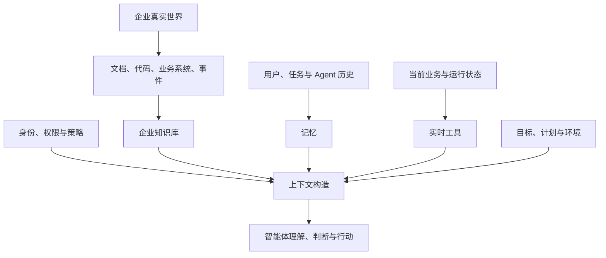

# 第 1 章 智能体为什么不懂企业

> 本章要回答：一个能够写代码、分析文本和调用工具的模型，为什么进入企业后仍然经常像一名没有入职培训的新员工？

## 1.1 一个看起来并不困难的任务

假设一家电商企业的运营负责人对智能体说：

> 最近退款出现积压。判断原因，说明影响范围，并给出处理建议。如果需要修改系统，请指出相关代码仓和测试。

这句话没有复杂术语。一个强大的语言模型能够解释退款、队列、数据库和微服务，也可以写出一套听起来合理的排查步骤。但它仍然不知道这家企业的退款由哪个服务负责，订单取消后发布什么事件，风控是否会冻结退款，当前告警来自哪个环境，哪份 Runbook 仍然有效，操作者是否有权重放消息，以及修改消费者后必须补哪些测试。

模型可能给出一份通用而流畅的答案。问题在于，企业需要的不是“通常怎样处理退款积压”，而是“这家企业、这个时间、这个环境、这个用户权限下应该怎样处理”。二者之间的距离，就是企业上下文问题。

这类失败很容易被误诊为模型能力不足。团队可能尝试更大的模型、更长的提示词或更多工具。模型也许变得更善于推理，却仍然缺少完成任务所依赖的企业事实。就像一位经验丰富的工程师入职第一天，他拥有通用能力，但不知道内部系统、业务规则、历史决策和组织边界。

## 1.2 模型拥有能力，不等于拥有企业知识

大语言模型从训练数据中获得语言、常识和通用问题解决能力。它的参数可以保存大量模式，但训练结束后，参数中的知识难以及时更新，也无法天然包含一家企业的私有信息。RAG 的早期研究正是为了把参数化模型与外部的非参数记忆结合，使模型能够在生成时访问可更新的知识来源。[Lewis 等，2020](https://arxiv.org/abs/2005.11401)

然而，“给模型接上搜索”只解决了一部分问题。要完成前面的退款任务，智能体至少需要六类信息：

| 上下文类型 | 在退款任务中的例子 | 典型来源 |
|---|---|---|
| 稳定知识 | 退款规则、服务职责、事件语义 | 制度、Wiki、代码、API Schema |
| 关系知识 | 订单服务如何影响支付与履约 | 服务图、调用图、数据血缘 |
| 实时状态 | 哪个队列积压、积压量、当前版本 | 监控、工单、业务 API |
| 历史记忆 | 已尝试过哪些操作、上次事故结论 | 任务记录、事件时间线、Agent 记忆 |
| 身份与权限 | 谁能查客户数据、谁能重放消息 | IAM、RBAC、审批策略 |
| 任务环境 | 本次目标、时间预算、允许的工具 | 会话、计划、执行沙箱 |

只有第一类通常被称为“知识库”。如果把六类信息都塞进一个向量数据库，不仅无法获得完整上下文，还会混淆事实与状态、公共知识与个人记忆、读取权限与执行权限。

## 1.3 企业上下文是什么

本书把企业上下文定义为：

> 智能体在特定企业内，针对当前身份、时间和任务，正确理解情况、形成判断并安全行动所需的信息与约束集合。

这个定义有四个限定词。

**特定企业**意味着上下文包含企业独有的术语、系统、业务规则和历史，而不是行业常识。**当前身份**意味着同一个问题对开发者、客服和审计人员可能有不同可见范围。**当前时间**意味着制度和代码都有版本，实时状态更会持续变化。**当前任务**意味着上下文不是把企业全部数据交给模型，而是选择完成这次任务所需的最小充分信息。

因此，企业上下文不是一个数据库名称，而是一套运行时能力：

知识库是其中最重要的组成部分之一，但不是全部。知识库保存相对稳定、可复用的事实、规则、解释和关系；记忆保存跨交互形成的状态和经验；工具提供不能或不应该预先复制的实时信息；权限与任务环境决定哪些内容可以进入本次上下文。

## 1.4 为什么“知识库就是向量数据库”会失败

向量表示把文本映射为数值，使语义相近的内容在向量空间中靠近。它适合处理用户表达和文档措辞不同的问题，但它不是无损知识表示。错误码、产品编号、否定条件、精确时间和代码符号往往更依赖关键词或结构化查询。调用关系、组织责任和版本演化也不能仅靠相似度可靠表达。

一个生产知识系统往往同时使用多种视图：

- BM25 或全文搜索寻找精确词项；
- 向量检索寻找语义相近的文档和摘要；
- 图检索寻找实体关系、依赖路径和影响范围；
- 层级索引从业务域逐步下钻到文档、模块和符号；
- 结构化查询处理数据库对象、时间和权限过滤；
- 原始来源提供最终可验证证据。

这些能力可以由不同存储实现。系统的统一性不来自“一种数据库”，而来自稳定对象标识、共同的权限和版本语义，以及能够把多个召回结果重新组合成证据的上下文服务。

## 1.5 检索到内容，仍然不等于得到正确上下文

即使正确文档进入搜索结果，智能体仍可能失败。

第一种失败是**版本错误**。旧 Runbook 与新架构描述了不同流程，搜索系统却没有有效时间。第二种是**粒度错误**。一个片段提到退款消费者，却缺少上级章节中的适用条件。第三种是**权限错误**。系统先检索所有内容，最后才遮盖答案，但敏感证据已经进入模型。第四种是**来源错误**。Wiki 摘要中的模型推断被当成事实，无法回到原始材料核验。第五种是**任务错误**。用户问当前积压量，系统却从昨日报告中检索一个数字，而不是调用监控接口。

因此，上下文构造至少包含四个动作：先确定身份与知识快照，再理解任务并选择信息源，然后多路召回和验证证据，最后在上下文窗口预算内组织材料。真正的工程难点逐渐从“能否搜索”转向“能否选择正确、充分、被授权且可验证的信息”。

## 1.6 企业上下文是一种认知基础设施

“基础设施”意味着它不只服务一个聊天机器人。研发 Agent 需要代码、ADR 和测试；运维 Agent 需要拓扑、Runbook 和实时指标；销售 Agent 需要产品、客户和合同；运营 Agent 需要流程、政策和业务状态。它们的内容不同，却共享连接器、对象标识、权限、版本、来源、检索、评测和审计能力。

“认知”并不意味着系统具有人类意识，而是强调它为智能体提供完成认知任务所需的外部结构：哪些概念存在，它们如何关联，哪些陈述可信，当前发生了什么，过去做过什么，以及可以采取哪些行动。

这也解释了为什么企业上下文平台不能只由 AI 团队建设。业务负责人定义知识的适用范围和责任人；数据与平台团队提供来源和身份；安全团队定义访问与执行边界；领域专家验证解释；Agent 团队负责把这些内容编译成本次任务上下文。

## 1.7 一条贯穿全书的判断链

本书后续内容将沿着以下判断展开：

1. 通用模型缺少企业私有、实时和受权限约束的信息；
2. RAG 让模型访问外部证据，但扁平片段不能覆盖全部知识问题；
3. Wiki、层级摘要和图谱把重复综合与关系理解编译成可复用知识；
4. 记忆让智能体延续用户和任务历史，但必须与公共知识隔离；
5. 工具提供实时状态与行动能力，但“可读”和“可做”必须分权；
6. 统一对象、来源、版本、时间、权限和评测把这些能力组织成平台；
7. 最终价值不在于存储多少知识，而在于智能体是否能用正确证据完成真实任务。

## 1.8 回到退款任务

拥有企业上下文后，智能体不会立即猜测答案。它先确认操作者身份和目标环境，读取当前退款队列指标，定位告警对应的服务版本；再从 Wiki 获取流程概览，从服务图找到订单、支付和退款消费者关系，从代码知识库验证事件处理和重试逻辑，从 Runbook 提取被批准的处置步骤，并从任务记忆确认哪些动作已经执行。

最后，它返回的不是一段笼统建议，而是一组可核验结论：当前积压发生在哪里；哪些指标和日志支持判断；相关代码位于哪个仓库和版本；潜在影响沿什么关系传播；哪些步骤可以自动执行，哪些需要审批；如果证据不足，系统还缺少什么。

这就是从“会说话的模型”到“能够在企业内工作的智能体”之间必须补上的基础设施。

## 本章小结

企业智能体的核心限制往往不是通用推理能力，而是缺少与企业、身份、时间和任务绑定的上下文。知识库解决稳定知识，记忆保存交互经验，工具提供实时状态和行动能力，权限与任务环境约束它们如何被使用。企业上下文平台的职责，是把这些分散要素构造成最小充分、可验证、可治理的任务上下文。

下一章将回到知识管理、搜索、专家系统、知识图谱和机器学习的发展历史，解释这些技术为什么最终汇聚到企业上下文问题。

## 延伸阅读

- [RAG 原始论文](https://arxiv.org/abs/2005.11401)
- [研究索引与进一步阅读](/research-notes)
- [全书术语与技术索引](/appendices)
