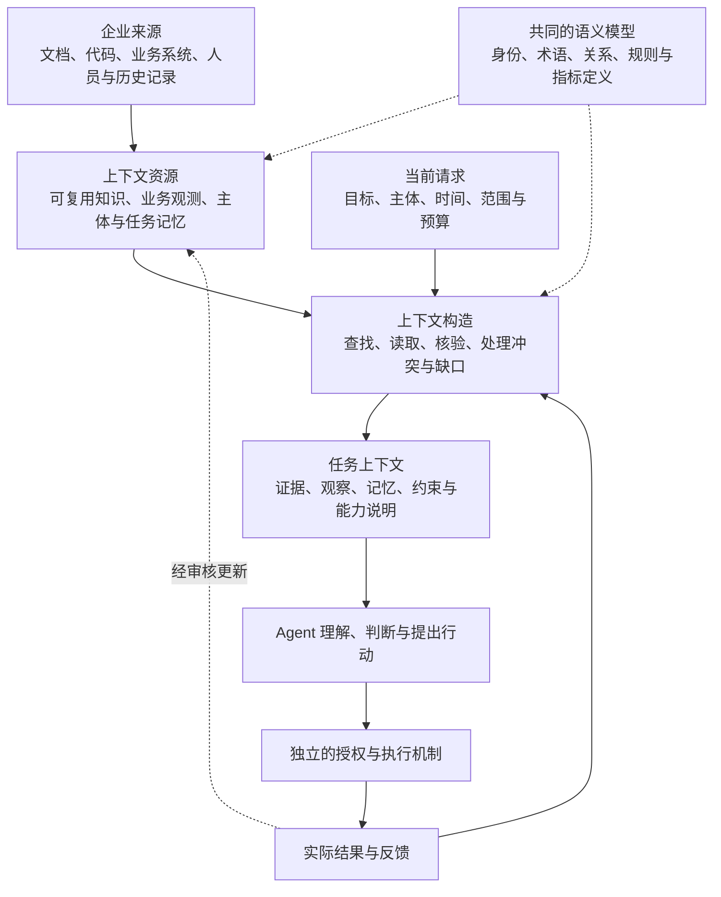

# 第 1 章 智能体为什么不懂企业

> 本章要回答：企业上下文到底是什么，它包括多大的范围，又怎样帮助智能体完成一项工作？

## 1.1 两个问题，同一种困难

假设一家在线零售企业的运营负责人对智能体说：

> 最近退款出现积压。判断原因，说明影响范围，并给出处理建议。如果需要修改系统，请指出相关代码仓和测试。

本书把这家虚构企业称为 Northstar Commerce。一个能力很强的模型可以解释退款、消息队列和重试机制，却不知道 Northstar 的退款由哪个服务负责，哪份运行手册仍然有效，当前告警属于哪个环境，以及谁有权重放消息。它可能给出一份不错的通用排查清单，但清单未必适用于这家公司。

再换一个问题。经营负责人问：

> H2 的销售情况为什么比 H1 差这么多？

模型首先要弄清“销售”指净订单额、收入还是回款，H1/H2 按自然年还是财年划分，比较的是全公司还是某个区域。接下来才是战略目标、产品和渠道、组织责任、经营数据、系统变化与候选原因。即使接上销售数据库，缺少这些背景也可能算对数字、解释错问题。

这两项任务一项偏运行处置，一项偏经营分析，面对的困难却相同：模型拥有通用能力，但不了解这个企业在这次任务中的具体情况。企业上下文要补的，就是这部分背景与约束。

## 1.2 完成任务前，必须先弄清什么

把退款问题展开，会得到一组很具体的追问：

| 要弄清的问题 | Northstar 中需要的材料 |
|---|---|
| 我们要解决什么，怎样才算完成？ | 是解释积压原因、提出建议，还是获准实施处置；成功条件是什么 |
| 公司对此有哪些定义和规定？ | 退款政策、事件含义、运行手册及适用版本 |
| 相关的人、系统和业务怎样联系？ | 订单到退款的关系、服务职责、负责团队与测试 |
| 现在实际发生了什么？ | 当前队列、错误率、部署版本和查询时间 |
| 这次已经查过、做过什么？ | 已排除的假设、已执行动作、结果与待办 |
| 当前这位操作者可以看什么、做什么？ | 数据可见范围、委托权限、允许工具和审批条件 |

这是一份帮助理解任务的提问清单，不是把全部企业信息分成六种互斥类型。关系可以属于知识，也可以由一次运行观察得到；任务记录可以同时包含证据引用和操作结果；权限则约束所有材料及动作。后文会解释它们怎样配合，不需要先记住一份类型表。

大语言模型能够利用外部材料补充参数中的知识。RAG 的早期研究把生成模型与可检索的外部文档结合，使回答能够使用可更新的知识来源。[Lewis 等，2020](https://arxiv.org/abs/2005.11401) 但搜索只能解决其中一部分问题。当前队列长度可能需要现场查询，审批必须由授权机制检查，而“上次查过什么”需要任务记录。找到几段相似文字，并不等于已经准备好完成工作。

## 1.3 分清资源、任务材料和平台

本书所说的企业上下文，是智能体在特定企业内，针对当前身份、时间和任务，理解情况、形成判断并安全行动所需的信息与约束。为了避免把信息和系统混在一起，后文进一步区分三个用法。

**企业上下文资源**是企业能够提供、可供任务使用的背景材料：政策、术语、架构说明、代码、业务观测、相关经历，以及规则和能力说明。它们可以保存在知识库、业务系统、监控或任务服务中，不要求先集中到一个数据库。

**任务上下文**是为一次具体任务挑选、组织的材料与约束。它会说明用户目标、适用范围、证据、当前观察、相关记忆、已知缺口以及可用能力。任务持续推进时，这份材料也会变化。模型每次调用能看到的输入，是任务上下文在那个决策点的一次具体呈现；它不一定包含任务的全部档案。

**企业上下文平台**是负责提供这些材料的系统。它连接来源，帮助不同系统认出同一个业务对象，维护版本与权限，再按当前任务取回、核验和组织信息。平台可以是一个模块化应用，也可以由多个服务共同承担。

因此，“公司有一份退款政策”“本次采用了政策的哪个版本”“平台怎样把它找出来”，是三个不同问题。它们分别涉及资源、任务上下文和平台能力。

## 1.4 先看全貌：企业材料怎样进入一次任务

下面是全书的逻辑总图。箭头表示材料和结果怎样流动，方框表示职责，不是要求采购或部署的一组产品。

```mermaid
flowchart TB
  S["企业来源<br/>文档、代码、业务系统、人员与历史记录"] --> R["上下文资源<br/>可复用知识、业务观测、主体与任务记忆"]
  M["共同的语义模型<br/>身份、术语、关系、规则与指标定义"] -.-> R
  M -.-> C["上下文构造<br/>查找、读取、核验、处理冲突与缺口"]
  R --> C
  Q["当前请求<br/>目标、主体、时间、范围与预算"] --> C
  C --> P["任务上下文<br/>证据、观察、记忆、约束与能力说明"]
  P --> A["Agent 理解、判断与提出行动"]
  A --> X["独立的授权与执行机制"]
  X --> F["实际结果与反馈"]
  F --> C
  F -.经审核更新.-> R
```

来源、版本、时间、责任和权限治理贯穿整张图。查询前要确认材料能否访问，使用时要检查是否适用，执行动作时还要重新授权，结果也需要验证。它们不是图走到最后才补上的检查。

这张图里，共同语义模型解决“大家是否在说同一件事”。例如，销售报表里的“客户”可能是签约公司，客服系统里的“客户”可能是联系人；不把含义和身份说明白，就容易把不同对象接在一起。模型可以从少量关键定义开始，不必等完整企业本体建好才能使用资料。

上下文构造解决“这次需要什么”。它既可能检索一份政策，也可能查询业务数据、读取任务记忆，还要保留来源、冲突和缺口。Agent 据此理解与判断。若需要改变外部系统，执行机制另行检查主体、参数和批准，不能因为模型读过操作说明就允许操作。

第三章将逐个展开这些职责。第二部分解释其中的建模、检索、知识组织和记忆方法；第三部分再讨论它们怎样组成能够长期运行的平台。

## 1.5 企业范围地图：不只了解操作步骤

总图说明系统怎样工作，还需要另一张地图说明它要了解企业的哪些方面。对于退款处置，了解运行规则已经很重要；对于经营分析，只了解流程和操作手册远远不够。

| 企业的哪一方面 | 需要理解什么 |
|---|---|
| 外部环境与商业模式 | 为谁创造什么价值，怎样获得收入，受到哪些市场和监管约束 |
| 战略意图 | 希望达到什么目标，优先做什么，接受什么风险 |
| 业务能力与价值流 | 依靠哪些能力、产品和跨部门协作实现目标 |
| 经营与组织 | 谁负责，谁有决策权，怎样衡量各业务单元的结果 |
| 应用与数据 | 哪些系统支撑业务，指标如何定义，数据来自哪里 |
| 业务运行 | 流程、业务对象、规则、事件，以及实际发生的情况 |

这是一张范围检查地图，不是六层系统架构，也不是六个必须分开的知识库。同一个目标可能关联多个产品、团队、流程和数据服务；同一个应用也可能支撑不同价值流。这些方面彼此交叉，不能靠一条从上到下的包含关系全部描述。

当前 Agent 的目标、身份、任务进度、预算和允许动作，应另放在“本次任务的条件”中。它们决定这次从企业地图的哪里进入、查多深、能做什么。把这些运行条件单独讲清楚，也能避免将“企业有哪些内容”和“一个 Agent 此刻怎样工作”混成一种分层。

回答销售问题时，任务可能从指标定义进入组织、产品和渠道，再追到数据服务和运行事件。处理退款时，任务可以先看队列和政策，必要时再向上解释对客户承诺和经营目标的影响。两者都需要企业级视野，但不需要每次装入全公司材料。关系路径也不自动证明因果：某系统发生过异常，不能仅凭关联就断言它造成销售下降。

## 1.6 为什么一个向量数据库不够

企业上下文资源可以有不同查法。精确函数名适合关键词或符号索引，依赖路径适合图查询，指标汇总适合结构化计算，流程概览适合 Wiki，而当前业务状态可能需要通过接口读取。它们解决不同问题，可以相互补充。

向量检索帮助找到措辞不同、意思相近的材料，却不能独自决定哪版政策有效、哪个订单属于当前用户、一次工具调用是否真正成功。数据库和检索算法只是实现手段，逻辑架构先要规定资料如何识别、哪些来源可信、怎样选择当前证据，以及在哪里检查权限。

这也不是要求同时安装所有技术。一个小场景可能用文档、关系表和几个接口就能跑通。只有当任务证明存在检索、关系或阅读效率上的缺口时，才引入相应能力。全书比较技术的依据，是它承担了总图中的哪项职责，而不是组件数量。

## 1.7 用两个任务检验这张图

退款任务首先明确是诊断还是处置，确认操作者及环境；再取回适用 Runbook、系统关系和历史事故，读取当前队列，将已有排查结果带入任务。证据不足时返回缺口；提出重放建议时生成具体参数，交给独立机制确认与执行；执行之后再看新的业务观察。

销售任务使用同一张总图，但选取的资源不同：先确认指标、期间和范围，再读取战略目标与可比较的数据快照，按产品或区域计算差异。此前已确认的口径可以进入任务记忆，尚未证实的原因仍标为假设。分析权限不会自动变成修改价格或战略目标的权限。

这两段描述是任务应有的逻辑过程。第四部分的教学代码只实现其中明确列出的最小切片，不应从总图推断所有生产能力已经交付。

## 本章小结

企业上下文资源是可供使用的背景，任务上下文是为当前工作挑出的材料，平台负责把两者连接起来。共同语义让资料讲的是同一套业务含义，治理决定哪些材料和动作可以使用，实际结果又成为后续判断的依据。企业范围地图说明需要了解什么，逻辑总图说明这些信息怎样进入工作，两张图不能互相替代。

下一章回顾这些能力从哪里来，第三章再把总图展开成清楚的职责和接口。

## 延伸阅读

- Patrick Lewis et al., [Retrieval-Augmented Generation for Knowledge-Intensive NLP Tasks](https://arxiv.org/abs/2005.11401), 2020。
- [研究索引与进一步阅读](/research-notes)。
- [全书术语与技术索引](/appendices)。
