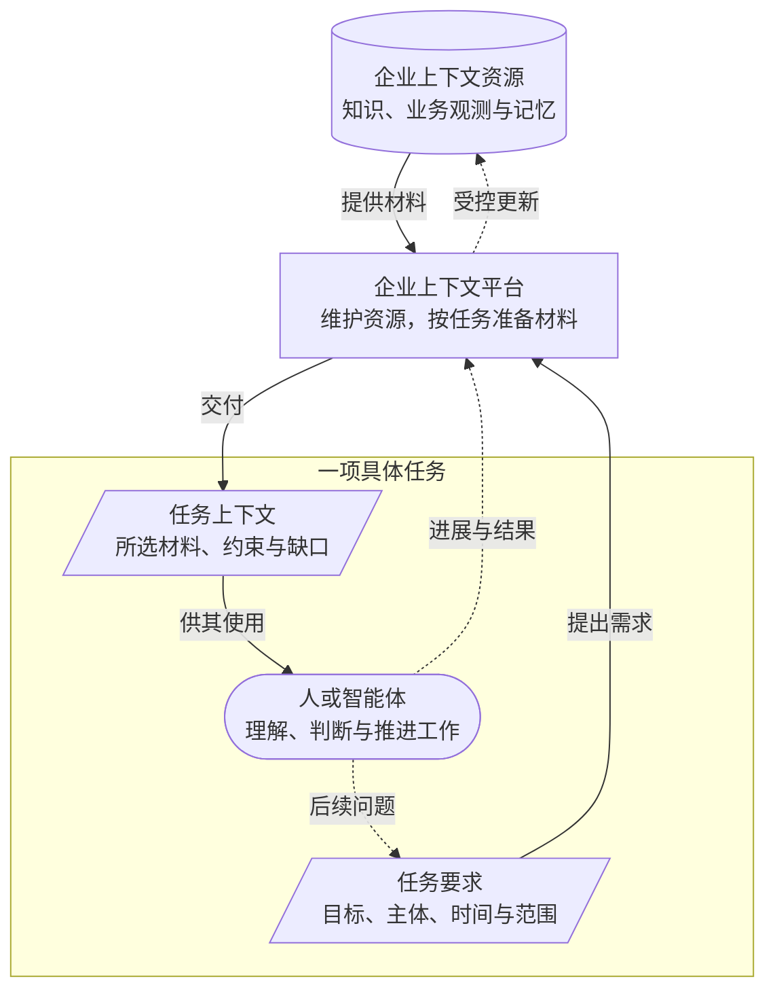

# 第 1 章 智能体为什么不懂企业

> 本章要回答：企业上下文到底是什么，它包括多大的范围，又怎样帮助智能体完成一项工作？

## 1.1 两个问题，同一种困难

假设一家在线零售企业的运营负责人对智能体说：

> 最近退款出现积压。判断原因，说明影响范围，并给出处理建议。如果需要修改系统，请指出相关代码仓和测试。

本书把这家虚构企业称为 Northstar Commerce。一个能力很强的模型可以解释退款、消息队列和重试机制，却不知道 Northstar 的退款由哪个服务负责，哪份运行手册仍然有效，当前告警属于哪个环境，以及谁有权重放消息。它可能给出一份不错的通用排查清单，但清单未必适用于这家公司。

再换一个问题。经营负责人问：

> H2 的销售情况为什么比 H1 差这么多？

模型首先要弄清“销售”指净订单额、收入还是回款，H1/H2 按自然年还是财年划分，比较的是全公司还是某个区域。接下来才是战略目标、产品和渠道、组织责任、经营数据、系统变化与候选原因。即使接上销售数据库，缺少这些背景也可能算对数字、解释错问题。

这两项任务一项偏运行处置，一项偏经营分析，面对的困难却相同：模型拥有通用能力，但不了解这个企业在这次任务中的具体情况。企业上下文要补的，就是这部分背景与约束。

## 1.2 完成任务前，必须先弄清什么

把退款问题展开，会得到一组很具体的追问：

| 要弄清的问题 | Northstar 中需要的材料 |
|---|---|
| 我们要解决什么，怎样才算完成？ | 是解释积压原因、提出建议，还是获准实施处置；成功条件是什么 |
| 公司对此有哪些定义和规定？ | 退款政策、事件含义、运行手册及适用版本 |
| 相关的人、系统和业务怎样联系？ | 订单到退款的关系、服务职责、负责团队与测试 |
| 现在实际发生了什么？ | 当前队列、错误率、部署版本和查询时间 |
| 这次已经查过、做过什么？ | 已排除的假设、已执行动作、结果与待办 |
| 当前这位操作者可以看什么、做什么？ | 数据可见范围、委托权限、允许工具和审批条件 |

这些问题的答案分散在不同地方。退款政策由业务团队维护，服务职责写在设计文档里，当前队列要从监控系统读取，之前的排查结果则留在任务记录中。要完成工作，智能体需要将它们联系起来：用政策判断什么行为合规，用当前状态判断问题是否仍在发生，再根据已做过的检查决定下一步。

## 1.3 分清资源、任务材料和平台

本书所说的企业上下文，是智能体在特定企业内，针对当前身份、时间和任务，理解情况、形成判断并安全行动所需的信息与约束。理解它，可以从企业已有的资源、当前任务使用的材料，以及连接两者的平台入手。

**企业上下文资源**是企业能够提供、可供任务使用的背景材料：政策、术语、架构说明、代码、业务观测、相关经历，以及规则和能力说明。它们可以保存在知识库、业务系统、监控或任务服务中，不要求先集中到一个数据库。

**任务上下文**是为一次具体任务挑选、组织的材料与约束。它会说明用户目标、适用范围、证据、当前观察、相关记忆、已知缺口以及可用能力。任务持续推进时，这份材料也会变化。模型每次调用能看到的输入，是任务上下文在那个决策点的一次具体呈现；它不一定包含任务的全部档案。

**企业上下文平台**是负责提供这些材料的系统。它连接来源，帮助不同系统认出同一个业务对象，维护版本与权限，再按当前任务取回、核验和组织信息。平台可以是一个模块化应用，也可以由多个服务共同承担。

因此，“公司有一份退款政策”“本次采用了政策的哪个版本”“平台怎样把它找出来”，是三个不同问题。它们分别涉及资源、任务上下文和平台能力。

## 1.4 资源、平台与任务怎样连接

企业平时积累资源，平台持续整理和维护这些资源。一项任务开始后，平台根据任务要求准备材料，交给人或智能体使用；工作中产生的问题和进展，又会影响下一轮材料的选择。这构成了企业上下文的基本架构。

```mermaid
flowchart TB
  R[("企业上下文资源<br/>知识、业务观测与记忆")]
  P["企业上下文平台<br/>维护资源，按任务准备材料"]
  subgraph T["一项具体任务"]
    Q[/"任务要求<br/>目标、主体、时间与范围"/]
    C[/"任务上下文<br/>所选材料、约束与缺口"/]
    A(["人或智能体<br/>理解、判断与推进工作"])
    C -->|供其使用| A
    A -.后续问题.-> Q
  end
  R -->|提供材料| P
  Q -->|提出需求| P
  P -->|交付| C
  A -.进展与结果.-> P
  P -.受控更新.-> R
```

图中，圆柱和斜框表示信息，矩形表示平台能力，圆角框表示使用材料的参与者。外框圈出一项具体任务。实线表示准备和使用材料，虚线表示后续请求与更新。

资源可以分布在文档、业务系统和任务服务中。平台负责找到它们、认清含义、检查权限与时间，再选出这次有用的部分。任务上下文保留所选材料的来源及适用条件，让使用者能够检查判断依据。

例如，平台可以长期维护退款政策的版本和引用。客服处理某笔订单时，得到的是适用于该订单的政策、当前订单状态和自己的操作权限；工程师调查积压时，则会取得系统关系、运行观察和排查记录。两项任务使用同一批企业资源中的不同部分。

任务继续推进时，平台可以记录已做过的检查、尚未解决的问题和工具返回的结果。任务记录经过写入检查后用于延续工作；值得推广的经验经过复核后成为组织知识。真正调用业务工具时，运行环境和业务系统还要检查执行权限、参数与批准条件。

第三章会展开平台内部的职责，以及它怎样将企业不同方面的资源组织起来。

## 1.5 企业上下文的内容体系：从战略到业务运行

资源中应当包含哪些企业内容？可以从企业为什么存在、怎样创造价值，一直看到它每天怎样运作。商业模式解释收入从哪里来，战略说明要往哪里去，业务能力与组织说明靠什么、由谁实现，应用和数据支撑具体运行。下面按这些方面组织企业上下文的内容体系。

| 企业的哪一方面 | 需要理解什么 |
|---|---|
| 外部环境与商业模式 | 为谁创造什么价值，怎样获得收入，受到哪些市场和监管约束 |
| 战略意图 | 希望达到什么目标，优先做什么，接受什么风险 |
| 业务能力与价值流 | 依靠哪些能力、产品和跨部门协作实现目标 |
| 经营与组织 | 谁负责，谁有决策权，怎样衡量各业务单元的结果 |
| 应用与数据 | 哪些系统支撑业务，指标如何定义，数据来自哪里 |
| 业务运行 | 流程、业务对象、规则、事件，以及实际发生的情况 |

这些内容通过关系相接：一个战略目标由多个业务能力共同支撑，每种能力有负责团队和相关流程，流程又依赖应用与数据。企业架构长期研究这些联系，第二章会介绍它的来历，第三章会说明怎样将这些联系变成可查证的企业资源。

回答销售问题时，任务可能从指标定义进入组织、产品和渠道，再追到数据服务和运行事件。处理退款时，任务可以先看队列和政策，再沿关系说明它对客户承诺和经营目标的影响。任务的目标、身份和允许范围决定查到哪里；每条结论仍需要相应证据。

## 1.6 从企业资料到任务材料

企业里有资料，只是准备工作的起点。以销售问题为例，同名的“销售额”可能出现在不同报表中，分别采用不同币种、订单范围和确认时间。平台需要先查明这些定义，找到可比较的数据，再把结果连同依据交给分析者。

这项工作可以分成相互配合的几部分。平时要连接来源、记录版本，并整理对象之间的关系。任务到来时，要确认需求和权限，查找或现场读取材料，核验它们是否适用。交付时，要保留来源、计算口径和未解决的问题，使读者知道哪些已经确认、哪些还需要调查。

后文介绍的技术都服务于这些工作：建模用来说明对象与关系，检索用来找回材料，摘要帮助快速理解，记忆让任务能够接着做。RAG（检索增强生成）则把取回外部材料与生成回答连起来，其早期研究展示了生成模型利用可更新文档的方式。[Lewis 等，2020](https://arxiv.org/abs/2005.11401) 第二部分会逐一介绍这些方法，第十章再讨论怎样把它们组成平台。

## 1.7 两项任务怎样使用同一套资源

退款任务首先明确是诊断还是处置，确认操作者及环境；再取回适用的运行手册（Runbook）、系统关系和历史事故。运行手册说明出现某种情况时，应怎样检查、处理并确认结果。平台同时读取当前队列，将已有排查结果带入任务。证据不足时返回缺口；提出重放建议时生成具体参数，交给独立机制确认与执行；执行之后再看新的业务观察。

销售任务选取的资源包括战略目标、指标定义、组织责任和经营数据：先确认指标、期间和范围，再读取目标与可比较的数据快照，按产品或区域计算差异。此前已确认的口径可以进入任务记忆，尚未证实的原因仍标为假设。分析权限不会自动变成修改价格或战略目标的权限。

第四部分将用一个可运行的教学案例展示资源组织、材料准备和受控行动，并逐步说明代码的实现范围。

## 本章小结

企业上下文的内容从商业模式和战略延伸到具体业务运行。这些内容形成可供使用的资源，平台按任务要求准备有依据、有范围的材料，人或智能体据此推进工作。任务的新问题和进展继续回到平台，帮助补充材料并维护资源。

下一章回顾这些能力从哪里来，第三章再说明企业内容怎样组织，以及平台怎样为任务提供上下文。

## 延伸阅读

- Patrick Lewis et al., [Retrieval-Augmented Generation for Knowledge-Intensive NLP Tasks](https://arxiv.org/abs/2005.11401), 2020。
- [研究索引与进一步阅读](/research-notes)。
- [全书术语与技术索引](/appendices)。
