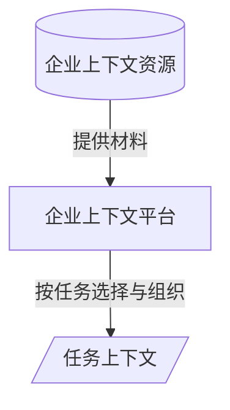

# 第 1 章 智能体为什么不懂企业

> 本章要回答：企业上下文到底是什么，它包括多大的范围，又怎样帮助智能体完成一项工作？

## 1.1 三个问题，同一种困难

假设一家在线零售企业的运营负责人对智能体说：

> 最近退款出现积压。判断原因，说明影响范围，并给出处理建议。如果需要修改系统，请指出相关代码仓和测试。

本书把这家虚构企业称为 Northstar Commerce。一个能力很强的模型可以解释退款、消息队列和重试机制，却不知道 Northstar 的退款由哪个服务负责，哪份运行手册仍然有效，当前告警属于哪个环境，以及谁有权重放消息。它可能给出一份不错的通用排查清单，但清单未必适用于这家公司。

再换一个问题。经营负责人问：

> H2 的销售情况为什么比 H1 差这么多？

模型首先要弄清“销售”指净订单额、收入还是回款，H1/H2 按自然年还是财年划分，比较的是全公司还是某个区域。接下来才是战略目标、产品和渠道、组织责任、经营数据、系统变化与候选原因。即使接上销售数据库，缺少这些背景也可能算对数字、解释错问题。

再看一家做仓储监测设备的虚构企业——澄川设备。研发负责人提出：

> 基于现有 W1 产品，为新一代 W2 温湿度记录器形成硬件方案草案。保留外壳与安装方式，目标两年续航、单台材料不超过预算。请给出硬件框图、候选物料、功耗预算、接口说明和验证计划。

这次需要交付一份新成果。模型要了解公司的既有设计、可复用部件、内部候选物料、试验记录、成本口径和评审要求，才能形成适合这家企业的方案，并指出哪些判断仍需试验。后文将用 W2 展示创造类工作，数值采用可复算的教学设定。

这三项任务分别从运行处置、经营分析和产品创造切入，面对的共同困难是：模型拥有通用能力，但不了解这个企业在这次任务中的具体情况。企业上下文要补的，就是这部分背景与约束。

## 1.2 完成任务前，必须先弄清什么

把退款问题展开，会得到一组很具体的追问：

| 要弄清的问题 | Northstar 中需要的材料 |
|---|---|
| 我们要解决什么，怎样才算完成？ | 是解释积压原因、提出建议，还是获准实施处置；成功条件是什么 |
| 公司对此有哪些定义和规定？ | 退款政策、事件含义、运行手册及适用版本 |
| 相关的人、系统和业务怎样联系？ | 订单到退款的关系、服务职责、负责团队与测试 |
| 现在实际发生了什么？ | 当前队列、错误率、部署版本和查询时间 |
| 这次已经查过、做过什么？ | 已排除的假设、已执行动作、结果与待办 |
| 当前这位操作者可以看什么、做什么？ | 数据可见范围、委托权限、允许工具和审批条件 |

这些问题的答案分散在不同地方。退款政策由业务团队维护，服务职责写在设计文档里，当前队列要从监控系统读取，之前的排查结果则留在任务记录中。要完成工作，智能体需要将它们联系起来：用政策判断什么行为合规，用当前状态判断问题是否仍在发生，再根据已做过的检查决定下一步。

## 1.3 企业上下文要支持哪些问题

售后主管查找积压原因，销售总监分析经营变化，CEO 思考企业发展方向，关注的范围和承担的责任各不相同。从最终希望得到的结果看，本书把需要企业上下文支持的问题归纳为四类：认知、决策、创造和执行。

| 基本问题 | 企业中的例子 | 主要交付结果 |
|---|---|---|
| 认知：弄清情况 | 查明退款积压原因，解释销售下降，估计下季度需求 | 有依据的事实、解释或预测，并说明不确定性 |
| 决策：作出取舍 | 选择市场进入方案，确定产品优先级，决定处置措施 | 可比较的选项与理由，以及由有权主体作出的决定 |
| 创造：形成新成果 | 设计产品方案、编写代码、制定业务流程、准备营销内容 | 符合需求、约束和验收标准的设计、内容或实现 |
| 执行：达成结果 | 处理退款、协调交付、发布系统变更、落实经营计划 | 可核对的业务结果及执行记录 |

判断一项任务属于哪类，先看业务上希望得到什么。分析报告主要用于解释事实，属于认知；提出几种可行设计，侧重创造；选择其中一种并承担相应责任，进入决策；组织人员和系统把选择落实，则进入执行。同一项工作往往包含多类问题，推进过程中也会反复补充认识、调整方案和重新作出选择。

查询、监测、分析、预测和推演可以服务多类问题。监测发现的偏差可能引出诊断，预测可以帮助比较方案，试验既能验证设计，也能产生新的认识。产品研发同样贯穿四类问题：理解需求、选择方向、形成产品、完成交付。销售、运营和企业战略也有各自的认知、决策、创造与执行工作。岗位决定职责与权限，问题类型帮助明确本次任务的结果要求。

例如，CEO 提出“未来三年是否进入新市场”，需要先了解市场与企业能力，设计可能的进入方案，比较不同假设下的结果，作出选择，再组织试点与实施。后续复盘会检验最初的判断，并为下一轮工作积累依据。

企业上下文为这些问题提供与本企业有关的目标、事实、规则、经验和能力说明。真正完成工作，还要配合分析计算、设计工具、业务接口、协作与授权机制，并验证相应结果。上下文体系的作用，是让这些能力围绕同一项企业任务使用适用的依据。

## 1.4 分清资源、任务材料和平台

本书所说的企业上下文，是智能体在特定企业内，针对当前身份、时间和任务，理解情况、形成判断并安全行动所需的信息与约束。理解它，可以从企业已有的资源、当前任务使用的材料，以及连接两者的平台入手。

**企业上下文资源**是企业能够提供、可供任务使用的背景材料：政策、术语、架构说明、代码、业务观测、相关经历，以及规则和能力说明。它们可以保存在知识库、业务系统、监控或任务服务中，不要求先集中到一个数据库。

**任务上下文**是为一次具体工作选择和组织的材料与约束。它帮助使用者理解这次要做什么、依据什么作出判断，以及工作受到哪些限制，并随任务推进而变化。

**企业上下文平台**是连接资源与任务的系统。它维护可用资源，按当前任务准备适用的材料，并保留检查这些材料所需的依据。

因此，“公司有一份退款政策”“本次采用了政策的哪个版本”“平台怎样把它找出来”，是三个不同问题。它们分别涉及资源、任务上下文和平台能力。

## 1.5 资源、平台与任务上下文怎样连接

企业积累可供使用的资源，平台依据任务要求选择并组织其中适用的部分，形成任务上下文。这构成了企业上下文的基本架构。

```mermaid
flowchart TB
  R[("企业上下文资源")]
  P["企业上下文平台"]
  C[/"任务上下文"/]
  R -->|提供材料| P
  P -->|按任务选择与组织| C
```

图中资源和任务上下文表示信息，平台表示组织和提供信息的系统能力。资源可以服务多项工作，任务上下文面向当前这项工作。

例如，平台可以长期维护退款政策的版本和引用。客服处理某笔订单时，得到的是适用于该订单的政策、当前订单状态和自己的操作权限；工程师调查积压时，则会取得系统关系、运行观察和排查记录。两项任务使用同一批企业资源中的不同部分。

第三章将分别展开资源、任务上下文与平台的内部组成，再说明它们怎样随着工作推进而协作。

## 1.6 企业上下文的内容体系：从战略到业务运行

资源中应当包含哪些企业内容？可以从企业为什么存在、怎样创造价值，一直看到它每天怎样运作。商业模式解释收入从哪里来，战略说明要往哪里去，业务能力与组织说明靠什么、由谁实现，应用和数据支撑具体运行。下面按这些方面组织企业上下文的内容体系。

| 企业的哪一方面 | 需要理解什么 |
|---|---|
| 外部环境与商业模式 | 为谁创造什么价值，怎样获得收入，受到哪些市场和监管约束 |
| 战略意图 | 希望达到什么目标，优先做什么，接受什么风险 |
| 业务能力与价值流 | 依靠哪些能力、产品和跨部门协作实现目标 |
| 经营与组织 | 谁负责，谁有决策权，怎样衡量各业务单元的结果 |
| 应用与数据 | 哪些系统支撑业务，指标如何定义，数据来自哪里 |
| 业务运行 | 流程、业务对象、规则、事件，以及实际发生的情况 |

这些内容通过关系相接：一个战略目标由多个业务能力共同支撑，每种能力有负责团队和相关流程，流程又依赖应用与数据。企业架构长期研究这些联系，第二章会介绍它的来历，第三章会说明怎样将这些联系变成可查证的企业资源。

回答销售问题时，任务可能从指标定义进入组织、产品和渠道，再追到数据服务和运行事件。处理退款时，任务可以先看队列和政策，再沿关系说明它对客户承诺和经营目标的影响。任务的目标、身份和允许范围决定查到哪里；每条结论仍需要相应证据。

## 1.7 从企业资料到任务材料

企业里有资料，只是准备工作的起点。以销售问题为例，同名的“销售额”可能出现在不同报表中，分别采用不同币种、订单范围和确认时间。平台需要先查明这些定义，找到可比较的数据，再把结果连同依据交给分析者。

平台的价值在于把分散的企业资料组织成适用于当前工作的依据，使使用者知道哪些已经确认、哪些还需要调查。

后文介绍的技术都服务于这些工作：建模用来说明对象与关系，检索用来找回材料，摘要帮助快速理解，记忆让任务能够接着做。RAG（检索增强生成）则把取回外部材料与生成回答连起来，其早期研究展示了生成模型利用可更新文档的方式。[Lewis 等，2020](https://arxiv.org/abs/2005.11401) 第二部分会逐一介绍这些方法，第十章再讨论怎样把它们组成平台。

## 1.8 三项任务怎样使用企业资源

退款处置需要政策、运行手册、系统关系和当前业务情况。运行手册（Runbook）说明出现某种情况时怎样检查、处理并确认结果。这些材料共同帮助使用者判断问题和处理边界。

销售分析需要战略目标、指标定义、组织责任和可比较的经营数据。它使用的资源不同，但同样需要平台将材料组织为有依据、有范围的任务上下文。

W2 硬件设计需要产品需求、旧版设计、候选器件、预算和验证依据。Agent 将它们组织为新的设计草案，计算与评审再检查约束是否满足。设计中的假设、候选选择和待验证项都随成果保留，方便其他专业继续工作。

第四部分用 Northstar 展示可运行的企业上下文系统；[W2 设计草案](/cases/hardware-w2)集中保存硬件创造例子的输入、成果和预算检查。两家企业的资料各自管理，共同说明这套架构怎样适用于不同工作。

## 本章小结

企业上下文支持企业中的认知、决策、创造与执行问题，内容从商业模式和战略延伸到具体业务运行。这些内容形成可供使用的资源，平台按任务要求准备有依据、有范围的材料，人或智能体据此推进工作。任务的新问题和进展继续回到平台，帮助补充材料并维护资源。

下一章回顾这些能力从哪里来，第三章再说明企业内容怎样组织，以及平台怎样为任务提供上下文。

## 延伸阅读

- Patrick Lewis et al., [Retrieval-Augmented Generation for Knowledge-Intensive NLP Tasks](https://arxiv.org/abs/2005.11401), 2020。
- [研究索引与进一步阅读](/research-notes)。
- [全书术语与技术索引](/appendices)。
