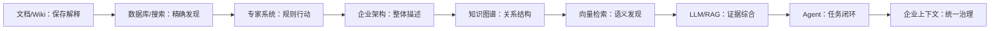

# 第 2 章 从知识管理到企业上下文

> 本章要回答：企业上下文为什么不是大模型时代凭空出现的新概念？

## 2.1 每一代系统都在解决同一个问题

企业一直在尝试把组织经验变成可重复使用的能力。文件柜、档案制度、数据库、搜索引擎、专家系统、企业 Wiki 和知识图谱看起来属于不同年代，本质上都在回答三个问题：知识放在哪里，怎样找到它，以及怎样让人或系统据此行动。

技术变化来自旧答案的不完整。文档可以保存解释，却难以精确计算；数据库能够精确查询，却要求预先定义结构；搜索能找到材料，却不会替读者综合；规则系统可以自动判断，却难以覆盖开放世界；知识图谱能表达关系，却需要持续治理；向量搜索能跨越措辞差异，却可能损失精确符号；大模型能够综合自然语言，却不天然拥有企业最新事实。

企业上下文不是抛弃这些技术，而是把它们重新组织在智能体的任务闭环里。

## 2.2 文档管理：先让知识留下来

早期企业知识管理首先解决保存和传播。制度、手册、项目总结和培训材料把个人经验变成组织资产。内容管理系统进一步提供分类、版本、审批和发布；Wiki 降低协作门槛，使页面能够通过链接形成导航网络。

这一范式的基本单位是“文档”。它适合叙述背景、条件和理由，却依赖人知道应该阅读哪一份材料。文件夹和标签能表达主题，但很难稳定表示“订单服务发布事件，退款服务消费事件，值班团队负责处置”这样的关系。文档数量增长后，知识虽然被保存，发现成本却不断上升。

今天的 LLM Wiki 延续了这条路线，只是把部分整理工作交给模型：从原始来源生成主题页、更新互链、发现冲突并执行知识 Lint。它改善维护成本，却没有改变一项原则：摘要是派生解释，原始来源仍是最终证据。[Karpathy 的 LLM Wiki 说明](https://gist.github.com/karpathy/442a6bf555914893e9891c11519de94f)

## 2.3 数据库与搜索：让知识可以被计算和发现

关系数据库把业务对象表示为表、字段和约束，使订单、客户和合同可以被精确查询。它擅长回答已经结构化的问题，例如“当前未关闭的退款工单有多少”，却不能自动理解一份事故复盘中的因果解释。

全文搜索为非结构化文档建立倒排索引。BM25 一类排序方法利用词频、词项稀有程度和文档长度评估相关性。它对错误码、产品编号、函数名和合同术语依然有效。搜索的局限不是召回速度，而是用户必须把需求表达成接近材料的词，并自行阅读和综合结果。

现代企业上下文系统因此同时保留结构化查询和全文搜索。实时状态不应被复制成过期文本；专有名词也不应只交给向量相似度处理。

## 2.4 专家系统：第一次把知识变成行动规则

专家系统尝试将领域知识写成事实和规则，通过推理引擎得到判断。它证明知识不仅可以供人阅读，还可以直接驱动系统决策。其优势是规则明确、过程可解释；困难在于知识获取和维护。现实业务包含例外、模糊概念和持续变化，规则数量增加后容易冲突，开放式文本也很难全部预先编码。

Agent 时代重新遇到了同一个边界。模型可以处理开放语言，但高风险行动不能只依赖概率判断。退款审批、权限检查和变更发布仍需要确定性策略。合理分工不是“LLM 取代规则”，而是模型理解意图和证据，规则系统约束允许的动作。

## 2.5 企业架构：让企业能够被系统描述

知识管理关注知识如何保存和复用，企业架构（Enterprise Architecture，EA）则从企业整体出发，描述业务、组织、应用、数据和技术如何共同实现目标。Zachman 在 1987 年提出信息系统架构分类框架，用不同问题和利益相关者视角组织架构描述；后来 TOGAF 把企业架构发展为可配置的方法与框架，ISO/IEC/IEEE 42010 则规范了架构描述、视角（viewpoint）和视图（view）等概念。[Zachman，1987](https://doi.org/10.1147/sj.263.0276) [TOGAF](https://www.opengroup.org/togaf) [ISO/IEC/IEEE 42010:2022](https://www.iso.org/standard/74393.html)

企业架构由此形成了一批可复用资产：能力地图、业务流程、组织责任、应用组合、数据模型、技术标准和架构决策。现代企业架构框架（Modern Enterprise Architecture Framework，MEAF）是其中一种面向平台型企业的实践，它以元模型定义架构描述的基本语言，并从业务、应用、数据和技术四类视图组织概念。[MEAF V4 学习镜像](https://web3d.github.io/meaf-book/Chapter2/2.5.html) 该站说明其内容版权属于 Thoughtworks、镜像仅供个人学习；Thoughtworks 当前公开的企业架构实践也把 EA 定义为使技术相关的人员、流程和资产对齐业务结果。[Thoughtworks Enterprise Architecture Playbook](https://www.thoughtworks.com/content/dam/thoughtworks/documents/report/thoughtworks-enterprise-architecture-playbook.pdf)

企业上下文不是企业架构的新名称，也不取代 EA。EA 资产通常包含目标状态、责任边界和设计决策等规范性声明；现代 EA 本身也强调反馈和持续治理。企业上下文平台增加的是面向智能体的运行时编译与核验：把这些声明连到稳定对象、权限、版本和时间，再与代码索引、配置和运行观察比较。前者提供“企业声称和计划怎样运作”的重要来源，后者让智能体同时看到“当前证据显示怎样运作”以及两者之间的差异。

## 2.6 语义网与知识图谱：让关系成为一等公民

文档以页面为中心，数据库以记录为中心，知识图谱则以实体和关系为中心。“订单服务调用支付服务”不再只是句子，而可以表示为带类型、时间和来源的边。图结构适合依赖分析、多跳查询、实体消歧和全局组织。

图谱也带来新的治理成本：同名实体是否相同，一条关系从哪里获得，推断边有多可信，来源删除后哪些社区摘要需要失效。Microsoft GraphRAG 将文本抽取、图网络分析、社区层级和摘要结合，用局部搜索回答实体问题，用全局搜索回答整个语料库的主题问题。[GraphRAG 文档](https://microsoft.github.io/graphrag/)

这条路线说明，检索“相似片段”与查询“关系结构”解决的不是同一类问题。

## 2.7 表示学习与向量检索：从相同词走向相近含义

Embedding 把文本映射到向量空间，使“退款积压”和“refund queue backlog”即使没有完全相同的词，也可能被判断为语义相关。这大幅改善自然语言访问企业材料的体验，并促成向量数据库与语义检索的普及。

但向量是一种有损表示。数字、否定、时间、短代码符号和极少出现的企业术语可能被错误压缩。向量检索擅长发现候选，不适合作为唯一事实模型。工程实践逐渐回到组合：词法检索保证精确性，向量检索扩大语义召回，图处理关系，结构化查询处理状态和过滤。

## 2.8 LLM 与 RAG：搜索结果开始被综合

大语言模型改变了知识系统的交互层。用户不再需要逐篇阅读搜索结果，模型可以根据证据生成解释。2020 年的 RAG 工作把参数化生成模型与外部非参数记忆结合，并把知识更新与来源追踪作为重要动机。[Lewis 等，2020](https://arxiv.org/abs/2005.11401)

基础 RAG 通常把文档分块、向量化、召回 Top-K，再把片段交给模型。它解决了“模型怎样访问私有知识”，却没有自动解决解析、权限、版本、全局结构、长期记忆和工具执行。许多最初被称为 RAG 优化的问题，后来扩展成了独立的上下文工程体系。

## 2.9 Agent：知识进入任务闭环

聊天系统的终点是回答，Agent 的终点是任务结果。它会围绕目标反复获取上下文、制定计划、调用工具、观察结果并继续行动。知识开始与记忆、实时状态、权限和执行环境相遇。

MCP 等协议可以连接资源与工具，但不能替代业务授权、审批与审计；安全边界的完整论述见第 12 章 §12.7。[MCP 规范](https://modelcontextprotocol.io/specification/)

在这一阶段，“知识库”已经无法完整描述问题。智能体需要的是针对当前任务动态构造的企业上下文。

## 2.10 演进不是替代，而是叠加

图中的箭头不是技术淘汰顺序。今天的企业上下文平台仍需要文档、数据库、BM25、规则、图和向量。变化的是这些能力被统一放入智能体的运行时：根据身份、时间和任务选择正确的信息，并对最终行动负责。

## 本章小结

企业上下文继承了几十年的知识管理和信息系统实践。文档保存解释，数据库保存结构化事实，搜索提供发现，专家系统约束决策，企业架构描述整体及目标状态，图谱表达关系，向量跨越措辞，LLM 综合证据，Agent 将知识带入行动。理解这段历史，可以避免把任何新组件误认为完整答案。

下一章将建立全书的术语边界，尤其区分知识、记忆、上下文、实时状态和工具。

## 延伸阅读

- Patrick Lewis et al., [Retrieval-Augmented Generation for Knowledge-Intensive NLP Tasks](https://arxiv.org/abs/2005.11401), 2020。
- Aidan Hogan et al., [Knowledge Graphs](https://arxiv.org/abs/2003.02320), 2020。
- Microsoft Research, [GraphRAG documentation](https://microsoft.github.io/graphrag/)。
- Andrej Karpathy, [LLM Wiki](https://gist.github.com/karpathy/442a6bf555914893e9891c11519de94f)。
- Model Context Protocol, [Specification](https://modelcontextprotocol.io/specification/)。
- John A. Zachman, [A Framework for Information Systems Architecture](https://doi.org/10.1147/sj.263.0276), 1987。
- ISO/IEC/IEEE, [42010:2022 Architecture Description](https://www.iso.org/standard/74393.html)。
- Thoughtworks, [现代企业架构框架（MEAF）V4 学习镜像](https://web3d.github.io/meaf-book/)；镜像标注版权归 Thoughtworks。
