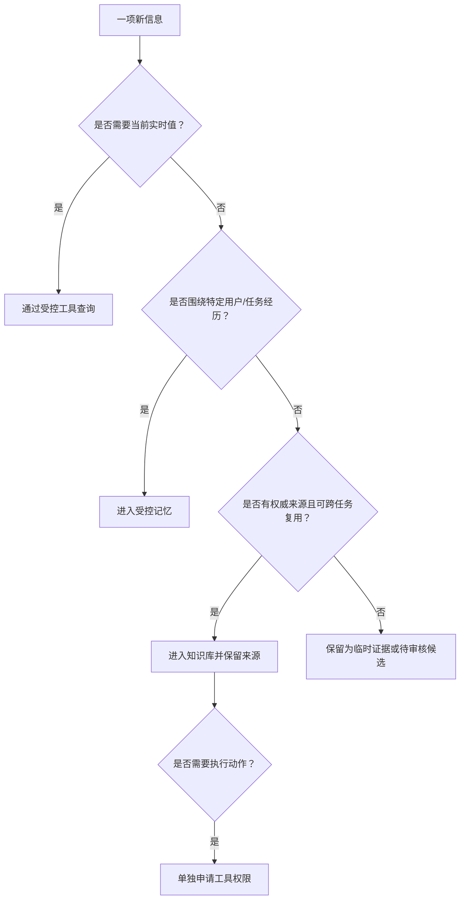

# 第 3 章 知识、记忆、上下文与工具

> 本章要回答：哪些信息应该进入知识库，哪些应该成为记忆，哪些必须实时查询？

## 3.1 混淆概念会直接制造系统风险

一个客服智能体记住“客户希望使用邮件沟通”是合理的；把“客户声称退款政策已经改变”写入全公司的政策知识库则是污染。将昨天的库存报表当成当前状态会产生业务错误；因为 Agent 找到了退款操作手册就允许它执行退款，则混淆了知识访问与行动授权。

这不是咬文嚼字。分错类别，系统就会把临时说法当成公司规则，把旧数据当成实时状态，甚至把“看过操作说明”误当成“有权执行操作”。平台要先分清信息属于哪一类，才能决定放在哪里、谁来更新、多久过期，以及什么时候交给模型。

## 3.2 原始来源与派生知识

原始来源是尚未被知识系统改写的材料，例如已签署合同、制度原文、固定 commit 的源码、数据库记录和事故时间线。原始并不自动等于权威：一份未经改写的草稿仍然是草稿，一条原始工单也可能包含错误判断。企业架构资产同样是重要来源候选，包括能力地图、业务流程模型、应用与数据视图、领域边界模型和架构决策库。它们应保留来源 URI、版本、时间、权限和内容哈希，再单独标明权威范围与审核状态。

“原始”不等于“当前事实”。企业架构制品常表达目标状态、责任划分或经过评审的设计，因此进入知识库时通常标为 `asserted`（来源明确声明），并注明适用范围和有效时间。若架构图与代码、配置或运行追踪冲突，平台应保留差异而不是让任一方静默覆盖另一方；第 16 章会把这种差异变成架构一致性检测。

派生知识是平台为了方便使用而加工出的内容，例如搜索索引、摘要、Wiki 页面、实体、关系和向量。它们让查询更快、阅读更省力，但也可能做错或过期。所以系统必须知道它们来自哪里，来源变化时能把旧结果下线，并且随时可以重新生成。模型写出的摘要不能覆盖原文。

```text
原始来源 --解析/抽取/摘要--> 派生知识 --检索/验证--> 任务上下文
    ^                                                |
    +-------------------- 引用与核验 -----------------+
```

## 3.3 知识：跨任务复用的企业事实与解释

知识是相对稳定、能够跨用户和任务复用的信息，包括规则、术语、系统职责、产品定义、架构解释和经过验证的关系。知识不等于永远不变，而是变化由明确来源和版本管理。

知识库要负责把知识接进来、读懂结构、组织起来、供人检索，并持续处理更新、权限和质量。它可以同时使用原文索引、Wiki 和图谱；“用了向量数据库”并不能说明已经建成知识库。

想判断一项信息能不能进入公共知识库，可以问三个简单问题：以后会不会有多个任务用到它？有没有可信来源或明确负责人？它变化时，平台能不能及时更新？如果三个答案都是否，它更可能只是本次任务的临时材料或某个人的记忆。

## 3.4 记忆：围绕主体和经历形成的状态

记忆来自交互历史。它可能属于会话、用户、任务、Agent 或组织。用户偏好、已执行动作、失败尝试和人工纠错都可能成为记忆。

与知识相比，记忆总是和某个人、某个任务以及一段经历有关。把全部聊天原样保存下来只能算日志。真正的记忆系统还要决定哪些值得记、怎样合并重复内容、发现错误后怎样纠正、需要时怎样找回来，以及什么时候应该忘掉。

公共知识和私人记忆必须分开。组织可以经过审核将多次事故经验提升为 Runbook，但不能让某个用户的一句话直接改变公共规则。记忆还需要用户可见性、删除权和保留期限。

## 3.5 实时状态：当前世界是什么样

库存、余额、告警、工单状态和部署版本变化很快。把它们定期复制进向量库，会在更新间隔内产生陈旧事实。实时状态应通过受控 API、数据库只读查询或可观测工具获得，并记录查询时间和环境。

当然，变化的信息也不一定每次都要实时查询。历史趋势和事故复盘可以整理成知识；队列现在有多长、订单此刻是什么状态，则更适合现场查询。判断标准是：业务最多能接受这个值旧多久。

## 3.6 工具：获取状态或改变世界的能力

工具包括只读工具与写工具。只读工具可以搜索代码、查询订单或读取指标；写工具可以退款、发布版本或修改配置。工具描述告诉 Agent 如何调用能力，但授权系统决定当前身份是否允许调用。

知识与工具经常成对出现：Runbook 说明怎么重放消息，消息系统工具真正执行重放。读取 Runbook 的权限不能自动转换成执行权限。高风险工具还需要参数约束、审批、幂等保护、审计和回滚。

## 3.6.1 程序性知识：告诉 Agent 怎样做一类工作

企业还有一类容易被漏掉的知识：不是“系统里有什么”，而是“遇到这种任务应该按什么步骤做”。Runbook 主要面向人阅读；程序性知识可以进一步整理成 Agent 能按需加载的工作包，里面包含规则、步骤、参考资料、模板和经过审查的脚本。

Agent Skills 是近年出现的一种开放格式。一个 Skill 通常是带有 `SKILL.md` 的目录，还可以包含 `scripts/`、`references/` 和 `assets/`。Agent 先看名称和描述，任务匹配后才加载完整说明，再按需读取附加文件或执行脚本，这是一种渐进披露。[Agent Skills 规范](https://agentskills.io/) [Anthropic 的 Agent Skills 说明](https://www.anthropic.com/engineering/equipping-agents-for-the-real-world-with-agent-skills) GitHub 已将同一规范用于 Copilot 的项目级和个人级技能。[GitHub Agent Skills 文档](https://docs.github.com/en/copilot/concepts/agents/about-agent-skills)

Skill 不等于工具权限。它可以告诉 Agent 怎样调用工具，却不能自行决定谁有权调用、参数是否安全或是否需要审批。Skill 也不等于组织知识：它是面向某类任务的程序性投影，必须带来源、版本、依赖、审核状态和回滚方式。把一个未经审核的脚本放进 Skill 目录，等于把不可信代码放进 Agent 的工作路径。

## 3.7 任务上下文：本次调用真正需要什么

上下文就是模型这一次调用真正能看到的全部内容，包括系统规则、用户目标、搜索证据、历史记忆、工具说明、当前状态和前几步的结果。模型能读取的长度有限，而且材料越多不一定越好。上下文工程要做的是挑出“刚好足以完成任务”的内容，而不是尽量塞满窗口。

光是“看起来相关”还不够。材料必须在用户权限内，版本和时间要对，细节层次要合适，来源也要可信。换句话说，准备上下文不是简单搜索，而是在一组限制条件下做选择。

### 3.7.1 企业上下文的层次不是知识类型

本书用七个层次描述企业上下文的范围，但这七个层次不能替代本章前面区分的知识、记忆、实时状态和工具。它们回答的是两个不同问题：层次说明“信息在企业工作链上的位置”，对象类型说明“信息怎样被保存、更新和使用”。

例如，战略目标属于 L1，但它可以作为经过审核的公共知识保存；H2 的销售实际值属于 L5，适合由数据服务作为带时间戳的观察返回；C-level 这次分析已经核对过哪些维度属于任务记忆；提交经营复核属于 L6 的受控动作。一个应用架构声明属于 L4，但它仍然是 `asserted` 的来源，不能因为放在“架构层”就自动变成当前事实。

七层可以作为路由线索：经营分析通常从 L0—L4 进入 L5，最后生成只读的 L6 执行上下文；变更影响分析从 L2/L4 进入 L5 的代码和运行证据；退款处置重点在 L5/L6。查询规划器不应按层次机械地全量加载，而应根据问题选择最短的、证据足够的路径，并把未覆盖的层次和数据缺口返回给 Agent。

## 3.8 主要对象的治理差异

下表列的是治理责任，不是互斥分类。一份政策原文可以同时是原始来源、公共知识和带有效时间的规则；它生成的摘要则又属于派生知识。设计数据模型时，应分别记录来源形态、业务用途、产生方式、可信程度和可见范围，避免用一个 `kind` 字段包办所有维度。

| 对象 | 主要写入者 | 更新方式 | 典型过期机制 | 关键治理 |
|---|---|---|---|---|
| 原始来源 | 业务系统/人 | 原系统变更 | 新版本或删除 | 不可篡改、来源、ACL |
| 派生知识 | 解析器/模型/人 | 增量重建 | 来源变化 | lineage、置信度、审核 |
| 公共知识 | 责任团队 | 发布流程 | 有效期/替代版本 | 责任人、冲突、版本 |
| 记忆 | 用户/Agent/任务 | 选择性写入 | TTL、遗忘、纠错 | 主体隔离、隐私、投毒 |
| 实时状态 | 业务/运行系统 | 实时查询 | 查询后迅速陈旧 | 时间戳、环境、只读范围 |
| 程序性知识/Skill | 领域团队/平台团队 | 审核后版本发布 | 版本替代、依赖变化、撤销 | 脚本来源、沙箱、权限、回滚 |
| 工具能力 | 平台团队 | 版本化接口 | 能力或策略变化 | 授权、审批、审计、回滚 |

## 3.9 Northstar 案例中的归类

在贯穿案例中（Northstar 的完整设定见第 14 章），订单取消规则是公共知识；ADR 和固定 commit 的源码是原始来源，同时可以生成 Wiki 与代码图；当前退款队列长度是实时状态；“值班工程师已经重启过消费者”属于本次事件的任务记忆；消息重放是写工具；操作者角色和审批状态决定它是否可用。

当用户问“退款为什么积压”时，上下文服务会组合这些对象，但不会把它们永久合并成一条无来源的文本。最终答案可以说明：规则来自哪份文档，调用关系来自哪个 commit，指标在何时查询，已执行动作来自哪次任务，以及建议中的哪些步骤尚需批准。

## 3.10 一个实用判断树



## 本章小结

知识、记忆、实时状态、工具和任务上下文分别由不同的人负责，更新速度和风险也不同。知识库保存可以反复使用的内容，记忆延续某个用户或任务的经历，工具读取当前状态或真正执行操作，上下文服务再按权限和任务把它们临时组合起来。先把这些东西分清楚，后面的架构、数据和安全设计才不会混乱。

第一部到此完成。第二部将从 RAG 开始，逐层解释知识怎样进入智能体。

## 延伸阅读

- Prateek Chhikara et al., [Mem0: Building Production-Ready AI Agents with Scalable Long-Term Memory](https://arxiv.org/abs/2504.19413), 2025。
- Preston Rasmussen et al., [Zep: A Temporal Knowledge Graph Architecture for Agent Memory](https://arxiv.org/abs/2501.13956), 2025。
- Model Context Protocol, [Specification](https://modelcontextprotocol.io/specification/)。
- NIST, [AI Risk Management Framework](https://www.nist.gov/itl/ai-risk-management-framework)。
