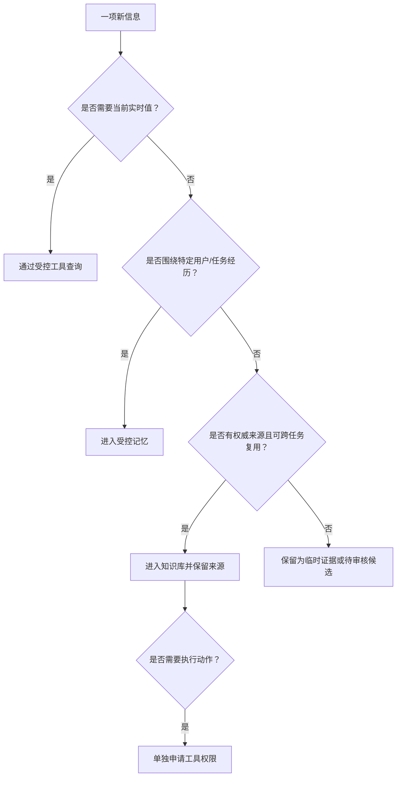

# 第 3 章 知识、记忆、上下文与工具

> 本章要回答：哪些信息应该进入知识库，哪些应该成为记忆，哪些必须实时查询？

## 3.1 混淆概念会直接制造系统风险

一个客服智能体记住“客户希望使用邮件沟通”是合理的；把“客户声称退款政策已经改变”写入全公司的政策知识库则是污染。将昨天的库存报表当成当前状态会产生业务错误；因为 Agent 找到了退款操作手册就允许它执行退款，则混淆了知识访问与行动授权。

这些不是术语争论，而是数据生命周期和安全边界。企业上下文系统首先要知道每类信息是什么，然后才能决定它存在哪里、由谁更新、何时过期和怎样进入模型。

## 3.2 原始来源与派生知识

原始来源是未经知识系统改写的权威材料，例如已签署合同、制度原文、固定 commit 的源码、数据库记录和事故时间线。它们应保留来源 URI、版本、时间、权限和内容哈希。

派生知识是从来源加工出的索引、摘要、Wiki 页面、实体、关系和向量。派生知识能够提高访问效率，却可能出错或过期，因此必须可回溯、可失效、可重建。一个成熟系统不会让模型摘要覆盖原始材料。

```text
原始来源 --解析/抽取/摘要--> 派生知识 --检索/验证--> 任务上下文
    ^                                                |
    +-------------------- 引用与核验 -----------------+
```

## 3.3 知识：跨任务复用的企业事实与解释

知识是相对稳定、能够跨用户和任务复用的信息，包括规则、术语、系统职责、产品定义、架构解释和经过验证的关系。知识不等于永远不变，而是变化由明确来源和版本管理。

知识库负责知识的采集、解析、组织、检索、更新、权限和质量。它可以同时包含原文索引、Wiki 和图谱，不能用某一种存储实现来定义。

判断一项信息是否适合成为公共知识，可以问三个问题：它是否被多个任务复用；是否存在权威来源或责任人；变化时是否能被可靠更新。如果三者都是否，信息更可能属于临时上下文或私人记忆。

## 3.4 记忆：围绕主体和经历形成的状态

记忆来自交互历史。它可能属于会话、用户、任务、Agent 或组织。用户偏好、已执行动作、失败尝试和人工纠错都可能成为记忆。

与知识相比，记忆更强调主体、时间和经历。记忆系统需要完成选择性写入、去重合并、冲突处理、检索和遗忘。保存全部聊天记录只是日志，不是完成了记忆管理。

公共知识和私人记忆必须分开。组织可以经过审核将多次事故经验提升为 Runbook，但不能让某个用户的一句话直接改变公共规则。记忆还需要用户可见性、删除权和保留期限。

## 3.5 实时状态：当前世界是什么样

库存、余额、告警、工单状态和部署版本变化很快。把它们定期复制进向量库，会在更新间隔内产生陈旧事实。实时状态应通过受控 API、数据库只读查询或可观测工具获得，并记录查询时间和环境。

并非所有动态信息都必须实时查询。历史趋势和事故复盘适合沉淀为知识；“现在的值”适合工具。区分的关键是业务允许的陈旧窗口。

## 3.6 工具：获取状态或改变世界的能力

工具包括只读工具与写工具。只读工具可以搜索代码、查询订单或读取指标；写工具可以退款、发布版本或修改配置。工具描述告诉 Agent 如何调用能力，但授权系统决定当前身份是否允许调用。

知识与工具经常成对出现：Runbook 说明怎么重放消息，消息系统工具真正执行重放。读取 Runbook 的权限不能自动转换成执行权限。高风险工具还需要参数约束、审批、幂等保护、审计和回滚。

## 3.7 任务上下文：本次调用真正需要什么

上下文是本次模型调用实际接收的信息集合。它可能包含系统规则、用户目标、检索证据、历史记忆、工具描述、当前状态和中间执行结果。上下文窗口有限，因此上下文工程的任务是选择最小充分集合，而不是尽可能多地塞入内容。

“相关”也不够。证据还要满足授权、版本正确、时间有效、粒度合适和来源可信。上下文构造是一项有约束的选择问题。

## 3.8 六类对象的治理差异

| 对象 | 主要写入者 | 更新方式 | 典型过期机制 | 关键治理 |
|---|---|---|---|---|
| 原始来源 | 业务系统/人 | 原系统变更 | 新版本或删除 | 不可篡改、来源、ACL |
| 派生知识 | 解析器/模型/人 | 增量重建 | 来源变化 | lineage、置信度、审核 |
| 公共知识 | 责任团队 | 发布流程 | 有效期/替代版本 | 责任人、冲突、版本 |
| 记忆 | 用户/Agent/任务 | 选择性写入 | TTL、遗忘、纠错 | 主体隔离、隐私、投毒 |
| 实时状态 | 业务/运行系统 | 实时查询 | 查询后迅速陈旧 | 时间戳、环境、只读范围 |
| 工具能力 | 平台团队 | 版本化接口 | 能力或策略变化 | 授权、审批、审计、回滚 |

## 3.9 Northstar 案例中的归类

在贯穿案例中（Northstar 的完整设定见第 14 章），订单取消规则是公共知识；ADR 和固定 commit 的源码是原始来源，同时可以生成 Wiki 与代码图；当前退款队列长度是实时状态；“值班工程师已经重启过消费者”属于本次事件的任务记忆；消息重放是写工具；操作者角色和审批状态决定它是否可用。

当用户问“退款为什么积压”时，上下文服务会组合这些对象，但不会把它们永久合并成一条无来源的文本。最终答案可以说明：规则来自哪份文档，调用关系来自哪个 commit，指标在何时查询，已执行动作来自哪次任务，以及建议中的哪些步骤尚需批准。

## 3.10 一个实用判断树



## 本章小结

知识、记忆、实时状态、工具和任务上下文拥有不同的主体、时间尺度和风险。知识库保存可复用知识，记忆延续经历，工具获取状态或改变世界，上下文服务在运行时把它们按权限和任务组合。把这些概念分开，是后续架构、数据模型和安全设计的前提。

第一部到此完成。第二部将从 RAG 开始，逐层解释知识怎样进入智能体。

## 延伸阅读

- Prateek Chhikara et al., [Mem0: Building Production-Ready AI Agents with Scalable Long-Term Memory](https://arxiv.org/abs/2504.19413), 2025。
- Preston Rasmussen et al., [Zep: A Temporal Knowledge Graph Architecture for Agent Memory](https://arxiv.org/abs/2501.13956), 2025。
- Model Context Protocol, [Specification](https://modelcontextprotocol.io/specification/)。
- NIST, [AI Risk Management Framework](https://www.nist.gov/itl/ai-risk-management-framework)。
