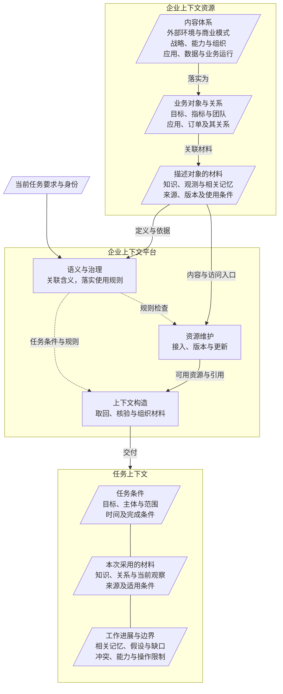
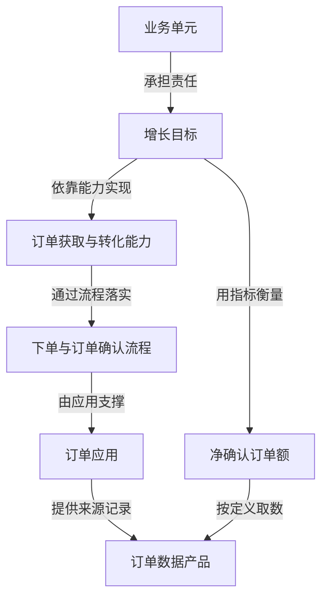
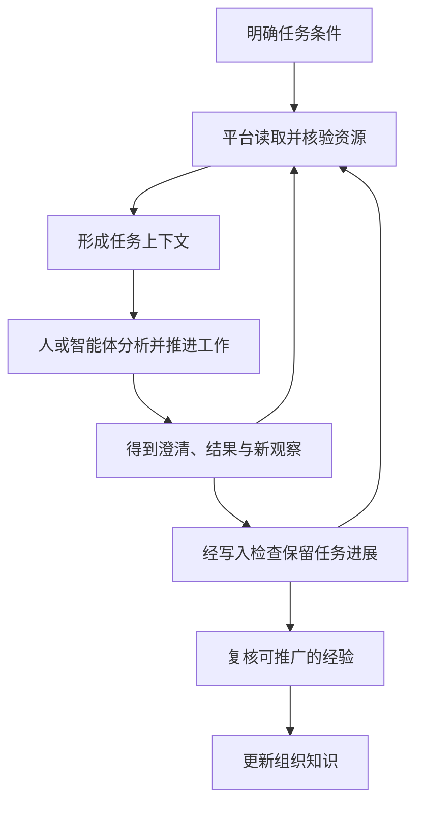

# 第 3 章 企业上下文怎样组织起来

> 本章要回答：企业上下文资源、任务上下文和平台各自包含什么，三者怎样协作支持一项工作？

第一章给出三个核心部分的关系。本章依次展开资源、任务上下文和平台，最后用销售分析贯穿一次工作。资源说明企业有什么可用依据，任务上下文说明这次采用什么，平台负责把两者连接并持续维护。

## 3.1 三个部分的内部组成

```mermaid
flowchart TB
  subgraph R["企业上下文资源"]
    D[/"内容体系<br/>外部环境与商业模式<br/>战略、能力与组织<br/>应用、数据与业务运行"/]
    O[/"业务对象与关系<br/>目标、指标与团队<br/>应用、订单及其关系"/]
    M[/"描述对象的材料<br/>知识、观测与相关记忆<br/>来源、版本及使用条件"/]
    D -->|落实为| O
    O -->|关联材料| M
  end
  subgraph P["企业上下文平台"]
    G["语义与治理<br/>关联含义，落实使用规则"]
    I["资源维护<br/>接入、版本与更新"]
    C["上下文构造<br/>取回、核验与组织材料"]
    G -.规则检查.-> I
    G -.任务条件与规则.-> C
    I -->|可用资源与引用| C
  end
  Q[/"当前任务要求与身份"/] --> G
  M -->|定义与依据| G
  M -->|内容与访问入口| I
  subgraph T["任务上下文"]
    direction TB
    S[/"任务条件<br/>目标、主体与范围<br/>时间及完成条件"/]
    E[/"本次采用的材料<br/>知识、关系与当前观察<br/>来源及适用条件"/]
    W[/"工作进展与边界<br/>相关记忆、假设与缺口<br/>冲突、能力与操作限制"/]
    S --- E
    E --- W
  end
  C -->|交付| T
```

斜框表示信息，矩形表示系统能力。资源内部按企业内容、对象关系和描述材料组织；任务上下文内部的连线表示条件、依据与进展共同组成一份工作材料；平台则承担维护、治理和构造职责。

同一份指标定义可以长期保存在资源中，被多个任务引用。销售分析只取其中适用的版本，再加上此次比较的期间、组织范围、经营观察和核验进展，形成当前任务上下文。用户的目标和身份来自本次请求，不能仅从历史资源推断。

图中先说明三个部分的结构。人或智能体使用上下文推进工作，工具和业务系统负责实际操作，这些参与者与结果反馈在 3.5 节的协作过程中展开。

## 3.2 企业上下文资源怎样组织

一组可用的企业上下文资源，需要让人或系统回答三个问题：这份材料在讲企业的哪一方面，涉及哪些对象，它对这些对象作出了什么描述。内容体系提供入口，对象与关系把不同资料连接起来，具体记录则提供定义、事实、经历与证据。

### 3.2.1 内容体系：覆盖企业的哪些方面

第一章的内容体系覆盖从商业模式到业务运行的企业全貌。在资源中，每一方面都需要落实为可以识别的对象，以及有业务含义的联系。

| 企业内容 | 需要认识的业务对象 | 需要建立的联系 |
|---|---|---|
| 外部环境与商业模式 | 客户群、市场、产品、收入来源、外部约束 | 为谁提供什么价值，哪些收入与约束影响经营选择 |
| 战略意图 | 目标、战略举措、衡量指标 | 用什么指标衡量目标，哪些业务能力支撑目标 |
| 业务能力与价值流 | 能力、价值流、产品、业务领域 | 哪些流程实现能力，哪些环节共同交付客户价值 |
| 经营与组织 | 业务单元、团队、角色、责任人 | 谁负责目标、流程或应用，谁有权作出哪类决定 |
| 应用与数据 | 应用、服务、数据产品、指标 | 流程依靠哪些系统，指标取自哪些数据及计算规则 |
| 业务运行 | 订单、流程实例、退款、业务事件 | 实际发生了什么，涉及哪些对象，依据什么规则处理 |

围绕这些对象，还要保留描述它们的材料。例如，指标有计算定义及不同期间的数值，应用有设计说明及运行观察，退款有适用政策及处理记录。这些材料通过对象身份和版本联系起来，供任务查询与核验。

### 3.2.2 对象与关系：把不同方面的内容连起来

例如，企业提出一个增长目标，就需要说明衡量它的指标、承担目标的业务单元，以及准备改善的业务能力。沿着能力可以找到相关流程，再找到支撑流程的应用和数据。沿着指标可以找到定义与数据来源，核对实际表现。这些联系让经营问题能够落到可检查的事实，也让一次运行异常能够追溯到业务影响。

下面用销售分析展示一组资源中的对象关系。每个框表示一个业务对象，箭头表示它们在业务上的联系。

```mermaid
flowchart TB
  T["增长目标"] -->|用指标衡量| M["净确认订单额"]
  U["业务单元"] -->|承担责任| T
  T -->|依靠能力实现| C["订单获取与转化能力"]
  C -->|通过流程落实| P["下单与订单确认流程"]
  P -->|由应用支撑| A["订单应用"]
  A -->|提供来源记录| D["订单数据产品"]
  M -->|按定义取数| D
```

这组关系提供了多条查证路径：从目标找到指标，可以核对经营结果；从责任关系找到业务单元，可以确认解释和决策由谁负责；沿能力、流程和应用继续查，可以定位相关运行记录。关系本身也需要依据，例如“业务单元承担目标”来自目标责任文件，“指标使用数据产品”来自指标定义及数据目录。

以“净确认订单额下降”为例，平台沿这些关系找到指标定义与所属目标，再确认涉及的业务单元、产品和渠道，以及提供订单数据的数据服务。随后取得同一口径下的两个期间快照。若要调查某次流程调整是否影响了销售，还需继续查调整时间、受影响订单和对照证据。架构关系指明查证方向，调查所得的证据决定能得出什么结论。

### 3.2.3 描述材料：知识、观测和记忆怎样围绕对象组织

找到对象后，还要取得本次任务所需的材料。指标定义说明怎样计算，期间快照记录算出了什么，分析记录说明这次已经核对了哪些问题。它们围绕同一个指标组织，各自承担不同用途。

| 围绕什么对象 | 可复用知识 | 业务观测 | 主体与任务记忆 |
|---|---|---|---|
| 净确认订单额 | 计算定义、币种规则、与目标的关系 | H1/H2 在指定口径和快照下的数值 | 本次已确认的口径、待核对维度 |
| 退款服务 | 服务职责、依赖关系、运行手册 | 当前队列深度、消费者延迟、部署版本 | 本次查过的日志、已排除的假设 |
| 客户退款 | 适用政策、审核要求、流程说明 | 退款申请当前状态、实际处理事件 | 此次沟通中已确认的事项与待办 |

知识、观测和记忆可以出现在不同企业内容中。战略分析既需要目标和指标知识，也需要经营观测及分析记忆；运行处置同样需要知识、观测和记忆，只是关联的对象换成服务、订单和事故。每份材料都保留来源、时间、版本以及谁能使用的条件，平台才能判断它是否适合当前任务。

例如，H2 数值要指明采用的指标定义和数据快照；“已核对币种”的记忆要指明属于哪次分析、依据哪些记录；关于下降原因的摘要要指回支持它的材料。用户可以从摘要追到观测，再追到计算口径和来源记录。材料之间的引用使一项结论能够被核查和更新。

### 3.2.4 让资源能够被任务持续使用

这些内容可以借用企业已有的架构资产。能力地图帮助定位业务能力，组织责任表指出维护者，应用目录说明系统归属，数据目录说明数据来源。平台将它们关联到同一批业务对象，并保留声明的来源与适用时间。第二章介绍的企业架构在这里提供结构依据，第八章会进一步说明怎样建立和验证模型。

实际建设可以从一个经营问题或业务任务开始，先连接回答它所需的对象。随着任务增多，同一个产品、团队或指标可以被其他任务继续引用，逐步形成跨部门的企业资源。销售分析可能沿目标、指标和数据进入，退款处置可能沿订单、政策和服务进入；每次查询都按主体权限、时间和范围选择其中一部分。

这些资源可以继续分布在原来的系统中。平台维护对象身份、关系、来源引用以及受控查询入口；收到任务后再选择要读取哪些记录。内容变化时，还需要找到依赖它的摘要、关系和任务材料，更新或标明失效。下面将继续说明任务上下文的组成，以及平台负责的维护和治理工作。

### 3.2.5 每份资源怎样保持可解释

来源材料说明依据从哪里来，对象身份说明它描述什么，版本和时间说明何时适用。平台还需要保留责任人、可见范围、加工方式和不确定性。政策、代码和经营指标各有自己的内容结构，共同的管理信息使它们能够被关联和核验。

业务对象与关于它的记录需要分开。指标有长期身份，计算定义有版本，某个期间的数值是一次观测，分析摘要则是对观测的解释。记录通过指标身份与版本相接，既能保留历史，也能解释同一个对象在不同材料中的描述。

共同语义模型也是需要维护的知识：它记录术语、类型、身份映射和关系含义。财务客户与客服联系人可以保留各自定义，再说明映射条件。平台的语义能力读取这些定义并执行关联；业务责任人负责确认定义是否准确。

## 3.3 任务上下文怎样组成

资源面向企业中可能发生的多项工作，任务上下文面向当前这项工作的一个决策点。它由本次请求、所选企业资源和任务已经产生的进展共同组成。

### 3.3.1 任务条件：明确这次要做什么

任务条件包含目标、主体、范围、时间和完成标准。销售分析需要明确指标与比较期间，退款处置需要明确是判断原因还是实施处理。允许的行动和预算也随任务确定。已确认条件应被后续步骤沿用，修改条件时要重新检查受影响的材料。

第一章的四类问题有助于确定完成标准：认知任务检查解释与证据，决策任务检查选项、取舍及决定，创造任务检查新成果是否满足要求，执行任务检查业务结果是否达到。一个复合任务应分别记录这些结果，避免把分析完成当作决定已经作出，或把方案写好当作实施已经完成。

### 3.3.2 本次依据：选中哪些资源

本次依据包括适用的定义和规则、相关对象与关系、业务观察和历史证据。每项材料保留来源、版本、范围与使用理由。用户应能知道：政策来自哪一版，数值按什么口径取得，关系由什么证据支持，观察在什么时间采集。

任务上下文既可以包含短材料，也可以保留外部引用，按需继续读取。选中的材料要足以支持当前判断，尤其不能在压缩时丢掉关键条件、单位和例外。

### 3.3.3 工作进展：保留已经知道和仍不知道的事

工作进展说明查过什么、采取过什么步骤、得到了什么结果，以及还有哪些待办。相关记忆帮助任务继续推进，已确认事实、待验证假设和用户声明则分别标明。

冲突与缺口也是上下文的一部分。例如两个报表口径不一致、当前库存没有取得、某个渠道变化尚无对照证据，都应该保留其影响与下一步需求。材料不足时，使用者才能决定补充查询、向人确认或停止相应判断。

### 3.3.4 能力与限制：说明现在可以怎样使用材料

上下文还应说明当前可用的读取能力、可以提出的操作及其限制。能力说明帮助智能体规划下一步，实际执行由相应服务检查权限、参数、前置状态和必要批准。关于工具的说明、工具执行结果与历史使用经验承担不同用途。

| 销售分析中的内容 | 在任务上下文中的作用 |
|---|---|
| 确认采用净确认订单额、H1/H2 和指定组织范围 | 任务条件 |
| 指标定义、目标与组织关系 | 所选知识与结构依据 |
| 按相同口径取得的两个期间快照 | 业务观测 |
| 已核对币种与取消订单的处理方式 | 工作进展 |
| 渠道变化可能有关，但缺少联合明细 | 假设与缺口 |
| 可读取经营数据，经营变更需要另行授权 | 能力与操作限制 |

### 3.3.5 任务推进时，上下文怎样变化

新的澄清、观察或分析结果会改变当前材料。平台重新核验影响范围，保留需要延续的进展，再准备下一轮上下文。长期任务可以维护外部工作档案，每次模型调用只读取其中适用的一部分。

恢复任务时，已有记录说明过去做到了哪里，当前权限和业务观察说明现在还能怎样继续。任务结束后，相关记录按保留要求归档或删除；有复用价值的经验经过复核，才进入组织知识。

## 3.4 平台怎样提供这三类能力

平台长期维护资源，并为具体任务提供上下文。其职责可以归为资源维护、语义与治理、上下文构造。下面说明每项能力的输入、输出和责任。

| 平台职责 | 接收什么 | 提供什么 |
|---|---|---|
| 资源维护 | 来源内容、访问入口、来源变化与必要任务进展 | 可访问资源、身份与版本、引用及更新记录 |
| 语义与治理 | 对象定义、身份映射、责任和有效策略 | 可采用的含义及访问、使用、更新规则 |
| 上下文构造 | 任务要求、受认证身份、可用资源与适用规则 | 本次条件、所选依据、进展、限制和缺口 |

### 3.4.1 资源维护

资源维护负责接入来源、记录身份、保留版本并处理变化。它可以保存一份文档，也可以登记一个受控查询入口。政策、数据服务和任务记录可以继续分布在原系统中，平台维护它们的引用和访问约定。

来源变化后，平台识别受影响的摘要、关系与引用，更新或标明失效。任务记录写入时检查归属、权限和保留要求；经验发布为组织知识时另行复核适用条件和依据。

### 3.4.2 语义与治理

语义能力让不同系统中的材料能够被正确关联，例如辨认某个服务的多个名字，或区分净订单额与收入。治理能力落实谁能使用、哪个版本适用、谁负责更新，以及冲突由谁处理。

一份权限手册可以作为解释材料，实际授权由当前生效的策略机制决定。过去可读的材料不一定今天仍可读，经过摘要的内容也要继续遵守来源的访问条件。

### 3.4.3 上下文构造

上下文构造根据当前任务选择读取路径：查找文档、查询结构化数据、沿关系取证、读取当前观察或相关记忆。材料回来后，检查权限、时间、口径、来源及冲突，再按任务需要组织输出。

这项能力还负责如实表达覆盖范围。缺少当前观察时不能用旧记录补成当前事实，未验证的解释不能进入已确认结论。查询预算不足时，可以缩小范围、分步读取或返回缺口。

## 3.5 三个部分怎样随任务协作

任务开始时，用户与系统先明确要求及身份。平台据此读取资源，构造任务上下文。人或智能体使用材料形成判断，提出补充问题或受控动作。得到的新信息回到平台，形成下一轮材料和必要记录。

```mermaid
flowchart TB
  Q[明确任务条件] --> P[平台读取并核验资源]
  P --> C[形成任务上下文]
  C --> A[人或智能体分析并推进工作]
  A --> F[得到澄清、结果与新观察]
  F --> P
  F --> M[经写入检查保留任务进展]
  M --> P
  M --> K[复核可推广的经验]
  K --> R[更新组织知识]
```

准备材料与改变业务状态由不同机制负责。智能体可以依据运行手册提出重放建议，执行服务仍要检查主体、参数、批准和当前状态；操作后还需要新的业务观察判断目标是否达到。关于这些机制的方法和实现分别在第 9、10、12 章展开。

一次任务没有执行外部动作，也会产生有用进展。例如销售口径得到确认、一个假设被排除，或缺少的数据有了明确负责人，都可以帮助后续工作。平台按各自用途保存这些记录，并控制它们的传播范围。

## 3.6 让销售问题完整走一遍

现在用第一章提出的销售问题检验整套逻辑。以下是解释架构的场景；第四部分的教学案例只实现其中的最小切片，尚不具备通用自然语言分析或真实数据仓连接能力。

经营负责人问：“H2 的销售情况为什么比 H1 差这么多？”平台先把它识别为需要确认口径的分析任务。用户确认采用净确认订单额、自然年半年度和全公司范围后，才继续准备材料。若问题实际只问某个区域，全公司的确认就不能替代区域范围。

语义模型把这个指标与目标、业务单元、产品、渠道及数据产品关联起来。指标定义是可复用知识，按定义读取的 H1/H2 快照是观测，“这次已核对币种和取消订单处理方式”是任务记忆。它们通过同一指标身份与版本相接，而不是通过文字相似就认定相同。

平台先验证数据可比，再由确定性计算得到差异和分解，将计算依据、范围、来源和缺口交付给 Agent。某条渠道事件可以成为待调查线索，但如果没有订单级数据或对照证据，就不能写成已确认原因。同一批订单按产品和地区分别分组，也不能把两组差异重复相加。

Agent 可以据此解释已经确认的下降、提出后续核验事项，并指出需要哪位负责人补充信息。即使经营负责人级别很高，这次只读分析也不会自动获得调价工具。若以后决定实施经营变更，那是具有新目标、参数与批准要求的行动任务。

将这个过程与本章的架构对应起来：

| 场景中的材料或动作 | 在总图中的位置 |
|---|---|
| 战略目标、指标定义、报表与经营快照 | 企业上下文资源 |
| 已确认的指标、期间、主体与范围 | 任务要求 |
| 关联指标与业务单元，落实访问规则 | 平台的语义与治理能力 |
| 查询、核验、对账并整理缺口 | 平台的上下文构造能力 |
| 本次可见证据、差异、假设和限制 | 任务上下文 |
| 分析解释或提出下一步 | Agent 的工作 |
| 保存核验进展，提交经验候选 | 平台的资源维护能力 |

退款场景可以用同一方法解释，只是资源变成政策、代码关系、队列观察和排查记忆，允许的行动变成受限重放。架构稳定，任务选择的材料和成功标准不同。

## 3.7 从逻辑架构走向方法与实现

第二部分解释完成这些职责的方法，并比较代表性技术。第三部分给出接口、持久化、权限、执行和评测的工程细节。

| 逻辑架构中的问题 | 核心方法与技术选择 | 工程细节 |
|---|---|---|
| 企业资料怎样成为可引用资源 | 第 4 章：来源、解析与证据单元 | 第 10、11 章：接入、身份、版本和更新 |
| 怎样找到相关材料与关系 | 第 5、6 章：检索、关系与层级导航 | 第 10、12、13 章：适配、过滤、预算和评测 |
| 怎样整理可复用的解释 | 第 7 章：知识视图与 Wiki | 第 11、12 章：血缘、失效与可见范围 |
| 怎样说明企业对象与业务约定 | 第 8 章：知识建模与本体 | 第 11、12 章：模型发布、数据约束与动作执行 |
| 怎样组成并延续任务上下文 | 第 9 章：材料选择、刷新与记忆 | 第 10—13 章：接口、恢复、安全和质量验证 |

各项方法可以组合使用。一次查询可能先沿关系定位系统，再读摘要了解背景，取回原始证据核验，最后把确认事项记入任务。实现时根据任务需要选择组件，并用实际结果检验它们的贡献。

## 本章小结

企业上下文资源由企业内容、对象关系和描述材料组成。任务上下文明确本次条件、采用的依据、工作进展及使用边界。平台维护资源，落实语义和治理规则，再按任务构造上下文。三者通过持续读取、使用和反馈形成协作，下一部分将逐一说明这些职责可以怎样实现。

## 延伸阅读

- [第 4 章：资料准备](/part-2/chapter-04)、[第 8 章：知识建模与本体](/part-2/chapter-08)。
- [第 9 章：任务上下文与记忆](/part-2/chapter-09)、[第 10 章：平台工程](/part-3/chapter-10)。
- [第 11 章：版本与时间](/part-3/chapter-11)、[第 12 章：安全与受控行动](/part-3/chapter-12)、[第 13 章：评测与运行](/part-3/chapter-13)。
