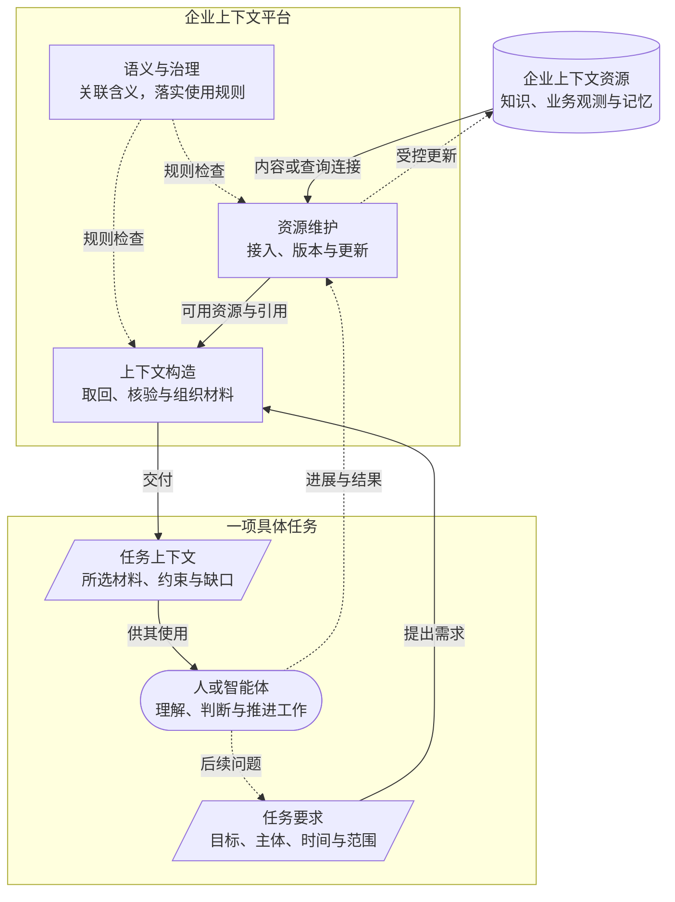

# 第 3 章 企业上下文怎样组织起来

> 本章要回答：从战略到运行的企业内容怎样组织成资源，平台又怎样把这些资源变成当前任务可用的材料？

第一章说明了企业上下文的内容体系，以及资源、平台和任务的关系。本章沿着这两条线展开：先看平台承担哪些职责，再看商业模式、战略、组织、应用和业务运行怎样通过对象与关系相接，最后跟随一次任务理解材料的选择、使用和更新。

## 3.1 平台怎样连接资源与任务

```mermaid
flowchart TB
  R[("企业上下文资源<br/>知识、业务观测与记忆")]
  subgraph P["企业上下文平台"]
    I["资源维护<br/>接入、版本与更新"]
    G["语义与治理<br/>关联含义，落实使用规则"]
    C["上下文构造<br/>取回、核验与组织材料"]
    G -.规则检查.-> I
    G -.规则检查.-> C
    I -->|可用资源与引用| C
  end
  subgraph T["一项具体任务"]
    Q[/"任务要求<br/>目标、主体、时间与范围"/]
    B[/"任务上下文<br/>所选材料、约束与缺口"/]
    A(["人或智能体<br/>理解、判断与推进工作"])
    B -->|供其使用| A
    A -.后续问题.-> Q
  end
  R -->|内容或查询连接| I
  Q -->|提出需求| C
  C -->|交付| B
  A -.进展与结果.-> I
  I -.受控更新.-> R
```

这张图展开了第一章的平台方框。平台内的三个矩形都是系统能力：资源维护负责让材料持续可用，语义与治理负责统一含义并落实规则，上下文构造负责为当前任务准备材料。圆柱和斜框仍表示信息，圆角框表示工作参与者；箭头上的文字说明它们交换什么，或怎样相互约束。

| 平台职责 | 接收什么 | 提供什么 |
|---|---|---|
| 资源维护 | 来源内容、查询连接、来源变更与任务进展 | 可访问的资源、版本、引用和更新记录 |
| 语义与治理 | 对象定义、身份映射、责任与有效策略 | 可采用的业务含义，以及访问、使用和更新的检查规则 |
| 上下文构造 | 任务要求、可用资源及适用规则 | 有来源、有范围、有缺口说明的任务上下文 |

例如，退款政策可以继续保存在文档系统中，当前队列通过监控接口读取。资源维护记录如何访问它们，语义与治理确认“退款”“队列”和操作者权限的含义，上下文构造再按本次问题取回材料并检查是否适用。各项能力可以放在同一个应用中，也可以由多个服务协作提供。

工作参与者负责使用材料、提出后续问题并推进任务。业务工具的实际调用由运行环境和业务系统授权执行，产生的结果再作为观察或任务记录回到平台。平台据此准备下一轮上下文，并按不同规则处理任务记忆和组织知识的更新。

## 3.2 把企业内容组织成相互关联的对象

第一章的内容体系覆盖从商业模式到业务运行的企业全貌。要让平台真正用起来，需要把每一方面落实为能够识别的对象、明确的关系和可查证的材料。

| 企业内容 | 需要认识的业务对象 | 需要建立的联系 |
|---|---|---|
| 外部环境与商业模式 | 客户群、市场、产品、收入来源、外部约束 | 为谁提供什么价值，哪些收入与约束影响经营选择 |
| 战略意图 | 目标、战略举措、衡量指标 | 用什么指标衡量目标，哪些业务能力支撑目标 |
| 业务能力与价值流 | 能力、价值流、产品、业务领域 | 哪些流程实现能力，哪些环节共同交付客户价值 |
| 经营与组织 | 业务单元、团队、角色、责任人 | 谁负责目标、流程或应用，谁有权作出哪类决定 |
| 应用与数据 | 应用、服务、数据产品、指标 | 流程依靠哪些系统，指标取自哪些数据及计算规则 |
| 业务运行 | 订单、流程实例、退款、业务事件 | 实际发生了什么，涉及哪些对象，依据什么规则处理 |

围绕这些对象，还要保留描述它们的材料。例如，指标有计算定义及不同期间的数值，应用有设计说明及运行观察，退款有适用政策及处理记录。这些材料通过对象身份和版本联系起来，供任务查询与核验。

例如，企业提出一个增长目标，就需要说明衡量它的指标、承担目标的业务单元，以及准备改善的业务能力。沿着能力可以找到相关流程，再找到支撑流程的应用和数据。沿着指标可以找到定义与数据来源，核对实际表现。这些联系让经营问题能够落到可检查的事实，也让一次运行异常能够追溯到业务影响。

以“净确认订单额下降”为例，平台先找到指标定义与所属目标，再确认涉及的业务单元、产品和渠道，以及提供订单数据的数据服务。随后取得同一口径下的两个期间快照。若要调查某次流程调整是否影响了销售，还需继续查调整时间、受影响订单和对照证据。架构关系指明查证方向，调查所得的证据决定能得出什么结论。

这些内容可以借用企业已有的架构资产。能力地图帮助定位业务能力，组织责任表指出维护者，应用目录说明系统归属，数据目录说明数据来源。平台将它们关联到同一批业务对象，并保留声明的来源与适用时间。第二章介绍的企业架构在这里提供结构依据，第八章会进一步说明怎样建立和验证模型。

实际建设可以从一个经营问题或业务任务开始，先连接回答它所需的对象。随着任务增多，同一个产品、团队或指标可以被其他任务继续引用，逐步形成跨部门的企业资源。销售分析可能沿目标、指标和数据进入，退款处置可能沿订单、政策和服务进入；每次查询都按主体权限、时间和范围选择其中一部分。

## 3.3 来源提供材料，但来源本身也需要判断

企业来源包括制度、设计说明、代码、数据库记录、业务 API、工单、事件和人员提供的解释。平台首先要保留材料来自哪里、哪个版本、谁提供、何时获得，以及适用范围。

“原始来源”表示材料尚未被知识系统改写，不表示它必然正确。一份草稿仍然可能是原始来源；一位专家的判断也可能只适用于某个区域。企业架构图常表达计划或经过评审的设计，监控记录则描述某次实际观察。两者冲突时，要解释各自说的是什么，不能简单让最后更新的一方覆盖另一方。

平台可以根据来源生成段落索引、摘要、Wiki 页面和关系。这些加工结果有助于搜索与阅读，但必须保留来源和加工记录。这里要分清两个概念：摘要或归纳关系可能形成派生知识；倒排索引、嵌入等则是帮助访问知识的技术表示。它们都不是新的独立事实来源。

例如，政策原文规定某类退款需要人工审核，Wiki 将它概括成一句话。两份材料可以共同帮助理解，但不能被当成两份独立证据。政策撤销后，依赖它的摘要和索引也要更新。第 11 章将详细解释这种来源与派生关系。

## 3.4 共同语义：先认清在说谁、说什么

材料汇集之后，常会遇到同一个词在不同系统里含义不同，或者同一个对象有多个名字的情况。

“销售”可能指订单额、收入或回款；“负责人”可能指业务负责人、技术维护者或值班人员；一个产品在合同、报表和代码里也可能使用不同编号。共同语义模型负责记录这些定义、身份和关系。它帮助平台判断哪些记录可以合并、哪些只能关联、哪些必须保持区别。

这里的“对象”首先指业务上需要认识的东西，例如客户、产品、团队、服务、指标或战略目标。它们可以有稳定身份和关系。信息记录则是关于这些对象的具体描述，例如一条客户归属声明、一份指标定义版本或一次指标观测。业务对象和描述它的记录不能混为一类。

以销售指标为例：

| 材料 | 它在说明什么 |
|---|---|
| 指标“净确认订单额” | 企业认识的一个指标，有稳定身份 |
| 指标定义的某个版本 | 怎样计算，包含和排除什么，适用哪个期间 |
| 某次查询返回的 H2 数值 | 在给定口径和数据快照下得到的观测 |
| 引用该数值的分析摘要 | 根据观测加工出的解释 |
| 本次任务的核对记录 | 哪位分析者已确认了哪项口径，仍有何疑问 |

这些记录通过指标身份、来源与版本联系起来。它们不应全部被压成一个不断覆盖的“销售”字段。

指标定义是一项可复用知识，也为查询和计算提供语义依据。人阅读定义时了解它是什么意思，程序使用定义时按其中规定的口径取得数值。两种用途引用同一个定义版本；为了查询效率生成的其他表示，也保留与该版本的对应关系。语义模型中的术语和关系定义都按这样的方式维护来源、版本、权限和责任人。

不同业务领域可以保留各自的词义。财务客户和客服联系人采用各自模型，再说明什么时候、依据什么建立映射。早期可以先定义当前任务需要的术语和关键关系；模型的表示与验证方法见第 8 章。

## 3.5 资源管理：知识、观测和记忆怎样配合

同一份企业资料可以服务不同任务。管理它时，需要说明它在什么条件下可用、由谁更新，以及怎样保留使用依据。知识、观测和记忆在这些方面各有侧重。

**可复用知识**帮助不同任务理解企业，例如政策、术语、服务职责、指标定义和经过验证的关系。知识变化时，需要保留来源和版本，让使用者知道哪一份适用于当前问题。

**业务观测**记录某个时间、范围和环境下取得的值或事件。当前队列深度有很短的可用时间，已结账的半年经营快照可以保存较久。变化速度影响如何读取和更新，却不单独决定信息类别。两者都必须说明观察时间、口径和来源，历史值不能假装是当前状态。

**主体与任务记忆**保存某个人、Agent 或任务的相关经历，例如偏好、已执行步骤、失败尝试、排除过的假设和未完成事项。记忆需要说明属于谁、谁可以访问、多久保留。重复利用一条经验，不代表它已经成为企业正式规则。

同一次工具返回，可以先作为当前观察使用，随后以引用形式记入任务记录，再在复盘中成为经验的证据。它在不同环节承担不同角色，但原始来源、时间和审核状态不能丢失。已有记忆研究也将外部记忆看作需要提取、更新和检索的系统，而不只是保存全部对话。[Mem0 论文](https://arxiv.org/abs/2504.19413)

因此，使用一条记录时，要看它用来解释哪件事，由谁负责更新，适用于什么时间和主体，以及这次任务可以如何使用。

## 3.6 一条信息要说明哪些事情

无论是一段政策、一个对象属性还是一条记忆，都需要携带足够的说明，让后来使用它的人能够判断它是否适用。至少要能回答下面这些问题。

| 要说明的问题 | 示例 |
|---|---|
| 描述的是谁或什么？ | 哪个产品、指标、客户、服务或任务 |
| 在这里承担什么角色？ | 定义、规则、当前观察、历史证据、经历或工作指导 |
| 怎样获得？ | 原系统记录、人工声明、程序计算或模型归纳 |
| 适用于哪里、什么时候？ | 组织、地区、环境、业务时间及版本 |
| 依据和不确定性是什么？ | 原始引用、审核记录、冲突来源、待验证假设 |
| 谁能使用、谁维护？ | 访问策略、责任人、更新和保留要求 |

例如，一份经过审批的退款政策原文，可以同时是来源材料、可复用知识和某业务范围内的规范依据。摘要是从它派生的阅读材料。私有任务中对政策的误解则是任务记录，不能反过来修改政策。关系和规则也应携带同样的管理信息，而不只给文档加标签。

后文把这套共同的身份与管理信息称为治理信封。信封负责让不同表示能够指回同一对象或版本，不要求每类业务内容都采用相同字段。代码保留符号与提交，经营指标保留口径与期间，订单保留业务主键与状态。第 8 章讲业务含义，第 11 章讲身份、版本和来源管理。

## 3.7 上下文构造：按任务取回并核验材料

资源准备好之后，平台还需要解决本次任务的问题。收到“为什么 H2 销售下降”时，不能立刻将所有销售资料交给模型。

先明确用户目标、主体权限、期间与范围。如果“销售”的含义尚不明确，就返回待确认项。确定问题后，平台选择相关来源：定义和战略目标可以检索，经营数据可能需要结构化查询，已有核验进展来自任务记忆。每条路径都要在暴露内容前执行访问检查。

材料回来后，再检查它们能否一起使用。两个报表单位不同，就不能直接相加；当前组织结构不能不加说明地套到历史期间；一份摘要和它引用的原文不能算两份独立佐证；未经验证的解释不能进入已确认事实。发现冲突或缺口时，应把原因留给调用方。

最后，按任务需要的细节和预算组织材料。预算可以限制条目数、上下文长度、查询耗时和成本，但不能为省事删除关键适用条件。如果现有预算内无法取得足够证据，应缩小任务、继续分步查询或明确停止，而不是声称已经完整理解。

这一职责可以由查询规划、检索、证据核验和材料组装等组件共同完成。它们共享本次任务的身份、时间、范围和预算，最终交付一份相互一致的材料。

## 3.8 任务上下文：交付的是有说明的材料

上下文构造的结果可以组织为上下文包（Context Package）。它至少让使用者看清：本次目标和范围是什么，证据来自哪里，哪些内容是当前观察，哪些是记忆，哪些问题仍未知，以及当前可用能力有哪些限制。

包中“可用的重放工具”是能力说明；“刚才重放了多少条”是执行结果；“上次事故重放后恢复”是历史证据。即使三项都提到重放，也不能合成一句不分来源的结论。

任务上下文会随工作推进而变化。长任务可以保留外部工作记录，每轮按需读取一部分；查询工具返回新的证据，模型分析形成待验证假设。这些信息进入后续步骤时，仍要保留各自的来源、时间和用途。

权限说明尤其需要谨慎。包可以告诉 Agent 某动作需要批准，但服务端必须真正执行批准检查。把权限规则写进提示词，有助于模型正确规划；它不能替代动作生效前的确定性约束。

## 3.9 工具与执行：知道做法，不等于获准行动

工具有两种常见用途：取得新信息，以及改变外部世界。读取库存或查询代码属于前者，退款、发布或调整价格属于后者。同一个接口也可能兼具读写能力，平台需要按实际操作限制权限。

工具的名称、参数说明、返回值含义和使用限制，是 Agent 理解能力所需的上下文；运行中的接口、凭据和授权检查，则属于执行机制。接口失败、身份变化或任务状态不符时，即使先前的上下文包列出了该工具，执行也仍应被拒绝或要求重新准备。

程序性知识描述怎样完成一类工作，例如排查步骤、参考资料和处理模板。Runbook 是其中常见形式，Skill 可以将这些指导和相关脚本组织成按需加载的工作包。[Agent Skills 规范](https://agentskills.io/) 它帮助 Agent 选择和使用能力，但不自行授予权限，也不能把脚本说明当成执行成功的证据。

执行机制应检查主体、目标、参数、前置状态和必要批准，并记录结果。随后还需读取外部状态，判断业务目标是否达到。模型说“已经完成”和工具请求返回成功，都不一定等于工作完成。第 12、17 章会具体展开权限与受控行动。

## 3.10 治理与反馈：材料怎样持续可用

在连接来源时，要明确访问范围与责任人；生成摘要或关系时，保留来源与加工方式；检索时检查当前权限和适用时间；写入记忆时检查主体、敏感性与保留要求；真正行动时再验证批准和运行条件。这些检查共同保证材料在整个使用过程中保持可追溯和适用。

授权规则需要区分“关于权限的说明”和“实际生效的策略”。知识库中可能有权限手册，但当前授权应由相应策略机制决定；旧知识快照也不能恢复已经撤销的访问权。

结果反馈同样有不同去处。用户确认了指标口径、分析者排除了一个假设，或者工具返回了新观察，都可能成为下一轮判断的材料，不需要先执行退款或发布等外部动作。Agent 如果仍缺证据，可以带着更具体的问题再次请求上下文。

为了延续这次工作，平台可以把必要进展记入任务记忆。写入前要检查属于哪个任务、谁有权写入、依据是什么、是否包含敏感信息，以及保留多久。用户声明、已验证结果和待验证假设应分别标明；记录一个假设，只表示它值得继续调查，不表示它已经成立。这些检查可以由明确的策略自动执行，不要求每条任务记录都经过人工复盘。

如果希望其他任务也采用这次经验，就需要另一条路径：先提出知识候选，再由相应负责人复核证据、适用条件和风险，通过后才发布到运行手册或组织知识中。模型给出的总结不会因为已经写进任务记忆，就自动获得这种地位。第 9 章将讨论晋升、纠错和遗忘。

反馈还包括失败：证据找不到、指标定义冲突、观察过期或用户纠正，都可以帮助定位资源和实现缺口。平台应把问题交给对应负责人，并在修订后通过用例验证。一次回答结束，不代表知识维护结束。

## 3.11 让销售问题完整走一遍

现在用第一章的销售问题检验整套逻辑。以下是解释架构的场景；第四部分的教学案例只实现其中的最小切片，尚不具备通用自然语言分析或真实数据仓连接能力。

经营负责人问：“H2 的销售情况为什么比 H1 差这么多？”平台先把它识别为需要确认口径的分析任务。用户确认采用净确认订单额、自然年半年度和全公司范围后，才继续准备材料。若问题实际只问某个区域，全公司的确认就不能替代区域范围。

语义模型把这个指标与目标、业务单元、产品、渠道及数据产品关联起来。指标定义是可复用知识，按定义读取的 H1/H2 快照是观测，“这次已核对币种和取消订单处理方式”是任务记忆。它们通过同一指标身份与版本相接，而不是通过文字相似就认定相同。

平台先验证数据可比，再由确定性计算得到差异和分解，将计算依据、范围、来源和缺口交付给 Agent。某条渠道事件可以成为待调查线索，但如果没有订单级数据或对照证据，就不能写成已确认原因。同一批订单按产品和地区分别分组，也不能把两组差异重复相加。

Agent 可以据此解释已经确认的下降、提出后续核验事项，并指出需要哪位负责人补充信息。即使经营负责人级别很高，这次只读分析也不会自动获得调价工具。若以后决定实施经营变更，那是具有新目标、参数与批准要求的行动任务。

将这个过程与本章的架构对应起来：

| 场景中的材料或动作 | 在总图中的位置 |
|---|---|
| 战略目标、指标定义、报表与经营快照 | 企业上下文资源 |
| 已确认的指标、期间、主体与范围 | 任务要求 |
| 关联指标与业务单元，落实访问规则 | 平台的语义与治理能力 |
| 查询、核验、对账并整理缺口 | 平台的上下文构造能力 |
| 本次可见证据、差异、假设和限制 | 任务上下文 |
| 分析解释或提出下一步 | Agent 的工作 |
| 保存核验进展，提交经验候选 | 平台的资源维护能力 |

退款场景可以用同一方法解释，只是资源变成政策、代码关系、队列观察和排查记忆，允许的行动变成受限重放。架构稳定，任务选择的材料和成功标准不同。

## 3.12 从逻辑职责走向技术方法

知道各部分承担什么职责之后，再看技术会容易得多。

| 要解决的问题 | 可以使用的手段 | 后文在哪里展开 |
|---|---|---|
| 认出同一个对象，说清同一个词 | 术语表、实体关联、Schema、本体及模型校验 | 第 8 章 |
| 找回有关且可验证的资料 | 结构化查询、关键词、向量、图查询与重排 | 第 4、5、8 章 |
| 保留整体结构，减少重复阅读 | 来源层级、摘要、Wiki 与派生关系管理 | 第 6、7 章 |
| 延续任务和主体的相关经历 | 记忆提取、更新、检索、纠错与遗忘 | 第 9 章 |
| 把材料交给当前任务 | 查询规划、证据核验、预算和上下文包 | 第 10、17 章 |
| 持续守住版本、权限和结果要求 | 快照、时间模型、策略、工作流、审计与评测 | 第 11—13、17 章 |

在同一项任务中，这些方法会一起工作。例如，平台先沿对象关系找到有关系统，再查阅摘要了解背景，取回原文核验证据，最后将已确认事项写入任务记忆。选择技术时，要看哪一步需要支持，以及已有能力能否满足任务要求。

第二部分先从容易观察的检索问题展开，再进入知识组织、建模和记忆。阅读每章时，都可以回到这张表追问：它解决什么问题，输入输出是什么，依赖哪些共同规则。第三部分再将这些能力落成平台的连接、更新、查询与发布设计。

## 本章小结

企业上下文的内容体系通过业务对象与关系落到资源中：目标关联能力与指标，能力关联流程和责任，流程关联应用与数据，运行记录提供实际发生情况的证据。平台维护这些资源，说明并落实使用规则，再为具体任务查找、核验和组织材料。人或智能体使用任务上下文推进工作，新的进展继续进入资源维护与下一轮查询。

读完第一部分，应能解释一份企业材料如何进入当前任务，以及一个候选动作为什么还需要独立授权。接下来学习各项技术，就是逐一理解总图中的能力怎样实现。

## 延伸阅读

- [第 8 章：知识建模、本体与图谱](/part-2/chapter-08)。
- [第 9 章：记忆](/part-2/chapter-09)。
- [第 11 章：版本、时间与血缘](/part-3/chapter-11)。
- [第 17 章：上下文包与受控行动](/part-4/chapter-17)。
- Prateek Chhikara et al., [Mem0: Building Production-Ready AI Agents with Scalable Long-Term Memory](https://arxiv.org/abs/2504.19413), 2025。
- [Agent Skills 规范](https://agentskills.io/)。
