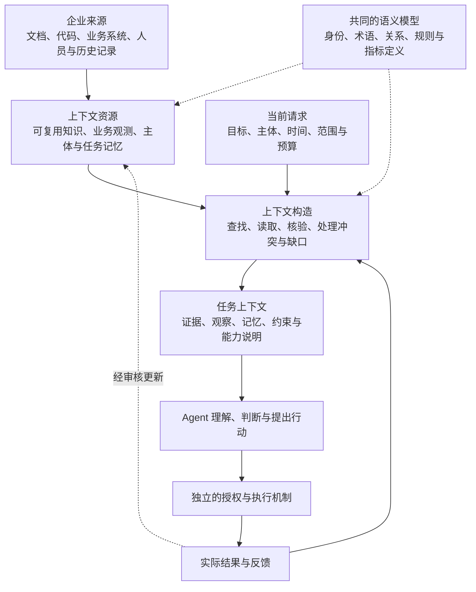

# 第 3 章 企业上下文怎样组织起来

> 本章要回答：来源、知识、记忆、业务状态和工具分别放在什么位置，又怎样共同形成一次任务可用的上下文？

第一章区分了三件事：企业能提供哪些上下文资源，一次任务实际需要哪些材料，以及平台怎样把材料准备好。本章沿着同一张总图展开。先看信息从哪里来、怎样认清含义，再看它怎样被保存、选择和交付，最后讨论结果如何反馈。

这是一套逻辑架构。逻辑架构说明每部分负责什么、输入输出是什么，以及不能越过哪些边界；它还不决定使用哪个数据库、部署几个服务。技术可以替换，职责需要先说明白。

## 3.1 把第一章的总图展开

```mermaid
flowchart TB
  S["企业来源<br/>文档、代码、业务系统、人员与历史记录"] --> R["上下文资源<br/>可复用知识、业务观测、主体与任务记忆"]
  M["共同的语义模型<br/>身份、术语、关系、规则与指标定义"] -.-> R
  M -.-> C["上下文构造<br/>查找、读取、核验、处理冲突与缺口"]
  R --> C
  Q["当前请求<br/>目标、主体、时间、范围与预算"] --> C
  C --> P["任务上下文<br/>证据、观察、记忆、约束与能力说明"]
  P --> A["Agent 理解、判断与提出行动"]
  A --> X["独立的授权与执行机制"]
  X --> F["实际结果与反馈"]
  F --> C
  F -.经审核更新.-> R
```

先注意中间的“上下文构造”。它不是一个新的存储库，而是一项服务职责：根据当前请求，从已经组织好的资源或受控来源中取材料，核验适用范围和证据，再整理成可供 Agent 使用的任务上下文。返回“缺少当前库存”也是一种有意义的结果，不能用旧报表填满这一格。

左侧资源可以分散存放。政策在文档系统中，指标在数据服务中，任务经历在任务服务中，平台只需提供一致的身份、引用和访问规则。图中的来源到资源箭头，也可能是建立可查询连接，而不是复制一份数据。

共同语义模型让这些材料能够接在一起，治理则决定它们能否被访问和使用。执行机制有自己的权限和前置条件，即使上下文里出现了某个工具名称，也不表示这次调用一定获准。

## 3.2 来源提供材料，但来源本身也需要判断

企业来源包括制度、设计说明、代码、数据库记录、业务 API、工单、事件和人员提供的解释。平台首先要保留材料来自哪里、哪个版本、谁提供、何时获得，以及适用范围。

“原始来源”表示材料尚未被知识系统改写，不表示它必然正确。一份草稿仍然可能是原始来源；一位专家的判断也可能只适用于某个区域。企业架构图常表达计划或经过评审的设计，监控记录则描述某次实际观察。两者冲突时，要解释各自说的是什么，不能简单让最后更新的一方覆盖另一方。

平台可以根据来源生成段落索引、摘要、Wiki 页面和关系。这些加工结果有助于搜索与阅读，但必须保留来源和加工记录。这里要分清两个概念：摘要或归纳关系可能形成派生知识；倒排索引、嵌入等则是帮助访问知识的技术表示。它们都不是新的独立事实来源。

例如，政策原文规定某类退款需要人工审核，Wiki 将它概括成一句话。两份材料可以共同帮助理解，但不能被当成两份独立证据。政策撤销后，依赖它的摘要和索引也要更新。第 11 章将详细解释这种来源与派生关系。

## 3.3 共同语义：先认清在说谁、说什么

材料汇集之后，最常见的问题不是缺少文字，而是同一个词在不同系统里含义不同，或者同一个对象有多个名字。

“销售”可能指订单额、收入或回款；“负责人”可能指业务负责人、技术维护者或值班人员；一个产品在合同、报表和代码里也可能使用不同编号。共同语义模型负责记录这些定义、身份和关系。它帮助平台判断哪些记录可以合并、哪些只能关联、哪些必须保持区别。

这里的“对象”首先指业务上需要认识的东西，例如客户、产品、团队、服务、指标或战略目标。它们可以有稳定身份和关系。信息记录则是关于这些对象的具体描述，例如一条客户归属声明、一份指标定义版本或一次指标观测。业务对象和描述它的记录不能混为一类。

以销售指标为例：

| 材料 | 它在说明什么 |
|---|---|
| 指标“净确认订单额” | 企业认识的一个指标，有稳定身份 |
| 指标定义的某个版本 | 怎样计算，包含和排除什么，适用哪个期间 |
| 某次查询返回的 H2 数值 | 在给定口径和数据快照下得到的观测 |
| 引用该数值的分析摘要 | 根据观测加工出的解释 |
| 本次任务的核对记录 | 哪位分析者已确认了哪项口径，仍有何疑问 |

这些记录通过指标身份、来源与版本联系起来。它们不应全部被压成一个不断覆盖的“销售”字段。

共同语义也不等于建立一套消灭所有差异的全公司词典。财务客户和客服联系人可以保留各自模型，再说明什么时候、依据什么映射。早期只定义当前任务需要的术语和关键关系即可；模型的表示与验证方法见第 8 章。

## 3.4 资源管理：知识、观测和记忆怎样配合

资源需要按用途和责任管理，不能只按文件格式分类。下面用三种常见角色解释它们的分工；这不是要求每条记录只能选其中一种标签。

**可复用知识**帮助不同任务理解企业，例如政策、术语、服务职责、指标定义和经过验证的关系。知识可以变化，但应由明确来源和版本管理。规则、流程说明和关系都可能属于知识，不必把“关系知识”另立成与知识平级的大类。

**业务观测**记录某个时间、范围和环境下取得的值或事件。当前队列深度有很短的可用时间，已结账的半年经营快照可以保存较久。变化速度影响如何读取和更新，却不单独决定信息类别。两者都必须说明观察时间、口径和来源，历史值不能假装是当前状态。

**主体与任务记忆**保存某个人、Agent 或任务的相关经历，例如偏好、已执行步骤、失败尝试、排除过的假设和未完成事项。记忆需要说明属于谁、谁可以访问、多久保留。重复利用一条经验，不代表它已经成为企业正式规则。

同一次工具返回，可以先作为当前观察使用，随后以引用形式记入任务记录，再在复盘中成为经验的证据。它在不同环节承担不同角色，但原始来源、时间和审核状态不能丢失。已有记忆研究也将外部记忆看作需要提取、更新和检索的系统，而不只是保存全部对话。[Mem0 论文](https://arxiv.org/abs/2504.19413)

不要把“知识”简单理解为所有稳定信息，把“记忆”理解为所有旧信息，把“状态”理解为所有新信息。更有用的判断是：它用来解释哪件事，由谁负责更新，适用于什么时间和主体，以及这次任务可以如何使用。

## 3.5 一条信息要说明哪些事情

既然分类会交叉，数据模型就不应靠一个类型字段包办全部问题。无论是一段政策、一个对象属性还是一条记忆，至少要能回答下面这些问题。

| 要说明的问题 | 示例 |
|---|---|
| 描述的是谁或什么？ | 哪个产品、指标、客户、服务或任务 |
| 在这里承担什么角色？ | 定义、规则、当前观察、历史证据、经历或工作指导 |
| 怎样获得？ | 原系统记录、人工声明、程序计算或模型归纳 |
| 适用于哪里、什么时候？ | 组织、地区、环境、业务时间及版本 |
| 依据和不确定性是什么？ | 原始引用、审核记录、冲突来源、待验证假设 |
| 谁能使用、谁维护？ | 访问策略、责任人、更新和保留要求 |

例如，一份经过审批的退款政策原文，可以同时是来源材料、可复用知识和某业务范围内的规范依据。摘要是从它派生的阅读材料。私有任务中对政策的误解则是任务记录，不能反过来修改政策。关系和规则也应携带同样的管理信息，而不只给文档加标签。

后文把这套共同的身份与管理信息称为治理信封。信封负责让不同表示能够指回同一对象或版本，不要求每类业务内容都采用相同字段。代码保留符号与提交，经营指标保留口径与期间，订单保留业务主键与状态。第 8 章讲业务含义，第 11 章讲身份、版本和来源管理。

## 3.6 上下文构造：按任务取回并核验材料

资源准备好之后，平台还需要解决本次任务的问题。收到“为什么 H2 销售下降”时，不能立刻将所有销售资料交给模型。

先明确用户目标、主体权限、期间与范围。如果“销售”的含义尚不明确，就返回待确认项。确定问题后，平台选择相关来源：定义和战略目标可以检索，经营数据可能需要结构化查询，已有核验进展来自任务记忆。每条路径都要在暴露内容前执行访问检查。

材料回来后，再检查它们能否一起使用。两个报表单位不同，就不能直接相加；当前组织结构不能不加说明地套到历史期间；一份摘要和它引用的原文不能算两份独立佐证；未经验证的解释不能进入已确认事实。发现冲突或缺口时，应把原因留给调用方。

最后，按任务需要的细节和预算组织材料。预算可以限制条目数、上下文长度、查询耗时和成本，但不能为省事删除关键适用条件。如果现有预算内无法取得足够证据，应缩小任务、继续分步查询或明确停止，而不是声称已经完整理解。

这一职责有时由多个组件共同完成，例如查询规划、检索、证据服务和打包器。本章先把它视为一项完整能力，避免读者过早陷入服务拆分。

## 3.7 任务上下文：交付的是有说明的材料

上下文构造的结果可以组织为上下文包（Context Package）。它至少让使用者看清：本次目标和范围是什么，证据来自哪里，哪些内容是当前观察，哪些是记忆，哪些问题仍未知，以及当前可用能力有哪些限制。

包中“可用的重放工具”是能力说明；“刚才重放了多少条”是执行结果；“上次事故重放后恢复”是历史证据。即使三项都提到重放，也不能合成一句不分来源的结论。

任务上下文也不必只有一份静态 JSON。长任务可以保留外部工作记录，每轮按需读取一部分；查询工具可以返回新的证据；模型输出还会形成待验证假设。关键是这些信息在后续步骤中的身份和用途仍然清楚，而不是每轮重新拼成一段没有出处的长文本。

权限说明尤其需要谨慎。包可以告诉 Agent 某动作需要批准，但服务端必须真正执行批准检查。把权限规则写进提示词，有助于模型正确规划；它不能替代动作生效前的确定性约束。

## 3.8 工具与执行：知道做法，不等于获准行动

工具有两种常见用途：取得新信息，以及改变外部世界。读取库存或查询代码属于前者，退款、发布或调整价格属于后者。同一个接口也可能兼具读写能力，平台需要按实际操作限制权限。

工具的名称、参数说明、返回值含义和使用限制，是 Agent 理解能力所需的上下文；运行中的接口、凭据和授权检查，则属于执行机制。接口失败、身份变化或任务状态不符时，即使先前的上下文包列出了该工具，执行也仍应被拒绝或要求重新准备。

程序性知识描述怎样完成一类工作，例如排查步骤、参考资料和处理模板。Runbook 是其中常见形式，Skill 可以将这些指导和相关脚本组织成按需加载的工作包。[Agent Skills 规范](https://agentskills.io/) 它帮助 Agent 选择和使用能力，但不自行授予权限，也不能把脚本说明当成执行成功的证据。

执行机制应检查主体、目标、参数、前置状态和必要批准，并记录结果。随后还需读取外部状态，判断业务目标是否达到。模型说“已经完成”和工具请求返回成功，都不一定等于工作完成。第 12、17 章会具体展开权限与受控行动；第一部分只需先把这条边界放稳。

## 3.9 治理与反馈：贯穿全程，而不是收尾步骤

在连接来源时，就要明确访问范围与责任人；生成摘要或关系时，就要保留来源与加工方式；检索时执行当前权限和适用时间；写入记忆时检查主体、敏感性与保留要求；真正行动时再验证批准和运行条件。因此，治理不应画成流水线末尾的一道关卡。

授权规则需要区分“关于权限的说明”和“实际生效的策略”。知识库中可能有权限手册，但当前授权应由相应策略机制决定；旧知识快照也不能恢复已经撤销的访问权。

结果反馈同样有不同去处。一次工具结果可以进入本次任务上下文；排查经过可以进入受控记忆；被复盘确认的经验才可能更新 Runbook 或公共规则。模型给出的总结先是候选，不因文字清楚就自动成为企业事实。第 9 章将讨论这种晋升、纠错和遗忘。

反馈还包括失败：证据找不到、指标定义冲突、观察过期或用户纠正，都可以帮助定位资源和实现缺口。平台应把问题交给对应负责人，并在修订后通过用例验证。一次回答结束，不代表知识维护结束。

## 3.10 让销售问题完整走一遍

现在用第一章的销售问题检验整套逻辑。以下是解释架构的场景，不是声称当前 C7 已有通用自然语言分析或真实数据仓连接器。

经营负责人问：“H2 的销售情况为什么比 H1 差这么多？”平台先把它识别为需要确认口径的分析任务。用户确认采用净确认订单额、自然年半年度和全公司范围后，才继续准备材料。若问题实际只问某个区域，全公司的确认就不能替代区域范围。

语义模型把这个指标与目标、业务单元、产品、渠道及数据产品关联起来。指标定义是可复用知识，按定义读取的 H1/H2 快照是观测，“这次已核对币种和取消订单处理方式”是任务记忆。它们通过同一指标身份与版本相接，而不是通过文字相似就认定相同。

平台先验证数据可比，再由确定性计算得到差异和分解，将计算依据、范围、来源和缺口交付给 Agent。某条渠道事件可以成为待调查线索，但如果没有订单级数据或对照证据，就不能写成已确认原因。同一批订单按产品和地区分别分组，也不能把两组差异重复相加。

Agent 可以据此解释已经确认的下降、提出后续核验事项，并指出需要哪位负责人补充信息。即使经营负责人级别很高，这次只读分析也不会自动获得调价工具。若以后决定实施经营变更，那是具有新目标、参数与批准要求的行动任务。

这条过程中，各种概念的位置已经明确：

| 场景中的材料或动作 | 在总图中的位置 |
|---|---|
| 报表、指标目录、业务负责人的说明 | 企业来源 |
| 指标、产品、区域及相互关系的定义 | 共同语义模型 |
| 战略与指标知识、经营快照、核验记录 | 上下文资源，按各自用途与责任管理 |
| 确认口径、查询、对账、处理缺口 | 上下文构造 |
| 本次可见证据、差异、假设和限制 | 任务上下文 |
| 分析解释或提出下一步 | Agent 的工作 |
| 另行批准的经营变更及结果检查 | 授权、执行与反馈 |

退款场景可以用同一方法解释，只是资源变成政策、代码关系、队列观察和排查记忆，允许的行动变成受限重放。架构稳定，任务选择的材料和成功标准不同。

## 3.11 从逻辑职责走向技术方法

知道各部分承担什么职责之后，再看技术会容易得多。

| 要解决的问题 | 可以使用的手段 | 后文在哪里展开 |
|---|---|---|
| 认出同一个对象，说清同一个词 | 术语表、实体关联、Schema、本体及模型校验 | 第 8 章 |
| 找回有关且可验证的资料 | 结构化查询、关键词、向量、图查询与重排 | 第 4、5、8 章 |
| 保留整体结构，减少重复阅读 | 来源层级、摘要、Wiki 与派生关系管理 | 第 6、7 章 |
| 延续任务和主体的相关经历 | 记忆提取、更新、检索、纠错与遗忘 | 第 9 章 |
| 把材料交给当前任务 | 查询规划、证据核验、预算和上下文包 | 第 10、17 章 |
| 持续守住版本、权限和结果要求 | 快照、时间模型、策略、工作流、审计与评测 | 第 11—13、17 章 |

表中的方法并不都处于同一个抽象层面。图是一种组织和查询关系的方式，Wiki 是便于阅读的知识视图，记忆管理覆盖一类资源的生命周期，RAG 则把取回证据与生成回答连起来。它们不能当成四个互斥方案，也不需要同时购买。

第二部分先从容易观察的检索问题展开，再进入知识组织、建模和记忆。阅读每章时，都可以回到这张表追问：它解决什么问题，输入输出是什么，依赖哪部分共同规则，还留下什么缺口。第三部分再将这些能力落成平台的连接、更新、查询与发布设计。

## 本章小结

企业来源提供材料，共同语义让材料能够正确关联，资源管理保留知识、观测与记忆各自的责任。上下文构造根据当前任务查找并核验，交付有依据、有范围、有缺口说明的任务上下文。Agent 在这些材料上工作，实际行动由独立机制约束，结果再进入下一轮判断或经审核更新资源。

读完第一部分，应能解释一份企业材料如何进入当前任务，以及一个候选动作为什么还需要独立授权。接下来学习各项技术，就是逐一理解总图中的能力怎样实现。

## 延伸阅读

- [第 8 章：知识建模、本体与图谱](/part-2/chapter-08)。
- [第 9 章：记忆](/part-2/chapter-09)。
- [第 11 章：版本、时间与血缘](/part-3/chapter-11)。
- [第 17 章：上下文包与受控行动](/part-4/chapter-17)。
- Prateek Chhikara et al., [Mem0: Building Production-Ready AI Agents with Scalable Long-Term Memory](https://arxiv.org/abs/2504.19413), 2025。
- [Agent Skills 规范](https://agentskills.io/)。
