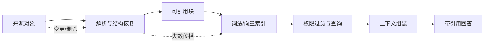

# 第 4 章 RAG：让模型访问外部证据

> 本章要回答：RAG 怎样把模型与可更新证据连接起来，它又会在哪些环节失败？

大语言模型知道很多通用知识，但它不知道企业昨天刚改过的退款规则、今天是谁值班、内部 API 有哪些限制，也不能只靠模型参数判断登录用户能看什么。把全部内部知识重新训练进模型既贵又慢：一条规则过期后很难单独删掉；两个来源互相冲突时，模型也说不清自己采用了哪一个版本。检索增强生成（Retrieval-Augmented Generation，RAG）提供了另一种办法：知识继续放在企业能够更新和授权的系统里，回答问题时再把相关证据找出来交给模型。

Lewis 等人在 2020 年发表的 RAG 论文，把模型参数中学到的知识和外部可检索文档结合起来，让模型在生成答案时使用刚刚找回的材料。[论文](https://arxiv.org/abs/2005.11401)研究的是开放域问答等任务，但对企业最有用的启示很简单：知识不必都塞进模型，可以在回答时按需取回。模型负责理解和表达，外部系统负责事实、权限、版本和来源。两边分工越清楚，系统越容易维护。

## 4.1 RAG 改变的是知识生命周期

传统搜索给人一串文档，由人自己阅读和归纳。纯生成模型直接给结论，却可能说不清依据。RAG 站在两者中间：先搜索，再让模型根据少量证据组织答案。表面上只是给提示词多加几段文字，背后却需要一条从来源接入到答案引用的完整处理链。

一份企业材料从产生到进入回答，至少要经历六个阶段。连接器首先从文件系统、Wiki、工单、代码仓库或业务系统获取内容，同时保留来源标识和访问控制信息。解析器再识别标题、段落、表格、列表、代码块和页面坐标。分块器把材料变成可检索、可引用的单元。索引器建立词法、向量或结构化索引。查询服务按用户身份召回和排序候选。最后，生成器在证据约束下作答并给出引用。

有了这条链，企业不必每次都更新整个模型，而可以更新具体知识对象。制度作废，就下线对应版本；代码提交，只重建受影响的文件；员工调岗，立即缩小他的检索范围；答案出错，还能查到当时用了哪个源片段。企业得到的不只是一个“会查资料的模型”，而是一套能更新、撤销和追责的知识处理流程。

## 4.2 从来源到可引用单元

最常见的 RAG 演示是读取 PDF、每隔若干字符切一刀、计算向量，然后取相似度最高的几个片段。这种方法适合验证接口，却不是稳定的生产基线。固定长度切块可能把条件与结论拆开，把表头与单元格分开，或者把函数签名与实现分开。检索结果字面相关，却失去了作出判断所需的上下文。

更可靠的做法是先看懂材料原有的结构，再决定怎么切。政策可以按“章—节—条款”拆分，工单可以按“现象—诊断—处置—结果”拆分，代码则按“仓库—模块—文件—符号”组织。搜索时用小块精确定位，返回给模型时补上较大的上级内容，这就是“子块检索、父块供给”：小块负责找准位置，大块负责补回条件、定义和例外。

每个可引用单元不应只有正文和向量，还需要一组最小元数据：稳定对象 ID、来源 URI、来源系统、标题路径、版本或提交号、有效时间、采集时间、所有者、访问控制标签、内容散列以及原文坐标。对网页，坐标可以是标题锚点和段落；对 PDF，可以是页码和区域；对代码，可以是提交号、文件路径和行区间。引用若不能回到一个不可歧义的版本，就只能算链接，不能算证据。

内容散列解决“地址不变、内容已变”的问题。稳定 ID 解决“内容移动、对象仍是同一个”的问题。二者配合后，系统既能判断是否需要重建索引，也能保留跨版本关系。对于频繁变化的业务资料，还应同时记录 `valid_from`、`valid_to` 和 `observed_at`：前两者描述事实何时有效，后者描述平台何时看见它。缺少这组时间语义，系统很容易用今天采集到的旧制度回答昨天或明天的问题。

## 4.3 查询不是一次相似度计算

当用户提问“为什么订单 1842 不能退款”时，查询服务首先要识别这不是一般知识问答。它包含具体订单，需要实时读取订单状态；它涉及退款规则，需要检索制度；它可能涉及服务异常，需要查看工单与代码变更。单一向量搜索无法完成这种路由。

一个可控的查询流程会依次回答几个问题：是谁在问、属于哪个租户和部门、这次任务能看多大范围？问题是在找精确名称、理解原因、比较版本、分析关系，还是查询实时状态？应该用关键词、向量、图，还是直接调用工具？平台先找回一批候选，再重新排序、去重，必要时补上上级章节，最后按模型可用长度组成证据包。实际系统可以并行执行其中一些步骤，但权限和任务限制必须在材料交给模型之前生效。

上下文窗口再大，也不应把所有候选都塞进去。冗余片段会稀释真正证据，相互矛盾的版本会让模型随机选择，边缘相关材料还可能把回答引向错误主题。上下文组装器应控制来源多样性、文档类型配额、时间范围和重复度，并把高风险问题所需的反证或例外条款一并纳入。

最终交给模型的不是若干裸文本，而应是一个“上下文包”。它至少包含任务说明、用户可见范围、候选证据、每条证据的来源与版本、实时工具结果、冲突提示，以及回答约束。生成器只能引用包内对象；当证据不足或冲突无法消解时，它应明确说明缺口，而不是补写一个听起来合理的答案。

## 4.4 权限必须进入检索，而不是只进入界面

企业 RAG 最危险的误区之一，是先从全库取回内容，再要求模型“不要展示无权信息”。这时敏感内容已经进入模型上下文，日志、缓存、追踪系统或后续工具调用都可能留下副本。正确的安全边界是：未经授权的对象不能成为候选证据。

权限可以来自文档 ACL、代码仓权限、组织关系、数据分级和业务属性。平台需要把这些规则编译成检索过滤条件，并在词法、向量、缓存和图扩展等每条路径上保持一致。若向量数据库不支持所需的过滤语义，就要在它之前划分安全域或改用能够执行过滤的索引，而不能依赖生成后的删改。

权限还有时间维度。员工今天能访问一份文档，不代表缓存中的昨日答案可以继续展示；项目成员退出后，先前生成的上下文包也应失效。因此缓存键应包含权限版本或安全域，审计记录要能够回答“以哪个身份、在什么时间、从哪些对象生成了这次答案”。

这并不意味着模型可以被完全信任。来源文档本身可能包含提示注入，例如要求模型忽略系统规则、调用某个工具或泄露其他上下文。平台应把检索内容视为不可信数据，明确分隔指令与证据，限制工具权限，并对高风险动作设置确定性的策略检查。RAG 扩大了模型可以读取的范围，也同时扩大了攻击面。

## 4.5 把失败拆开，才能知道该修哪里

“回答对不对”是最终指标，却不足以诊断系统。RAG 的失败至少可拆成三层。

第一层是“没找回来”：正确证据根本没有进入候选列表。原因可能是文档解析错了、切块不合理、同义词没覆盖、权限过滤太严、索引太旧，或者问题被送到了错误的检索通道。可以用 Recall@k、命中文档率或人工标注的证据覆盖率来衡量。

第二层是“找到了，却没有正确交给模型”：证据曾进入候选列表，却在重新排序、去重、补充上级内容或压缩长度时丢了；也可能只留下结论，没留下适用条件。排查这一层必须查看最终上下文包，不能只看搜索结果。

第三层是“材料够了，模型还是答错”：模型可能误读证据、混用两个冲突版本，或说出证据没有支持的结论。这时应该检查答案是否忠于材料、引用是否正确、重要结论是否都有证据。RAGAS 提出了一套把上下文相关性、忠实度和答案相关性分开评估的方法；它可以提供思路，但不能替代企业根据真实任务建立的标准题集。[RAGAS 论文](https://arxiv.org/abs/2309.15217)

生产评测应从真实任务采样，并为每个问题保存期望证据、允许的答案范围、用户身份和时间截面。离线金标准用于版本比较，线上反馈用于发现新问题，安全红队集专门覆盖越权、提示注入、过期知识和冲突来源。若只统计用户点赞，系统会偏向流畅和迎合；若只统计检索命中，系统又可能忽略最终答案是否真的使用了证据。

评测还必须做消融。逐步比较无检索、BM25、向量、混合检索、重排、父块补充和图扩展，才能知道新增组件是否创造了可测收益。没有消融的复杂架构很容易把工程成本误认为智能程度。

## 4.6 RAG 的边界

RAG 适合访问可外部化、可检索、相对稳定的证据，但不能包办所有企业上下文。账户余额、库存和告警属于实时状态，应通过受控工具读取；用户偏好和未完成任务属于记忆，需要独立的写入、冲突和删除策略；系统依赖与数据血缘属于关系问题，图结构通常比文本相似度更可靠；执行退款、发布版本或修改权限则属于行动，必须经过身份验证、策略和确认。

RAG 也不会自动解决知识质量。错误文档被精准检索，仍然只会得到有引用的错误答案；多个团队各自维护定义，向量索引不会替企业决定哪个是规范来源。因此，来源治理、所有权、有效期和冲突处理是检索之前的问题。后续章节介绍的层级、Wiki、图谱和记忆，也都不能绕过这个前提。

## 4.7 Northstar 的第一条纵向切片

在目标企业设计中，Northstar Commerce 决定从“解释退款失败”这一任务开始，而不是先建设覆盖全公司的向量库。目标方案会选取四类最小来源：退款政策、客服处置手册、退款服务代码与接口说明、脱敏订单状态。当前公开 fixture 把它收缩成 `data/raw/` 下的五份文件（政策、Runbook、事件 Schema、代码和测试），实时队列由内存运行观察模拟；这里的目标方案与可运行样例不是同一层。

摄取流程保留每份材料的 ACL 和版本。政策按条款切分，手册按处置步骤切分，代码按符号切分。每个对象生成稳定 ID 和可回跳坐标。查询时，目标系统先验证客服身份，只给客服返回允许的政策和客服手册；代码和工程 Runbook 留给开发者或 SRE。订单状态工具属于目标设计，当前样例只模拟退款队列观察。上下文组装器把“当前订单事实”和“解释这些事实的稳定知识”分区，避免模型把历史文档当作实时状态。

第一版的验收条件刻意朴素：无权限用户永远召回不到受限对象；每项事实都有来源和版本；旧政策不会覆盖当前政策；证据不足时系统拒绝猜测；同一组金标准问题在索引更新后能够回归运行。团队没有把“像人一样聊天”列为首要指标，因为可信的上下文契约比措辞更难补救。

这个从来源一直走到答案的最小案例，说明了 RAG 在企业上下文里的位置：它负责让模型拿到证据，但不负责全部知识治理，也不负责真正执行操作。下一章会继续拆开检索过程，解释为什么企业问题通常需要 BM25、向量、结构化过滤和重排一起工作。

## 本章小结

RAG 把模型接到企业自己管理的证据上，让知识可以单独更新、授权、撤销和审计。生产系统要把来源接入、解析、按结构切块、建索引、规划查询、权限过滤、整理上下文、引用和评测当作一条完整链路。比一段漂亮答案更重要的，是交给模型的材料有明确权限、版本和来源，而且证据不够时能如实说明。

## 延伸阅读

- Patrick Lewis et al., [Retrieval-Augmented Generation for Knowledge-Intensive NLP Tasks](https://arxiv.org/abs/2005.11401), 2020。
- Akari Asai et al., [Self-RAG: Learning to Retrieve, Generate, and Critique through Self-Reflection](https://arxiv.org/abs/2310.11511), 2023。
- Yunfan Gao et al., [Retrieval-Augmented Generation for Large Language Models: A Survey](https://arxiv.org/abs/2312.10997), 2023。
- Shahul Es et al., [RAGAS: Automated Evaluation of Retrieval Augmented Generation](https://arxiv.org/abs/2309.15217), 2023。
