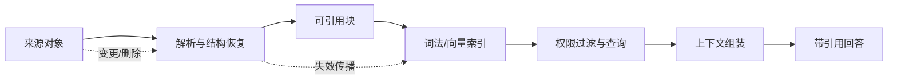

# 第 4 章 RAG：让模型访问外部证据

> 本章要回答：RAG 怎样把模型与可更新证据连接起来，它又会在哪些环节失败？

大语言模型拥有广泛的通用知识，却不会天然知道一家企业昨天修改的退款规则、当前值班人、某个内部 API 的约束，也无法仅凭参数判断一个登录用户有权看到什么。把所有企业知识重新训练进模型既昂贵又迟缓：知识一旦过期，很难定点删除；来源彼此冲突时，参数也无法展示它选择了哪一个版本。检索增强生成（Retrieval-Augmented Generation，RAG）的关键价值，因而不是“让聊天机器人多知道一些”，而是把回答重新连接到企业能够管理、更新、授权和审计的外部证据。

Lewis 等人在 2020 年发表的 RAG 论文把预训练模型的参数化记忆与可检索的非参数记忆结合起来，并在生成过程中利用检索到的文档。[论文](https://arxiv.org/abs/2005.11401)讨论的是开放域问答等研究任务，但它给企业系统留下了一个更重要的工程契约：知识可以留在模型之外，回答时再按需要取回。模型负责理解与表达，外部系统负责事实、权限、版本和来源。二者边界越清楚，系统越容易治理。

## 4.1 RAG 改变的是知识生命周期

传统搜索把文档列表交给人，由人阅读、比较和归纳。纯生成模型直接给出结论，却不一定能说明结论从何而来。RAG 位于两者之间：它先搜索，再把有限的证据交给模型综合。这个动作看似只是给提示词增加几段文字，实际上引入了一条完整的数据生产线。

一份企业材料从产生到进入回答，至少要经历六个阶段。连接器首先从文件系统、Wiki、工单、代码仓库或业务系统获取内容，同时保留来源标识和访问控制信息。解析器再识别标题、段落、表格、列表、代码块和页面坐标。分块器把材料变成可检索、可引用的单元。索引器建立词法、向量或结构化索引。查询服务按用户身份召回和排序候选。最后，生成器在证据约束下作答并给出引用。

这条链路意味着，RAG 的更新单位不再是整个模型，而是知识对象。制度作废时可以撤销对应版本；代码提交后只重建受影响文件；员工调岗后可以立即改变检索范围；发现错误时可以追踪是哪一个源片段进入了哪一次回答。企业真正获得的不是一个“会查资料的模型”，而是一套可操作的知识生命周期。

## 4.2 从来源到可引用单元

最常见的 RAG 演示是读取 PDF、每隔若干字符切一刀、计算向量，然后取相似度最高的几个片段。这种方法适合验证接口，却不是稳定的生产基线。固定长度切块可能把条件与结论拆开，把表头与单元格分开，或者把函数签名与实现分开。检索结果字面相关，却失去了作出判断所需的上下文。

更可靠的方法是先恢复文档结构，再决定检索粒度。政策文件可以按“章—节—条款”解析，工单按“现象—诊断—处置—结果”解析，代码按“仓库—模块—文件—符号”解析。较小的子块用于命中，较大的父块用于返回，这就是“子块检索、父块供给”的基本模式。子块提高定位精度，父块补回条件、定义和例外。

每个可引用单元不应只有正文和向量，还需要一组最小元数据：稳定对象 ID、来源 URI、来源系统、标题路径、版本或提交号、有效时间、采集时间、所有者、访问控制标签、内容散列以及原文坐标。对网页，坐标可以是标题锚点和段落；对 PDF，可以是页码和区域；对代码，可以是提交号、文件路径和行区间。引用若不能回到一个不可歧义的版本，就只能算链接，不能算证据。

内容散列解决“地址不变、内容已变”的问题。稳定 ID 解决“内容移动、对象仍是同一个”的问题。二者配合后，系统既能判断是否需要重建索引，也能保留跨版本关系。对于频繁变化的业务资料，还应同时记录 `valid_from`、`valid_to` 和 `observed_at`：前两者描述事实何时有效，后者描述平台何时看见它。缺少这组时间语义，系统很容易用今天采集到的旧制度回答昨天或明天的问题。

## 4.3 查询不是一次相似度计算

当用户提问“为什么订单 1842 不能退款”时，查询服务首先要识别这不是一般知识问答。它包含具体订单，需要实时读取订单状态；它涉及退款规则，需要检索制度；它可能涉及服务异常，需要查看工单与代码变更。单一向量搜索无法完成这种路由。

一个可控的查询流程通常包含以下逻辑：先确定用户、租户、部门和任务范围；再判断问题属于精确定位、解释、比较、关系分析还是实时状态；随后选择词法、向量、图或工具通道；在候选集内重排和去重；必要时补充父级上下文；最后根据上下文预算组装证据包。这里的“先”不是指所有系统都要串行执行，而是指权限和任务约束必须在证据暴露给模型之前生效。

上下文窗口再大，也不应把所有候选都塞进去。冗余片段会稀释真正证据，相互矛盾的版本会让模型随机选择，边缘相关材料还可能把回答引向错误主题。上下文组装器应控制来源多样性、文档类型配额、时间范围和重复度，并把高风险问题所需的反证或例外条款一并纳入。

最终交给模型的不是若干裸文本，而应是一个“上下文包”。它至少包含任务说明、用户可见范围、候选证据、每条证据的来源与版本、实时工具结果、冲突提示，以及回答约束。生成器只能引用包内对象；当证据不足或冲突无法消解时，它应明确说明缺口，而不是补写一个听起来合理的答案。

## 4.4 权限必须进入检索，而不是只进入界面

企业 RAG 最危险的误区之一，是先从全库取回内容，再要求模型“不要展示无权信息”。这时敏感内容已经进入模型上下文，日志、缓存、追踪系统或后续工具调用都可能留下副本。正确的安全边界是：未经授权的对象不能成为候选证据。

权限可以来自文档 ACL、代码仓权限、组织关系、数据分级和业务属性。平台需要把这些规则编译成检索过滤条件，并在词法、向量、缓存和图扩展等每条路径上保持一致。若向量数据库不支持所需的过滤语义，就要在它之前划分安全域或改用能够执行过滤的索引，而不能依赖生成后的删改。

权限还有时间维度。员工今天能访问一份文档，不代表缓存中的昨日答案可以继续展示；项目成员退出后，先前生成的上下文包也应失效。因此缓存键应包含权限版本或安全域，审计记录要能够回答“以哪个身份、在什么时间、从哪些对象生成了这次答案”。

这并不意味着模型可以被完全信任。来源文档本身可能包含提示注入，例如要求模型忽略系统规则、调用某个工具或泄露其他上下文。平台应把检索内容视为不可信数据，明确分隔指令与证据，限制工具权限，并对高风险动作设置确定性的策略检查。RAG 扩大了模型可以读取的范围，也同时扩大了攻击面。

## 4.5 把失败拆开，才能知道该修哪里

“回答对不对”是最终指标，却不足以诊断系统。RAG 的失败至少可拆成三层。

第一层是检索失败：正确证据没有进入候选集。原因可能是解析错误、分块不当、同义词缺失、权限过滤过严、索引陈旧或查询路由错误。它可以用 Recall@k、命中文档率或人工标注的证据覆盖率衡量。

第二层是上下文失败：正确证据曾经被召回，却在重排、去重、父块补充或预算裁剪时丢失；或者只返回了结论，没有返回适用条件。这一层需要检查最终上下文包，而不是只检查搜索结果。

第三层是生成失败：上下文已经足够，模型仍然误读、混合了冲突版本，或给出了证据无法支持的结论。此时应测量答案忠实度、引用正确率和声明覆盖率。RAGAS 提出了一套无需逐题人工参考答案的 RAG 评估思路，将上下文相关性、忠实度和答案相关性分开考察；它适合作为方法参考，而不是替代企业自己的金标准题集。[RAGAS 论文](https://arxiv.org/abs/2309.15217)

生产评测应从真实任务采样，并为每个问题保存期望证据、允许的答案范围、用户身份和时间截面。离线金标准用于版本比较，线上反馈用于发现新问题，安全红队集专门覆盖越权、提示注入、过期知识和冲突来源。若只统计用户点赞，系统会偏向流畅和迎合；若只统计检索命中，系统又可能忽略最终答案是否真的使用了证据。

评测还必须做消融。逐步比较无检索、BM25、向量、混合检索、重排、父块补充和图扩展，才能知道新增组件是否创造了可测收益。没有消融的复杂架构很容易把工程成本误认为智能程度。

## 4.6 RAG 的边界

RAG 适合访问可外部化、可检索、相对稳定的证据，但不能包办所有企业上下文。账户余额、库存和告警属于实时状态，应通过受控工具读取；用户偏好和未完成任务属于记忆，需要独立的写入、冲突和删除策略；系统依赖与数据血缘属于关系问题，图结构通常比文本相似度更可靠；执行退款、发布版本或修改权限则属于行动，必须经过身份验证、策略和确认。

RAG 也不会自动解决知识质量。错误文档被精准检索，仍然只会得到有引用的错误答案；多个团队各自维护定义，向量索引不会替企业决定哪个是规范来源。因此，来源治理、所有权、有效期和冲突处理是检索之前的问题。后续章节介绍的层级、Wiki、图谱和记忆，也都不能绕过这个前提。

## 4.7 Northstar 的第一条纵向切片

Northstar Commerce 决定从“解释退款失败”这一任务开始，而不是先建设覆盖全公司的向量库。团队选取四类最小来源：退款政策、客服处置手册、退款服务代码与接口说明、脱敏订单状态。前三类进入检索索引，最后一类由只读工具实时获取。

摄取流程保留每份材料的 ACL 和版本。政策按条款切分，手册按处置步骤切分，代码按符号切分。每个对象生成稳定 ID 和可回跳坐标。查询时，系统先验证客服是否属于订单所在租户，再并行寻找政策条款、运行手册与代码符号，同时调用订单状态工具。上下文组装器把“当前订单事实”和“解释这些事实的稳定知识”分区，避免模型把历史文档当作实时状态。

第一版的验收条件刻意朴素：无权限用户永远召回不到受限对象；每项事实都有来源和版本；旧政策不会覆盖当前政策；证据不足时系统拒绝猜测；同一组金标准问题在索引更新后能够回归运行。团队没有把“像人一样聊天”列为首要指标，因为可信的上下文契约比措辞更难补救。

这条纵向切片展示了 RAG 在整套企业上下文中的位置：它是证据访问层，不是知识治理的全部，更不是行动系统。下一章将进入检索内部，解释为什么企业问题通常需要 BM25、向量、结构化过滤和重排共同工作。

## 本章小结

RAG 把模型与可治理的外部证据连接起来，使企业知识能够独立更新、授权、撤销和审计。一个生产系统必须把连接、解析、结构分块、索引、查询规划、权限过滤、上下文组装、引用和评测视为同一条链路。它最重要的产物不是答案，而是一个有身份边界、有版本、有来源且能够说明不足的上下文包。

## 延伸阅读

- Patrick Lewis et al., [Retrieval-Augmented Generation for Knowledge-Intensive NLP Tasks](https://arxiv.org/abs/2005.11401), 2020。
- Akari Asai et al., [Self-RAG: Learning to Retrieve, Generate, and Critique through Self-Reflection](https://arxiv.org/abs/2310.11511), 2023。
- Yunfan Gao et al., [Retrieval-Augmented Generation for Large Language Models: A Survey](https://arxiv.org/abs/2312.10997), 2023。
- Shahul Es et al., [RAGAS: Automated Evaluation of Retrieval Augmented Generation](https://arxiv.org/abs/2309.15217), 2023。
