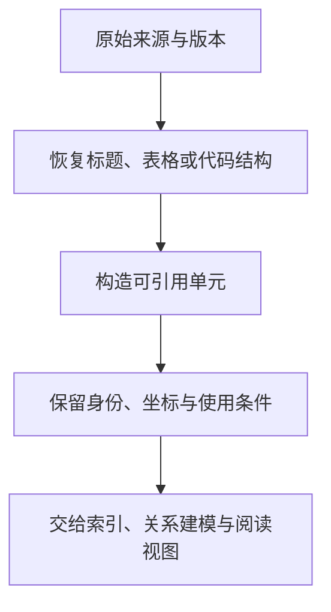

# 第 4 章 资料准备：从来源到可引用的证据

> 本章要回答：怎样把文档、代码和业务记录整理成后续方法能够使用、能够回查的知识资源？

第一部分给出了资源、任务上下文和平台的逻辑关系。第二部分从资源准备开始，依次讨论检索、结构导航、知识视图、业务建模和任务上下文。每项方法先说明输入、处理过程和产物，再讨论可以选择的技术。第三部分将这些方法接成具有版本、安全和运行保障的平台。

资料准备的输入是企业已有的来源，产物是带身份、位置和使用条件的证据单元。例如一条政策、一张表的定义、一段固定版本源码，或指向业务查询的入口。后面的搜索、图和摘要都应能够通过这些单元回到来源。

## 4.1 按任务盘点来源

先选择一项任务，再找它需要的材料。解释退款失败，可能需要政策、订单状态、处理记录和系统说明；分析销售变化，则需要指标定义、组织范围和经营数据。每类材料都要找到维护者，并说明哪些说法以它为依据。

来源清单至少记录内容范围、责任人、访问方式、更新频率、权限来源和当前缺口。政策文档可以支持规则判断，服务目录可以支持责任归属，监控接口可以返回当前观察。对同一个问题，先确认不同来源分别负责哪部分事实，再决定怎样接入。

文本、结构化数据和在线观察采用不同准备方式。文档适合解析和建立索引；指标数据通常保留原有表、视图及查询规则；库存或队列可保留受控读取入口。访谈记录先作为带来源的声明保存，经过核验后再用于正式定义或规则。

## 4.2 恢复材料本来的结构

解析先回答材料怎样组织。网页和 Markdown 有标题与段落，PDF 可能有多栏、页眉和跨页表格，代码有文件与符号，表格有列名、单位和数据行。若这些结构被抹掉，后来再精确地搜索，也可能得到含义残缺的片段。

对于原生 PDF，先恢复阅读顺序、标题和表格；扫描件还需要文字识别。表格应保留表头、单位及行列对应，不能把所有单元格摊成一段无序文本。图片里的关键定义需要可核验的文字或区域引用。低质量解析结果应进入复核或失败队列，而不是无声地加入索引。

代码资料则保留仓库、提交、文件路径和符号位置。语法解析能恢复结构，跨文件引用还需要相应语言的语义索引。第 6 章会说明怎样把这些结构用于导航；这里先保证任何提取结果都能定位到原始版本。

解析结果需要保留原始坐标和处理版本。更换解析器后，团队可以比较同一文件的结构差异，而不是只能观察最终回答突然变差。

## 4.3 构造完整的证据单元

证据单元的边界由内容含义决定。政策可以按条款组织，运行手册按检查和处置步骤组织，代码按符号组织。一个条款的条件、例外和结论应能被一起读取；一条表格记录必须知道字段名与单位。

单元过大，查询难以定位重点；过小，则容易丢失背景。常用方法是用小单元定位，再补上父级章节或邻近记录。例如先命中退款期限，再取回该期限适用的地区和订单条件。固定长度与重叠切块可以作为简单基线，实际边界应通过样本检查和任务评测调整。

```mermaid
flowchart TB
  S[原始来源与版本] --> P[恢复标题、表格或代码结构]
  P --> U[构造可引用单元]
  U --> M[保留身份、坐标与使用条件]
  M --> I[交给索引、关系建模与阅读视图]
```

同一单元可以进入不同表示：全文索引用词项检索，向量表示支持语义近邻，关系索引连接对象，Wiki 提供便于阅读的解释。这些表示沿用同一个证据身份，检索结果合并时才不会把一份原文算成多份独立依据。

## 4.4 给证据附上使用说明

单元除了正文，还应保留来源系统、对象身份、版本、原文坐标、业务有效时间、采集时间、责任人和访问规则。正文回答“写了什么”，这些说明帮助回答“现在能不能用”。第 11 章将给出统一管理记录的工程表示。

例如，退款政策单元应指明条款位置、发布版本、适用地区和有效期间；源码单元应绑定仓库提交及文件坐标；指标查询结果应说明计算口径、期间和快照。引用只有能够回到确切材料，才便于复核。

访问控制从接入开始保留，并在查询路径中落实。失去来源权限的片段不能因为已经进入向量库或摘要就继续可见。权限与内容的更新速度可以不同，但两者都要传播到使用方，具体执行方式在第 12 章展开。

## 4.5 用样本验证准备质量

先按来源类型抽样，检查结构和坐标。对政策检查条件与例外是否同在，对表格检查单位与表头，对代码检查提交及符号位置。分别报告扫描件、多栏文档、跨页表格和普通文本的失败，平均分会掩盖最难的数据。

再用少量真实问题验证证据单元是否够用。正确片段能被找到，却因为缺少父级条件无法判断，说明切分或补充策略有问题。资料尚未接全、权限映射错误、版本定位失败也应分别记录，不能一律归因于模型。

输出验收应包括：原文可回查，重要条件未被切丢，字段单位清楚，权限及时间保留，无法解析的材料有明确记录。后续的检索质量建立在这个基础上。

## 4.6 解析与加工可以选择哪些技术

| 要实现的方法 | 代表性技术 | 选择时重点检查 |
|---|---|---|
| 按已知格式读取结构 | Markdown/HTML 解析器、数据库和业务 API 适配器 | 原生标识、层级、字段、权限及版本能否保留 |
| 恢复复杂文档版面与表格 | Docling、Unstructured 等文档解析工具 | 真实文档的阅读顺序、表格、OCR 与坐标质量 |
| 提取代码结构 | Tree-sitter，语言编译器或 SCIP 索引器 | 语法结构与语义关系的边界、语言覆盖和构建条件 |
| 编排解析、索引和查询组件 | LlamaIndex、Haystack、LangChain，或应用自己的任务流水线 | 能否传递自定义元数据、失败状态、版本和授权上下文 |
| 保存来源与加工结果 | Git、对象存储、关系数据库 | 不可变版本、引用解析、保留和删除机制 |

Docling 的公开实现包括版面、阅读顺序、表格及 OCR 等处理；Unstructured 的开源库提供面向文档摄入和预处理的组件。支持某种格式并不证明对企业实际文件解析正确，仍要以样本验收。开源库与同名托管服务的能力、许可和运行边界也要分别核对。[Docling](https://github.com/docling-project/docling) [Unstructured](https://github.com/Unstructured-IO/unstructured)

编排框架提供组件连接和扩展入口，无法替团队判断规范来源或补齐丢失的权限。已有应用可以先用简单流水线完成同样的契约，再按连接器数量、可观测性和迭代需求决定是否采用框架。[LlamaIndex](https://github.com/run-llama/llama_index) [Haystack](https://github.com/deepset-ai/haystack) [LangChain](https://github.com/langchain-ai/langchain)

## 4.7 这些资源怎样支持 RAG

RAG（检索增强生成）把外部材料取回后交给模型生成回答。它的早期研究将生成模型与可检索的外部文档结合，使知识能够独立更新。[RAG 论文](https://arxiv.org/abs/2005.11401) 本章准备好可引用单元，下一章决定怎样找回它们，第 9 章再说明怎样组织成任务上下文。

要验证一条最小路径，可以选一份政策及几个包含例外的问题：保存来源和条款，建立词法检索，返回条款及其适用条件，再检查答案引用。之后逐项比较向量、重排、层级或图是否改善了真实失败样本。

当前余额、库存和业务动作需要相应的查询与执行接口。RAG 可以帮助找到含义和处理规则，实时值及实际结果仍由业务系统提供。这样的分工让文档知识与业务事实能够在同一任务中配合。

## 本章小结

资料准备先确定来源责任，恢复原有结构，再建立有完整含义、可定位和受治理的证据单元。解析器、文档工具和编排框架是实现这些方法的选择。资源准备好之后，检索方法才能比较“怎样找到”，平台工程才能保证“持续可用”。

## 延伸阅读

- [Retrieval-Augmented Generation for Knowledge-Intensive NLP Tasks](https://arxiv.org/abs/2005.11401)。
- [Docling](https://github.com/docling-project/docling)、[Unstructured](https://github.com/Unstructured-IO/unstructured)。
- [Tree-sitter](https://github.com/tree-sitter/tree-sitter)、[SCIP](https://github.com/scip-code/scip)。
- [LlamaIndex](https://github.com/run-llama/llama_index)、[Haystack](https://github.com/deepset-ai/haystack)、[LangChain](https://github.com/langchain-ai/langchain)。
