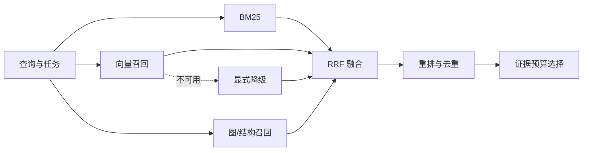

# 第 5 章 从单路搜索到混合检索

> 本章要回答：为什么企业检索需要在词法、向量、图和层级之间规划，而不是押注单一路径？

讨论搜索时，人们常把问题说成二选一：关键词还是向量，Elasticsearch 还是向量数据库，稠密模型还是稀疏模型。可企业里的问题不是一种形态。用户可能输入错误码、客户简称、API 路径、旧产品名，也可能只说一句含糊的业务现象；材料又分散在制度、表格、工单、代码和业务系统中。没有一种搜索方式能稳定处理所有组合。

混合检索不是同时搜几遍就算完成。平台要先根据问题选择合适的通道，再把各通道使用不同分数排出的结果合成一份候选列表。目标也不是找得越多越好，而是在权限、时间和模型窗口允许的范围内，让真正有用的证据更有机会进入最终上下文。

## 5.1 词法检索为什么没有过时

BM25 是企业搜索最可靠的基线之一。Robertson 和 Zaragoza 的综述系统解释了 BM25 所属的概率相关性框架及其词频饱和、文档长度归一化等思想。[BM25 综述](https://www.staff.city.ac.uk/~sbrp622/papers/foundations_bm25_review.pdf) 对工程实践的重要启示是：一个词在文档中出现十次，通常不应获得十倍于出现一次的相关性；较长文档也不应仅因包含更多词而天然占优。

词法检索特别擅长不能被“语义近似”替代的字符串。错误码 `PAYMENT_4027`、函数 `refund_order`、配置键 `max_refund_days`、CVE 编号、表名和客户合同编号都属于精确锚点。它还具有容易解释、更新便宜、无需训练语料的优点。对中文文本，分词、同义词表与领域词典会显著影响结果；对代码，则常需同时保留完整符号、驼峰拆词与路径片段。

BM25 的弱点同样清楚。用户问“钱退不回来怎么办”，文档可能写的是“原路退款失败后的补偿流程”，两者词面重叠很少。企业内部还存在缩写、改名、多语言和口语化表达。人工同义词表能覆盖高频术语，却难以穷尽表达变化。

## 5.2 向量检索解决语义近邻，也引入语义模糊

向量检索会把问题和文档都转换成一串数字，让含义接近的内容在数学空间里靠得更近。DPR 在开放域问答中展示了稠密双编码器相对于经典稀疏检索的能力，并推动了后续语义检索实践。[DPR 论文](https://arxiv.org/abs/2004.04906) 在企业系统中，它特别适合处理同义表达、概念解释，以及“我知道意思但不知道准确术语”的探索式问题。

但相似不等于可用。两个制度都讨论退款，只有一个适用于当前国家；两个函数语义相近，只有一个位于正在运行的版本；一份事故复盘与当前故障描述高度相似，却可能给出已经废弃的处置方式。向量分数不能替代结构化过滤、版本判断和来源权威性。

嵌入还会丢失某些精确差异。否定词、数字、罕见标识符和细粒度条件可能只造成很小的向量变化。模型升级也会改变向量空间，迫使系统重新索引并重新验证阈值。因此，向量检索应被视为候选生成器，而不是事实裁判。

## 5.3 从并行召回到排序流水线

一个实用的混合流程分四步。第一步是召回，也就是让 BM25、向量搜索和必要的结构化查询各自找回一批可能有用的材料；这一阶段宁可稍微多找一些，但每条通道都必须遵守同样的 ACL、租户、时间和业务范围。第二步把多份列表合并，第三步更仔细地重新排序，第四步才挑出最终要交给模型的证据。

不同通道给出的分数不能直接相加：BM25 的 8 分和向量相似度的 0.8 不是同一把尺子，图上的两跳距离又是另一种含义。倒数排名融合（Reciprocal Rank Fusion，RRF）避开了这个问题。它不比较原始分数，只看同一候选在每份列表里排第几，再合并名次。Cormack 等人的实验表明，RRF 是一种简单而稳健的融合方法。[RRF 论文](https://dl.acm.org/doi/10.1145/1571941.1572114)

一种常见形式是：

$$
\operatorname{RRF}(d)=\sum_{r\in R}\frac{1}{k+\operatorname{rank}_r(d)}
$$

其中 $R$ 是检索通道集合，$k$ 用来降低头部名次差异的剧烈程度。候选没有出现在某条通道时，该通道贡献为零。比如 $k=60$，A 在两条通道分别排第 1、3，得分为 $1/61+1/63≈0.03227$；B 只在第一条排第 2，得分为 $1/62≈0.01613$。A 胜出只说明多路排序支持它，仍不证明证据正确。这个公式不是企业检索的最终答案，却提供了一个无需对齐原始分数的可靠起点。

列表合并后，可以用交叉编码器或生成式重排器做一次更细的判断：把问题和每个候选放在一起看，再重新排序。它通常比第一轮向量召回更准，也更贵，所以只处理前几十或几百个候选。之后还要删掉重复内容、补上必要的上级章节、限制每类来源的数量，最后选出一组能共同支持答案的证据。

## 5.4 查询规划比固定权重更重要

固定采用“BM25 50% + 向量 50%”忽略了查询类型。搜索 `REFUND_TIMEOUT` 时，词法结果应占主导；询问“退款为什么需要等待清算”时，解释性文档和语义检索更重要；询问“修改退款网关会影响哪些系统”时，需要从代码或系统图扩展；询问“订单现在是否已到账”时，任何静态索引都不如业务 API。

查询规划器的工作就是先决定“这道题应该怎么查”。它可以用明确规则识别错误码、路径、工单号和时间词，再用轻量分类器判断用户意图。结果不需要是一段很长的模型思考，只要是一份可检查的计划：要找什么对象、查哪个时间、在哪个权限范围内、打开哪些通道、每路取多少候选、是否需要调用实时工具。

复杂查询可以拆成子问题。例如“新版退款政策上线后，哪些服务和客服流程需要调整”至少包含政策差异、系统依赖和流程影响三部分。规划器先获得政策变更，再以变更实体为种子执行图扩展和定向检索。反过来，搜索一个已知函数不应被迫经历多轮推理；延迟和失败面都会无谓增加。

## 5.5 横向多通道，纵向逐层深入

代码知识库最能说明二维检索。横向看，它同时需要图、向量和 BM25：图回答调用、实现与依赖关系；向量命中 Wiki 中的概念解释；BM25 定位符号、路径和错误信息。纵向看，查询可以从系统摘要进入仓库页面，再进入模块和符号，最后回到版本化源码。

代码检索是二维检索最典型的场景，第 18 章会完整展开。语言服务器协议（Language Server Protocol，LSP）是编辑器与语言分析器之间的标准协议，提供定义跳转、引用查找、类型信息和诊断。[LSP 规范](https://microsoft.github.io/language-server-protocol/)

代码工具链中有一种常见提法：粗检索负责找到候选，精确导航“最后交给 LSP”。但生产设计不应把 LSP 当作唯一事实存储：语言服务器通常依赖具体工作区与进程状态，并不天然适合离线归档、多版本索引和跨语言统一查询。更稳妥的组合是用 Tree-sitter 语法解析器恢复结构，用 SCIP 等代码索引协议保存符号和关系，以 ArtifactFS 或对象存储保留不可变源码；需要工作区级语义时再调用 LSP。本书用 ArtifactFS 指版本化源码工件层：按仓库与提交保存不可变 blob，并提供路径、行号与内容散列；它可以由本地 Git 对象库、对象存储或源码归档实现。SCIP 将代码索引描述为一种语言无关协议，可表示定义、引用与文档等信息。[SCIP 仓库](https://github.com/scip-code/scip)

每一层都应该能给出有用答案，不是只有走到最底层源码才算成功。用户问系统负责什么，仓库或模块摘要通常已经够用；用户继续问某个判断在代码里为什么成立，才需要走到符号和源码。这样既省时间和模型窗口，也不会用过多实现细节回答一个高层问题。

## 5.6 候选越多，上下文未必越好

多路召回会带来重复、热门文档霸榜和来源失衡。同一段内容可能同时存在于原文、转载、Wiki 摘要和事故复盘中，看似四条证据，实际只有一个来源。系统需要按内容散列、规范对象和派生关系去重，并优先返回权威原文与必要的解释层。

配额控制可以防止某类材料淹没上下文。例如一个诊断问题可以保留两条制度、两条运行手册、三个代码符号和一条实时状态，而不是让十个相似 Wiki 片段占满窗口。图扩展也必须限制允许的边类型、跳数和节点数；无边界的两跳查询在大型企业图上可能迅速退化成“几乎所有东西都相关”。

Northstar 的目标设计可以用一个早期原型说明典型问题：通用自然语言查询把政策和手册排在代码前面，即使开发者实际想找实现。增加候选数并没有修复排序。生产查询规划器随后可以把用户角色、查询中的代码符号以及期望文档类型加入计划，并对代码、架构决策和政策分别设置配额。当前公开 fixture 只用显式参数、两条本地排序通道和有界图遍历表现这些契约，并没有交付一个通用查询规划器。

## 5.7 用消融证明复杂度有价值

检索评测至少需要三类指标。候选阶段关注 Recall@k 和平均倒数排名，判断正确证据能否进入前列；重排阶段关注 nDCG 等有序相关性指标；上下文阶段关注证据覆盖、冗余、冲突和最终引用正确率。延迟、索引成本与权限错误率同样是生产指标。

最有用的实验不是比较两个漂亮的总分，而是逐项开关组件，这叫消融实验。先测只有 BM25，再测只有向量，然后测试二者合并、增加重排、补充父块、加入图分别带来了什么。测试题还要按精确标识符、同义表达、跨文档综合、关系影响、时间敏感和越权攻击分组。假如图只对影响分析有帮助，就只在这类问题上启用，不要让所有查询都承担它的时间和成本。

归根结底，混合检索是在分配查询成本。便宜、容易解释的方法先覆盖大多数问题，昂贵模型和图扩展只留给确实需要的任务。成熟系统不会每次都把所有组件跑一遍，而会用刚好够用的证据回答当前问题。

## 本章小结

BM25 保存精确性，向量检索扩大语义召回，结构化过滤维护业务边界，图处理关系，重排器做细粒度匹配，查询规划器决定何时使用它们。横向多通道与纵向分层下钻共同构成企业检索的基本形态。评价它的标准不是组件数量，而是每项复杂度能否在特定任务分桶中产生可验证收益。

## 延伸阅读

- Stephen Robertson and Hugo Zaragoza, [The Probabilistic Relevance Framework: BM25 and Beyond](https://www.staff.city.ac.uk/~sbrp622/papers/foundations_bm25_review.pdf), 2009。
- Vladimir Karpukhin et al., [Dense Passage Retrieval for Open-Domain Question Answering](https://arxiv.org/abs/2004.04906), 2020。
- Gordon Cormack, Charles Clarke and Stefan Buettcher, [Reciprocal Rank Fusion Outperforms Condorcet and Individual Rank Learning Methods](https://dl.acm.org/doi/10.1145/1571941.1572114), 2009。
- Nils Reimers and Iryna Gurevych, [Sentence-BERT](https://arxiv.org/abs/1908.10084), 2019。
