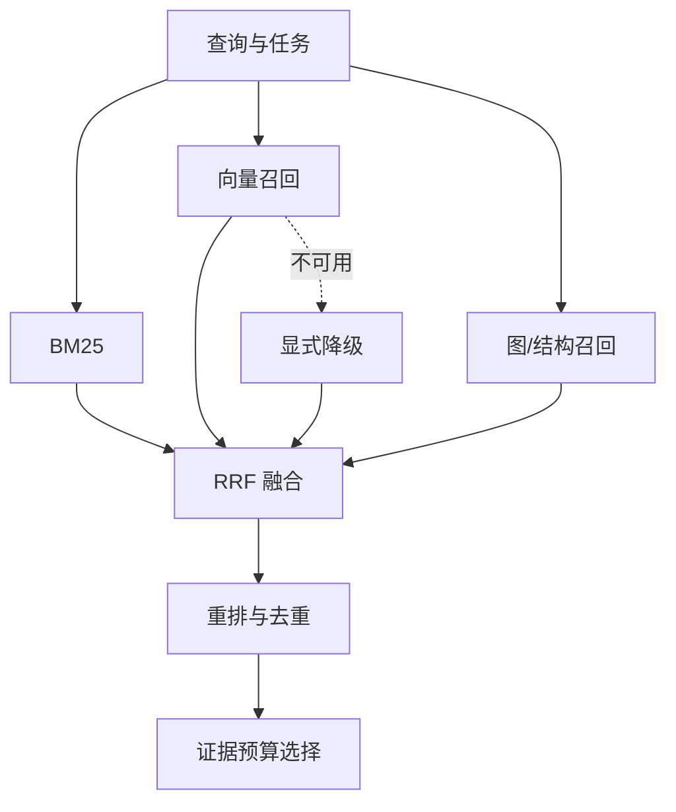

# 第 5 章 检索：选择通道，再组合证据

> 本章要回答：为什么企业检索需要在词法、向量、图和层级之间规划，而不是押注单一路径？

第 4 章准备了带身份和来源的证据单元。本章接收任务要求与这些可用资源，选择检索或查询通道，返回候选证据及选用理由。用户可能输入错误码、客户简称、API 路径或一句含糊的业务现象；方法需要随问题变化。

混合检索不是同时搜几遍就算完成。平台要先根据问题选择合适的通道，再把各通道使用不同分数排出的结果合成一份候选列表。目标也不是找得越多越好，而是在权限、时间和模型窗口允许的范围内，让真正有用的证据更有机会进入最终上下文。

## 5.1 词法检索为什么没有过时

BM25 是企业搜索最可靠的基线之一。Robertson 和 Zaragoza 的综述系统解释了 BM25 所属的概率相关性框架及其词频饱和、文档长度归一化等思想。[BM25 综述](https://www.staff.city.ac.uk/~sbrp622/papers/foundations_bm25_review.pdf) 对工程实践的重要启示是：一个词在文档中出现十次，通常不应获得十倍于出现一次的相关性；较长文档也不应仅因包含更多词而天然占优。

词法检索特别擅长不能被“语义近似”替代的字符串。错误码 `PAYMENT_4027`、函数 `refund_order`、配置键 `max_refund_days`、CVE 编号、表名和客户合同编号都属于精确锚点。它还具有容易解释、更新便宜、无需训练语料的优点。对中文文本，分词、同义词表与领域词典会显著影响结果；对代码，则常需同时保留完整符号、驼峰拆词与路径片段。

BM25 的弱点同样清楚。用户问“钱退不回来怎么办”，文档可能写的是“原路退款失败后的补偿流程”，两者词面重叠很少。企业内部还存在缩写、改名、多语言和口语化表达。人工同义词表能覆盖高频术语，却难以穷尽表达变化。

## 5.2 向量检索解决语义近邻，也引入语义模糊

向量检索会把问题和文档都转换成一串数字，让含义接近的内容在数学空间里靠得更近。DPR 在开放域问答中展示了稠密双编码器相对于经典稀疏检索的能力，并推动了后续语义检索实践。[DPR 论文](https://arxiv.org/abs/2004.04906) 在企业系统中，它特别适合处理同义表达、概念解释，以及“我知道意思但不知道准确术语”的探索式问题。

但相似不等于可用。两个制度都讨论退款，只有一个适用于当前国家；两个函数语义相近，只有一个位于正在运行的版本；一份事故复盘与当前故障描述高度相似，却可能给出已经废弃的处置方式。向量分数不能替代结构化过滤、版本判断和来源权威性。

嵌入还会丢失某些精确差异。否定词、数字、罕见标识符和细粒度条件可能只造成很小的向量变化。模型升级也会改变向量空间，迫使系统重新索引并重新验证阈值。因此，向量检索应被视为候选生成器，而不是事实裁判。

表示方法与索引算法要分别选择。嵌入模型决定文本怎样变成向量；精确近邻搜索按既定距离查找；近似近邻索引则在召回、内存和速度之间取舍。HNSW 使用多层邻接图缩小搜索范围，IVF 类方法先组织向量分区，再搜索相关分区。pgvector 提供精确搜索和 HNSW、IVFFlat 等近似索引，Faiss 则提供多种向量索引实现。[pgvector](https://github.com/pgvector/pgvector) [Faiss](https://github.com/facebookresearch/faiss)

精确向量搜索可以作为检查近似索引召回损失的对照，但向量近邻召回完整不等于业务证据完整。增加过滤条件后，还要单独测结果数量与召回：索引先扫描再过滤、分区内检索或迭代扩展，可能产生不同结果。无权记录是否进入应用候选、重排器或日志，则是另一项必须验证的安全要求。

在基本词法与单向量基线之外，学习型稀疏表示可以扩展词项匹配，多向量晚交互可以保留更细的局部匹配。这些增强需要针对语料、语言、成本和更新方式比较，不应仅凭模型榜单替换原有基线。[Sentence Transformers](https://github.com/huggingface/sentence-transformers) [FlagEmbedding](https://github.com/FlagOpen/FlagEmbedding)

## 5.3 从并行召回到排序流水线

```mermaid
flowchart TB
  Q[查询与任务] --> B[BM25]
  Q --> V[向量召回]
  Q --> G[图/结构召回]
  B --> R[RRF 融合]
  V --> R
  G --> R
  R --> X[重排与去重]
  X --> E[证据预算选择]
  V -.不可用.-> D[显式降级]
  D --> R
```

一个实用的混合流程分四步。第一步是召回，也就是让 BM25、向量搜索和必要的结构化查询各自找回一批可能有用的材料；这一阶段宁可稍微多找一些，但每条通道都必须遵守同样的 ACL、租户、时间和业务范围。第二步把多份列表合并，第三步更仔细地重新排序，第四步才挑出最终要交给模型的证据。

不同通道给出的分数不能直接相加：BM25 的 8 分和向量相似度的 0.8 不是同一把尺子，图上的两跳距离又是另一种含义。倒数排名融合（Reciprocal Rank Fusion，RRF）避开了这个问题。它不比较原始分数，只看同一候选在每份列表里排第几，再合并名次。Cormack 等人的实验表明，RRF 是一种简单而稳健的融合方法。[RRF 论文](https://dl.acm.org/doi/10.1145/1571941.1572114)

一种常见形式是：

$$
\operatorname{RRF}(d)=\sum_{r\in R}\frac{1}{k+\operatorname{rank}_r(d)}
$$

其中 $R$ 是检索通道集合，$k$ 用来降低头部名次差异的剧烈程度。候选没有出现在某条通道时，该通道贡献为零。比如 $k=60$，A 在两条通道分别排第 1、3，得分为 $1/61+1/63≈0.03227$；B 只在第一条排第 2，得分为 $1/62≈0.01613$。A 胜出只说明多路排序支持它，仍不证明证据正确。这个公式不是企业检索的最终答案，却提供了一个无需对齐原始分数的可靠起点。

列表合并后，可以用交叉编码器或生成式重排器，把问题和每个候选放在一起做更细的相关性判断。额外计算只用于已经召回的有限候选，是否改善质量由任务评测决定。之后再去重、补上必要的上级章节、限制每类来源的数量，选出能共同支持答案的证据。融合合并多份排序，重排重新判断候选相关性，两者承担不同工作。

## 5.4 查询规划比固定权重更重要

固定采用“BM25 50% + 向量 50%”忽略了查询类型。搜索 `REFUND_TIMEOUT` 时，词法结果应占主导；询问“退款为什么需要等待清算”时，解释性文档和语义检索更重要；询问“修改退款网关会影响哪些系统”时，需要从代码或系统图扩展；询问“订单现在是否已到账”时，任何静态索引都不如业务 API。

查询规划器的工作就是先决定“这道题应该怎么查”。它可以用明确规则识别错误码、路径、工单号和时间词，再用轻量分类器判断用户意图。结果不需要是一段很长的模型思考，只要是一份可检查的计划：要找什么对象、查哪个时间、在哪个权限范围内、打开哪些通道、每路取多少候选、是否需要调用实时工具。

复杂查询可以拆成子问题。例如“新版退款政策上线后，哪些服务和客服流程需要调整”至少包含政策差异、系统依赖和流程影响三部分。规划器先获得政策变更，再以变更实体为种子执行图扩展和定向检索。反过来，搜索一个已知函数不应被迫经历多轮推理；延迟和失败面都会无谓增加。

经营分析还需要结构化查询通道。先确认指标定义、时间粒度、允许维度和连接关系，再用只读、受限的查询计算结果。要检查关联后是否重复累计订单、币种是否一致、空分母和迟到数据怎样处理。指标语义层可以将定义转换成查询计划和 SQL，例如 MetricFlow；它不替企业验证源数据，也不证明下降原因。[MetricFlow](https://github.com/dbt-labs/metricflow)

创造任务也需要按约束取材。W2 设计先定位指定版本的需求和 W1 复用资料，再查候选模块的接口、功耗及成本字段；用途相似只适合产生候选，不能替代电气条件和预算核对。取回参数后交给计算检查，结果再反馈到方案。单纯返回几篇“低功耗设计”文章，还不足以支撑这次设计选择。

## 5.5 沿结构取证时，先限定路径

当问题明确涉及“依赖、负责、实现或来源”时，可以从已识别的对象出发，按允许的关系类型和方向查询。起点、边类型、跳数、有效时间、证据要求和最大节点数都应进入计划。权限在每一步落实，共享服务这样的枢纽节点不能导致无边界扩展。

路径只说明结构联系。`A` 依赖 `B`、`B` 依赖 `C`，可以产生潜在影响范围，但是否真的受影响还要核对接口差异、版本与运行证据。返回路径时，附带每条边的含义和来源，再取回对应文本或源码核验。

对于代码问题，可以用词法定位函数，用对象关系找到调用者，用摘要理解模块，然后按需要读取固定版本源码。层级和关系分别决定查哪里、查多深；其构建方法及代码分析技术在第 6 章统一展开。

## 5.6 候选越多，上下文未必越好

多路召回会带来重复、热门文档霸榜和来源失衡。同一段内容可能同时存在于原文、转载、Wiki 摘要和事故复盘中，看似四条证据，实际只有一个来源。系统需要按内容散列、规范对象和派生关系去重，并优先返回权威原文与必要的解释层。

配额控制可以防止某类材料淹没上下文。例如一个诊断问题可以保留两条制度、两条运行手册、三个代码符号和一条实时状态，而不是让十个相似 Wiki 片段占满窗口。图扩展也必须限制允许的边类型、跳数和节点数；无边界的两跳查询在大型企业图上可能迅速退化成“几乎所有东西都相关”。

例如，通用查询可能把政策和手册排在源码之前，即使开发者实际想找实现。此时应检查意图、精确符号和所需证据类型，而不是只增加候选数。配额可以保证源码、架构说明和相关政策都有机会进入核验，再由任务需要决定保留哪些材料。

## 5.7 用消融证明复杂度有价值

检索评测至少需要三类指标。候选阶段关注 Recall@k 和平均倒数排名，判断正确证据能否进入前列；重排阶段关注 nDCG 等有序相关性指标；上下文阶段关注证据覆盖、冗余、冲突和最终引用正确率。延迟、索引成本与权限错误率同样是生产指标。

最有用的实验不是比较两个漂亮的总分，而是逐项开关组件，这叫消融实验。先测只有 BM25，再测只有向量，然后测试二者合并、增加重排、补充父块、加入图分别带来了什么。测试题还要按精确标识符、同义表达、跨文档综合、关系影响、时间敏感和越权攻击分组。假如图只对影响分析有帮助，就只在这类问题上启用，不要让所有查询都承担它的时间和成本。

归根结底，混合检索是在分配查询成本。便宜、容易解释的方法先覆盖大多数问题，昂贵模型和图扩展只留给确实需要的任务。成熟系统不会每次都把所有组件跑一遍，而会用刚好够用的证据回答当前问题。

## 5.8 检索方法对应哪些技术选择

| 要实现的部分 | 代表性技术 | 选择依据 |
|---|---|---|
| 词法与通用搜索服务 | Elasticsearch、OpenSearch、关系数据库全文检索 | 中文分词、字段过滤、更新、相关性与现有运维能力 |
| 向量与混合检索服务 | pgvector、Qdrant、Milvus、Weaviate | 数据规模、过滤后召回、索引开销与权限适配 |
| 应用内向量索引 | [Faiss 索引读写接口](https://github.com/facebookresearch/faiss/blob/83ae8b0908312c1e40734a806a3cc435b64f9496/faiss/index_io.h#L42) | 提供索引保存与加载；事务一致性、版本发布、恢复、授权和服务接口由应用承担 |
| 表示模型与重排 | Sentence Transformers、BGE/FlagEmbedding 工具链 | 语言与领域覆盖、序列长度、版本、许可、质量与成本 |
| 指标与结构化查询 | SQL、业务查询 API、MetricFlow | 指标口径、连接基数、结果可对账和只读执行边界 |

搜索产品已经具有交叉能力：通用搜索引擎可以提供向量检索，向量服务也可能提供稀疏、混合或重排接口。应按需要的表示、过滤、融合和更新契约选择，而不是把产品简单分成“关键词库”与“语义库”。[Elasticsearch](https://github.com/elastic/elasticsearch) [OpenSearch](https://github.com/opensearch-project/OpenSearch) [Qdrant](https://github.com/qdrant/qdrant) [Milvus](https://github.com/milvus-io/milvus) [Weaviate](https://github.com/weaviate/weaviate)

对于已有 PostgreSQL、且扩展与查询需求兼容的项目，pgvector 可以减少额外系统；需要独立扩展时，可以比较专门的检索服务；离线或嵌入式应用可以考虑索引库。这些是部署取舍，质量仍要用同一份带权限和时间约束的任务集验证。具体的后端适配、缓存与降级在第 10 章讨论。

## 本章小结

BM25 保存精确性，向量检索扩大语义召回，结构化过滤维护业务边界，图处理关系，重排器做细粒度匹配，查询规划器决定何时使用它们。横向多通道与纵向分层下钻共同构成企业检索的基本形态。评价它的标准不是组件数量，而是每项复杂度能否在特定任务分桶中产生可验证收益。

## 延伸阅读

- Stephen Robertson and Hugo Zaragoza, [The Probabilistic Relevance Framework: BM25 and Beyond](https://www.staff.city.ac.uk/~sbrp622/papers/foundations_bm25_review.pdf), 2009。
- Vladimir Karpukhin et al., [Dense Passage Retrieval for Open-Domain Question Answering](https://arxiv.org/abs/2004.04906), 2020。
- Gordon Cormack, Charles Clarke and Stefan Buettcher, [Reciprocal Rank Fusion Outperforms Condorcet and Individual Rank Learning Methods](https://dl.acm.org/doi/10.1145/1571941.1572114), 2009。
- Nils Reimers and Iryna Gurevych, [Sentence-BERT](https://arxiv.org/abs/1908.10084), 2019。
