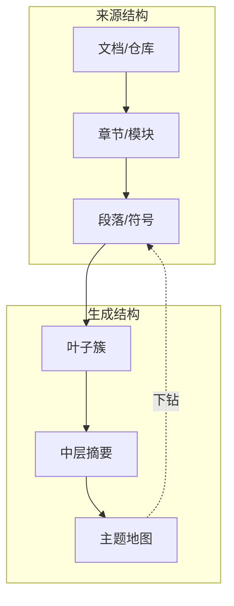

# 第 6 章 从片段到层级知识

片段是检索系统方便处理的单位，却不是人理解企业的天然单位。读者不会通过随机抽取的五段文字认识一个支付系统，也不会仅凭几个函数体理解一个代码仓。局部片段擅长回答“这一条规则是什么”，但面对“这个系统如何工作”“过去一年事故集中在哪些主题”“这个仓库由哪些子系统组成”时，缺少整体结构会成为决定性限制。

层级知识要解决的不是把分块做得更大，而是在多个抽象层之间建立可追溯的路径。系统摘要能够下钻到仓库，仓库下钻到模块，模块下钻到符号；一条高层结论也能反向指出它覆盖了哪些原始证据。检索由此从“在同一个平面上找相似片段”，转变为“先选择正确区域，再进入合适深度”。

## 6.1 为什么扩大上下文窗口不能替代结构

更大的上下文窗口允许模型一次读取更多材料，但容量不等于组织。把几百个无序片段放入窗口，模型仍需推断它们的层级、重复、版本和关系；不相关内容还会竞争注意力。大窗口适合阅读已经选定的长文档，不能替检索系统决定应该读哪一批文档。

固定块还会抹去“部分属于整体”的信息。一个段落可能属于退款政策的例外章节，一个函数属于支付服务的补偿模块，一个工单属于某次跨区域事故。若索引只保存文本，查询虽然能命中局部内容，却无法自然扩展到兄弟条目、父级说明和邻近上下文。

层级表示给每个对象增加父子关系、路径和覆盖范围。叶子保留细节，中间节点组织局部主题，根节点提供全局地图。检索器可以在不同粒度上召回，答案也可以停留在足够的层级，不必每次都返回最底层材料。

## 6.2 两种层级：来源结构与生成结构

第一种层级来自来源本身。文档已有目录，代码已有仓库、目录、文件、类和函数，组织已有事业部、团队与岗位，产品已有产品线和功能。这些结构是确定性的，应优先保留。它们不仅帮助导航，也携带权限继承、所有权和变更边界。

第二种层级是系统根据内容生成的主题结构。RAPTOR 从文本叶子开始，递归地进行聚类与摘要，形成不同抽象层的树；查询时可以跨层检索，从而支持需要综合多个片段的问题。[RAPTOR 论文](https://arxiv.org/abs/2401.18059) 这种结构能发现来源目录没有显式表达的主题，例如分散在不同事故中的“重试风暴”模式。

两种层级不能混为一谈。来源结构表达作者或系统的明确组织，生成结构表达算法推断出的相似主题。前者通常具有更高确定性，后者适合探索和综合。界面与 API 应标明层级来源，避免用户把一次聚类结果误认为正式组织关系。

## 6.3 企业不是一棵树，而是多个相交视图

“企业知识树”是有用的比喻，却容易产生误导。一份退款政策属于客户服务域，由法务团队拥有，影响支付产品，被多个地区采用，并与三个系统实现相关。它在组织、业务、产品、系统和地域视图中各有位置，不可能只挂在一棵树上而不丢失信息。

因此，平台更适合维护若干可组合的层级投影：

- 组织视图回答谁负责、谁审批和谁可以访问；
- 业务域视图组织概念、流程、规则和指标；
- 产品与系统视图连接能力、服务、接口和运行资产；
- 文档视图保留手册、政策、决策记录和版本结构；
- 代码视图从组织、仓库、模块一直到符号和源码；
- 时间视图区分当前、历史与计划状态。

对象本身保持稳定身份，各视图只提供不同的父子或包含关系。当查询“退款服务由谁负责”时，系统可以从系统视图定位服务，再跨到组织视图；当查询“这个团队的变更影响哪些客户流程”时，路径方向相反。严格来说，这已经接近图，但层级仍然重要，因为它提供了最自然的浏览、权限继承和逐层摘要边界。

## 6.4 路由、检索与下钻

层级查询可以分为三个动作。路由先判断问题应进入哪个域、系统或文档集合；局部检索在选定范围内运行 BM25、向量或图查询；下钻根据证据不足程度进入更细层级。三者不必由同一种模型完成。

例如用户问“Northstar 的退款链路为什么需要两个阶段”。路由器先进入支付域和退款系统；系统级 Wiki 给出授权与清算两阶段概览；若用户继续追问失败回滚，检索器进入补偿模块；若需要验证实现，再下钻到 `refund_worker` 的具体符号。每一层都返回摘要、关键实体、子节点和来源，因此用户可以在任何层停止。

PageIndex 一类“推理式文档索引”方案强调保留文档目录并像人查书一样逐层定位，而不是先把所有内容切成无结构向量。它代表的是一种设计方向：让目录和树参与检索决策。[PageIndex 项目](https://github.com/VectifyAI/PageIndex) 这类方法是否优于扁平向量，要由具体数据与任务评测决定；它尤其适合目录质量较高、长文档内部定位重要的场景。

层级路由也可能出错。问题往往跨域，单一路由会过早剪枝。因此生产系统可以保留多个候选分支，为每个分支设置预算，并允许词法精确命中绕过错误的高层分类。路由是缩小搜索空间的启发式，不应成为不可恢复的闸门。

## 6.5 摘要是一种派生知识

层级系统离不开摘要，但摘要不是原始事实。它是对一组下层对象在某个时间、使用某个模型和提示生成的派生视图。若没有血缘，高层页面会逐渐变成无法核验的“第二事实源”。

一个可治理的摘要对象至少需要记录覆盖对象、覆盖版本、生成时间、模型和提示版本、摘要类型、置信或审核状态。摘要中的关键声明应能链接到下层证据。对于财务规则、安全操作等高风险内容，还应经过人工审核或由确定性模板生成。

摘要也不应假装消除冲突。如果两个地区政策不同，高层摘要应显式保留差异和适用范围，而不是合并成一个模糊结论。若来源不足以支持全局判断，摘要应陈述覆盖边界。好的摘要压缩信息，不压平不确定性。

## 6.6 增量更新与失效传播

层级知识最容易在演示后腐化。一个函数发生变化，它的函数摘要、文件摘要、模块页面和仓库导览可能都已过期；但因此重建整个企业 Wiki 既昂贵又会造成大量无意义变更。

解决办法是把生成物也纳入依赖图。每个摘要记录直接输入及其版本。当叶子内容散列改变时，系统沿依赖边向上标记 `stale`，只重建受影响祖先。若变更只是注释或格式，可以根据解析结果判断语义对象未变，避免传播。若一个公共接口变化，则除了父级摘要，还应使依赖它的跨仓页面失效。

失效不等于立即删除。旧摘要可能仍用于解释历史版本，因此应与其覆盖版本一起保留；“当前”视图只选择最新且未过期的生成物。重建任务需要幂等，并把模型输出差异与来源差异分开，否则模型随机性会制造大量无意义的 Wiki 提交。

## 6.7 Northstar 的多层地图

Northstar 为退款领域建立了四级入口。第一层是业务域页面，解释客户退款能力、关键指标与责任边界；第二层是系统页面，展示订单、支付网关、退款服务和账务系统；第三层是仓库与运行手册；第四层是接口、符号、配置和版本化源码。组织、权限和地区政策作为横向视图连接到这些对象。

当客服提问时，系统通常停在政策和处置手册层，不暴露代码；开发者诊断错误码时则可以从系统页面一路下钻到实现。平台不会为两类用户建立两份知识库，而是在同一对象图上使用不同权限和上下文预算。

一次退款服务提交修改了重试条件。摄取任务更新两个函数节点，函数摘要随之失效；文件与模块摘要被重新生成；仓库总览由于职责没有变化，只更新版本覆盖，不重写正文；关联运行手册被标记为“需要所有者复核”，而不是由模型自动修改。这条传播链把“代码变了”转化为明确、有限且可审计的知识维护工作。

## 6.8 如何评价层级是否有用

层级系统不应只以页面数量衡量。离线评测可以比较扁平检索与层级路由在全局理解、局部定位和跨层追问上的证据召回与成本；还应统计错误路由率、平均下钻深度、摘要引用覆盖率和变更后的陈旧窗口。

人工评审应特别检查三个问题：高层摘要是否忠实保留关键例外，用户能否从结论回到原始证据，不同视图是否错误合并了同名实体。若层级只增加导航页面却没有提高任务成功率，它就是昂贵的目录生成器；若它能减少无关召回、复用高频理解并保持证据链，它才成为企业上下文的认知骨架。

## 本章小结

片段解决局部命中，层级解决范围选择和抽象切换。企业应同时保留来源确定的结构与算法生成的主题结构，并用组织、业务、系统、文档、代码和时间等多个视图观察同一批对象。摘要属于有血缘、有版本的派生知识；增量失效则保证这套结构能够跟随企业变化。下一章将在此基础上讨论 Wiki：如何把反复发生的理解工作编译成可维护的页面。

## 延伸阅读

- Parth Sarthi et al., [RAPTOR: Recursive Abstractive Processing for Tree-Organized Retrieval](https://arxiv.org/abs/2401.18059), 2024。
- VectifyAI, [PageIndex](https://github.com/VectifyAI/PageIndex)。
- LlamaIndex, [Recursive Retriever](https://docs.llamaindex.ai/en/stable/examples/retrievers/recursive_retriever_nodes/)。
