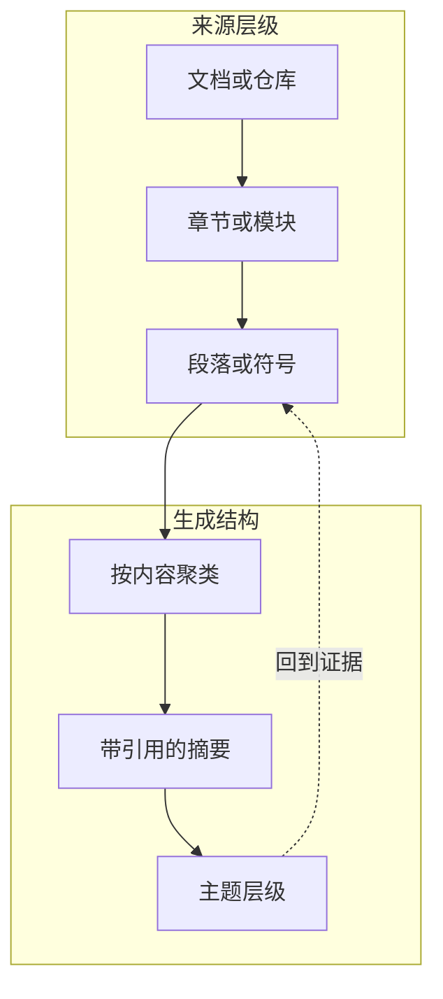

# 第 6 章 关系与层级：沿结构查找证据

> 本章要回答：当答案分散在不同章节、系统或代码符号中时，怎样沿层级与关系找到足够的证据？

检索系统喜欢把材料切成片段，因为小块更容易搜索。可人并不是靠随机读五段文字来认识一个支付系统，也不会只看几个函数就理解整个代码仓。片段适合回答“这条规则写了什么”；要回答“系统怎样运作”“过去一年事故集中在哪些问题”“这个接口变化还要检查哪里”，还得利用材料之间的结构。

解决办法是保留从概览到细节、从一个对象到相关对象的路。系统概览可以进入仓库，仓库可以进入模块，模块再进入代码符号；接口可以连接调用者、测试和运行手册。高层解释和关系路径最终都要能回到来源。本章先说明如何使用这些结构检索，再比较实现它们的技术。第 8 章负责另一项工作：定义对象与关系的业务含义，并验证模型是否符合实际问题。

## 6.1 先明确输入和输出

更大的上下文窗口能让模型一次读更多内容，但几百个无序片段仍会带来重复、版本混淆和无关材料。大窗口适合阅读已经选定的长文档；结构检索帮助决定先选哪些材料，以及何时继续向下或向外查找。

输入包括当前问题、主体权限、时间范围、已定位的对象，以及带来源的层级和关系。每个节点需要可解析的身份与版本，每条关系需要类型、方向、依据和适用时间。仅有同名字符串，还不足以开始跨系统连接。

输出是一组有解释的候选证据：命中了哪个对象，沿什么路径找到哪些材料，哪些来源支持这条路径，以及哪里仍缺证据。输出中还要保留停止原因，例如证据已经足够、达到预算、遇到不可访问分支或来源缺失。没有找到路径，不等于证明业务上不存在联系。

| 任务需要 | 优先利用的结构 | 交付结果 |
|---|---|---|
| 找到政策条款的条件与例外 | 文档目录、父子块与相邻章节 | 条款、上级范围和例外原文 |
| 理解系统或仓库职责 | 系统、模块、文件与符号层级 | 概览及可下钻的证据入口 |
| 查接口依赖与潜在影响 | 有类型和方向的依赖关系 | 受约束的路径、来源与待核验项 |
| 综合大量事故的共同主题 | 生成的主题树或图社区摘要 | 有覆盖范围的主题解释及原始案例 |

## 6.2 分清来源层级、业务关系和生成结构

```mermaid
flowchart TB
  subgraph 来源层级
    D[文档或仓库] --> S[章节或模块]
    S --> L[段落或符号]
  end
  subgraph 生成结构
    L --> C[按内容聚类]
    C --> M[带引用的摘要]
    M --> T[主题层级]
  end
  T -.回到证据.-> L
```

来源层级来自材料已有的组织：文档目录、章节、段落，或仓库、目录、文件与符号。应先保留这些父子关系、路径和原文坐标。它们表达作者或系统怎样组织内容；抽取质量仍需检查，例如扫描文档的标题识别可能出错。来源目录也不保证内容真实，更不能自动代表业务依赖。

业务关系连接不同对象，例如服务调用接口、团队负责服务、指标使用数据产品。它们通常跨越目录边界。一份退款政策既有文档位置，也关联地区、产品和服务。平台为同一批对象保留不同关系视图：查责任时沿组织关系，查实现时沿接口与代码关系，查历史时选择当时有效的版本。导航树只有在来源明确规定权限继承时才可用于权限计算，主题聚类不授予访问权。

生成结构则由算法根据材料建立。相似片段可以聚成主题，再生成摘要，继续形成更高层概览；实体关系图也可以划分为联系较密的社区，并为社区生成报告。主题树的父子关系表示概括范围，图社区表示某种分组结果，二者都不等于正式组织归属或已确认因果。每个生成节点都应标明输入范围、生成方式、版本和证据链接。

层级解决逐层定位，关系解决跨对象连接，生成摘要帮助综合阅读。把三种结构放在同一检索系统中时，仍要保留它们各自的含义和来源。

## 6.3 基线方法：定位入口，再有界下钻与扩展

先用标题、精确名称、关键词或已有对象 ID 找到入口，再沿少量允许的关系补充上下文，是一个可独立实现的基线。保存父子 ID 和有类型的边，用关系表或邻接表就能开始；不必先生成全库摘要或部署专用图数据库。

1. **定位入口。** 将问题中的服务、条款、符号或指标解析到候选对象。歧义未解决时保留多个候选，或请求澄清。
2. **选择路径。** 根据问题确定要查的层级、边类型与方向。例如找调用者要沿调用边的反向查询，找接口实现则选择实现关系。
3. **限制范围。** 为候选分支分配跳数、节点数、来源数、时间和上下文预算。共享基础服务可能连接数百系统，应在扩展前限制范围。
4. **沿途检查。** 每次读取节点、关系及其证据前检查权限、时间和来源等级。保留已访问集合，避免环路和重复计数。
5. **取回原文。** 路径用于找到材料，再读取条款、配置、源码或观察记录，判断它是否真的支持回答。
6. **决定停止或继续。** 已有足够证据就组织答案；不足时换分支、增加一次受限查询，或明确返回缺口。

路由可以先选业务域、系统或文档集合，再在局部运行关键词、向量或关系查询。问题可能跨域，因此要允许多个候选分支，并让精确命中补救错误路由。高层分类缩小搜索空间，不能让被误分的材料永久不可达。

例如，用户问退款链路为什么分成两个阶段。先读系统概览确认两个阶段及其来源，再取回对应流程说明；追问失败回滚时，进入补偿模块和运行手册；需要验证实现时，才下钻到相关符号。每层返回概述、证据入口与覆盖范围，用户可以在证据足够的层级停止。

## 6.4 图检索的结果怎样成为证据

图最诱人的操作是从一个节点不断向外扩展，但“连得上”与“回答得出”是两件事。A 依赖 B、B 依赖 C，只能说明存在结构路径，不能自动断言修改 C 一定影响 A。影响分析还要检查边的含义、实际变更、版本与运行证据，并区分直接依赖、潜在传递影响和已观察影响。

权限过滤要在遍历过程中执行。先走过完整路径再隐藏节点名称，仍可能泄露路径形状、关联数量和受限业务的存在。是否可以返回“存在受限依赖”，需要由明确的安全策略决定；未经授权的分支不能成为回答的隐含依据。

关系的来源决定怎样使用它。服务目录中的责任声明、编译器解析的符号引用、一次追踪观察和模型推断的关联，证明的是不同事情。名称匹配产生的候选关系可以引导查证，不能与已解析引用合并为同一证据等级。运行追踪也只证明采样窗口内实际观察到的路径。

图查询结果通常仍需与文本结合。图找到相关实体和路径，文本检索取回解释与依据，Wiki 提供概览，固定版本源码或业务观察用于核验。图数据库保存和遍历关系；第 8 章的建模方法决定关系允许连接什么、意味着什么，以及要满足哪些约束。采用数据库不会自动完成这些判断。

硬件设计可以沿“需求—设计部分—器件或接口—依据—验证项”查证。W2 的续航目标关联功耗预算，预算引用采样与上传的电量输入，并关联待做的电池测试。若上报周期或无线模块改变，平台沿这些关系找到需要重算的预算、接口和验证计划。存在验证链接只说明找到了验证安排，不能据此认定试验通过。

## 6.5 代码导航：从系统概览到固定版本源码

代码检索同时需要横向通道与纵向深度。横向看，关键词适合符号、路径和错误信息，语义检索适合职责解释，关系查询适合定义、引用与依赖。纵向看，可以从系统摘要进入仓库和模块，再定位符号，最后读取具体提交下的源码。用户问系统职责时，概览可能已经足够；问某项判断在实现中是否成立时，才需要更细的证据。

代码图不止是调用图。文件、符号、类型、测试、配置、构建目标和包依赖分别提供不同线索。仓间关系可以来自 API 契约、消息主题和部署配置。静态分析会受到动态分派、反射、宏和条件编译影响；运行观察也无法覆盖没有执行过的路径，因此结果需要记录分析环境与覆盖边界。

| 工具或材料 | 能提供什么 | 核验边界 |
|---|---|---|
| Tree-sitter 语法解析 | 语法树、结构化切块、语法位置和候选符号 | 语法结构不等于完成类型解析或跨仓符号绑定 |
| 编译器或语言索引器 | 在相应构建环境下解析的定义、引用及部分语义关系 | 取决于语言、依赖、编译选项和索引器覆盖 |
| SCIP 索引协议 | 保存和交换代码导航索引，可支持定义、引用和实现查找 | 协议不自行解析代码，也不自动给出完整运行调用图 |
| LSP 语言服务器协议 | 向语言服务器请求工作区中的定义、引用、类型等信息 | 具体能力由服务器提供，结果依赖工作区状态，须记录所用版本 |
| 版本化源码存储 | 仓库、提交、路径、原文范围与内容散列 | 用于回到具体代码；源码本身不证明运行时效果 |

Tree-sitter 的核心是增量语法解析；SCIP 是索引协议，需要相应索引器产生数据；LSP 是客户端与语言服务器的交互协议。这三者处于不同位置，可以组合使用。[Tree-sitter](https://github.com/tree-sitter/tree-sitter) [SCIP](https://github.com/scip-code/scip) [LSP 规范](https://microsoft.github.io/language-server-protocol/)

一个可复核的实现先保存源码提交，用解析器和语言索引器建立结构，再按需调用匹配工作区的语言服务器。LSP 返回的位置要解析回相同提交或明确标注未提交内容；不能将当前工作区的结果贴到历史提交上。本书将版本化源码工件层称为 ArtifactFS，它是一项存储职责，可由 Git 对象库、对象存储或源码归档实现，并非必须采购的特定产品。

最终引用至少能够定位仓库、提交、路径和原文范围。跨仓关系还要记录两端版本及关联依据。固定源码证据让摘要、图路径与导航结果可以被复核，但测试是否通过、故障是否发生，仍需要对应的测试或运行记录。

## 6.6 生成结构的可选方法：主题树与社区摘要

当来源目录不足以回答跨文档综合问题时，可以增加生成结构。先规定要改善的任务，再固定语料和基础检索结果作为对照，避免把摘要数量当成理解能力。

**递归主题树。** 从可引用片段出发，按内容聚类，为每组生成带证据的摘要，再对摘要继续聚类与概括。查询可以命中不同层级，先取得主题概览，再回到叶子核验。RAPTOR 研究了递归聚类与摘要形成的树状检索结构；它提供一种跨粒度综合方法，不证明算法主题就是来源本身的组织关系。[RAPTOR 论文](https://arxiv.org/abs/2401.18059)

**图社区摘要。** 从文本抽取实体和关系，建立图，划分社区，再生成社区报告。Microsoft GraphRAG 的研究方法用这些报告支持面向整个语料库的主题问题，也提供围绕具体实体的局部检索。它需要额外的抽取、实体归并和摘要成本，还会继承这些步骤的错误。[GraphRAG 方法说明](https://github.com/microsoft/graphrag/blob/00adeaf713d9bca070d28476bdd21234dce6ecc4/docs/index.md#L36)

普通图查询可以直接回答“谁调用这个接口”，无需社区检测或生成摘要。GraphRAG 这里指图辅助的生成式检索方法，Microsoft GraphRAG 则是具体研究与实现；不能把任何图查询都称为已采用这套流程。

截至 2026 年 10 月核对，Microsoft GraphRAG 的 README 明确标注主要处于维护模式，仍可进行修复与依赖更新。学习其公开方法与采用某个具体实现是两个选择；选型还要检查维护范围、许可证与升级路径。[项目维护说明](https://github.com/microsoft/graphrag/blob/00adeaf713d9bca070d28476bdd21234dce6ecc4/README.md#L4)

LightRAG 是另一种结合图结构与向量检索的专项实现，其双层检索分别关注细节和较抽象的概念，项目也描述了增量更新和选择性删除。可把它作为实验候选，在相同语料、权限和预算下比较效果。默认存储配置与生产配置的边界也要单独检查，不能从名称中的“Light”推断部署成本或治理已经解决。[LightRAG 来源快照](https://github.com/HKUDS/LightRAG/blob/b9ec0644f9c48000ba93116265b2f1adf496a645/README.md#L261)

生成摘要是一种派生知识。系统要保存它总结了哪些对象与版本、生成时间、模型与提示版本、覆盖范围及审核状态。关键说法必须能回到下层证据；高风险规则需要人工复核，或采用能够明确校验的模板。两个地区政策不同，就保留差异；材料只覆盖部分事故，就不能写成全公司的结论。

## 6.7 增量维护：关系和摘要一起失效

一个函数变化后，它的引用关系、函数摘要、模块页面和仓库导览可能受到不同影响。维护时应以来源版本和内容变化定位受影响节点，再沿依赖关系找到相关边和生成物；没有必要因一处变化重建全部企业资料。

节点和边需要稳定身份及版本记录。来源删除时撤销当前关系，保留必要的历史证据；解析器或模型版本变化时，记录这是加工方式的变化。对于有业务有效期的关系，保存 `valid_from`、`valid_to`，并用 `recorded_at` 及系统记录区间说明平台何时获知。运行观察另外保留采样时间 `observed_at` 和窗口，代码关系还需要提交与构建配置。未知有效时间不能用采集时间冒充，完整时间契约见第 11 章。

生成物可先标为 `stale`（需要重新核验），再重建受影响部分。仅格式变化时，只有在含义和定位仍可验证的前提下才能复用；注释可能是摘要依据，不能一概忽略。无论是否重写正文，都要更新版本映射和引用坐标。旧摘要可以用于历史问题，当前查询则应选用适用版本。

例如，重试条件变化可能使函数摘要和运行手册产生差异。系统更新代码证据并提出手册复核项，不应由模型自动把新实现改写为正式操作规范。失效传播的目标是找出哪些判断需要重做，而不是把所有来源强行改成一致。

## 6.8 技术选项与验证顺序

选型先看哪种检索困难尚未解决，再选择增加的能力。下表区分通用实现与专门方法，成熟度判断针对使用边界，不以项目关注度代替验证。

| 需要补足的能力 | 可选实现 | 采用前要验证什么 |
|---|---|---|
| 来源目录、父子块与少量关系查询 | 关系表、邻接表、既有搜索索引 | 父子映射、版本定位、权限和遍历预算；作为基线先做 |
| 较复杂的有类型路径查询 | 属性图或 RDF 查询系统 | 查询表达、规模、权限过滤与更新成本；存储工具不替代模型设计 |
| 长文档的目录路由 | 自建目录检索，或 PageIndex 一类树导航实现 | 目录质量、错误路由恢复、漏检和查询成本；作为可选路径 |
| 跨片段的多层主题概括 | RAPTOR 类聚类摘要树 | 摘要失真、跨层召回与增量维护；按任务做实验 |
| 全语料主题问答 | GraphRAG 类社区报告 | 抽取和实体合并错误、证据覆盖、构建与查询成本 |
| 图与文本检索的组合探索 | LightRAG 等实验候选 | 对同一基线的实际增益，以及访问隔离、删除传播和失败行为 |
| 代码精确导航 | Tree-sitter、语言索引器、SCIP、LSP 的分工组合 | 目标语言和构建配置覆盖；协议支持不等于所有关系都已解析 |

PageIndex 是目录与树导航的一种实现参考；是否比扁平检索更合适，取决于文档结构及任务，而非是否采用向量。其开源文本 PDF 工作流与云端跨文件树是不同交付范围，选型时应分别核对。[PageIndex 来源快照](https://github.com/VectifyAI/PageIndex/blob/91238b33b625b51a797db591f9719d97716e5c4e/README.md#L46) RAPTOR、GraphRAG 和 LightRAG 的研究结果也不应直接换算为当前企业资料的效果。选定版本后，还应核对许可、依赖、安全修复和升级方式。

验证集至少包含局部定位、全局综合、跨关系追问、同名对象、历史版本、越权分支和无答案问题。先测扁平检索，再分别加入父块、关系扩展和生成摘要，比较正确证据召回、引用准确率、回答支持度、错误路由率、延迟与构建成本。关系检索还要检查方向、环路、枢纽节点和预算截断，记录缺失边导致的漏检。

更新验证可以修改或撤销一份来源，检查受影响关系与摘要是否失效，历史查询能否定位旧证据，以及权限撤销是否立即约束当前读取。只有新增结构改善了实际任务，并能持续保持证据链，才值得保留其维护成本。

## 本章小结

结构检索先定位对象，再沿有含义、有依据的层级和关系查找材料。来源目录、业务关系与生成主题各有作用；查询需要限制方向、深度、时间、权限和预算，最后回到原文核验。代码导航要区分语法解析、语义索引、交互协议与固定源码证据。主题树和社区摘要是基线不足时的可选增强。下一章讨论怎样把反复使用的解释编译为可维护的 Wiki 视图。

## 延伸阅读

- Parth Sarthi et al., [RAPTOR: Recursive Abstractive Processing for Tree-Organized Retrieval](https://arxiv.org/abs/2401.18059), 2024。
- Darren Edge et al., [From Local to Global: A Graph RAG Approach to Query-Focused Summarization](https://arxiv.org/abs/2404.16130), 2024。
- Microsoft, [GraphRAG documentation](https://microsoft.github.io/graphrag/)。
- HKUDS, [LightRAG](https://github.com/HKUDS/LightRAG)。
- VectifyAI, [PageIndex](https://github.com/VectifyAI/PageIndex)。
- Tree-sitter, [Incremental parsing system](https://tree-sitter.github.io/tree-sitter/)。
- SCIP contributors, [SCIP code indexing protocol](https://github.com/scip-code/scip)。
- Microsoft, [Language Server Protocol](https://microsoft.github.io/language-server-protocol/)。
