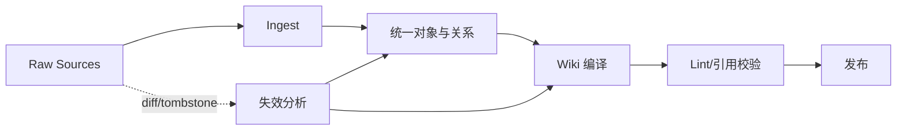

# 第 7 章 Wiki：把反复查资料的工作提前做好

> 本章要回答：怎样把经常重复的阅读和归纳提前做好，变成能查来源、能随资料更新的 Wiki？

检索可以在需要时找回证据，却会反复支付理解成本。每当新人询问“退款系统由哪些服务组成”，系统都要重新召回架构文档、代码入口和事故记录，再临时合成一次答案。若这个问题稳定、高频且答案具有复用价值，就值得把综合过程提前完成，形成一张持续维护的知识页面。

本章所说的 Wiki，不只是让员工手工编辑网页。它更像由原始资料持续生成的一层阅读指南：提供稳定目录、术语解释、系统导览、主题摘要和证据链接；来源变化后，只更新受影响的页面。Andrej Karpathy 提出的 LLM Wiki 设想把 Raw Sources、Schema、Ingest、Query 与 Lint 组成持续循环，核心意思也是：Wiki 是可以重新生成和检查的派生内容，不是模型一次写完就无人维护的页面。[LLM Wiki](https://gist.github.com/karpathy/442a6bf555914893e9891c11519de94f)

## 7.1 从“写页面”到“按规则生成和维护页面”

传统企业 Wiki 常见两个极端。一端完全依赖人工：质量可能很高，但更新落后于业务，知识集中在少数热心作者身上。另一端用模型批量生成：很快获得上千页面，却产生重复、空泛和无法核验的内容。编译式 Wiki 试图保留两者优势：机器承担发现、初稿、链接与更新，人负责结构、规范来源、关键判断和高风险审核。

本书仍把这种方式简称为“编译式 Wiki”。这里的“编译”有四个具体含义：系统知道输入有哪些、分别是什么版本；输出遵循固定页面模板；每段生成内容能找到输入证据；来源变化时，系统知道哪些页面需要重做。它不像代码编译那样完全确定，所以还要记录所用模型、提示词、审核情况和质量状态。

Wiki 页面不是新的事实终点。政策原文、Git 提交、数据库记录和工单仍是权威来源；页面只把分散证据组织成适合阅读和检索的解释视图。若页面与来源冲突，系统应优先暴露冲突并回到来源，而不是让更流畅的摘要胜出。

## 7.2 页面模式决定 Wiki 能否规模化

自动生成 Wiki 如果没有页面模板，很快就会变成一批长短不一、结构各异的散文。不同对象应该使用不同 Schema（结构模板），而不是所有主题套一个格式。系统页可以写职责、边界、接口、依赖、负责人、运行指标、常见故障和相关仓库；仓库页可以写目标、构建方式、模块地图、入口符号和变更热点；业务概念页则可以写定义、同义词、适用范围、规则、指标与负责人。

Schema 的价值不只在排版。它让摄取流程知道需要补哪些信息，让检索器可以定向查找字段，让 Lint 能发现“系统页面缺少所有者”或“架构结论没有来源”。页面字段应区分必需、推荐和可选，避免资料不足时模型用猜测填满模板。

一个可治理的页面对象可包含以下信息：

- 稳定页面 ID、对象类型和规范标题；
- 页面正文与结构化字段；
- 覆盖来源及具体版本；
- 每项关键声明的证据链接；
- 生成模型、提示和流水线版本；
- 所有者、审核状态、有效时间和新鲜度；
- 父页面、子页面、相关实体和派生页面；
- 人工锁定区域与机器可重建区域。

这些元数据不必全部显示在正文，却必须进入页面清单和审计接口。否则平台无法回答一张页面为什么出现、何时应重建以及谁对它负责。

## 7.3 事实、解释与推断必须分层

模型很擅长把零散材料写成连贯叙述，也因此容易把来源事实与自己的连接句混在一起。页面应至少区分三类内容。事实是来源直接支持的声明；解释是对多个事实的整理，例如把五个调用步骤概括为一条业务链路；推断是尚未被权威来源确认的判断，例如“这个模块可能是延迟瓶颈”。

事实需要精确引用。解释需要列明覆盖证据和适用范围。推断必须显式标记，并通常不应用于高风险自动决策。若一次代码分析仅根据名称匹配推断两个符号相关，这条关系可以帮助导航，但不能被页面写成确定调用。

时间也是声明的一部分。“退款服务由支付团队负责”只有在某段时间内成立。页面既要说明覆盖的源版本，也要区分事实有效时间与页面生成时间。对于历史页面，生成物可以保持可访问；对于当前页面，只能选择仍有效且未过期的证据。

## 7.4 摄取流水线如何生成和更新页面

编译流程从变更集开始，而不是从“重新阅读全部资料”开始。连接器发现新增、修改和删除的对象；解析器更新结构与实体；影响分析根据页面血缘找出可能失效的页面；生成器只重建受影响区域；Lint 与评测通过后，页面才进入可检索状态。

图中的 tombstone 是删除标记，用于防止迟到事件让已删对象重新出现；第 11 章 §11.7 会完整说明删除传播。

生成页面不能只调用一次模型就结束。更稳妥的流程是：先收集页面需要的证据，再按模板写出草稿，逐条检查重要说法有没有依据，最后才生成 Markdown。来源互相冲突，就把冲突保留下来；必填项没有证据，就明确留空。不能为了把模板填满而编造负责人、接口或结论。

更新策略需要处理人工编辑。最简单的办法是将页面分为机器区块与人工区块：机器区块可以整体重建，人工区块永不自动覆盖。更细粒度的方法为每个段落保存来源和编辑来源，在三方合并中比较旧生成物、新生成物与人工版本。无论采用哪种方式，模型都不应静默覆盖人工判断。

删除同样重要。当源文档撤销或权限收紧时，派生页面必须重新计算可见性；若页面唯一依据被删除，应下线或标为失效，而不是继续作为孤立知识存在。缓存、搜索索引和静态站点也要收到同一撤销事件。

## 7.5 Wiki Lint：把内容质量变成可检查规则

代码有编译和测试，Wiki 也需要一组自动检查，通常叫 Wiki Lint。结构检查负责必填字段、标题层级和模板版本；链接检查负责坏链接、孤立页面、循环和不存在的实体；证据检查负责没有来源的说法、无法定位的版本和过期引用；语义检查则寻找术语冲突、重复页面，以及同一个对象出现两个互相矛盾的负责人。

部分检查可以确定执行，例如 URL、对象 ID、Git 提交和 Schema。另一些只能作为告警，例如“正文可能与来源矛盾”。模型评审可以帮助发现问题，但不能成为自己的唯一裁判。高风险页面需要人工抽样，重要声明则可通过确定性来源或独立模型交叉验证。

Wiki 还需要内容级测试。为系统页面维护一组关键问题，例如“入口 API 是什么”“由谁值班”“如何回滚”；页面更新后，测试回答是否仍能找到预期证据。测试失败不一定意味着页面错误，也可能说明来源或系统发生了真实变化，此时应进入复核队列。

## 7.6 什么适合编译，什么不适合

适合进入 Wiki 的内容通常同时具备三项特征：需要综合多个来源、被反复使用、变化速度低于查询频率。系统导览、产品能力、术语解释、架构决策、常见故障模式和代码模块地图都符合这一条件。

快速变化的账户余额、库存、告警、审批进度和当前部署状态不适合被摘要成页面。它们应由实时工具读取，Wiki 只解释字段含义、查询方式和处置规则。一次临时会议中的未确认观点也不应立即变成团队事实；它可以进入待审核区或任务记忆，待决策正式化后再编入知识。

Wiki 也不应复制所有原文。对完整政策和源码，页面提供地图、关键解释与引用即可。过度复制既增加更新成本，也让用户难以判断哪份材料是规范来源。

## 7.7 开源代码 Wiki 的实践启示

自动生成代码 Wiki 已形成一类明确实践。CodeWiki 关注从代码仓库生成结构化文档与 Wiki；OpenWiki 则提供面向代码仓的开源 Wiki 生成与问答思路。[CodeWiki](https://github.com/FSoft-AI4Code/CodeWiki) [OpenWiki](https://github.com/langchain-ai/openwiki) 这些项目证明了仓库导览、文件解释和问答可以自动化，也同时暴露出一个共同挑战：页面若只从当前源码一次性生成，很难处理跨仓依赖、版本比较、人工维护和持续失效。

因此，企业代码 Wiki 不能停在“每个文件生成一段摘要”。仓库里的符号、文件、构建目标、接口、负责人、提交和事故本来就互相关联，页面只是把这些关系整理成不同深度的阅读入口。Tree-sitter、SCIP 或编译器索引提供较确定的代码结构，模型补充职责解释和主题摘要，最终证据始终是固定版本的源码。

代码 Wiki 的质量也不能按页面长度衡量。有效指标包括入口覆盖率、符号引用正确率、跨仓链接可解析率、变更后陈旧时间以及开发者完成真实理解任务所需的跳转次数。

## 7.8 Northstar 的页面编译循环

下面描述生产扩展中的页面编译循环；当前样例仅按 system 和角色生成模板页，还没有增量队列或人工区块合并。目标方案为退款系统定义三种页面：业务能力页、系统页和仓库页。业务能力页由政策、流程与指标生成；系统页由服务目录、接口、运行手册和架构决策生成；仓库页由 README、构建文件、代码图和关键符号生成。三类页面共享对象 ID，却有不同 Schema 和 ACL。

在这套目标方案中，假设一次代码提交修改了退款重试策略。代码索引首先更新符号和调用关系，影响分析使仓库页的“重试机制”区块失效。系统页因为引用该机制也进入待重建状态；业务能力页没有直接依赖实现，因此保持不变。新页面生成后，Lint 发现运行手册仍描述旧次数，于是发布流程没有悄悄改写手册，而是创建一个由所有者审核的知识差异项。

客服检索只能看到业务能力页和获准的运行步骤；开发者可以继续下钻到系统页、仓库页和源码。两者阅读的是同一事实链的不同投影，而不是两套彼此漂移的知识库。

## 本章小结

Wiki 的价值，是把经常重复的查资料和归纳工作提前做好。页面模板让内容结构稳定，来源记录说明每段话从哪里来，增量更新只重做受影响部分，Lint 则挡住缺字段、坏链接和无证据结论。Wiki 始终是帮助阅读的派生知识：它要保留版本和证据，分清事实、解释和推断，不复制随时变化的实时状态，也不能覆盖规范来源。下一章会把页面之间隐含的关系单独建模，进入知识图谱。

## 延伸阅读

- Andrej Karpathy, [LLM Wiki](https://gist.github.com/karpathy/442a6bf555914893e9891c11519de94f)。
- FSoft-AI4Code, [CodeWiki](https://github.com/FSoft-AI4Code/CodeWiki)。
- LangChain AI, [OpenWiki](https://github.com/langchain-ai/openwiki)。
- Diátaxis, [A systematic approach to technical documentation authoring](https://diataxis.fr/)。它对教程、操作指南、解释与参考的区分可用于页面类型设计。
