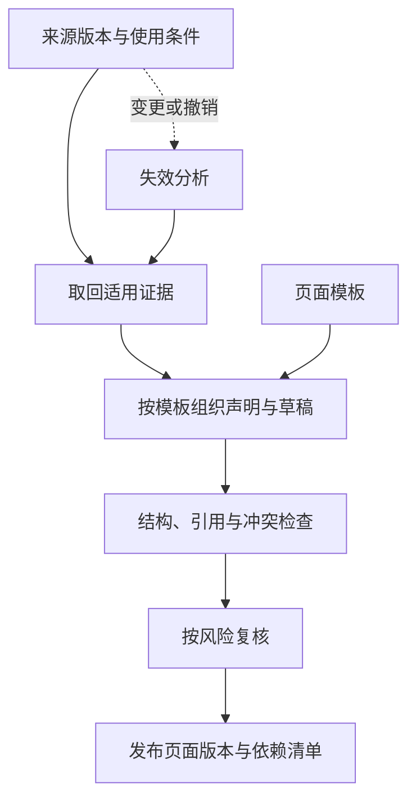

# 第 7 章 Wiki：把反复查资料的工作提前做好

> 本章要回答：怎样把经常重复的阅读和归纳提前做好，变成能查来源、能随资料更新的 Wiki？

检索可以在需要时找回证据，却会反复支付理解成本。每当新人询问“退款系统由哪些服务组成”，系统都要重新召回架构文档、代码入口和事故记录，再临时合成一次答案。若这个问题稳定、高频且答案具有复用价值，就值得把综合过程提前完成，形成一张持续维护的知识页面。

本章所说的 Wiki，是围绕主题或对象组织的知识阅读视图：提供稳定目录、术语解释、系统导览、主题摘要和证据链接。它可以人工编写，也可以从来源生成草稿；来源变化后，依赖它的内容需要重新核验。本章先建立一条从来源到发布的通用方法，再讨论哪些工具可以承担其中的工作。

## 7.1 从“写页面”到“按规则生成和维护页面”

传统企业 Wiki 常见两个极端。一端完全依赖人工：质量可能很高，但更新落后于业务，知识集中在少数热心作者身上。另一端用模型批量生成：很快获得上千页面，却产生重复、空泛和无法核验的内容。编译式 Wiki 试图保留两者优势：机器承担发现、初稿、链接与更新，人负责结构、规范来源、关键判断和高风险审核。

本书把这种方式称为“编译式 Wiki”。这里的“编译”有四个具体含义：系统知道输入有哪些、分别是什么版本；输出遵循固定页面模板；每项关键声明能找到输入证据；来源变化时，系统知道哪些页面需要重做。它不像代码编译那样完全确定，所以还要记录所用模型、提示词、审核情况和质量状态。

输入是一组已确定范围和访问条件的来源版本、页面模板、已有页面及人工修订；输出是可阅读和检索的页面版本，以及声明引用、依赖清单、审核状态和可见范围。最小实现可以只用版本化 Markdown、结构化元数据和检查脚本，把一类高频问题先维护好。

Wiki 页面把分散证据组织成解释视图，不能凭生成过程取得权威地位。政策原文、Git 提交、数据库记录和工单也有不同证据地位：代码说明实现，政策说明规范，工单可能只有尚待验证的报告。页面与来源冲突时，要保留差异并由相应负责人判断，不能让更流畅或更新时间更晚的文字自动胜出。

## 7.2 页面模式决定 Wiki 能否规模化

自动生成 Wiki 如果没有页面模板，很快就会变成一批长短不一、结构各异的散文。不同对象应该使用不同 Schema（结构模板），而不是所有主题套一个格式。系统页可以写职责、边界、接口、依赖、负责人、运行指标、常见故障和相关仓库；仓库页可以写目标、构建方式、模块地图、入口符号和变更热点；业务概念页则可以写定义、同义词、适用范围、规则、指标与负责人。

Schema 的价值不只在排版。它让摄取流程知道需要补哪些信息，让检索器可以定向查找字段，让 Lint 能发现“系统页面缺少所有者”或“架构结论没有来源”。页面字段应区分必需、推荐和可选，避免资料不足时模型用猜测填满模板。

企业整体也需要便于阅读的页面。它们使用第八章定义的对象和关系，帮助读者从企业背景进入具体工作。

| 页面类型 | 读者希望弄清什么 | 内容及证据入口 |
|---|---|---|
| 企业与业务概览 | 服务谁、怎样创造价值、当前重点是什么 | 客户群、产品、收入成本口径、目标和举措，引用商业及经营材料 |
| 业务能力页 | 企业能做什么、由谁承担、依靠什么 | 能力定义、相关价值流阶段、团队、流程、应用和已知缺口 |
| 目标与指标页 | 希望改变什么、怎样衡量、到哪里看结果 | 目标期间、指标定义、责任人和举措；实际值保留带时间的查询入口 |

W2 产品概览可以先说明服务的仓储客户、减少现场维护的设想，再链接续航与结构要求、负责角色和 W2-D0 草案。低功耗设计能力页则说明设计、预算与验证怎样配合，并引用相关流程和设计记录。两个页面引用同一产品、目标和能力身份，页面正文不另行创造定义。[W2 企业背景](https://github.com/LENSHOOD/enterprise-context-book/blob/main/examples/hardware-design/enterprise-brief.md)

编译这些页面时，要保留“目标草案”“拟建应用”“预算已计算”“实测待执行”等区别。客户价值尚未验证，就显示验证所需的资料；当前维护指标没有可用查询，就标明缺口。若以后接入经营看板，概览可以链接它，也可以展示注明期间与快照的历史结果，不能把旧摘要伪装成当前数值。

一个可治理的页面对象可包含以下信息：

- 稳定页面 ID、对象类型和规范标题；
- 页面正文与结构化字段；
- 覆盖来源及具体版本；
- 每项关键声明的证据链接；
- 生成模型、提示和流水线版本；
- 所有者、审核状态、有效时间和新鲜度；
- 父页面、子页面、相关实体和派生页面；
- 人工锁定区域与机器可重建区域。

这些元数据不必全部显示在正文，却必须进入页面清单和审计接口。否则平台无法回答一张页面为什么出现、何时应重建以及谁对它负责。

## 7.3 事实、解释与推断必须分层

模型很擅长把零散材料写成连贯叙述，也因此容易把来源事实与自己的连接句混在一起。页面应至少区分三类内容。事实是来源直接支持的声明；解释是对多个事实的整理，例如把五个调用步骤概括为一条业务链路；推断是尚未被权威来源确认的判断，例如“这个模块可能是延迟瓶颈”。

事实需要精确引用。解释需要列明覆盖证据和适用范围。推断必须显式标记，并通常不应用于高风险自动决策。若一次代码分析仅根据名称匹配推断两个符号相关，这条关系可以帮助导航，但不能被页面写成确定调用。

时间也是声明的一部分。“退款服务由支付团队负责”只有在某段时间内成立。页面既要说明覆盖的源版本，也要区分事实有效时间与页面生成时间。对于历史页面，生成物可以保持可访问；对于当前页面，只能选择仍有效且未过期的证据。

## 7.4 从来源、模板与声明到检查和发布

```mermaid
flowchart TB
  R[来源版本与使用条件] --> E[取回适用证据]
  E --> W[按模板组织声明与草稿]
  T[页面模板] --> W
  W --> L[结构、引用与冲突检查]
  L --> H[按风险复核]
  H --> P[发布页面版本与依赖清单]
  R -.变更或撤销.-> S[失效分析]
  S --> E
```

第一步固定来源范围与版本，确认谁可以阅读这些材料。第二步选择页面类型和模板，为每个字段取回证据。第三步整理声明：每项关键说法保存文本、支持来源、适用范围，以及事实、解释或推断的状态，然后据此生成草稿。第四步执行结构、引用和冲突检查，并按风险安排复核。最后发布页面及其依赖清单，使检索器能够选择明确的页面版本。

这条流程允许缺口。来源互相冲突，就保留各自依据；必填项没有证据，标明缺失，并按发布规则阻止发布或发布有明确限制的页面。不能为了把模板填满而编造负责人、接口或结论。检查失败的草稿留在待审区，不应与已发布页面混合检索。

首次编译处理选定的来源集合。后续编译从变更集开始：发现新增、修改与删除，按依赖清单找出受影响声明，只重建相关区域。发布前还要重新核对引用可见性；由受限材料生成的摘要不会因为改写了措辞就变成公开内容。发布清单应把正文、引用和检查结果绑定到同一版本，避免读者看到新正文与旧证据。

更新策略需要处理人工编辑。最简单的办法是将页面分为机器区块与人工区块：机器区块可以整体重建，人工区块永不自动覆盖。更细粒度的方法为每个段落保存来源和编辑来源，在三方合并中比较旧生成物、新生成物与人工版本。无论采用哪种方式，模型都不应静默覆盖人工判断。

保留人工区块不表示它永远有效。来源变化后，人工内容也应被标为待核验；若作者修改了业务定义，应先让定义的责任人确认并更新规范来源，再重新编译相关页面。若只是增加阅读解释，则作为有作者、有依据的说明保留。这样既保护人工劳动，也不会产生两套互不关联的规则。

删除同样重要。当源文档撤销或权限收紧时，派生页面必须重新计算可见性；若页面唯一依据被删除，应下线或标为失效，而不是继续作为孤立知识存在。缓存、搜索索引和静态站点也要收到同一撤销事件。

## 7.5 Wiki Lint：把内容质量变成可检查规则

代码有编译和测试，Wiki 也需要一组自动检查，通常叫 Wiki Lint。结构检查负责必填字段、标题层级和模板版本；链接检查负责坏链接、孤立页面、不存在的实体，以及本应为树的目录中的环路；普通页面之间的相互引用可以保留。证据检查负责没有来源的说法、无法定位的版本和过期引用；语义检查则寻找术语冲突、重复页面，以及同一个对象出现两个互相矛盾的负责人。

部分检查可以确定执行，例如引用是否可解析到指定对象版本、模板字段是否齐全。另一些只能作为告警，例如“正文可能与来源矛盾”。链接能打开不代表内容支持声明；另一个模型表示同意也不构成独立事实证据。高风险页面应由负责人核对原文、适用条件和操作后果，模型评审用于发现疑点。

Wiki 还需要内容级测试。为系统页面维护一组关键问题，例如“入口 API 是什么”“由谁值班”“如何回滚”；页面更新后，测试回答是否仍能找到预期证据。测试失败不一定意味着页面错误，也可能说明来源或系统发生了真实变化，此时应进入复核队列。

## 7.6 什么适合编译，什么不适合

适合进入 Wiki 的内容通常同时具备三项特征：需要综合多个来源、被反复使用、变化速度低于查询频率。系统导览、产品能力、术语解释、架构决策、常见故障模式和代码模块地图都符合这一条件。

快速变化的账户余额、库存、告警、审批进度和当前部署状态不适合被摘要成页面。它们应由实时工具读取，Wiki 只解释字段含义、查询方式和处置规则。一次临时会议中的未确认观点也不应立即变成团队事实；它可以进入待审核区或任务记忆，待决策正式化后再编入知识。

Wiki 也不应复制所有原文。对完整政策和源码，页面提供地图、关键解释与引用即可。过度复制既增加更新成本，也让用户难以判断哪份材料是规范来源。

W2 设计可以读取 W1 的结构导览、已确认的设计约定和历史问题说明，再形成新的设计草案。新草案先按设计版本和评审状态管理，计算通过的预算与待实测的性能分别标注；经过相应审核的成果再进入可复用知识视图。Wiki 帮助研发复用经验，设计成果的发布仍遵循研发评审过程。

## 7.7 技术选项：先有页面契约，再选生成器

通用基线是把来源清单、模板、声明引用和发布检查组合起来。结构化来源明确时，可以用确定性模板生成字段和链接；需要跨文档概括时，再引入模型起草解释。模型负责组织语言，事实依据仍来自所选来源。页面可以存为 Markdown 或结构化记录，由既有文档站点展示。

模板规定读者需要看到什么，结构校验器检查字段和类型，版本控制记录差异，检索组件帮助选择证据，生成模型组织解释。这些是不同职责，单独一个工具不会自动保证整条链可信。成熟的存储、版本管理和文档渲染组件可以作为底座；面向自动知识编译的专项项目则要按其实际来源范围和更新能力逐项验证。

| 实现路径 | 适合的输入与输出 | 需要自行验证的边界 |
|---|---|---|
| Markdown、模板与检查脚本 | 小范围、明确来源生成结构稳定的页面 | 引用版本、人工区块、失效传播和发布权限 |
| 确定性字段填充加模型解释 | 服务目录、指标目录与相关文档生成对象页面 | 解释是否忠实，缺失和冲突是否保留，来源权限是否延续 |
| CodeWiki 等代码文档框架 | 从仓库依赖结构生成模块层级与文档 | 目标语言覆盖、增量范围、人工维护和跨仓权限 |
| OpenWiki 等持续维护工具 | 关联仓库材料、带证据声明与可链接页面 | 声明验证覆盖哪些来源，变更后哪些内容会被复核 |

CodeWiki 的项目文档描述了根据依赖图形成模块层级、生成文档，以及组件级增量更新：比较保存的图与当前代码，修复模块树并更新受影响页面，变化过大时回退全量生成。这些能力可作为代码 Wiki 的实现参考，但仍需验证本企业的语言、仓库规模和权限要求。[CodeWiki 来源快照](https://github.com/FSoft-AI4Code/CodeWiki/blob/0815b547a28640f15b73e714b6259189bfc57f06/README.md#L41)

OpenWiki 的项目文档用 Grounded Claims（带证据的声明）记录支持材料，证据变化或消失时识别需要确认、重写或撤回的说法，并使用可持久化的页面队列处理后续更新。该声明机制明确限于仓库代码 Wiki 与仓库证据，不能自动推广到连接器带来的全部企业材料。[OpenWiki 来源快照](https://github.com/langchain-ai/openwiki/blob/0f2060fe884a3a7bb7cc880c8c4f066267771483/README.md#L19)

这两类专项工具都值得做小范围对照，但项目说明不等于已经通过企业验收。选型时固定版本，检查许可、模型调用的数据去向、可恢复性、人工编辑保护和撤销行为。不要把“能生成页面”直接当成“能维护组织知识”。

代码 Wiki 可以复用第 6 章的导航链：语法解析恢复结构，语言索引提供定义与引用，模型补充职责解释，页面最终链接到固定版本源码。页面的结构、引用与审核契约应能独立于生成工具保存，以便替换实现时仍能解释旧结论。

## 7.8 用一次来源变化验证整个循环

可以用退款系统的“重试机制”页面做一个小实验。先选择固定版本的代码、配置和运行手册，模板规定机制、适用条件、风险与证据入口。页面对每项关键声明保留引用，读者可以从概述回到实现和操作依据。这是方法示例，不要求先搭建完整企业平台。

随后修改一处重试条件。依赖分析应定位相关声明和页面区块，重建草稿；若手册仍描述旧次数，检查流程应留下冲突并交给所有者复核。代码的新行为不会自动取代规范要求。引用同一机制的系统页也要重新核验，确实没有依赖的页面则无需重写。

再测试三种失败情形：删除唯一证据、撤销读者权限，以及人工修改生成段落。唯一依据消失时，当前页面不得继续把声明作为已确认事实；权限撤销后，页面、缓存与检索结果都不能继续暴露受限内容；人工修订必须被保留或进入显式冲突处理。历史生成物可按保留策略保存，但读取仍执行当前权限。

验证结果需要同时覆盖内容与维护成本。可统计关键声明的证据支持率、引用可解析率、必需问题覆盖率、错误陈述和遗漏、人工修订保留率、变更后的陈旧时间，以及单页更新成本。把人工维护基线、模板生成和模型辅助生成放在相同来源与问题集上比较，才能判断提前编译是否减少了反复阅读和纠错。

## 本章小结

Wiki 的价值，是把经常重复的查资料和归纳工作提前做好。页面模板让内容结构稳定，声明引用说明每段话从哪里来，增量更新只重做受影响部分，检查与复核控制发布。Wiki 始终是帮助阅读的派生知识：它要保留版本和证据，分清事实、解释和推断，不复制随时变化的实时状态，也不能覆盖规范来源。下一章讨论怎样从业务问题出发建立对象、关系与约束，使这些页面及其他知识视图使用一致的含义。

## 延伸阅读

- FSoft-AI4Code, [CodeWiki：模块化文档与增量更新](https://github.com/FSoft-AI4Code/CodeWiki/blob/0815b547a28640f15b73e714b6259189bfc57f06/README.md)。
- LangChain AI, [OpenWiki：带证据声明与来源变化检查](https://github.com/langchain-ai/openwiki/blob/0f2060fe884a3a7bb7cc880c8c4f066267771483/README.md)。
