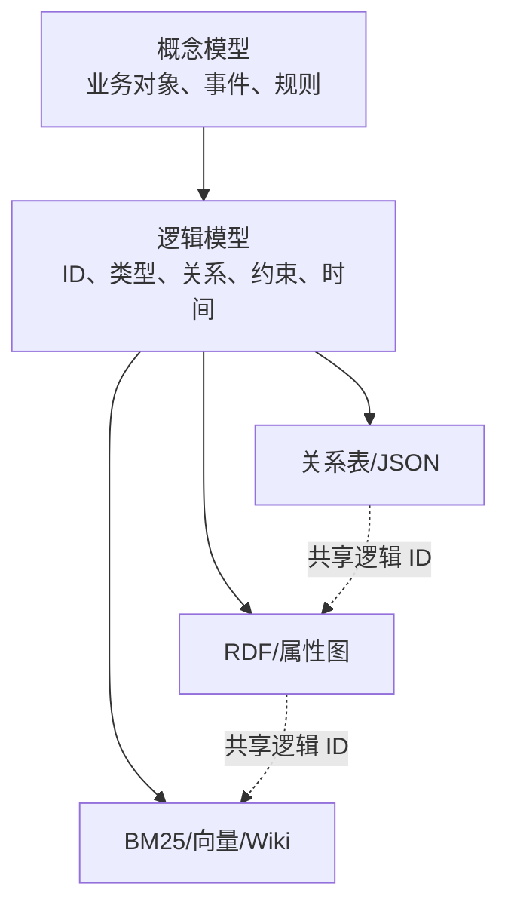
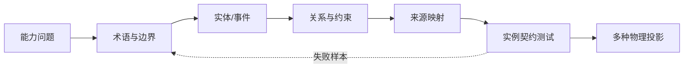
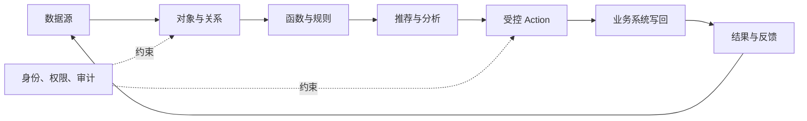

# 第 8 章 知识建模、本体与图谱：让系统听懂企业在说什么

> 本章要回答：怎样把员工口中的“客户、服务、负责人、依赖”等词，变成系统能够识别、查询和检查的模型？

文本索引擅长寻找内容相似的片段，却不天然知道退款服务调用哪个网关、某张表由哪条任务写入、一个团队拥有哪些系统，或者修改一个接口会沿哪些路径产生影响。只要问题中的核心动词变成“依赖、属于、调用、负责、影响、源自”，关系就不再是附属元数据，而应成为可查询对象。

图谱把对象表示成节点，把对象之间的关系表示成边。但在画图之前，企业必须先说清楚一件事：这些词到底是什么意思？“客户”是签合同的公司，还是实际使用产品的人？“负责人”是代码维护者、值班人员，还是预算审批人？知识建模就是把这些含义、边界和规则写清楚，让人和系统使用同一套说法。图谱只是保存和查询这套模型的一种办法。

因此，本章不从选图数据库开始，而从企业想回答的问题开始。我们会先分清词表、分类体系、数据 Schema、本体和知识图谱，再把业务语言逐步整理成概念模型、平台规则和实际存储。目标不是设计一套包罗万象的“终极本体”，而是让系统能稳定地查关系、解释结果、检查数据，并为智能体的行动提供约束。

## 8.1 从实体链接开始，而不是从图数据库开始

图谱建设最常见的倒置，是先采购图数据库，再问应该放什么。数据库解决的是存储与查询，不能替企业定义“什么是同一个对象”。真正的起点是实体身份。

Northstar 的“退款服务”可能在服务目录中叫 `refund-service`，在代码仓中叫 `payments/refund`，在运行手册中简称“退款”，在监控中使用标签 `svc_refund_v2`。若这些名称没有链接到同一个规范实体，图里会出现四个孤立节点；若简单按名称合并，又可能把退款业务流程与退款微服务错误合并。

实体解析通常结合稳定外部 ID、命名规则、上下文和人工映射。服务目录 ID、Git 仓库地址、数据库全限定名和组织账号是强锚点；名称相似和模型判断只能作为候选。每次合并和拆分都应保存决策依据，因为错误消歧会沿图查询放大。

规范实体并不要求所有系统改用同一名称。平台可以保留各来源的别名和源对象 ID，把它们映射到统一节点。这样既支持用户按熟悉名称搜索，也保留回到原系统的能力。

## 8.2 先分清词表、分类体系、Schema、本体与知识图谱

这些概念经常被混用，但它们解决的问题不同。词表统一术语和别名，例如“客户”“商户”和内部简称是否指向同一概念。分类体系（taxonomy）用上下位关系组织概念，例如把退款分成原路退款和线下退款。W3C 的 SKOS 把知识组织系统表示为概念方案，支持首选标签、别名以及 broader、narrower 等语义关系，适合管理主题词、标签和分类目录。[SKOS Reference](https://www.w3.org/TR/skos-reference/)

数据 Schema 约束一份数据“长什么样”：字段名称、类型、必填性、枚举和嵌套结构。它通常服务某个接口、数据库或消息，而不一定说明不同系统中的字段在业务上是否等价。本体则显式定义一个共同领域中的概念及其关系。OWL 2 将本体描述为由共同用户群体共享的形式化词汇，并通过术语之间的关系表达定义。[OWL 2 Overview](https://www.w3.org/TR/owl2-overview/) 本体不等于一棵分类树；它还可以表达属性、关系、互斥、基数和其他可推理语义。

知识图谱是具体的知识实例：规范实体、属性、关系、声明及其证据。RDF 用主语—谓词—宾语三元组表示图；属性图则通常允许节点和边直接携带属性。两者都是物理表达选择，不应反过来决定业务概念。[RDF 1.2 Concepts](https://www.w3.org/TR/rdf12-concepts/) 一个企业完全可以用 Markdown 管理术语、用 JSON Schema 校验接口、用关系数据库保存对象、用属性图执行遍历；只要它们遵守同一逻辑模型，就不必为了“语义化”全部迁移到 RDF。

最简单的区分方法是：词表规定“怎么叫”，分类体系规定“怎么分”，Schema 检查“一条数据长得对不对”，本体说明“这些概念是什么意思、彼此能有什么关系”，知识图谱则记录“现在具体有哪些对象和关系”。Wiki、向量索引和 BM25 不负责重新定义这些概念，而是用不同方式解释和查找它们。

## 8.3 企业架构与领域驱动设计提供现成词汇

企业知识建模不必从空白画布开始。企业架构（EA）长期使用结构化模型描述企业的目标、责任和构成。其元模型规定可以出现哪些架构元素以及它们如何关联，相当于架构描述的语言。MEAF 把企业架构分为业务、应用、数据和技术四类视图；其中业务架构又围绕业务、流程、组织、服务、领域和模式组织概念。[MEAF 元模型总览](https://web3d.github.io/meaf-book/Chapter2/2.5.html) [MEAF 业务架构元模型](https://web3d.github.io/meaf-book/Chapter3/3.1.html)

因此，企业已有的能力地图、流程模型、组织责任、应用组合、数据对象和技术标准，是概念模型的首批候选，而不是需要重新抽取的一堆普通文档。它们可以提供稳定术语和预期关系，也可以暴露企业希望达到的目标状态。但这些资产并非天然完整或新鲜：架构声明进入知识图谱时应标为 `asserted`，绑定负责人、版本、适用范围和有效时间，并与代码、配置和运行观察核对。

领域驱动设计（Domain-Driven Design，DDD）则提供了处理业务语言边界的实践。限界上下文（Bounded Context）是某套模型和词义成立的明确边界；统一语言（Ubiquitous Language）是领域专家与开发团队在该边界内共同使用并持续校验的语言。[Evans，2003](https://www.pearson.com/en-gb/subject-catalog/p/domain-driven-design-tackling-complexity-in-the-heart-of-software/P200000009375/9780321125217) [Fowler：Bounded Context](https://martinfowler.com/bliki/BoundedContext.html) 同一个“客户”在销售、客服和财务上下文中可以拥有不同结构。平台应保存各上下文的命名空间和显式映射，不应追求一个消灭差异的全局词典。

状态变化还可以建成领域事件：例如 `OrderCancelled` 表达业务已经发生的事实，而不是一个待执行命令。事件连接触发者、时间、规则、数据对象与下游消费者，使知识库能够回答“发生了什么、为什么发生、谁受到影响”。第 8.6 节会把事件纳入从业务语言到可执行模型的步骤。

业务流程同样需要结构，而不能只保存成一段说明。MEAF 的一种分解方式是“阶段—活动—任务—步骤”，并在相应层级关联角色、业务对象和规则。企业上下文平台不必照搬某个框架的完整元模型，但可把这条层级作为 `BusinessProcess`、`Activity`、`Task`、`Step` 与 `BusinessRule` 的起始 Schema。智能体通常在任务或步骤层规划和调用工具；阶段与活动层则提供目标、责任和上下游约束。第 17 章的任务状态机描述一次 Agent 执行的控制状态，不能替代企业业务流程，两者通过任务所实现的流程节点连接。

这里有两组术语必须消歧。MEAF 的“业务身份”用于区分业务线路由或场景，不是本书用于鉴权的用户身份与主体；其架构模式中的“上下文”指某个问题的背景和约束，也不是本书所定义的完整企业上下文。接入外部元模型时，应保留来源命名空间，不能因为中文名称相同就合并对象。

## 8.4 先讲业务，再定规则，最后才选存储



概念模型是写给业务专家看的。它只描述业务中有哪些对象、事件和规则，例如“客户发起退款请求，退款服务负责处理，并且要遵守当时有效的政策”。这一层暂时不谈表名、向量维度或图数据库标签，只检查业务说法是否准确，概念边界是否清楚。

逻辑模型把这些业务说法改写成平台能够执行和检查的规则。它规定对象怎样编号、有哪些类型、关系从谁指向谁、一个对象最多能关联多少对象，以及状态、时间、来源和权限怎样记录。比如“团队负责服务”太含糊，必须拆成“维护代码”“承担值班”或“承担业务责任”。逻辑模型还要注明一条关系是来自权威系统、由程序推导，还是仍需人工确认。

物理模型才决定这些内容具体存在哪里：关系表、JSON 文档、RDF 三元组、属性图、搜索字段、向量元数据，或者 Wiki 的 frontmatter。这里的“投影”，就是针对某种用途生成一份专用视图。同一个服务可以同时出现在图、搜索索引和 Wiki 中；这些视图共用同一个逻辑 ID 和版本，但各自为遍历关系、搜索或阅读做优化。三层分开后，更换图数据库或嵌入模型时，企业对“服务”和“负责人”的定义不必跟着重写。

第 11 章还会介绍“统一对象模型”。可以把它理解成每份知识都要携带的统一身份证和管理信息：ID、版本、时间、来源、权限与血缘。本章的领域模型则说明这张身份证对应的对象在业务中意味着什么。一个负责跨系统管理，一个负责解释业务含义，不能互相替代。

## 8.5 不要试图一次建完整：先看系统必须回答什么

本体规定系统认识哪些对象、允许哪些关系，以及数据必须遵守哪些约束。它很容易越建越大：组织、人员、流程、系统、数据、代码、客户、产品、事件和政策，每一项都还能继续细分。控制范围的办法，是先写出一组能力问题（competency questions）。它们不是口号，而是模型建好后必须真正答得出来的验收题，例如：“某个 API 字段变化会影响哪些服务、团队、Runbook 和政策？”只建立回答这些问题所必需的类型和关系。

若首要任务是变更影响分析，可以从 `Service`、`Repository`、`API`、`Table`、`Team` 与 `Runbook` 开始，关系只需要 `CALLS`、`IMPLEMENTS`、`READS`、`WRITES`、`ON_CALL_FOR`、`MAINTAINS` 和 `DOCUMENTED_BY`。若任务是客户支持，还需加入产品、政策、地区和工单。每增加一种边，都要回答它如何产生、如何更新以及能支持什么查询。

关系方向与语义必须明确。`A DEPENDS_ON B` 不等于 `B CALLS A`；“团队拥有系统”也可能表示预算责任、代码维护或值班责任。模糊的 `RELATED_TO` 容易建，却几乎无法支持确定推理。允许它作为探索边存在，但不应替代具体关系。

建模时至少检查六类要素：实体及其身份边界；事件与状态变化；关系的方向和基数；时间与适用条件；来源、证据和不确定性；权限与敏感级别。事件尤其容易被遗漏。若只保存“订单状态为已退款”，系统无法可靠回答由谁、何时、依据什么政策完成退款，也无法重建事故当时的事实。

本体应可演化。使用版本化 Schema、迁移规则和兼容查询，比试图一次设计永久模型更现实。企业结构变化时，历史边仍需按原语义解释，因此边要同时保存本体版本和有效时间。

## 8.6 一步步把业务语言变成可检查的模型



一次能落地的建模工作，可以按下面的顺序进行：

1. 先收集最有价值的问题、决策和行动，不要一上来罗列所有数据源。
2. 请业务专家、系统负责人和平台团队一起整理术语，记下同义词、歧义和反例。
3. 找出真正拥有独立身份和生命周期的对象，并把重要的状态变化建成领域事件。不要看到一个名词就建一个节点。这里可以借用第 8.3 节的 DDD 方法，但不要求整个平台采用 DDD 的全部设计模式。
4. 给每一种关系写清契约：两端各是什么类型、方向和数量限制是什么、关系来自哪里、怎样更新、何时有效、允许什么证据，并给出一个正确例子和一个错误例子。
5. 把真实数据源映射到逻辑模型，说明源字段怎样生成规范 ID、缺失值怎样处理、冲突由谁裁决。
6. 把能力问题写成验收查询，同时准备“应该返回”和“不应该返回”的样本。
7. 最后再选数据库和索引。数据进入平台时，同时检查结构、业务含义和引用是否有效。

如果采用 RDF，SHACL 可以描述节点类型、属性路径和数量限制，并生成验证报告。若使用属性图或 JSON，也可以用 Schema 和自定义规则建立同样的质量门。[SHACL Recommendation](https://www.w3.org/TR/shacl/)

建模产物不应只有一张图。最小交付包应包括术语表、概念图、类型与关系目录、约束、源映射、样例实例、能力问题与验收查询、版本变更记录以及负责人。缺少源映射，模型无法摄取；缺少验收查询，模型无法证明有用；缺少负责人，语义冲突最终会退化为平台团队猜测。

模型必须约束实例，而不是只校验自己的 JSON 是否语法正确。Northstar 的契约测试逐条读取领域模型、知识对象和关系边，验证：每种实例边已经声明；主客体的 `entity_type` 与关系契约一致；`evidence_tier`（证据等级，定义见 §8.9）属于允许等级；地区和有效时间约束成立；每个能力问题所需的类型和关系能形成连通回答子图。否则“能力问题存在于模型文件中”并不意味着交付数据真的能回答它。

## 8.7 RDF、OWL、SHACL 与属性图如何取舍

RDF 提供可交换的图数据模型和基于 IRI 的全局标识，适合跨组织数据链接、标准词汇复用和语义互操作。OWL 在其上增加更强的类、属性和逻辑公理，适合确实需要形式推理的领域。SHACL 侧重验证图是否符合形状约束。三者职责不同：OWL 中可以推导为真的知识，不等于 SHACL 意义上输入数据必须满足的校验规则。

属性图通常更贴近工程团队熟悉的节点、边和属性模型，遍历及路径查询也很直观。关系数据库在事务、约束和常规报表上依然成熟；文档数据库适合变化较快的聚合对象。选择标准不应是“哪种最像知识”，而应是查询模式、互操作需求、推理强度、团队能力、延迟和运维成本。

多数企业平台可以从轻量逻辑模型、Schema 校验和属性图或关系表开始，仅在需要跨域词汇交换、标准本体复用或可证明推理时引入 RDF/OWL。反过来，已经有语义网基础的组织也不应跳过来源、权限、时间和评测。形式语言提高表达精度，不会自动保证数据正确或知识新鲜。

## 8.8 同一个对象，可以有多种查法和看法

领域模型不应只为图数据库服务。它要像一张总装配图，告诉各条知识生产链怎样处理同一个对象：类型和别名写入 BM25 字段，实体描述和同义词用于生成向量，对象关系进入图，页面模板按实体类型生成 Wiki，工具的参数和返回值也使用同一个逻辑 ID。无论从哪条通道找到结果，最终都能回到带版本的原始来源。

这样，各种检索方式才不会各说各话。用户搜索“退款网关”时，词表先把别名对应到规范的 `Service`；图找出调用者和负责人；Wiki 给出机制说明；BM25 命中精确的 API 名称；向量检索补充说法不同但含义相近的政策。上下文组装器最后合并的是同一对象的几种视图，而不是五套互不相干的搜索结果。

模型也不能强迫所有来源失去原生结构。代码仍保留 AST、符号和构建配置；数据系统仍保留表、列和血缘；政策仍保留条款与适用范围。统一发生在身份、语义和跨域关系层，而不是把所有东西压成一个万能节点类型。

## 8.9 一条关系能不能用于决策，要看证据从哪里来

并非所有边都同样可信。编译器产生的函数调用、数据库外键和包管理器依赖通常具有确定性；从配置或命名规则解析的关系可能已解析但受规则覆盖限制；名称匹配属于启发式；模型从自然语言抽取的关系则是推断。

可以使用一个简单的证据等级：

- `deterministic`：编译器、协议或权威系统直接给出；
- `resolved`：由确定规则解析并通过唯一性检查；
- `asserted`：由有权限的人或规范文档明确声明；
- `observed`：由运行追踪或实时系统在特定时间窗口观察到；
- `heuristic`：名称、路径或统计模式推测；
- `inferred`：模型从非结构化内容归纳。

这些等级不是简单的“可信度分数”。编译器确认的调用关系可能只适用于某种构建配置，人工确认的关系也可能已经过期。因此，每条边还要记录证据 URI、源版本、解析器版本、有效时间和可见范围。系统再根据任务风险决定使用哪些证据：探索性搜索可以展示模型推断的关系，高风险变更审批则只接受程序确定或人工确认的关系。

同一关系可以有多份证据。源码和运行追踪都显示 A 调用 B 时，图应保留两个证据，而不是只提高一个不透明分数。证据冲突也应保留，例如静态代码存在调用但生产追踪从未观察到，二者分别描述“可能路径”和“已观察路径”。

## 8.10 GraphRAG：图既能检索关系，也能组织主题

GraphRAG 把图与生成式检索结合。Microsoft 的 GraphRAG 流水线从非结构化文本抽取实体、关系和声明，对图进行社区检测，再为社区生成摘要；查询时，局部搜索围绕具体实体展开，全局搜索利用社区报告回答整个语料库的主题问题。[GraphRAG 文档](https://microsoft.github.io/graphrag/) [论文预印本](https://arxiv.org/abs/2404.16130)

这种方法补足了向量检索的一个弱点：回答“这个资料库整体在讨论什么”时，证据通常散落在许多片段里，单独看任何一段都不像完整答案。GraphRAG 会先把联系紧密的实体分组，再为每组生成一份主题摘要，查询时可以直接使用这些摘要。但这些摘要是系统加工出来的知识，分组方法和摘要内容都可能变化，所以仍要记录来源、生成版本并持续评测。

企业图不必完全从文本抽取。更稳妥的顺序是先接入服务目录、代码索引、数据库元数据和组织系统等确定结构，再让模型补充文档中的概念关系和关键声明。这样构建的图具有“确定性骨架 + 推断性语义”，比纯粹从所有文本生成一张图更容易治理。

## 8.11 代码图不止是调用图

代码仓知识库常把每个仓建成一个子图，再通过包依赖、API、消息主题、构建产物和部署关系连接。仓内节点包括文件、符号、类型、测试和配置；仓间节点则通过稳定标识关联。Tree-sitter 能跨语言恢复语法结构，SCIP 或语言编译器索引能提供定义与引用，构建系统和包管理器补充实际依赖。

调用图只是其中一层。静态调用可能受动态分派、反射、宏和条件编译影响；运行追踪只能覆盖实际执行过的路径。图应区分静态可能关系、解析后关系与运行观察关系。对大型仓库，还需把提交、作者、评审、事故和文档连接进来，才能回答“这段代码为何存在”“谁熟悉它”“最近修改是否与事故相关”。

社区中的代码图尝试大致分为三类：从代码提取结构关系，把变更、评审意见和影响路径组织为图，以及自动探索仓库并生成理解产物。它们不是一套公认协议。架构设计应拆解其能力：解析器、符号索引、图模式、摘要生成、检索 API 与可视化，而不是把项目名称当作标准组件。

## 8.12 图检索必须受约束

图最诱人的操作是从一个节点向外扩展，但真实企业图具有大量枢纽节点。一个共享身份服务可能连接数百系统，两跳扩展就会返回几乎全公司。查询必须限制边类型、方向、跳数、时间、证据等级和最大节点数。

路径也不等于因果。A 依赖 B、B 依赖 C，只能说明存在结构路径，不能自动断言修改 C 一定影响 A。影响分析需要结合边语义、接口变更、版本与运行证据。回答中应区分“直接依赖”“潜在传递影响”和“已观察影响”。

权限过滤要在遍历过程中执行。如果用户无权看到中间节点，系统不能先遍历完整路径再隐藏名称，因为路径形状本身可能泄露敏感信息。某些场景允许返回“存在受限依赖”，另一些场景则必须像该路径不存在一样；这属于安全策略，不应交给模型临时决定。

图查询结果通常仍需与文本结合。图负责找到相关实体和路径，文本索引负责取回解释与证据，Wiki 提供高层摘要，源码或业务工具负责最终核验。所谓图检索不是用图替换所有检索，而是让关系成为候选生成和上下文组装的一条通道。

## 8.13 图的增量维护与时间语义

企业图每天都在变化。全量重建会丢失历史身份并制造无意义抖动；只追加又会让已经删除的依赖永久存在。摄取流程应对节点和边执行版本化 upsert，以来源对象和解析器版本判断新增、修改与撤销。

边至少需要 `valid_from`、`valid_to` 和 `observed_at`。查询“当前依赖”只选有效边；事故复盘则按当时版本恢复图。对于运行观察边，还可记录首次、最近观察时间和样本窗口。时间图能避免用今天的架构解释半年前的故障。

派生关系也需要失效。当代码符号删除时，调用边撤销，仓库摘要和跨仓影响页面随之标记过期。图因而不仅服务查询，也成为知识编译系统的依赖基础。

## 8.14 Northstar：从能力问题到领域模型

Northstar 从一个具体能力问题开始：“退款网关接口变化时，需要通知哪些团队并更新哪些材料？”当前可执行模型包含服务、仓库、API、团队、Runbook、政策、退款事件、事件契约、代码符号、测试、ADR 和事故。退款申请被建成事件，事件契约被建成另一类对象，政策具有适用地区与有效时间；队列深度则保留为第 17 章按 TTL 读取的运行观察，而不是为了“万物皆节点”塞进长期知识图。

逻辑关系目录为每条边规定契约。例如 `IMPLEMENTS(Repository, API)` 必须来自代码索引或显式映射；`CALLS(Service, API)` 可来自企业架构声明、编译级索引、网关配置或运行追踪，但查询结果显示来源差异；Northstar 最小模型用 `ON_CALL_FOR(Team, Service)` 表达值班责任，避免使用含义不清的 `OWNS`。更完整的生产模型可以另行声明 `MAINTAINS(Team, Repository)`，但它不属于本案例机器契约所列的八种最小关系。`GOVERNED_BY(RefundEvent, Policy)` 必须同时检查政策适用地区和事件发生时间。

配套案例不再把领域模型作为一份不可解释的预制 JSON。`examples/enterprise-case/data/modeling/` 分别保存能力问题、术语表、概念模型和源映射；`src/build_domain_model.py` 将它们编译为 `generated/domain-model.json`，再以真实知识对象和关系边生成验证报告。这样读者既能审阅建模过程，也能得到 Agent 运行时使用的单一可执行契约。核心关系契约如下：

```json
{
  "relation": "CALLS",
  "from": "Service",
  "to": "API",
  "cardinality": "many_to_many",
  "allowedEvidence": ["deterministic", "resolved", "asserted", "observed"],
  "temporal": true,
  "inverse": "CALLED_BY"
}
```

一次接口字段变更触发查询。系统先定位 API 版本，再沿 `IMPLEMENTS` 找到仓库，沿反向 `CALLS` 找到调用服务，沿反向 `ON_CALL_FOR` 找到值班团队，沿 `DOCUMENTED_BY` 找到需要复核的手册。每条路径显示边来源和版本。一个仅由名称匹配得到的潜在消费者被列入“待确认”，不会与编译器确认的调用者混在一起。

这个结果随后成为上下文包的一部分，由智能体生成变更清单，但真正创建工单或发送通知仍需工具权限和人工确认。图谱缩小了影响范围，没有越过行动治理边界。

## 8.15 Palantir Ontology：把本体推进到运营层

Palantir 对 Ontology（本体）的产品化实践，是本书企业上下文方法的重要参照。它与本章的共同点是：都不把企业知识理解成一堆文本，而是用稳定身份、对象类型、关系、来源、权限和时间来组织业务语义；它的进一步之处在于，把业务逻辑、可提交的动作和应用接口也纳入同一套运营模型。Palantir 官方将这组能力概括为数据、逻辑、动作和安全的结合。[Palantir Ontology 概览](https://palantir.com/docs/foundry/ontology/overview/) [Ontology system](https://www.palantir.com/docs/foundry/architecture-center/ontology-system)

### 8.15.1 四层构件

可以用四层理解 Palantir 的运营本体，而不必把它误解为一个特定图数据库：

| 构件 | 解决的问题 | 与本书概念的对应 |
|---|---|---|
| Object Type | 企业里有哪些可识别的业务对象？ | 领域模型中的实体类型与统一对象 |
| Property | 对象有哪些属性、状态和时间字段？ | 知识对象内容、状态与双时间 |
| Link Type | 对象怎样关联、基数是什么？ | 关系图中的有向、带证据边 |
| Action / Function | 谁能以什么参数改变哪些对象？ | 工具、工作流、预览、批准与验证 |

因此，`Order` 不只是 ERP 中的一行；它可以拥有客户承诺、产品、工厂和运输关系，并暴露“重新分配”“拆分”或“批准加急”等受控操作。`Function` 负责跨对象计算和业务规则，`Action` 负责把经过授权的业务意图提交为状态变化。只有对象和链接时，它更接近语义层或知识图谱；把动作、提交条件和审计纳入后，才接近可运营的企业上下文层。[Object types](https://palantir.com/docs/foundry/object-types/overview/) [Actions](https://palantir.com/docs/foundry/action-types/overview/)

这里的“本体”采用 Palantir 的产品语境，不等同于 OWL 本体。OWL 关注形式化类、公理和推理；Palantir Ontology 更关注一个组织如何把数据映射成可使用、可授权、可执行的业务对象。二者可以互补：OWL/SHACL 适合跨组织语义交换和约束验证，运营本体还必须补上数据刷新、动作写回、责任人和运行反馈。

### 8.15.2 从一个真实决策反推对象与动作

Palantir 案例最值得借鉴的地方，不是先建立一份覆盖全公司的名词表，而是从一个需要改善的真实决策开始，例如“某工厂产能下降时，哪些订单应该改派”。建模团队随后回答七个具体问题：谁来决定？他需要哪些事实？哪些对象有自己的身份和生命周期？哪些关系决定影响范围？系统用什么规则生成候选方案？哪些变化允许写回业务系统？最后由谁批准和执行？

这和本书的能力问题是一致的，只是又向前走了一步：系统不仅要“找到受影响订单”，还要在当前状态和权限下，给出一个能解释、能审批、执行后能验证的动作。为此，`Recommendation`（系统建议）和 `Decision`（人的决定）通常应该成为独立对象，而不是直接改写 `Order.status`。前者保存候选方案及其依据，后者记录谁在何时做了什么决定、理由是什么，并留下审计记录。

### 8.15.3 对企业上下文平台的启示

Palantir 的方法可以抽象为一条平台能力链：



本书的实现不依赖 Palantir，也不要求购买同类平台。Northstar 中的领域模型、知识对象、图/Wiki 投影、Context Package 和受控动作，分别实现了这条链的不同部分。重要的架构原则是：对象模型要独立于物理索引，动作要独立于模型生成，写回要独立验证；否则平台只是把供应商的界面术语换成自己的界面术语。

Palantir 的优势在于把这条链作为一套一体化产品交付，代价是对象、函数、动作、权限和应用配置会形成较强的平台耦合。企业评估时应要求导出对象定义、关系、函数、动作、权限、血缘和历史版本，并验证在平台外是否仍能解释关键决策。厂商案例中的效率或节省数字属于特定客户和部署范围，不能直接推导为一般 ROI。

### 8.15.4 一个最小示例

以 Northstar 的退款场景为例，Palantir 风格的运营本体可以这样映射：`RefundEvent`、`Service`、`API` 是长期对象；`Service CALLS API`、`EventSchema CONSUMED_BY CodeSymbol` 是链接；队列则在本教学模型中保留为带 TTL 的运行资源，队列深度是一次观察，而不是长期本体对象。“队列深度是否超过阈值”和“重放后是否下降”是函数或验证规则；`prepare_replay`、`confirm_replay`、`execute_replay` 是不同权限和状态下的动作。若生产系统确实需要跨任务引用队列身份、生命周期和关系，再把 `Queue` 提升为领域对象，而不是为了对齐产品术语预先加入。

这个映射并没有取代本书已有设计，而是帮助读者看见两种语言的对应关系：第 8 章的领域模型规定对象和关系意味着什么，第 15—16 章将它们编译成可检索和可导航视图，第 17 章把允许的变化编译成带身份、批准、幂等和验证的行动闭环。

## 8.16 模型治理：语义也需要发布流程

领域模型不是画完就归档的设计稿。每个类型和关系都要有业务负责人和技术维护者。修改模型时，要提交变更说明、样例、兼容性分析、验收查询和迁移计划，再发布新版本。增加一个可选属性通常不影响旧数据；拆分实体、改变关系方向或重新定义“谁负责什么”，却可能让已有查询得出不同结果，因此必须提供新旧映射，并给使用方留出迁移时间。

治理还要监控实例质量：无法解析到规范实体的比例、错误合并率、违反约束的对象数、无证据边比例、过期关系、各能力问题的准确率，以及模型版本间结果漂移。模型规模不是成功指标；能够用更少、更清晰的概念稳定回答关键问题，通常比拥有数千种关系更有价值。

当不同部门对同一术语有真实分歧时，不应强行选一个“全公司定义”。可以按第 8.3 节的限界上下文保留命名空间，例如财务的 `CustomerAccount` 与支持部门的 `SupportContact`，再显式定义映射条件。统一语义不等于消灭领域差异，而是让差异可见、可查询、可治理。

## 本章小结

知识建模要解决的核心问题，是企业怎样把自己的业务说清楚，并让系统按同样的含义处理数据。图谱只是保存和查询这些对象与关系的一种方式。正确的建设顺序是：先写出系统必须回答的问题，再统一术语和边界，建立概念模型和平台规则，映射真实数据源并编写验收查询，最后才选择数据库。词表、taxonomy、Schema、本体和知识图谱各有任务；RDF、OWL、SHACL、属性图和关系表也没有适合所有企业的唯一答案。

模型落地后，系统会把对象身份和关系正式保存下来，用它们查询依赖、血缘、责任和影响范围。结构化来源提供较可靠的骨架，模型推断补充难以直接提取的含义；不同证据等级只能用于相应风险的任务。图检索还必须限制权限、时间、边类型和结果规模，并与文本、Wiki 和原始来源一起组成证据链。领域模型本身要像 API 一样有版本、有测试、有负责人，让 Wiki、关键词、向量、图和智能体工具对同一个对象使用同一种含义。

## 延伸阅读

- Palantir, [Ontology 概览](https://palantir.com/docs/foundry/ontology/overview/)。
- Palantir, [Ontology system](https://www.palantir.com/docs/foundry/architecture-center/ontology-system)。
- Palantir, [Object types](https://palantir.com/docs/foundry/object-types/overview/)。
- Palantir, [Action types](https://palantir.com/docs/foundry/action-types/overview/)。
- Darren Edge et al., [From Local to Global: A Graph RAG Approach to Query-Focused Summarization](https://arxiv.org/abs/2404.16130), 2024。
- Microsoft Research, [GraphRAG documentation](https://microsoft.github.io/graphrag/)。
- Aidan Hogan et al., [Knowledge Graphs](https://arxiv.org/abs/2003.02320), 2020。
- W3C, [SKOS Simple Knowledge Organization System Reference](https://www.w3.org/TR/skos-reference/), 2009。
- W3C, [OWL 2 Web Ontology Language Document Overview](https://www.w3.org/TR/owl2-overview/), 2012。
- W3C, [Shapes Constraint Language (SHACL)](https://www.w3.org/TR/shacl/), 2017。
- W3C, [RDF 1.2 Concepts and Abstract Data Model](https://www.w3.org/TR/rdf12-concepts/), Candidate Recommendation Snapshot, 2026。
- Tree-sitter, [Incremental parsing system](https://tree-sitter.github.io/tree-sitter/)。
- SCIP contributors, [SCIP code indexing protocol](https://github.com/scip-code/scip)。
- Eric Evans, [Domain-Driven Design](https://www.pearson.com/en-gb/subject-catalog/p/domain-driven-design-tackling-complexity-in-the-heart-of-software/P200000009375/9780321125217), 2003。
- Thoughtworks, [现代企业架构框架（MEAF）V4 学习镜像](https://web3d.github.io/meaf-book/)；镜像标注版权归 Thoughtworks。
