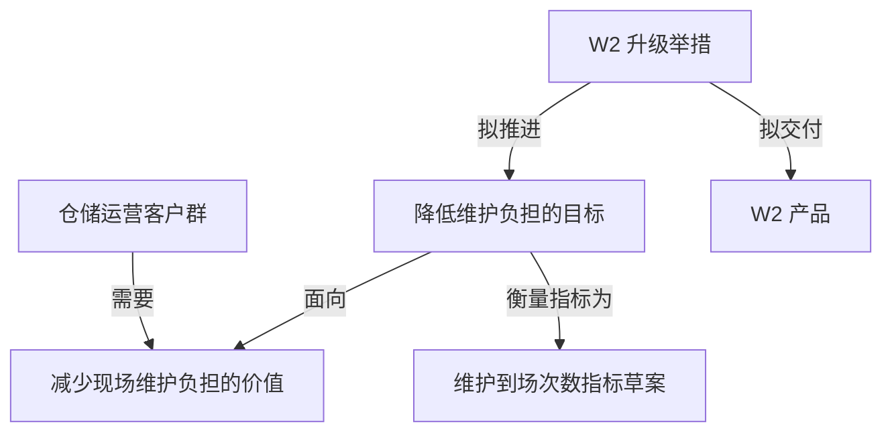
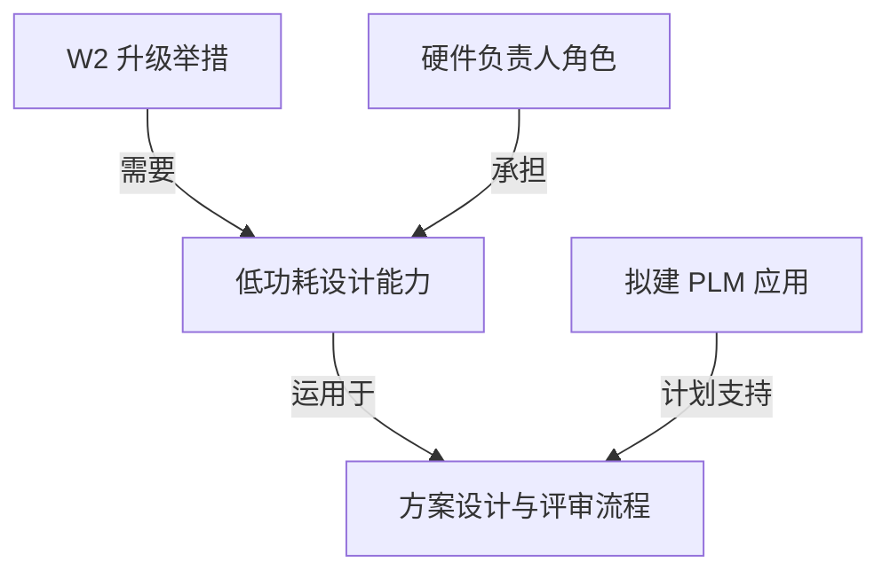
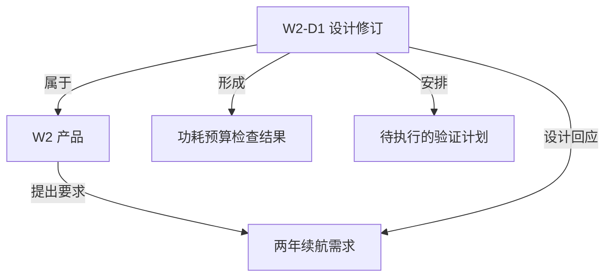

# 第 8 章 知识建模与本体：把业务说法变成可检查的约定

> 本章要回答：怎样把企业的客户价值、战略、能力、组织和系统连成可查证的模型，再展开具体业务的对象、规则与动作？

前面几章解决了资料怎样保留、查找和整理成阅读视图。要让这些能力共同服务企业，还需要把企业里的含义说清楚：一款产品为谁创造价值，一个目标靠哪些能力实现，哪个团队负责，哪些系统提供依据。进入具体业务后，还要说明什么算同一个客户、退款申请和退款事件有什么区别、一次状态变化需要满足什么条件。知识建模把这些约定及其联系写下来，使不同系统和使用者能够按一致的含义处理材料。

本体是其中一种表达方式，用明确的概念、属性、关系和约束描述一个领域。形式化本体语言还可以支持推理。实际企业系统常在这套语义上继续定义状态、计算规则和操作契约，让业务含义与可执行能力相接；执行仍由工作流和业务系统负责。OWL 2 规定的是类、属性、个体、公理及其语义，不能单独完成业务授权或外部写入。[OWL 2 概览](https://www.w3.org/TR/owl2-overview/)

本章先围绕任务建立企业整体的基本联系，再展开具体领域的对象与规则，最后映射来源、验证和维护。W2 软硬件协同设计用来串起企业目标与工程工作，退款处理用来说明业务状态和动作。表达语言、数据库及建模工具放在方法之后选择。

## 8.1 先确定要支持的判断和行动

建模的起点是一项需要改善的工作。W2 团队需要知道：这款产品解决谁的什么困难，为什么提出两年续航，哪些角色负责设计和验证，以及怎样判断产品确实减少了客户的维护负担。退款团队关心的则是申请属于哪笔订单、采用哪版政策、由谁批准、执行后怎样确认结果。把模型需要回答的问题写成可以验收的句子，就是能力问题（competency questions）。这里的“能力”指模型能否回答问题；后文的“业务能力”指企业能做什么。

能力问题同时限定范围和证据要求。“找到负责人”应进一步说明是业务审批人、代码维护者还是值班人员；“可以退款”应说明地区、订单阶段、金额口径和授权条件。每个问题要有一个应当成立的例子和一个不应成立的例子，例如同样的申请在政策生效日前后可能得到不同判断。

企业级任务采用相同方法。分析半年销售变化时，对象会包含战略目标、业务单元、产品、渠道、指标和数据产品，验收条件则包括口径确认、期间可比和分解对账。能力问题让建模从当前任务开始，同时保留连接企业整体的路径。

开始时可以建立一张工作表：问题、使用者、需要的事实、可能的决定、允许的动作、成功条件、缺少的材料。业务负责人确认问题是否值得解决，系统负责人说明数据是否存在，建模人员负责把两者接起来。

## 8.2 从业务材料中提取约定

材料可以来自客户研究、经营计划、组织责任表、应用目录，也可以来自政策、业务流程、系统字段、真实工单和访谈。第四章负责把这些材料保存为可引用的依据，这里负责解释它们说的是什么。先保留原话及出处，再把一句话拆成可核查的约定。比如“老客户的小额退款可以快速处理”，至少有三个待确认项：老客户怎样定义，小额采用什么币种和阈值，快速处理是否仍需批准。没有依据时，先记录问题与确认责任人。

沿一次实际业务过程逐步核对，通常比只请专家列术语更有效。每一步问清谁处理、读取什么、产生什么、根据什么判断，以及异常时交给谁。把规范要求、系统实际行为、个人经验和改进建议分别记录，后续再由相应负责人裁决差异。

已有企业架构资料能够提供起点。TOGAF 的系列指南分别讨论商业模式、业务能力、价值流、组织映射和信息映射，可以用来检查需要收集哪些约定，以及如何组织它们。MEAF 用元模型和不同架构视图描述企业，其业务架构部分把战略、能力、组织、服务和流程联系起来。本书借用这些建模思路，为任务建立可查询的关系；具体对象和实例仍由本企业的材料确认。[TOGAF 系列指南](https://www.opengroup.org/togaf/series-guides) [MEAF 元模型（学习镜像）](https://web3d.github.io/meaf-book/Chapter2/2.5.html) [MEAF 业务架构](https://web3d.github.io/meaf-book/Chapter3/3.1.html)

架构资料中还要区分现状、目标和迁移安排。例如“由产品系统统一管理需求”可能是一项建设计划，不能据此认定系统已经上线。领域驱动设计中的统一语言与限界上下文则帮助保留各业务域自己的词义。财务的客户账户与客服的联系人可以有关联，但不必强行合成一个实体。[限界上下文](https://martinfowler.com/bliki/BoundedContext.html)

这一步交付的是带来源的术语、规则和疑问清单。模型可以帮助提出初稿、查找同义词和疑似冲突，业务人员负责确认含义，实际样本负责检验描述是否适用。

## 8.3 建立企业整体的基本联系

第一章的六个方面在建模时各有要回答的问题。先为当前任务建立一个小而连贯的企业模型：知道服务谁、想达到什么结果、依靠什么能力、由谁负责，以及到哪里查实际情况。下表是一组起步用的建模项，可以按企业已有术语调整。

| 内容范围 | 首先回答的问题 | 基本对象与关系 | 核对依据 |
|---|---|---|---|
| 外部环境与商业模式 | 为谁创造什么价值，收入和成本怎样形成，受什么限制 | 客户群需要价值；产品提供价值；渠道和伙伴参与交付；外部条件约束产品或业务 | 客户研究、商业计划、合同、市场与适用规则资料 |
| 战略意图 | 希望改变什么，优先投入哪里，怎样判断进展 | 目标用指标衡量；举措推进目标；举措需要资源与能力 | 战略与经营计划、预算及决策记录 |
| 业务能力与价值流 | 企业需要能做什么，怎样共同交付客户价值 | 价值流阶段需要能力；流程落实工作；能力由组织、流程和系统支撑 | 能力地图、业务设计、流程及交付记录 |
| 经营与组织 | 谁承担结果，谁执行，谁可以作决定 | 业务单元承担目标；角色负责能力或流程；任职记录连接人员与角色 | 组织与岗位文件、责任表、授权及任职记录 |
| 应用与数据 | 工作靠哪些系统，判断依据从哪里来 | 应用支持流程；数据产品提供指标所需数据；数据记录关联业务对象 | 应用目录、数据目录、指标定义、接口及血缘记录 |
| 业务运行 | 实际发生了什么，与目标和规则相符吗 | 实例遵循流程；事件改变状态；观察关联对象、时间和环境 | 订单、工单、日志、测试及经营观测 |

这些对象通过有明确含义的关系相接。同一个产品会同时涉及客户价值、战略举措、负责团队、设计资料和售后记录。无需为每个方面复制一份产品；保留统一身份，再从不同问题出发查看它。

### 8.3.1 从客户价值找到商业依据

商业模式先说明企业怎样提供价值并获得收入。建模时，可以从“哪类客户遇到什么问题”开始，连接提供价值的产品或服务、到达客户的渠道、参与交付的伙伴，以及收入和成本项目。外部环境则补充可能改变这些安排的市场条件、竞争变化和适用约束。每项外部判断都需要来源、日期和适用范围；市场预测应保留假设，法规适用性需要由相应责任人确认。

W2 的教学企业澄川设备向仓储运营团队出售监测设备，希望让已有监测点位更容易维护。减少电池更换和沿用安装位置，是对这项客户价值的产品设计回应。但客户是否愿意付费、到场维护究竟花费多少，仍需要调查。产品要求可以先作为明确的设计输入使用，商业判断则保留待验证状态。相关设定统一保存在 [W2 企业背景](https://github.com/LENSHOOD/enterprise-context-book/blob/main/examples/hardware-design/enterprise-brief.md)，并非真实客户研究。

商业模型还需要防止口径混淆。W2 的80元是单台材料预算，尚未计入研发、试验、认证、渠道和售后等成本。它可以约束设计，不能直接回答产品是否盈利。模型应让“材料成本”“完整成本”“售价”和“客户使用成本”各有定义，再记录它们可以怎样用于计算。

### 8.3.2 把目标、举措和实际表现分开

目标表达希望发生的变化，指标规定怎样衡量，举措说明准备做什么。例如，“降低监测点位的维护负担”是目标，“开发兼容已有安装方式的 W2”是拟采取的举措。举措需要负责人、阶段、资源和依赖；没有预算或批准记录时，应明确还处在提议或探索阶段。

指标至少需要名称、单位、计算方法、对象范围、时间范围和数据来源。指标的目标值、预测值和实际观测分别记录：目标值来自经营决策，预测值来自假设与计算，实际值来自观测及其汇总。三者可能使用同一个指标定义，却不能互相替代。销售分析中，也要先确定是在比较两个实际期间，还是在比较实际与目标。

W2 可以提出“每100个点位每年的电池维护到场次数”作为候选指标。计数是否包括计划维护和故障维护、覆盖哪些客户、目标期间和改善幅度，都尚待确认。因此模型中可以存在指标草案，但不能生成一项已经达成的经营结果。两年续航是一项产品要求，预算计算只是它的部分依据；客户维护负担还受故障、安装条件和服务方式影响。

战略中常有需要取舍的目标。降低材料成本和减少维护次数可能要求不同的器件方案。应保留谁决定优先级、在哪个阶段适用、接受什么代价，以及依据是什么。决策记录连接目标、候选方案和决定，后续任务才能理解某个较贵方案为什么仍被选中。

### 8.3.3 分清业务能力、价值流和流程

业务能力描述企业能做什么，例如低功耗设计、产品验证和供应保障。价值流从受益者的需要出发，描述价值怎样逐步形成并交付。流程进一步说明一项工作由谁按什么顺序处理。能力通常比具体流程稳定：更换审批工具会改变操作方式，但企业仍然需要产品验证能力。[The Open Group：客户价值、能力与流程的联系](https://blog.opengroup.org/2021/01/28/providing-customer-driven-value-with-a-togaf-based-enterprise-architecture/)

在 W2 场景中，“确认客户维护需求—形成升级方案—验证适用性—交付安装—使用与反馈”是一条教学价值流。形成方案需要设计能力，也需要采购提供供应信息；验证适用性需要测试能力，也可能要求设计团队修改方案。一个阶段可以使用多种能力，一种能力也可以服务多个阶段。

“准备草案—专业评审—记录问题—形成决定”则是方案评审流程。它可以支持价值流中的方案形成和验证，但流程步骤不能代替能力定义。建模时分别保存能力、价值流阶段和流程，再写清它们的支持关系。也不要把组织名称当成能力：硬件团队是一组人，低功耗设计是它承担的一种能力。

能力图还可以记录当前水平、目标水平和缺口，不过每项判断都要有评价准则。会计算预算不代表已具备完整的低功耗产品研发能力；还要检查测量、工况验证、经验和工具。文档聚类可以帮助发现材料主题，企业能力划分则需要业务确认。

### 8.3.4 连接组织责任与决策权

组织模型需要区分业务单元、团队、角色和人员。产品负责人是一种角色，某个人在一段时间内担任该角色；部门调整后，历史决策仍应能找到当时的任职与授权依据。责任关系至少写明负责什么、承担哪种责任、适用时间和范围。

W2 中，产品负责人确认客户价值和产品要求，硬件负责人提交器件与接口方案，固件负责人承担嵌入式软件研发，二者共同核对低功耗设计；测试负责人组织验证，采购负责人核对供应条件。谁执行工作、谁对结果负责、谁有权批准进入下一阶段，是不同关系。它们可能由同一人承担，也可能分开，模型应按实际制度记录。

组织图不能单独授予 Agent 权限。即使某角色在业务上负责试制，平台仍需要确认当前用户的身份、委托、预算、批准记录及可调用工具。第十二章说明这些约定怎样落实为访问和执行控制。这里先把业务上的责任与决定范围定义清楚。

### 8.3.5 从应用和数据查到实际运行

应用模型说明哪些系统支持哪些工作，数据模型说明其中的信息描述什么、怎样取得及计算。产品生命周期管理系统（PLM）可以管理需求与设计修订，物料系统可以管理 BOM 和报价，测试记录系统可以保存计划与结果。一个应用可能支持多项能力；一种能力也常跨越多个应用，不能用系统列表代替业务能力地图。

接下来把静态安排与实际记录接起来。W2 的主机测试关联模型代码与输入版本，板级测试关联样机、固件镜像和构建配置，售后维护事件关联客户、点位和设备。代码与构建系统为软件研发提供证据，PLM保留产品要求和设计修订。按已确认口径汇总维护事件，才能得到经营指标的实际值，再与目标比较。当指标异常时，可以沿产品批次、固件版本和验证记录寻找调查线索。

架构安排和运行证据需要分别保存。应用目录声明某系统负责维护记录，并不证明记录完整；一份测试计划也不证明试验已经执行。企业上下文模型将这些材料连接起来，同时保留它们各自能证明什么。

## 8.4 用 W2 把企业模型接到设计任务

先把前一节的概念落实到少量有身份的对象。下面分三张图展示同一个 W2 模型。方框都是对象，箭头文字说明关系含义；它们不表示工作流顺序，也不表示关系已经通过真实业务验证。同名对象在不同图中保持同一身份。

先看业务目的：客户需要什么价值，企业提出什么目标，准备通过什么举措和产品来回应。


```mermaid
flowchart TB
  S[仓储运营客户群] -->|需要| V[减少现场维护负担的价值]
  G[降低维护负担的目标] -->|面向| V
  G -->|衡量指标为| M[维护到场次数指标草案]
  I[W2 升级举措] -->|拟推进| G
  I -->|拟交付| P[W2 产品]
```

再看实现举措所需的能力、责任和系统。图中只展开硬件负责人参与低功耗设计的一条路径；固件研发、产品验证与供应保障也有相应的责任，软硬件还要共同核对唤醒、通信和休眠条件。


```mermaid
flowchart TB
  I[W2 升级举措] -->|需要| C[低功耗设计能力]
  T[硬件负责人角色] -->|承担| C
  C -->|运用于| F[方案设计与评审流程]
  A[拟建 PLM 应用] -->|计划支持| F
```

最后把产品连接到本次设计。设计修订回应产品要求，产生预算结果，并安排后续验证。


```mermaid
flowchart TB
  P[W2 产品] -->|提出要求| R[两年续航需求]
  D[W2-D1 设计修订] -->|属于| P
  D -->|设计回应| R
  D -->|形成| B[功耗预算检查结果]
  D -->|安排| Q[待执行的验证计划]
```

图里从企业目标走到了工程预算，但中间并没有“目标已经达成”的关系。W2-D1 当前形成了设计、预算和主机行为测试结果，维护事件、板级实测和客户反馈仍然缺失。

开始实现时，可以先维护对象表、关系表和依据表。对象表保存身份、类型、名称和状态；关系表保存两端及关系类型；依据表指出哪个来源支持这项声明。下面展示一小组可人工核对的关系实例，完整教学背景见 `BRIEF-W2@r2`。

| 起点 | 关系 | 终点 | 依据与适用说明 |
|---|---|---|---|
| GOAL-MAINT | 衡量指标为 | METRIC-VISITS | BRIEF-W2@r2；指标定义尚待确认 |
| INIT-W2 | 拟推进 | GOAL-MAINT | BRIEF-W2@r2；方案探索，未批准生产 |
| INIT-W2 | 拟交付 | W2 | BRIEF-W2@r2；产品范围 |
| INIT-W2 | 需要 | CAP-POWER、CAP-FIRMWARE、CAP-VERIFY、CAP-SUPPLY | BRIEF-W2@r2；每个终点分别保存一条关系 |
| W2 | 提出要求 | R-LIFE | REQ-W2@r1；两年续航要求 |
| W2-D1 | 设计回应 | R-LIFE | design.json；关联功耗预算与验证计划 |

工程要求和企业背景使用各自的来源版本。[工程输入](https://github.com/LENSHOOD/enterprise-context-book/blob/main/examples/hardware-design/inputs.json)及[设计草案](https://github.com/LENSHOOD/enterprise-context-book/blob/main/examples/hardware-design/design.json)已有可运行检查器；[企业背景](https://github.com/LENSHOOD/enterprise-context-book/blob/main/examples/hardware-design/enterprise-brief.md)用于说明建模和人工核对，尚未接入企业关系查询程序。PLM、物料和售后系统也是教学目标架构，没有在配套代码中部署。

可以用三次查询思路检查这组模型。首先从 R-LIFE 反向找到 W2、举措与目标，解释两年续航要求的业务背景；其次从候选模块变更出发，找到设计、验证和供应方面的责任角色，列出需要重新核对的事项；最后从预算检查结果追问经营目标是否达成，应得到“缺少实测、维护观测和已确认的指标口径”。能够明确返回这个缺口，也是模型正确工作的表现。[W2 完整设计示例](/cases/hardware-w2)

企业整体模型可以从这样的小范围开始。随后接入另一个产品或业务领域时，先复用已有的客户、组织、能力与应用身份，再添加确实不同的定义。模型随任务扩展，同时持续检查跨部门连接是否仍然说得通。

## 8.5 展开领域对象、属性与关系

整理词义时，词表记录名称与别名，分类体系组织上下位概念，数据 Schema 约束记录的字段形状，本体明确业务概念及关系，知识图谱保存具体对象、关系和相应声明。它们可以配合使用：先明确“退款申请”是什么意思，再定义记录结构，最后接入某笔申请的实例与证据。

一个业务对象应当值得被持续识别和管理。判断时可以问：它有没有稳定身份，是否需要单独追踪变化，是否会被查询、决策或操作独立引用？订单、退款申请、业务单元和指标都可能成为对象。战略目标和业务能力也可以有身份及版本，不必等到出现交易记录才建模。

属性描述对象本身，例如申请金额、币种和状态。关系连接具有独立身份的对象，例如申请对应订单、团队承担服务值班责任。某个仓库只是显示名称时可以作为属性；若需要查询它的库存、负责人或历史归属，就应保留仓库身份及其关系。选择依据是业务问题和维护责任。

| 建模项 | 退款申请的设计示例 | 必须说清的约定 |
|---|---|---|
| 对象身份 | 一次退款申请 | 与订单身份分开；一次订单可有多次申请 |
| 属性 | 金额、币种、申请状态 | 类型、单位、可空性、有效范围 |
| 关系 | 申请对应订单、申请采用政策 | 两端类型、方向、基数和适用时间 |
| 事件 | 提交申请、审核决定、退款到账 | 发生时间、主体、关联对象和来源 |
| 规则 | 满足哪些条件才能进入审核 | 依据、版本、缺失数据时的处理 |

对象类型与对象实例也要分开：类型描述“退款申请有哪些属性”，实例描述“这一笔申请的金额和状态”。类型完整不代表实例已经有值，图上有一条关系也不代表当前这笔申请已经关联了订单。

W2 设计则需要认识需求、设计修订、器件型号、软件模块、代码提交、构建配置、固件镜像、接口和验证项。器件型号与实际样机是不同对象，代码提交与可刷写镜像也不是同一对象。计算报告记录输入条件，主机测试报告绑定模型代码，板级记录还要绑定样机、镜像、仪器和环境。W2-D1 只有预算与主机行为结果，没有真实固件镜像或板级实测。

例如，R-UPLOAD 分配给记录队列和通信模块，软件模块由某个提交实现，构建按板次和工具链产生镜像，测试再检查该镜像的实际行为。每一条关系都应有依据。接口相同不能证明驱动兼容，主机模型的Python文件也不能冒充已生成的MCU镜像。缺失的构建与板级记录应作为缺口保留。

这组模型可以支持具体问题：“每项需求由哪部分设计承担？”“哪些预算引用了这版无线模块数据？”“更换器件后要重新核对哪些接口和试验？”设计修改前后，用这些问题检查引用和覆盖，创造出的成果才有持续修改的依据。

## 8.6 写清关系方向、身份与证据

给每种关系写一句完整的业务话，再定义两端。例如“团队为服务承担值班责任”可以表示为 `ON_CALL_FOR(Team, Service)`。反向查询是从服务找值班团队，含义仍是同一种责任。业务流程的先后顺序另用步骤依赖或事件关系表达，不能拿它替代所有业务关系的方向。

关系契约至少包括主客体类型、方向、数量限制、适用范围、时间、来源和更新者。下面是简化的服务调用契约：

```json
{
  "relation": "CALLS",
  "from": "Service",
  "to": "API",
  "cardinality": "many_to_many",
  "allowedEvidence": ["deterministic", "resolved", "asserted", "observed"],
  "temporal": true,
  "inverse": "CALLED_BY"
}
```

契约允许记录一条关系，实例还需要提供具体证据和适用版本。例如代码存在调用路径与生产中观察到调用，是两个需要分别保留的声明。第 6 章说明如何沿关系取证，第 11 章说明关系版本和历史时间怎样保存。

跨系统身份同样需要明确映射。服务目录中的 `refund-service`、代码仓路径和监控标签可能对应同一服务；名称相似只能提出合并候选。优先采用源系统主键、命名空间及人工确认映射，并记录每次合并或拆分的依据。

## 8.7 描述状态、事件、规则和动作

静态对象说明业务里有什么，状态和事件说明它们怎样变化。退款申请可以处于待补资料、待审核、已批准、执行中、已完成或失败等状态。提交、批准、执行回执和结果确认是不同事件。先画正常路径，再补拒绝、取消、超时和人工处理分支。

规则可以用“当某事件发生，在条件满足时，允许或要求什么后续处理”描述。条件应包括业务事实、适用规则及必要的数据就绪状态。规则需要明确触发源：外部回调、定时检查、用户提交，还是前一个动作产生的事件。

动作则需要自己的契约：读哪些对象及属性，输入参数是什么，怎样计算或调用外部接口，允许改哪些字段，返回什么结果，失败后怎样处理。例如“核对退款条件”可以只读并返回检查结果；“执行退款”会改变外部交易状态，需要独立授权、并发控制和结果验证。

| 约定 | 作用 | 简化示例 |
|---|---|---|
| 计算规则 | 从输入得到结果 | 按订单、已退金额和政策计算可退额度 |
| 状态转移条件 | 判断是否能进入下一步 | 资料齐全、口径已确认，才允许提交审核 |
| 动作契约 | 明确一次操作的读写与后果 | 使用指定申请、金额和批准记录调用退款接口 |

这些约定可以围绕同一业务模型维护，但具有不同执行责任。定义了动作不代表当前主体获准调用；满足业务条件也不代表审批已经完成。第 12 章给出通用执行机制，包括批准绑定、重试、部分成功和独立验证。

## 8.8 将真实来源映射到模型

从概念到实例，需要一份明确的来源映射。对每个对象，说明源系统、表或文档、主键、字段转换、单位、时间、缺失值和权限来源。对每条关系，说明连接键、唯一性要求及找不到关联对象时的处理。

例如，源表的金额若是文本，应先验证格式、币种和精度再转换；空值不应悄悄变成零；两个系统的客户编号相同，也不应在没有命名空间的情况下直接合并。读入一批小样本，核对对象数、重复身份、关系完整性和字段范围，再扩大同步范围。

“能连上数据库”“字段已经映射”“实例可以支持任务”是不同验收结果。最后一步要实际执行能力问题：是否能从申请找到正确订单和政策，能否取得有效金额，哪些记录仍缺少依据。缺失记录进入修复队列或返回任务缺口。

全量同步适合初始化和周期对账，增量同步适合持续更新。同步事件可能重复、乱序或晚到，实例层需要幂等身份和来源水位。具体的版本、删除和快照发布机制在第 11 章展开。

## 8.9 按依赖就绪顺序连接规则

多步业务要检查产物依赖。假设“申请创建”事件立即触发审核条件计算，但申请与订单的关系稍后才建立，此时计算会读到空值。可以将“所需字段和关系就绪”作为显式条件，在关联完成后再发出就绪事件；也可以先进入等待状态，待数据补齐后恢复。

为每个动作记录读取集合、写入集合和输出结构，再检查下游是否得到所需结果。若动作声明输出字符串，却在失败时返回空值，后续处理可能直接中断。成功、失败、待补信息应有明确结果类型，各条路径都要通过结构校验。

还要检查触发循环和重复回调。动作更新了自己的触发字段时，可能不断重新执行。采用事件去重、状态前置条件、有限重试和显式终止条件，才能控制级联范围。定时触发和外部回调需要各自的入口，不能因为它们画在同一张图上就认为运行链路已经接通。

## 8.10 用实例和反例验证模型

模型验证有三个对象。第一是定义本身：类型是否存在，关系两端和数量限制是否自洽，状态转移是否有终点。第二是实例：身份是否唯一，字段类型是否正确，引用是否有效，时间与地区约束是否成立。第三是任务：沿实际样本查询或执行受控测试，能否得到能力问题要求的结果。

每条重要约定至少准备正常、缺失、冲突和越界样本。退款设计可以测试：缺订单关联时不能进入审核；政策未生效时不能采用；金额币种不符时不能直接计算；重复事件不应创建两份执行请求；被拒绝的申请不能沿成功路径继续。只看一张连通图，无法证明这些行为成立。

检查结果应记录所用模型、来源快照、样例和断言。模型修改后重跑，失败时回到术语、关系、来源映射或执行契约中定位问题。图形可视化有助于讨论结构，实际查询和测试负责证明模型能用。

企业整体模型也要检查反例。把 W2 的材料预算当成总成本，应被口径检查拦住；把未来 PLM 系统当成已上线的数据入口，应报告没有可用连接；用今天的负责人解释过去的审批，应先核对任职期间；用续航估算填入维护指标实际值，应判定证据不支持。模型中的“支持目标”关系提供调查路径，本身不证明因果或效果。

## 8.11 保留每项声明的证据

关系和属性声明都应说明怎样获得。本书使用以下证据标签描述来源方式：`deterministic` 表示程序或协议直接确定，`resolved` 表示按规则解析并通过唯一性检查，`asserted` 表示由责任人或规范材料声明，`observed` 表示特定环境和时间的实际观察，`heuristic` 表示名称或统计启发式，`inferred` 表示模型归纳。

这些是本书采用的工程标签，使用时还要检查来源、版本、时间、环境和权限。例如，编译器解析出的调用关系可能依赖构建配置，经过评审的架构声明也可能只描述目标状态。标签有助于选择证据，不能单独证明当前结论。

同一关系可以保留多个声明及各自依据。声明与运行观察冲突时，先核对它们的范围和时间，再决定需要更新模型、修正实现还是补充调查。第 11 章进一步规定声明、派生记录与引用的管理方式。

## 8.12 为方法选择合适的表达与工具

先确定需要表达和检查什么，再选择语言与存储。下面的方案可以组合使用。

| 需要实现的方法 | 表达方式 | 可选技术与适用条件 |
|---|---|---|
| 描述企业目标、能力与跨域联系 | 能力地图、价值流、组织与应用映射等架构视图 | 借鉴 TOGAF、MEAF 的建模方法；用版本化表格或建模工具保存，保留对象 ID 及来源 |
| 管理术语、别名和分类 | 词表与上下位关系 | 表格或版本化文件；需要共享概念方案时采用 SKOS |
| 校验对象和接口结构 | 字段类型、必填、枚举与嵌套 | JSON Schema、JSON Schema 校验器或 Pydantic；业务语义另配规则 |
| 管理业务实例与约束 | 主键、外键、唯一性及事务 | 关系数据库，适合已有结构化业务数据与确定性计算 |
| 保存并查询关系路径 | 属性图、节点与边属性 | Neo4j 等图数据库；先确认路径查询是否确有价值 |
| 交换语义数据与查询三元组 | RDF、IRI、SPARQL | Apache Jena 等 RDF 工具链；适合标准词汇复用和语义互操作 |
| 形式化表达类与逻辑公理 | OWL | 有明确推理需求时选用相应推理工具，评估表达范围与成本 |
| 验证 RDF 实例约束 | SHACL 形状与校验报告 | pySHACL 等校验器；与 OWL 推理分开验证 |

企业架构方法帮助确定描述哪些内容以及怎样组织视图；存储和语义技术负责表达、查询或检查这些约定。SKOS 主要用于概念组织，RDF 提供图数据模型，OWL 提供形式语义，SHACL 负责描述和验证图约束。关系表、属性图和 RDF 应按查询、互操作、事务和团队维护能力选择。[SKOS](https://www.w3.org/TR/skos-reference/) [RDF 1.1](https://www.w3.org/TR/rdf11-concepts/) [SHACL](https://www.w3.org/TR/shacl/)

具体实现可以从版本化术语表、JSON Schema 和关系表开始。需要复杂路径时增加图投影，需要跨组织语义交换时采用 RDF，需要形式推理时再引入 OWL。图、搜索索引和 Wiki 使用同一对象身份与模型版本，各自承担查询和阅读职责。[JSON Schema](https://json-schema.org/overview/what-is-jsonschema) [Neo4j](https://github.com/neo4j/neo4j) [Apache Jena](https://github.com/apache/jena) [pySHACL](https://github.com/RDFLib/pySHACL)

## 8.13 交付模型并持续维护

一份可交接的建模成果应包含：要回答的问题、企业整体的对象关系图、已展开的领域模型、术语与反例、状态与规则、动作输入输出、来源映射、实例样本、验收查询，以及责任人与版本。还要列出哪些关系描述现状、哪些描述目标，哪些信息仍待确认。业务人员可以检查含义，工程人员可以按它接入数据，测试人员可以据此编写断言。

同一模型服务不同使用方：第六章用对象与关系选择取证路径，第七章将适用声明编成企业概览和能力页面，第九章按任务取出需要的部分。它们应引用同一身份与定义，避免在图、Wiki 和任务材料里分别维护三套客户或目标。

模型变化也要经过发布过程。增加可选属性与拆分对象类型的影响不同；修改关系方向、时间口径或动作输出，会影响查询、页面、规则和任务。变更时列出受影响的使用方，提供迁移说明，并以新旧样本进行回归。第 11 章给出与资源版本共同发布的做法。

当不同部门对同一词有真实分歧时，保留领域边界和映射条件。建模的成果应让这些差异能够被解释、查询和检查，并由相应责任人持续维护。

## 本章小结

知识建模先把企业为什么做、依靠什么做、由谁做和怎样查到实际结果连起来，再深入具体领域的对象、状态、规则与动作。企业架构资料提供可复用的组织方法，真实来源和实例决定模型能支持哪些判断。目标、计划、计算和实际观测分别保留；关系帮助寻找依据，验证负责检查依据是否足够。模型从任务所需的小范围开始，逐步扩展到企业整体，并持续维护同一套身份、含义和证据。

下一章将把前面准备好的知识和证据组织为任务上下文，并说明工作进展怎样通过记忆延续。

## 延伸阅读

- W3C：[OWL 2](https://www.w3.org/TR/owl2-overview/)、[SKOS](https://www.w3.org/TR/skos-reference/)、[RDF 1.1](https://www.w3.org/TR/rdf11-concepts/)、[SHACL](https://www.w3.org/TR/shacl/)。
- [领域边界与共享语言](https://martinfowler.com/bliki/BoundedContext.html)。
- [TOGAF 系列指南](https://www.opengroup.org/togaf/series-guides)：商业模式、能力、价值流、组织和信息映射；索引公开，指南正文可能需要官方账号登录。
- Daniel Lambert，[客户价值、能力与流程的联系](https://blog.opengroup.org/2021/01/28/providing-customer-driven-value-with-a-togaf-based-enterprise-architecture/)，The Open Group Blog，2021。
- [MEAF 企业架构元模型](https://web3d.github.io/meaf-book/Chapter2/2.5.html)与[业务架构](https://web3d.github.io/meaf-book/Chapter3/3.1.html)。链接为标注版权归 Thoughtworks 的个人学习镜像，出处说明见第二章。
- [W2 企业背景与建模依据](https://github.com/LENSHOOD/enterprise-context-book/blob/main/examples/hardware-design/enterprise-brief.md)：本书合成教学资料。
- [JSON Schema](https://json-schema.org/overview/what-is-jsonschema)、[Pydantic](https://github.com/pydantic/pydantic)、[Neo4j](https://github.com/neo4j/neo4j)、[Apache Jena](https://github.com/apache/jena)、[pySHACL](https://github.com/RDFLib/pySHACL)。
