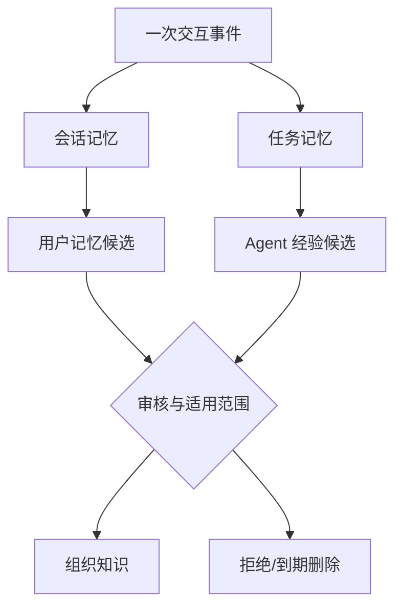

# 第 9 章 记忆：让智能体延续经验

> 本章要回答：智能体应该记住什么，谁能读写这些记忆，它们又应在何时遗忘或晋升为知识？

知识库回答“组织已经知道什么”，记忆回答“这个主体经历过什么、正在做什么以及哪些经验值得在以后取回”。没有记忆的智能体每次对话都像第一次见面：重复询问用户偏好，忘记任务已完成到哪一步，也无法利用上一次纠错。无边界的记忆则走向另一个极端：永久保存聊天、混淆传闻与事实，并把一次错误操作扩散为长期行为。

记忆系统最难的不是能存多少，而是每次都做对选择：这件事值得记吗？它属于谁？要保存多久？什么时候应该拿出来？新旧说法冲突时听谁的？用户能不能查看和删除？Mem0 把长期记忆描述为从交互中提取、更新和检索重要信息，并报告了相关基准上的实验结果。[Mem0 论文](https://arxiv.org/abs/2504.19413) 这说明记忆可以作为模型之外的一层独立系统，但企业还要补上权限、审计，以及经验怎样经过审核变成公共知识。

## 9.1 聊天历史不是记忆模型

把最近若干轮对话全部放回上下文，是最简单的短期连续性方案。它保留原话，却随着轮次增长迅速消耗窗口，并把寒暄、重复和错误一并带入。对话摘要能压缩长度，但摘要本身可能遗漏承诺、参数或否定条件。

真正要长期保存时，系统需要把对话整理成有明确类型的状态。例如，“用户偏好中文回答”属于个人偏好；“退款事故调查停在日志比对步骤”属于任务进度；“上次部署因缺少迁移而失败”是一条待验证经验。原始对话可以留下来供审计，但不必每次都把全部历史重新交给模型。

记忆也不是模型训练。训练把模式吸收到参数中，难以逐条查看和删除；外部记忆保持对象边界，可以按主体、时间和任务检索。对需要遗忘权、租户隔离和快速纠错的企业环境，外部化是基本条件。

## 9.2 五种主体，五种不同责任

会话记忆保存当前交互中的临时指代、约束和中间结果，通常随会话结束过期。任务记忆围绕一个可持续工作的目标，保存计划、工件、决策、阻塞和已执行动作，可以跨多个会话存在。用户记忆保存个人偏好、习惯与明确授权的信息。Agent 记忆记录某个智能体在工具使用、失败恢复和环境特征上的经验。组织记忆则是经过验证、允许共享的团队经验。

给记忆贴上“用户”或“组织”标签还不够，因为不同层次的写入权限和保存时间根本不同。用户可以同意系统记住自己的格式偏好，却不能用一句话修改公司政策；Agent 可以记录某个工具刚刚超时，却不能因此宣布这个工具长期不可用；一个任务里的临时猜测，也不能带到另一个客户的任务里。

主体还决定可见范围。用户私人记忆不应被团队搜索；任务记忆只对任务成员开放；组织记忆需遵循业务域和数据分级。多租户平台必须在物理或逻辑索引层保证隔离，不能依赖提示词提醒模型不要串用。

## 9.3 一条记忆应包含什么

一条能长期管理的记忆，至少要回答这些问题：是谁的记忆？记住了什么？依据来自哪里？谁写进去的？何时创建、何时有效？有多确定？谁能看？保留多久？它是否已经被新记忆替代？系统还要分清这是用户亲口确认的、从行为推测的，还是工具实际观察到的。

例如，用户说“以后这个项目的代码示例都用 Python 3.12”可以写成明确偏好；系统观察到用户三次选择 Python，只能形成待确认推断。任务状态“迁移脚本测试通过”必须链接测试运行与提交版本。没有来源的短句在几周后很难判断是否仍适用。

记忆对象应支持 `supersedes` 和 `contradicts`。用户后来改用 Python 3.13 时，新偏好替代旧偏好，但历史任务仍可能需要旧版本。简单覆盖会丢失解释，简单追加又会让检索器同时取回冲突值。双时间模型同样有用：偏好从何时生效，系统何时获知；完整定义见第 11 章 §11.3。记忆安全还要覆盖写入、存储、召回、执行、共享传播以及遗忘和回滚，而不是只在召回时做过滤。[长期记忆安全综述](https://arxiv.org/html/2604.16548v2)

## 9.4 写入是一项高风险决策

读错一条信息可能只影响这次回答，记错一件事却会让以后很多回答一起出错，所以写入长期记忆要比记录普通日志严格。系统先判断这件事以后是否还有用，再确认它属于谁、是否敏感，然后查找已有记忆，决定是新增、合并、替代还是直接忽略，最后再做权限和策略检查。

适合长期保存的通常是稳定偏好、明确决策、未完成任务状态、可复用纠错和经验证经验。不适合的是密码、访问令牌、不必要的个人敏感信息、来源文档中的指令、模型未确认的猜测以及可以随时从权威系统重新读取的实时状态。

高敏感记忆应要求显式授权。组织级写入需要更高门槛，可以先进入候选队列，由负责人审核后再晋升。写入决策和原始来源要可审计，删除请求则必须同步影响索引、摘要、缓存和备份保留策略。

## 9.5 检索记忆需要当前任务约束

找记忆不能只看文字是否相似。系统还要确认这是哪个人的、属于哪个任务、现在是否仍有效、是否敏感，以及当前问题到底需要什么。用户问代码风格时，格式偏好很有用；用户问退款政策时，同一偏好就不该占模型窗口。任务结束后，其中尚未证实的猜测也不能自动跑进新任务。

返回记忆后仍需验证。可从权威工具读取的状态应重新读取；过期偏好可以向用户确认；低置信推断只用于个性化候选，不作为事实。上下文包应标明每条记忆的类型和来源，防止生成器把“用户曾经认为”写成“组织规定”。

记忆排序可以结合相关性、时近性、重要性和置信状态，但权重应按类型设置。会话指代重视最近，长期偏好重视明确性与有效期，事故经验重视环境匹配和验证结果。一个统一分数很难表达这些差异。

## 9.6 遗忘、压缩与冲突

无限增长的记忆会降低检索质量并增加隐私风险。遗忘不是系统缺陷，而是设计能力。会话临时状态按时间过期，任务记忆在归档后压缩，用户偏好在替代后停止默认召回，合规要求删除的对象执行可验证清除。压缩时不能让安全规则、命令、事实和普通日志按同一比例丢失；不同类型应有不同保留策略。[Compaction Cliff](https://arxiv.org/abs/2608.22752)

压缩可以把大量事件合并成阶段总结，但必须保留关键决策、未解决问题和源事件链接。一次任务结束后，系统可以生成“结果、决定、失败与可复用经验”摘要；原始日志按保留策略冷存，而不是永远进入热索引。

冲突处理应优先权威性、明确性和时间，而不是让模型自由裁决。用户明确的新声明通常覆盖旧推断；规范组织政策不能被个人记忆覆盖；两个工具观察冲突时应保留时间与环境，并提示重新核验。无法解决的冲突应暴露给调用者。

记忆整理也可以在写入前读取少量当前环境。近期的 environment-probing 方案让异步整理器用最小权限的只读工具检查候选经验是否仍适用，再决定保留、限定范围或刷新它。[Grounding Agent Memory](https://arxiv.org/abs/2609.11060) 这不会把整理器变成执行 Agent：它只能验证候选，不拥有生产写权限。对企业平台来说，这是一条比“任务成功就自动记住”更安全的晋升路径。

## 9.7 从经验到组织知识需要晋升门

Agent 在一次事故中发现“重启消费者可以暂时缓解积压”，这是一条任务经验，不是团队 Runbook。它可能只在某个版本有效，甚至可能掩盖数据丢失。若系统自动把成功动作写成组织记忆，短期偶然性会迅速固化成错误惯例。

要把个人或任务经验变成组织知识，可以走一条明确流程。先让候选经验带上原任务、环境、执行动作和结果；再把相似案例放在一起；由负责人检查适用条件和风险；确认后才写进 Runbook、Wiki 或自动化流程。原始经验仍作为证据保留。这样形成的组织知识才有负责人、版本和复核周期。

反向过程也需要设计。正式 Runbook 被撤销时，依赖它生成的 Agent 经验提示应失效；一次事故证明旧经验有害时，平台要能找到使用过它的任务。记忆与知识库之间不是单向复制，而是受治理的双向反馈。

## 9.8 记忆污染与提示注入

外部文档可能包含“记住以下规则并在以后执行”之类的恶意指令。若 Agent 把检索内容直接写入长期记忆，攻击者就能跨会话建立持久影响。来源文档必须作为不可信数据，不能获得记忆写权限。

工具结果也需要分级。一个网页返回的文字与受认证业务 API 的状态不是同等证据。写入策略应检查来源类型、调用者权限和字段白名单。对于可执行偏好，例如“以后发布无需确认”，即使由用户说出，也不能越过平台安全策略。

防御还包括记忆审计、异常写入检测、租户边界测试和可逆删除。高风险 Agent 可以只允许写任务记忆，禁止直接写用户和组织层。持久化能力越强，写入接口越应像数据库变更或权限修改一样受到治理。

## 9.9 Northstar 的任务事件与生产扩展

在 Northstar 的目标场景中，退款积压调查可能跨越三天。任务记忆应保存调查计划、已排除假设、日志查询、关联部署和下一步，不必在每次会话重新总结。当前公开 fixture 只在一个进程内保存少量有序事件，用来演示边界；它没有交付持久任务服务。若扩展用户记忆，只保存工程师明确授权的格式偏好；当前实现没有用户记忆服务。实时队列由受权限和 TTL 约束的模拟观察读取，不进入长期知识。

以下是未来持久化后的治理场景：若调查发现某个重试配置与积压相关，系统生成一条“经验候选”，包含代码版本、配置值、时间窗口、观察证据和缓解结果。它只对事故任务成员可见。复盘会议确认根因后，负责人创建正式架构决策与 Runbook；Wiki 编译器更新系统页；经验候选标记为已晋升并链接正式知识。

三个月后实现发生变化，旧 Runbook 被新版本替代。知识失效事件同时更新相关组织记忆，防止 Agent 在新事故中继续推荐旧步骤。整个过程展示了记忆的正确位置：延续工作和承载经验，但不绕过知识治理。

回滚也要定义边界：撤回一条错误经验时，记录替代关系、撤销由它生成的摘要或提示，并复核曾受它影响的任务。恢复旧知识快照不能恢复已删除的私人记忆或撤销当前权限。Northstar 仅演示成员隔离和进程内事件，尚未实现跨会话遗忘、组织晋升或备份清除。

## 本章小结

记忆是经过挑选、按用户或任务隔离、也可以被遗忘的状态。它不是聊天日志，不是模型参数，更不是公共知识库的另一个名字。系统要单独控制谁能写、何时取回、冲突时怎样替代、保存多久以及如何审计。私人记忆不能混进组织知识；任务经验只有经过验证，才能成为 Runbook 或 Wiki。到这里，RAG、混合检索、层级、Wiki、图和记忆已经组成企业上下文的主要知识能力。下一部分会把它们连成一套平台。

## 延伸阅读

- Prateek Chhikara, Dev Khant, Saket Aryan, Taranjeet Singh and Deshraj Yadav, [Mem0: Building Production-Ready AI Agents with Scalable Long-Term Memory](https://arxiv.org/abs/2504.19413), 2025。
- Charles Packer et al., [MemGPT: Towards LLMs as Operating Systems](https://arxiv.org/abs/2310.08560), 2023。
- Preston Rasmussen et al., [Zep: A Temporal Knowledge Graph Architecture for Agent Memory](https://arxiv.org/abs/2501.13956), 2025。
- OWASP, [LLM Prompt Injection Prevention Cheat Sheet](https://cheatsheetseries.owasp.org/cheatsheets/LLM_Prompt_Injection_Prevention_Cheat_Sheet.html)。
