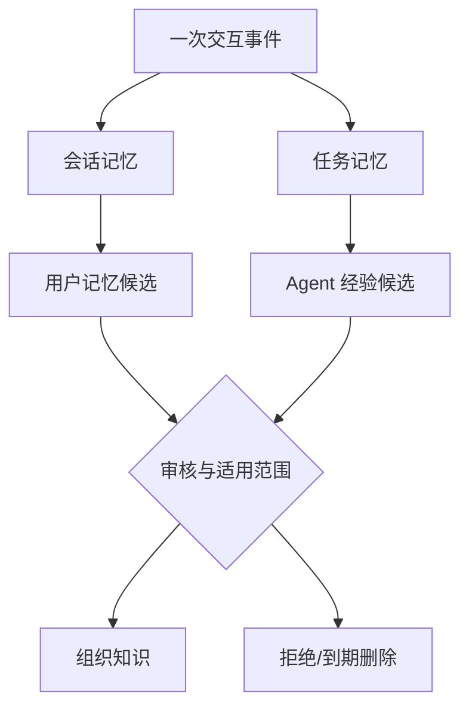

# 第 9 章 记忆：让智能体延续经验

知识库回答“组织已经知道什么”，记忆回答“这个主体经历过什么、正在做什么以及哪些经验值得在以后取回”。没有记忆的智能体每次对话都像第一次见面：重复询问用户偏好，忘记任务已完成到哪一步，也无法利用上一次纠错。无边界的记忆则走向另一个极端：永久保存聊天、混淆传闻与事实，并把一次错误操作扩散为长期行为。

记忆系统的核心不是存储容量，而是选择与治理。它要决定什么值得写、写给谁、保留多久、何时取回、发生冲突如何更新，以及用户如何查看和删除。Mem0 将长期记忆描述为从交互中抽取、更新并检索显著信息，并报告了其在相关记忆基准上的实验结果。[Mem0 论文](https://arxiv.org/abs/2504.19413) 这类工作说明“记忆管理层”可以独立于模型存在，但企业应用还必须补上权限、审计和知识晋升。

## 9.1 聊天历史不是记忆模型

把最近若干轮对话全部放回上下文，是最简单的短期连续性方案。它保留原话，却随着轮次增长迅速消耗窗口，并把寒暄、重复和错误一并带入。对话摘要能压缩长度，但摘要本身可能遗漏承诺、参数或否定条件。

持久记忆需要把交互转换成结构化状态。例如“用户偏好中文回答”是偏好记忆，“退款事故调查停在日志比对步骤”是任务记忆，“上次部署因缺少迁移而失败”是一次经验候选。原始对话仍可作为审计来源，但系统不应在每次查询时重放全部历史。

记忆也不是模型训练。训练把模式吸收到参数中，难以逐条查看和删除；外部记忆保持对象边界，可以按主体、时间和任务检索。对需要遗忘权、租户隔离和快速纠错的企业环境，外部化是基本条件。

## 9.2 五种主体，五种不同责任

会话记忆保存当前交互中的临时指代、约束和中间结果，通常随会话结束过期。任务记忆围绕一个可持续工作的目标，保存计划、工件、决策、阻塞和已执行动作，可以跨多个会话存在。用户记忆保存个人偏好、习惯与明确授权的信息。Agent 记忆记录某个智能体在工具使用、失败恢复和环境特征上的经验。组织记忆则是经过验证、允许共享的团队经验。

这些层次不能只靠标签区分，因为它们拥有不同的写权限和保留策略。用户可以授权保存自己的格式偏好，却不能通过一句话改写组织政策；Agent 可以记录某个工具刚刚超时，却不能自动宣布“该工具不可用”；一次任务的临时假设也不应在另一个客户任务中复用。

主体还决定可见范围。用户私人记忆不应被团队搜索；任务记忆只对任务成员开放；组织记忆需遵循业务域和数据分级。多租户平台必须在物理或逻辑索引层保证隔离，不能依赖提示词提醒模型不要串用。

## 9.3 一条记忆应包含什么

一条可治理的记忆至少包含主体、陈述、来源、写入者、创建时间、有效时间、置信状态、可见范围、保留期限与替代关系。它还应区分“用户明确声明”“系统从行为推断”和“工具观察到的事实”。

例如，用户说“以后这个项目的代码示例都用 Python 3.12”可以写成明确偏好；系统观察到用户三次选择 Python，只能形成待确认推断。任务状态“迁移脚本测试通过”必须链接测试运行与提交版本。没有来源的短句在几周后很难判断是否仍适用。

记忆对象应支持 `supersedes` 和 `contradicts`。用户后来改用 Python 3.13 时，新偏好替代旧偏好，但历史任务仍可能需要旧版本。简单覆盖会丢失解释，简单追加又会让检索器同时取回冲突值。双时间模型同样有用：偏好从何时生效，系统何时获知。

## 9.4 写入是一项高风险决策

读取错误会影响一次回答，持久写入错误会影响许多未来回答。记忆写入因此应比普通日志更严格。写入流水线首先判断信息是否具有未来价值，再识别主体和敏感级别，随后查找已有记忆，决定新增、合并、替代或忽略，最后执行策略检查。

适合长期保存的通常是稳定偏好、明确决策、未完成任务状态、可复用纠错和经验证经验。不适合的是密码、访问令牌、不必要的个人敏感信息、来源文档中的指令、模型未确认的猜测以及可以随时从权威系统重新读取的实时状态。

高敏感记忆应要求显式授权。组织级写入需要更高门槛，可以先进入候选队列，由负责人审核后再晋升。写入决策和原始来源要可审计，删除请求则必须同步影响索引、摘要、缓存和备份保留策略。

## 9.5 检索记忆需要当前任务约束

记忆检索不能只按语义相似度。系统应同时考虑主体、任务、时间、有效性、敏感级别和当前意图。用户询问代码风格时，格式偏好相关；用户询问退款政策时，同一偏好不应占用上下文。任务已结束后，其中的中间假设也不应自动出现在新任务。

返回记忆后仍需验证。可从权威工具读取的状态应重新读取；过期偏好可以向用户确认；低置信推断只用于个性化候选，不作为事实。上下文包应标明每条记忆的类型和来源，防止生成器把“用户曾经认为”写成“组织规定”。

记忆排序可以结合相关性、时近性、重要性和置信状态，但权重应按类型设置。会话指代重视最近，长期偏好重视明确性与有效期，事故经验重视环境匹配和验证结果。一个统一分数很难表达这些差异。

## 9.6 遗忘、压缩与冲突

无限增长的记忆会降低检索质量并增加隐私风险。遗忘不是系统缺陷，而是设计能力。会话临时状态按时间过期，任务记忆在归档后压缩，用户偏好在替代后停止默认召回，合规要求删除的对象执行可验证清除。

压缩可以把大量事件合并成阶段总结，但必须保留关键决策、未解决问题和源事件链接。一次任务结束后，系统可以生成“结果、决定、失败与可复用经验”摘要；原始日志按保留策略冷存，而不是永远进入热索引。

冲突处理应优先权威性、明确性和时间，而不是让模型自由裁决。用户明确的新声明通常覆盖旧推断；规范组织政策不能被个人记忆覆盖；两个工具观察冲突时应保留时间与环境，并提示重新核验。无法解决的冲突应暴露给调用者。

## 9.7 从经验到组织知识需要晋升门

Agent 在一次事故中发现“重启消费者可以暂时缓解积压”，这是一条任务经验，不是团队 Runbook。它可能只在某个版本有效，甚至可能掩盖数据丢失。若系统自动把成功动作写成组织记忆，短期偶然性会迅速固化成错误惯例。

经验晋升可以采用一条明确流水线：候选经验附带任务、环境、执行动作和结果；相似经验被聚类；负责人验证适用条件与风险；通过后转化为 Runbook、Wiki 或自动化；原始经验继续作为证据。组织知识由此拥有所有者、版本和复核周期。

反向过程也需要设计。正式 Runbook 被撤销时，依赖它生成的 Agent 经验提示应失效；一次事故证明旧经验有害时，平台要能找到使用过它的任务。记忆与知识库之间不是单向复制，而是受治理的双向反馈。

## 9.8 记忆污染与提示注入

外部文档可能包含“记住以下规则并在以后执行”之类的恶意指令。若 Agent 把检索内容直接写入长期记忆，攻击者就能跨会话建立持久影响。来源文档必须作为不可信数据，不能获得记忆写权限。

工具结果也需要分级。一个网页返回的文字与受认证业务 API 的状态不是同等证据。写入策略应检查来源类型、调用者权限和字段白名单。对于可执行偏好，例如“以后发布无需确认”，即使由用户说出，也不能越过平台安全策略。

防御还包括记忆审计、异常写入检测、租户边界测试和可逆删除。高风险 Agent 可以只允许写任务记忆，禁止直接写用户和组织层。持久化能力越强，写入接口越应像数据库变更或权限修改一样受到治理。

## 9.9 Northstar 的事故记忆

Northstar 的退款积压调查跨越三天。任务记忆保存调查计划、已排除假设、日志查询、关联部署和下一步，不必在每次会话重新总结。用户记忆仅保存工程师明确选择的输出格式。实时队列深度始终由监控工具读取，不进入长期记忆。

调查发现某个重试配置与积压相关。系统生成一条“经验候选”，包含代码版本、配置值、时间窗口、观察证据和缓解结果。它只对事故任务成员可见。复盘会议确认根因后，负责人创建正式架构决策与 Runbook；Wiki 编译器更新系统页；经验候选标记为已晋升并链接正式知识。

三个月后实现发生变化，旧 Runbook 被新版本替代。知识失效事件同时更新相关组织记忆，防止 Agent 在新事故中继续推荐旧步骤。整个过程展示了记忆的正确位置：延续工作和承载经验，但不绕过知识治理。

## 本章小结

记忆是经过选择、按主体隔离并可被遗忘的状态，不是聊天日志、模型参数或公共知识库的别名。它需要独立的写入门、检索约束、冲突与替代关系、保留策略和审计。私人记忆与组织知识必须隔离，任务经验只有经过验证才能晋升为 Runbook 或 Wiki。至此，RAG、混合检索、层级、Wiki、图和记忆共同构成了企业上下文的主要知识能力；下一部分将把它们组装成平台架构。

## 延伸阅读

- Prateek Chhikara, Dev Khant, Saket Aryan, Taranjeet Singh and Deshraj Yadav, [Mem0: Building Production-Ready AI Agents with Scalable Long-Term Memory](https://arxiv.org/abs/2504.19413), 2025。
- Charles Packer et al., [MemGPT: Towards LLMs as Operating Systems](https://arxiv.org/abs/2310.08560), 2023。
- Preston Rasmussen et al., [Zep: A Temporal Knowledge Graph Architecture for Agent Memory](https://arxiv.org/abs/2501.13956), 2025。
- OWASP, [LLM Prompt Injection Prevention Cheat Sheet](https://cheatsheetseries.owasp.org/cheatsheets/LLM_Prompt_Injection_Prevention_Cheat_Sheet.html)。
