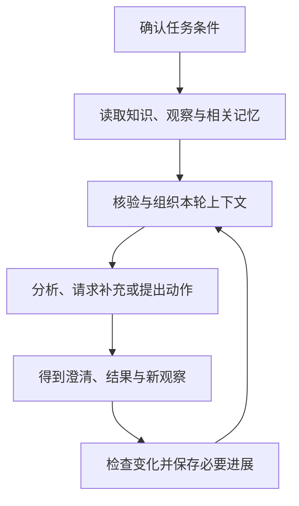

# 第 9 章 任务上下文与记忆：让材料随工作推进

> 本章要回答：怎样把企业资源整理成这次工作可用的材料，并在任务持续推进时更新证据、保留进展和恢复工作？

前面几章已经得到可引用的资料、可以查询的关系、阅读视图和业务模型。接下来要解决的是一次具体任务：这个人现在需要哪些材料，哪些已经确认，哪些仍然未知，下一步允许做什么。企业上下文资源可以很多，任务上下文只选择当前工作所需且允许使用的部分。

上下文工程关注模型每次判断时可用的信息，以及这些信息怎样随任务维护。它包括目标、证据、工具说明、工作记录和约束的组织，而不只是写一段提示词。公开的工程实践强调按需读取、压缩和外部工作记录；企业还需要把身份、时间、业务口径与来源接入同一过程。[上下文工程实践](https://www.anthropic.com/engineering/effective-context-engineering-for-ai-agents)

本章先讲上下文的构造和更新，再讲记忆如何延续工作。第 10 章将这些方法落实为服务契约，第 11、12 章补充版本与安全控制。

## 9.1 先明确本次任务的条件

收到“H2 的销售情况为什么比 H1 差”时，先确认销售指标、期间、组织范围与结果用途。净订单额、收入和回款需要不同数据；自然年与财年会选中不同记录。主体身份则由认证与委托机制提供，不能靠用户在问题中自称某个角色来决定权限。

任务条件还包括成功标准、允许的行动、时间要求及查询预算。只读分析可能在列明差异、候选解释和待补证据后完成；退款执行需要额外的批准与结果验证。将这些条件保存为结构化任务要求，后面的查询和更新才能使用同一范围。

不明确的条件进入待确认项。缺少关键口径时，可以先说明可选定义及需要谁确认；不要提前计算一个看似准确的差异，再在回答末尾补一句“仅供参考”。

### 9.1.1 用智能辅助把请求说清楚

用户或外部 Agent 发来的问题未必完整。“看看下半年为什么这么差”没有说明指标、范围和交付物。上下文助手可以先查看当前身份可见的指标目录和已有任务条件，再提出少量关键问题。已经明确的条件直接沿用，不影响当前取证的细节可以暂时留空；会改变结论、费用或权限的歧义需要确认。

助手交付一份任务理解：目标、范围、完成条件、已采用的默认值和待确认问题。模型提出的理解保留为建议，确认后才作为本轮工作依据。若委托者修改目标，要保存新约定并检查已有材料是否仍然适用。确认“继续”之前，双方应能看到具体继续什么。

业务任务与上下文请求各有完成条件。例如业务任务要解释销售下降，一次取证请求可以先交付同口径期间数据、主要差异和仍需调查的假设。上下文材料准备好了，不代表解释已经成立，更不代表销售策略已经调整。

## 9.2 按材料性质选择读取路径

任务要求明确后，规划器选择需要的资源。政策、说明和历史事故可以从文本索引取回；负责人或影响路径可以沿对象关系查找；经营数值通常需要参数化的结构化查询；当前队列和库存通过受控接口读取；任务进展从授权的记忆或状态服务取得。

结构化数据尤其需要先读定义。一次指标查询应绑定指标身份及版本、期间、币种、组织范围、过滤条件和数据快照。先由确定性的查询或计算取得结果，再让模型解释。文本检索可以找到指标说明，却不应替代订单总额的计算。[指标语义与查询生成](https://github.com/dbt-labs/metricflow)

每条读取路径都要携带主体、范围、时间和预算。回来后再核对材料是否能一起使用：两个期间是否采用同一口径，历史组织结构是否被今天的结构覆盖，观察是否过期，摘要与原文是否属于同一个证据来源。

读取失败也是结果。返回哪项材料缺失、哪个通道不可用，以及对当前任务有什么影响。政策检索缺失与运行指标超时应有不同处理；能够回答的问题可以继续，依赖缺失数据的判断要明确暂停或缩小范围。

### 9.2.1 让查询计划随着证据调整

固定问题可以使用固定查询模板；开放问题更适合逐步规划。先列出当前必须知道什么，选择工具读取；结果回来后再决定继续查、询问还是交付。例如销售分析先检查指标和可比较期间，再看差异集中在哪个维度，随后调查有关事件。退款诊断则先区分手册、历史案例与当前观察，缺少新鲜读数时不能继续准备动作。

两类调查可以共用一个规划机制，采用不同证据要求。任务也可能从认知走向决策或执行，查询路线应随当前交付物调整。每一步计划至少说明工具、参数、目的、依赖与停止条件；平台限制可用工具、数据范围、步数、材料用量和时间。模型收到失败或缺口后，可以选择另一条获准的路径，不能自行扩大权限。

最后核对材料是否支撑交付要求。助手可以指出冲突和遗漏、建议补查，并整理解释草案；程序负责引用、版本、权限和新鲜度等可明确检查的条件。证据不足时交付部分材料与缺口，不能为了给出完整答案而补造事实。

## 9.3 把材料组织成任务上下文

任务上下文可以由结构化对象、短说明和外部引用共同组成。下面是一份通用的逻辑结构，具体字段名可以根据接口调整。

| 内容 | 让使用者知道什么 | 需要保留的依据 |
|---|---|---|
| 任务要求与使用范围 | 要做什么，谁在使用，怎样才算完成 | 主体、目标、时间、范围及已确认口径 |
| 所选知识与关系 | 哪些定义、规则、路径适用于本次问题 | 对象身份、版本、来源及适用条件 |
| 业务观测 | 某个时间和环境下实际是什么情况 | 查询参数、观察时间、快照与新鲜度 |
| 工作进展与相关记忆 | 已经做过什么，哪些结论仍待验证 | 任务归属、原始记录、确认状态 |
| 冲突、假设与缺口 | 现有材料不能支持哪些判断 | 冲突双方、缺失项、影响及下一步需求 |
| 可用能力与约束 | 当前能读取或提出哪些操作 | 服务端策略结果、前置条件及审批要求 |

一条材料可以承担多个角色。例如，工具返回的观察被任务记录引用后，同时成为后续判断的历史依据。上下文应保留这些关系，而不是复制成几条互不相干的文本。同一原文与其摘要也不能被算作两份独立佐证。

销售分析的上下文可以写成下面这样的工作材料。这里展示信息组织方式，不包含真实经营数值：

```json
{
  "task": {"goal": "解释半年度销售差异", "mode": "read_only_analysis"},
  "scope": {"metric": "净确认订单额", "periods": ["H1", "H2"], "organization": "已确认范围"},
  "evidence_refs": ["已确认的指标定义版本", "对应的目标与组织关系"],
  "observation_refs": ["相同口径下的两个期间快照"],
  "progress": {"confirmed": ["币种一致"], "hypotheses": ["渠道变化可能有关"]},
  "missing": ["验证渠道影响所需的联合明细"],
  "capabilities": {"mode": "read_only", "decision_ref": "由策略服务返回的决定标识"}
}
```

生产接口应使用可解析的对象标识和验证记录替代这里的说明文字。策略决定引用由服务端产生，用于说明这份材料的使用范围；它不是执行凭据，每次工具调用仍需重新授权。第 10 章给出工程契约。

上下文提供材料和限制，模型负责形成解释与建议。模型生成的新解释先是待验证结果，不能在下一轮悄悄变成“已确认事实”。

W2 的创造任务还要保留正在形成的成果：设计修订、候选器件及淘汰理由、功耗与 BOM 计算、固件模块、重试与恢复策略、主机测试结果和待做板级验证。协议假设、需求缺口和未解决故障也要随任务延续。已有规格是输入依据，新草案是任务产物；后续读取时仍携带评审状态，避免把候选接口当成已批准的标准。[W2 设计任务](/cases/hardware-w2)

## 9.4 在预算内保留足够证据

整理上下文时，先去重，再选择能共同支持任务的材料。一个完整政策条款和它的适用范围通常需要一起保留；一条关系路径应带上起点、终点、边含义和来源；一次指标比较应带上双方数值及口径。

预算可以约束条目数、文本长度、查询时间、模型调用和成本。优先保留任务目标、硬约束、关键事实、反例与尚未解决的缺口，再用摘要减少重复背景。大段原文可以暂留外部，通过稳定引用按需读取。

若材料超出窗口，应选择分步查证或缩小当前问题。压缩不能删掉金额单位、否定条件、时间范围和批准边界。内容越长并不越可靠；每一轮需要的是足以支撑当前判断的一组材料。

上下文选择也需要解释性。记录一条材料为什么被保留、为什么被排除、是否因为权限、版本冲突或预算而缺失。这样回答不完整时，团队能够定位问题发生在检索、核验还是材料选择阶段。

## 9.5 工作推进后，怎样更新上下文

任务上下文会经历准备、使用、得到新信息、再次核验和更新的循环。新的用户澄清可以修改已确认范围；新的工具结果可以补充观察；已经执行的检查可以进入工作进展。每次更新都要保留来源和确认状态。


```mermaid
flowchart TB
  Q[确认任务条件] --> R[读取知识、观察与相关记忆]
  R --> V[核验与组织本轮上下文]
  V --> A[分析、请求补充或提出动作]
  A --> E[得到澄清、结果与新观察]
  E --> S[检查变化并保存必要进展]
  S --> V
```

恢复一个中断任务时，先读任务记录和有效检查点，再刷新容易变化的业务事实与权限。昨天已获准读取的资料今天可能被撤销，五分钟前的库存也可能已改变。检查点帮助恢复“做到了哪里”，当前观察用于判断“现在还能不能继续”。

任务上下文与模型一次调用的输入也有不同范围。任务可以维护较完整的外部档案，每个决策点只取其中适用的一部分。一个长期任务因此可以跨越多次调用或会话，而不必反复把全部记录塞进窗口。

## 9.6 什么值得写入记忆

记忆围绕主体和工作经历组织。会话记忆保留当前指代与短期约束；任务记忆保留计划、工件、核验结果、阻塞和待办；用户记忆保留明确授权的偏好；Agent 经验保存有依据的工具使用和失败恢复经验；组织知识接纳经过审核的可复用经验。

保存一条记忆前，先确认它以后是否仍有用、属于谁、来自哪里、谁可以读取，以及应保留多久。再查找已有记录，决定新增、合并、替代还是不保存。明确声明与行为推测要分开，例如“用户要求使用 Python”与“用户似乎偏好 Python”具有不同确定性。Mem0 的提取、更新与检索流程提供了外部记忆管理的一种实现思路。[Mem0 论文](https://arxiv.org/abs/2504.19413)

任务可以记录尚未证实的假设，前提是标明它是待核验假设，并限定在相应任务中。密码、令牌、不必要的敏感信息和来源文档中的命令句不应成为可反复召回的长期记忆。一个记忆标签也不会自动扩大信息的可见范围。

经验晋升为组织知识需要单独复核。一次重启恰好缓解了事故，尚不足以形成通用运行手册。应保留环境、版本、动作和结果，由负责人检查适用条件与风险，再决定是否发布。

维护助手可以帮助整理这些经验，提出“哪些内容值得进入手册”的候选。候选保留任务来源、环境、适用条件和反例，由知识负责人决定是否推广。平台内部智能体的查询过程同样需要工作记录：已经读过什么、哪些参数得到确认、为什么停止。它的工作记录与外部业务 Agent 的任务记录通过请求 ID 相连，避免把“材料已交付”误写为“业务已完成”。

## 9.7 记忆怎样查询、压缩、纠正和遗忘

检索记忆时，先限制主体、租户、任务和有效时间，再判断与当前问题的关系。用户的代码格式偏好可以影响示例表达，却不能覆盖企业政策；旧任务里的观察可以提供线索，却不能证明当前系统状态。

旧记录被纠正时，保存替代或冲突关系。简单覆盖会丢失历史解释，简单追加又可能让新旧说法同时进入上下文。时间语义帮助区别何时生效和何时获知，第 11 章给出数据表示。

长任务可以压缩为阶段记录：已经确认的事实、决定及理由、未解决问题、下一步和证据引用。原始记录按保留策略存放，摘要保留回查路径。检查点、阶段摘要和长期经验各有用途，应分别控制更新和召回。

遗忘需要覆盖正文、索引、摘要和缓存。来源撤销或用户纠正后，依赖它的经验也要失效；恢复旧快照时不能恢复已删除的私人记忆或旧权限。第 11、12 章进一步说明删除传播与主体隔离。

## 9.8 可以采用哪些技术

先用能够检查和恢复的任务状态、记录与查询接口建立基线，再考虑自动记忆提取或时间图。

| 方法 | 可选技术 | 使用前要核对什么 |
|---|---|---|
| 保存任务状态与事件 | 关系数据库、事件表、事务和版本字段 | 主体隔离、并发更新、可恢复位置 |
| 保存多轮执行检查点 | LangGraph 等编排框架的持久化能力 | 检查点恢复范围，副作用重试，权限重新核验 |
| 自动提取和检索记忆 | Mem0 等记忆组件 | 候选写入、更新与纠错、来源、删除及业务审核接口 |
| 保存随时间变化的关系经验 | Graphiti 等时间图实现 | 事实有效时间、冲突、来源及跨主体隔离 |
| 编排读取、核验与组装 | LlamaIndex、Haystack、LangChain，或自建应用服务 | 能否贯穿身份、版本、预算和可观测性 |

这些项目的职责不同。检查点解决执行恢复，记忆组件帮助挑选可复用记录，图实现支持关系与时间查询；企业仍须规定哪些记录可以写入、读取和删除。论文中的算法、开源库与托管服务也要按具体版本分别核对，不能直接共用功能或效果保证。[LangGraph 持久化](https://docs.langchain.com/oss/python/langgraph/persistence) [Mem0](https://github.com/mem0ai/mem0) [Graphiti](https://github.com/getzep/graphiti)

业务指标的结构化读取可以接已有数据服务或语义层；全文和向量检索采用第 5 章的后端；低频小规模任务也可以从普通数据库和文件引用开始。选择技术时优先检查契约是否可实现，再比较自动化能力与维护成本。[LlamaIndex](https://github.com/run-llama/llama_index) [Haystack](https://github.com/deepset-ai/haystack) [LangChain](https://github.com/langchain-ai/langchain)

## 9.9 怎样验证这些方法有效

上下文构造要测必要证据覆盖、引用可解析性、版本与口径一致性、过期观察拒绝、缺口表达和预算裁剪。测试应检查交给模型的实际材料，而不只检查检索结果或最终文字。

记忆要测应写入与不应写入、纠错后的召回、主体隔离、跨任务污染、压缩后条件保留以及删除传播。恢复测试要在任务中断、权限变化和业务状态改变后重新执行，确认系统会刷新条件而不是沿旧计划直接行动。

同一任务还应比较有无记忆、有无阶段摘要、不同预算和不同刷新策略。只有在不降低安全与事实准确性的前提下减少重复工作、改善任务完成，记忆和上下文整理才创造了价值。第 13 章将这些检查放入持续评测与发布流程。

## 本章小结

任务上下文从明确的工作条件开始，将知识、关系、当前观察和相关记忆组织为有依据的材料，随后随着澄清与执行结果不断刷新。记忆保留值得延续的进展和经验，检查点保存恢复位置，业务系统继续提供当前事实。下一部分会把这些方法接成可部署、可审计、可持续维护的平台。

## 延伸阅读

- [上下文工程实践](https://www.anthropic.com/engineering/effective-context-engineering-for-ai-agents)。
- [Mem0: Building Production-Ready AI Agents with Scalable Long-Term Memory](https://arxiv.org/abs/2504.19413)。
- [MemGPT](https://arxiv.org/abs/2310.08560)、[Zep 时间图架构](https://arxiv.org/abs/2501.13956)。
- [LangGraph](https://github.com/langchain-ai/langgraph)、[Graphiti](https://github.com/getzep/graphiti)、[MetricFlow](https://github.com/dbt-labs/metricflow)。
