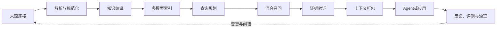
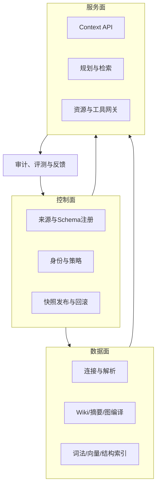

# 第 10 章 把零散知识能力装成一个平台

> 本章要回答：怎样让搜索、Wiki、图谱和记忆使用同一套对象、版本、权限和证据规则？

前六章分别讨论了 RAG、混合检索、层级、Wiki、图谱和记忆。如果把它们当成六个独立产品，用户就会遇到六套对象 ID、六套权限和六种更新时间，最后还可能得到互相矛盾的答案。企业上下文平台首先要做的，不是再加一个组件，而是让这些能力认得同一个对象，遵守同一套版本、权限、证据和评测规则，再为当前任务拼出一份一致的材料。

“上下文基础设施”比“企业知识库”多考虑了任务正在怎样运行。知识库主要保存制度、文档、代码和解释；智能体真正工作时，还需要知道当前用户是谁、任务进行到哪一步、业务系统现在是什么状态、可以调用哪些工具，以及哪些动作不能做。平台最后交付给智能体的不是一页搜索结果，而是一份有权限边界、能追溯来源、专门为当前任务准备的上下文包（Context Package，第 17 章给出完整结构）。

## 10.1 九段生命周期

可以把平台理解成一条九步流水线：把资料接进来，整理成统一对象，生成摘要和关系，建立多种索引；收到问题后，决定去哪里查，找回候选材料，检查证据，再打包给智能体；任务结束后，把错误和反馈送回维护流程。正式名称依次是：来源连接、解析规范化、知识编译、多模型索引、查询规划、混合召回、证据验证、上下文打包、反馈治理。



来源连接负责“看见”企业系统，并保留身份、版本和 ACL。解析与规范化把不同格式转成统一对象，同时保存原始坐标。知识编译生成页面、摘要、实体和关系等派生知识。多模型索引为同一对象建立词法、向量、图与结构化视图。

查询侧从任务开始。规划器识别意图、实体、时间与安全域，召回器并行获取候选，验证器检查版本、权限、来源与冲突，上下文打包器按预算组装证据、记忆和工具结果。Agent 使用这个包回答或行动，反馈系统再把失败、纠错和真实结果送回评测与知识维护流程。

九段并不要求九个微服务。早期团队可以把它们实现为一个模块化应用，但接口边界应明确。否则随着数据量和团队增长，解析逻辑、在线查询和权限策略会互相缠绕，任何变化都要重建整个系统。

## 10.2 三类工作：定规则、做批处理、接在线请求

从工作职责看，平台可以分为控制面、数据面和服务面。控制面负责定规则：接哪些来源、使用什么 Schema、怎样映射身份、谁可以访问、运行哪个处理版本，以及何时发布或回滚。

数据面负责真正处理资料：抓取来源、解析文件、生成嵌入、抽取代码关系、编译 Wiki、构建快照。同一任务重复执行不能制造重复数据，失败后要能重试，也要看得见失败在哪一步。因为实际故障往往只是一个坏文件、一次接口限流或一条不合格的模型输出。

服务面负责接住在线请求：确认用户身份、规划查询、执行检索、生成上下文包，并提供获准使用的资源和工具。它既要快，也必须严格执行权限；部分组件故障时可以明确降级，但结果仍要能够复现。向量索引暂时不可用，不能成为绕过 ACL 的理由；为了降低延迟，也不能偷偷使用已经过期且与其他索引不兼容的图快照。



这个划分也明确了职责。内容团队可以管理页面 Schema 与规范来源，平台团队维护摄取和查询服务，安全团队定义策略与审计要求，业务团队对知识所有权和金标准问题负责。若所有责任都落在“AI 团队”，知识很快会失去业务维护者。

## 10.3 统一对象与多种投影

词法索引、向量库、图数据库、Wiki 文件和对象存储不是五份独立真相，而是同一批对象的不同投影。一个退款政策条款有稳定逻辑 ID 和不可变版本 ID；BM25 文档、嵌入向量、图节点与 Wiki 引用都保存该 ID。用户点击任何结果，都能回到对应版本的原文。

统一身份解决了去重、更新和审计问题。来源变化时，平台根据内容散列创建新版本，并向各投影发送更新；删除时可以找到所有派生物；查询时可以把多路结果合并为同一个对象，而不是把它们当作四条独立证据。

不同投影允许有不同延迟。词法索引可能在一分钟内更新，向量在十分钟后完成，Wiki 在审核后发布。平台必须显式记录这种差异，并通过快照清单决定哪些版本可以共同服务，而不是假设最终一致就足够安全。

## 10.4 Snapshot Manifest：给一起上线的版本列一张清单

一次查询通常会同时访问多个后端。如果 BM25 使用政策 v3、向量库仍是 v2，图中却已经出现 v4 的接口，系统拼出的结果可能对应一个现实中从未存在过的状态。Snapshot Manifest（快照清单）就像一张装箱单，明确哪些版本已经验证过，可以一起对外服务。

清单可以包含来源水位、对象模型版本、词法索引版本、嵌入模型与索引版本、图快照、Wiki 提交、权限策略版本和工具 Schema 版本。在线请求先选择一个已发布清单，再将其传给每条检索通道。某个投影未准备好时，发布系统可以继续使用上一清单或明确降级，而不是静默混用。

保存 Manifest ID、查询计划、候选对象 ID 与最终引用，可以在权限允许时重放静态证据选择。若要重现完整决策，还需要保存当时的实时观察、记忆状态、模型与提示版本、工具结果和最终输出，并说明非确定性边界。清单使索引回滚成为整体操作，但权限撤销不能随旧清单一起撤回：恢复旧知识时仍须执行当前有效的访问策略。

## 10.5 Context API 的核心契约

Context API 不应等同于 `search(query)`。一个面向智能体的请求至少要表达主体、任务、时间、范围、上下文预算和允许使用的能力；响应则返回结构化证据、记忆、实时观察、冲突与缺口。

一个简化请求可以是：

```json
{
  "principal": "user:alice",
  "task": "diagnose_refund_backlog",
  "query": "为什么退款队列持续增长？",
  "as_of": "2026-08-23T10:00:00+08:00",
  "scope": {"tenant": "northstar", "systems": ["refund"]},
  "budget": {"max_items": 12, "max_tokens": 8000},
  "capabilities": ["knowledge", "memory", "read_tools"]
}
```

响应中的每个条目都应有类型、对象 ID、版本、来源、可见范围、时间和检索理由。实时工具结果标为 observation，文档标为 evidence，用户偏好标为 memory，模型生成的社区摘要标为 derived。调用者不必猜测一段文字属于哪类上下文。

API 还要显式返回 `conflicts`、`missing` 和 `degraded_channels`。如果实时监控不可用，系统应说明答案只基于静态 Runbook；如果政策存在两个有效版本，应把冲突交给回答策略。透明降级比用流畅语言掩盖基础设施故障更可靠。

### 10.5.1 不同问题需要不同的 Context Package

上下文包不是一个固定的大 JSON。平台应先识别任务处于企业工作链的哪个位置，再选择包的形状和允许的深度。至少可以区分三种模式：

| 包模式 | 主要服务的问题 | 典型内容 | 默认动作边界 |
|---|---|---|---|
| 战略分析包 | 企业为什么偏离目标，下一步应调查什么 | 商业模式、战略目标、指标语义、能力、组织、应用、数据产品、分解、假设和缺口 | 只读；输出分析复核建议，不直接改策略 |
| 变更影响包 | 改一个事件、API 或数据定义会影响什么 | 对象版本、关系路径、代码和测试、责任团队、Runbook、架构差异 | 只读；提出评审范围 |
| 执行行动包 | 当前任务能否安全地完成一个动作 | 任务记忆、实时观察、Runbook、预览参数、批准、工具 Schema、回执和验证条件 | 按状态、主体和参数逐步放行 |

三种包共用对象身份、来源、时间和权限治理，但不共用证据门槛。战略分析可以返回“候选假设”，执行行动包则必须把实时前置条件和批准绑定到具体参数。把三种任务都交给同一种“搜索并总结”接口，通常会让战略问题缺少企业结构，或者让操作问题暴露不必要的组织和经营数据。

## 10.6 资源与工具是两条不同信任路径

资源提供可阅读上下文，工具允许查询实时系统或执行动作；MCP 可以承载两者，但授权与风险判断仍由企业系统执行，详见第 12 章 §12.7。[MCP 规范](https://modelcontextprotocol.io/specification/)

一个 Context API 可以通过 REST、SDK 或 MCP 暴露。知识页面、源码和对象详情适合作为资源；订单状态查询是只读工具；退款、发布和权限修改是写工具。三者必须拥有不同策略。用户能阅读退款政策，不代表能执行退款；Agent 能查询部署状态，也不代表能发布。

工具调用产生的新事实应以观察事件进入上下文，而不是自动改写知识库。执行结果可以进入任务记忆；经过复盘和审核后，稳定经验才晋升为 Runbook 或 Wiki。这条边界防止平台把一次运行状态污染成长期事实。

### 10.6.1 Skill 和 Agent-to-Agent 协作

Skill 是把程序性知识按需装入 Agent 的工作包；MCP 是 Agent 访问资源和工具的连接方式；A2A 则用于不同 Agent 之间发现能力、交换信息和协作任务。三者都可以使用 Context API 提供的对象、版本、权限和证据，但职责不同。Skill 不能自动授予工具权限，MCP 不能替企业定义业务动作，A2A 也不能跳过委托链和审批。

Google 在 2025 年将 A2A 规范、SDK 和工具交给 Linux Foundation 项目，说明 Agent 互操作正在形成独立协议层。[Google A2A 项目公告](https://developers.googleblog.com/google-cloud-donates-a2a-to-linux-foundation/) 平台应把 Agent 的发现描述当作不可信配置输入，再用本地策略决定能否建立协作、共享哪些上下文和允许哪些回调。

## 10.7 降级、背压与成本

企业平台必须预先定义组件失败时的行为。向量服务不可用时，可以退化到 BM25 与结构化查询；重排模型超时时，可以使用 RRF 排名；图快照落后时，关系问题应标记数据水位，而不是假装完整。权限服务失败则通常必须关闭访问，不能为了可用性放行。

摄取侧需要背压。一次大仓库提交或共享盘全量变更可能产生数百万任务；队列应按来源、租户和优先级限流，并合并连续变更。实时性不是所有来源都一样：事故告警可能要求秒级，政策和代码 Wiki 可以分钟级，历史档案可以每日处理。

成本模型也应按阶段拆分。解析与 BM25 主要消耗计算和存储，嵌入消耗模型调用，Wiki 和图抽取消耗更多生成预算，在线重排和 Agent 推理影响查询成本。平台应记录每个上下文包的通道贡献和成本，用消融淘汰没有带来任务收益的组件。

## 10.8 先守住共同规则，再讨论选什么产品

具体产品会不断变化，但有些共同规则不能变：每个对象都能准确定位，引用不会混淆版本，内容暴露前先检查权限，结论能回到来源，加工结果有血缘，快照可以复现，组件失败时能够明确降级，执行动作必须另行授权，最终效果可以评测。这些规则就是平台契约。

这些契约也给“自建还是采购”提供判断框架。企业可以采购向量数据库、图数据库或 Wiki 生成器，只要组件能服从统一身份、ACL、快照和审计。若一个产品只能返回文本与相似度，却无法表达版本和安全过滤，它即使基准性能优秀，也不能单独承担企业上下文底座。

Northstar 的当前参考实现是一个 Python 标准库单体：JSON 保存教学对象，内存索引演示 BM25、语义代理、图和任务状态，模板生成可审阅 Wiki。PostgreSQL/pgvector、持久图存储、对象存储与网络 Context API 都属于生产替换路线。组件数量不是重点；每个对象贯穿这些投影且能够被测试，才是架构成立的证据。

## 本章小结

上下文平台用九步流水线把企业资料变成当前任务可以使用的材料。控制面负责定规则，数据面负责处理资料，服务面负责回答在线请求。统一对象让词法、向量、图和 Wiki 指向同一份知识；Snapshot Manifest 保证各索引版本可以一起使用；Context API 再把证据、记忆、实时观察和已知缺口清楚地交给 Agent。企业真正需要长期保留的，不是某个数据库品牌，而是这套跨组件不变的可信规则。

## 延伸阅读

- Model Context Protocol, [Specification](https://modelcontextprotocol.io/specification/)。
- Martin Kleppmann, [Designing Data-Intensive Applications](https://dataintensive.net/)。其中关于数据流、派生数据与一致性的讨论可用于理解多索引平台。
- OpenLineage, [Open standard for lineage metadata collection](https://openlineage.io/)。
