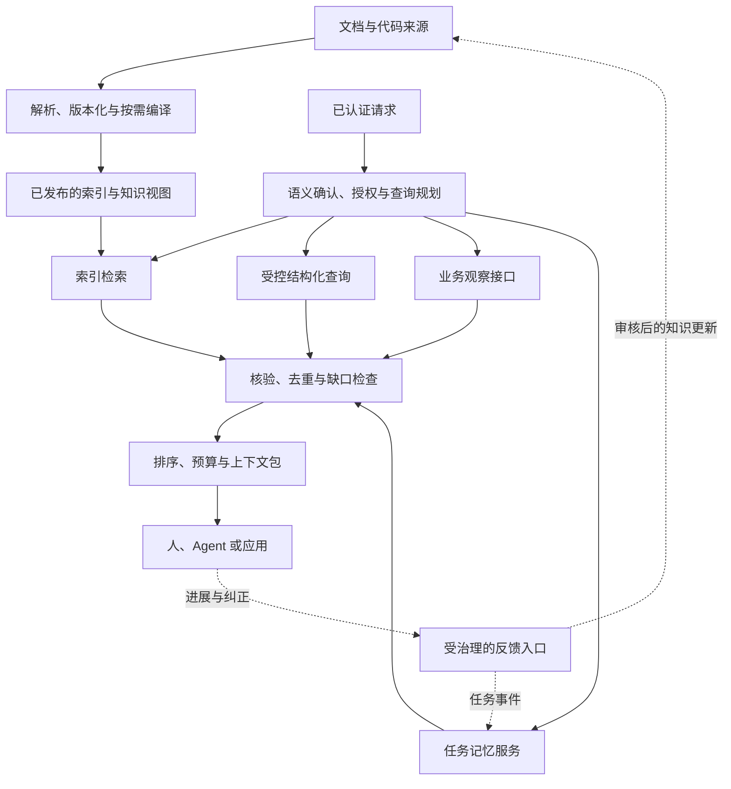

# 第 10 章 把零散知识能力装成一个平台

> 本章要回答：怎样把前面的知识方法接成可调用、可恢复、可控制成本的平台，并给每次任务交付可靠的上下文？

第 4—9 章解释了材料准备、检索、结构导航、Wiki、语义建模，以及任务上下文构造和记忆的方法。现在要解决的是工程集成：查询需要同时访问哪些系统，谁负责检查权限，各路结果怎样汇合，超时后如何处理，下一轮任务又如何接着做。

第 3 章的平台有三项职责：资源维护、语义与治理、上下文构造。本章将它们落实为模块边界、适配器和 Context API 读接口。第 11 章展开身份、时间、血缘与发布，第 12 章展开授权和受控行动，第 13 章展开评测与运行验收。第四部分再用小型案例将这些契约逐步实现。

## 10.1 从三项职责确定模块边界

平台首先要明确谁接收什么、保证什么、返回什么。模块可以放在同一个进程中，职责仍须清楚。

| 平台职责 | 工程模块与输入 | 对外提供的结果 | 主要责任人 |
|---|---|---|---|
| 资源维护 | 来源注册、连接器、解析与编译任务、任务记录；接收来源变更和工作进展 | 可访问的引用、索引、来源水位、记忆修订及更新结果 | 来源所有者负责内容，平台团队负责接入与更新 |
| 语义与治理 | 语义模型、身份映射、版本清单、访问策略与校验规则 | 有版本的业务契约、有效安全范围、可使用的材料和能力 | 业务负责人裁决含义，安全团队定策略，平台执行检查 |
| 上下文构造 | 请求解析、查询规划、通道调度、证据核验、预算与打包 | 本次任务上下文、缺口和下一步条件 | 平台团队负责交付，任务负责人确认目标和完成标准 |

语义与治理贯穿另外两项职责。连接器不能先收集所有租户正文，再等模型判断谁能看；打包器也不能为了长度预算删掉政策的适用地区。业务负责人不必维护向量索引，但必须能解释指标口径；平台团队可以发现定义冲突，却不能自行裁决销售与财务谁说了算。

实际部署常使用“控制面、数据面、服务面”三个词。控制面管理模型、连接配置、策略和发布；数据面加工来源、构建索引；服务面接收在线查询。它们是工程组织方式，与三项逻辑职责交叉：服务面执行治理，数据面同样执行治理。不能把权限只放进一个远离数据读取的“安全模块”。

## 10.2 两条取材路径，在同一个核验点汇合

适合重复使用的政策、代码和解释，可以预先解析、编译并建立索引。订单汇总、当前队列和本次任务进展，则可能需要直接查询业务系统或任务服务。两条路径共享身份、来源和使用规则，不要求所有数据先搬进统一数据库。


```mermaid
flowchart TB
  S["文档与代码来源"] --> P["解析、版本化与按需编译"]
  P --> I["已发布的索引与知识视图"]
  Q["已认证请求"] --> G["语义确认、授权与查询规划"]
  G --> R["索引检索"]
  I --> R
  G --> D["受控结构化查询"]
  G --> O["业务观察接口"]
  G --> M["任务记忆服务"]
  R --> V["核验、去重与缺口检查"]
  D --> V
  O --> V
  M --> V
  V --> B["排序、预算与上下文包"]
  B --> A["人、Agent 或应用"]
  A -.进展与纠正.-> F["受治理的反馈入口"]
  F -.任务事件.-> M
  F -.审核后的知识更新.-> S
```

离线路径可以包含连接、解析、知识编译和索引发布，每份材料只经过必要步骤。精确查询政策条款可以直接使用词法索引，小型术语表可以直接查询。在线任务再根据所需材料选择索引、数据或观察接口。

直接查询同样不是裸连接。结构化适配器接收已确定的指标定义、期间、单位与组织范围，在受控查询模板或受限查询计划上计算，返回数据快照和计算依据。不能把模型生成的任意 SQL 交给具有全库权限的连接执行。观察适配器返回观察时间、资源修订和新鲜度；记忆适配器返回任务归属、修订号及证据引用。它们在核验后参与本轮上下文构造，无需先进入全文或向量索引。

例如“为什么 H2 销售下降”需要先读指标定义，再对同一口径的数据快照计算差异；“退款队列为什么增长”需要当前观察和运行手册。前者的数据可以是已结算快照，后者通常要求秒级或分钟级新鲜度。是否直接读、是否缓存，由任务用途决定，不按“新信息”与“旧信息”机械分库。

## 10.3 让适配器服从同一份查询计划

每个后端都有自己的查询语言。平台用适配器隔离差异，而不要求所有后端只返回相似度分数。一个内部读取接口可以写成 `read(plan, authorization_context, deadline) -> ChannelResult`。其中授权上下文由服务端生成并通过可信通道传递，适配器必须验证它的范围和有效期。

| 契约部分 | 必须传递的内容 |
|---|---|
| 查询计划 | 目标对象或指标、业务时间、知识快照、模型版本、允许关系与方向、必要材料、通道预算 |
| 授权上下文 | 已认证主体、租户、委托范围、任务成员资格、当前策略决定及有效期 |
| 通道结果 | 材料及引用、实际使用的模型与数据版本、来源水位、耗时、可见覆盖、分页或截断状态 |
| 失败结果 | 错误代码、是否可重试、缺失要求；不得将访问拒绝伪装成完整的空结果 |

适配器应在内容进入候选和重排前执行访问控制。后端不支持所需粒度的权限过滤时，应使用隔离索引、受控视图或拒绝该通道，不能先把高权限正文交给模型再删除。图适配器还要在遍历中控制节点与边；数据适配器要限制行、列和聚合范围。内部错误可以更详细，但对调用者的缺口说明不能泄露被拒对象的名称、数量或存在性。

查询规划器先根据已确认目标列出“必须有”和“有助于解释”的材料，再进行并发分发。例如运行诊断并行读取手册、队列和任务记录；队列是当前状态判断的必需项，语义召回历史事故可以是可选项。各通道共享总截止时间，各自拥有更短的超时与候选上限；没有必要启动的通道，不占连接池和模型预算。

候选回来后，先按对象、版本与来源依赖去重，再检查时间、权威性、冲突和覆盖。多路召回得到同一政策不能算多份佐证；摘要与原文也不能当成独立证据。RRF 等融合解决排序尺度不同的问题，重排进一步选择相关材料，但两者都不能裁决哪个政策版本合法。确定性指标计算也不能被一段得分更高的文字替代。

打包预算应包含条目数、输入 Token、耗时和成本。必要定义、关键证据、适用条件与缺口优先保留；可选历史案例可以被压缩或省略。压缩必须保留引用，省略必须反映在覆盖结果中。如果必要材料超过预算，返回暂停并请求缩小范围或分步处理。不要截掉限制条件后仍声称包已完整。请求中的预算只是调用方上限，服务端还要与租户配额及系统上限取交集。

## 10.4 模型、快照和当前世界分别固定什么

语义模型版本规定对象和关系的含义。Snapshot Manifest（快照清单）规定哪些索引和知识视图经过兼容性检查、可以一起服务。业务数据快照说明一次计算实际读了哪些数据。三者不能用一个含糊的 `version` 代替。

假设关键词索引已经收录退款政策 v3，向量索引仍只有 v2。发布清单可以继续选用兼容的旧视图，或明确关闭尚未就绪的通道，不能静默把不兼容结果拼起来。旧视图也必须满足当前任务的时效要求；任务需要新政策时，应报告缺口。对象身份、血缘传播和原子发布的具体实现见第 11 章。

在线服务固定一次请求的清单和模型版本，并要求适配器回报实际版本。没有参加该清单的业务接口，应单独给出数据快照或资源修订、观察时间和查询条件。任务记忆给出本次读取的任务修订。跨系统无法取得同一事务快照时，应明示时间偏差及允许误差，不能以相同请求 ID 假装各系统在同一瞬间被读取。

业务有效时间回答“事实适用于什么时候”，系统记录时间回答“当时已经知道什么”，观察时间回答“何时读取了这次状态”。历史分析可以同时指定前两者；当前状态的使用还需检查 TTL、未来时间和来源水位。新鲜度应在读取后以及交付前检查，因为排队和慢通道可能让刚取回的观察在包完成前过期。

授权使用当前有效策略。清单可以记录构建时的策略版本以便审计，但选择旧清单不恢复旧访问权。长查询交付前如果权限已撤销，必须重新过滤或终止；不应以“请求开始时有权”为由继续暴露材料。审计重放也要先通过当前权限检查。

## 10.5 Context API 的核心契约

Context API 接受任务要求，返回可用于当前决策的材料及使用条件。下面给出本书的一份完整最小读契约，包括成功、缺口与恢复语义。它是生产设计示例，不是声称 Northstar 已实现网络接口或这些全部字段。接口版本固定字段含义；部署时应将字段类型、枚举、必填性、大小上限和错误格式写入机器可校验的 Schema。

### 10.5.1 请求：表达需求，不自行声明权限

客户端通过已认证连接发送 `POST /v1/context-requests`，正文如下。认证凭据放在传输层，不进入模型上下文、请求示例或普通日志。

```json
{
  "api_version": "1",
  "client_request_id": "req-1042-01",
  "task": {
    "id": "INC-1042",
    "expected_revision": 7,
    "purpose": "diagnose",
    "goal": "判断退款积压的现状，列出下一步核验事项",
    "completion_criteria": ["给出带时间的队列观察", "区分事实与假设"]
  },
  "query": "为什么退款队列持续增长？",
  "semantic_request": {"contract_id": "refund-diagnosis-v2", "model_version": "domain-8", "confirmed_parameters": {}},
  "scope": {"tenant": "northstar", "systems": ["refund"], "environment": "prod"},
  "time": {
    "valid_at": "2026-10-06T02:00:00Z",
    "known_at": null,
    "observation_mode": "current",
    "observation_range": null,
    "max_observation_age_seconds": 60
  },
  "snapshot": {"selection": "latest_compatible", "manifest_id": null},
  "requirements": [
    {"id": "runbook", "required": true},
    {"id": "queue", "required": true},
    {"id": "task_history", "required": true},
    {"id": "similar_incidents", "required": false}
  ],
  "requested_capabilities": ["knowledge.read", "runtime.read", "memory.read"],
  "budget": {"max_items": 12, "max_input_tokens": 8000, "timeout_ms": 3000, "max_cost_usd": 0.02},
  "on_optional_failure": "continue_with_gaps"
}
```

`scope.tenant`、任务 ID 和能力列表都是请求条件。服务器从经验证的登录身份、服务身份或委托凭据生成 `principal`，检查租户成员、任务成员及委托链，再计算有效范围。正文即使增加 `role: admin` 或 `principal: alice` 也不能获得权限；本契约拒绝这些未声明字段。语义契约中的强制要求不能被客户端将 `required` 改成 `false` 取消，完成条件也要经过业务规则校验。

`expected_revision` 用来发现任务在准备期间是否已变化。`known_at: null` 表示使用当前已知记录解释 `valid_at` 所指定的业务时刻；它不固定实时观察。固定历史知识时可指定记录时间和已发布的 `manifest_id`，服务端检查两者是否兼容。`observation_mode: current` 则明确要求读取当前观察，并返回实际时间。历史重放改用历史观察时必须另行声明，不能把它当作当前动作依据。

服务器校验 Schema 后，将请求范围、客户端预算与当前策略相交，选出语义切片和查询计划。不支持的指标、歧义范围或不存在的可用快照应返回可处理结果，不让模型默默替换成“最接近”的任务。

请求中的全部顶层字段均为必填；只有明确允许的字段可以取 `null`。`task.expected_revision` 是非负整数，预算与新鲜度上限必须为正且不得超出服务端上限；字符串标识设长度限制，布尔值不接受字符串替代。`snapshot.selection` 只接受 `latest_compatible` 或 `pinned`，后者要求非空清单 ID；`observation_mode` 只接受 `current` 或 `historical`，前者的 `observation_range` 为 `null`，后者要求该字段包含 `from`、`to` 两个时间戳并满足前者早于后者。历史样本按该区间检查覆盖，不以当前时间计算其年龄；新鲜度上限仍限制当前观察。`on_optional_failure` 只接受 `continue_with_gaps` 或 `pause`。时间统一使用带时区的时间戳。

`semantic_request` 指定请求采用的业务契约与模型版本；`confirmed_parameters` 保存用户明确确认的口径、期间、单位或范围。服务端验证它们与该契约一致，不能把客户端随意填写的“已确认”当作批准。退款示例没有额外待确认指标参数，因此为空。销售分析若缺少必需口径，则先暂停并返回待确认值；下次请求必须绑定原确认问题及版本，不能只传一个不说明确认了什么的布尔值。

### 10.5.2 响应：同时交付材料、边界与下一步

以下响应使用三个条目展示三条来源路径。示例中的 `continue` 只允许继续只读诊断，不表示根因已查明，更不表示可以执行重放。

```json
{
  "api_version": "1",
  "request_id": "ctx-1042-01",
  "request_revision": 5,
  "trace_id": "trace-1042-01",
  "generated_at": "2026-10-06T02:00:01Z",
  "status": "partial",
  "principal": {"subject": "user:sre-oncall", "tenant": "northstar", "delegation_id": null},
  "effective_scope": {"systems": ["refund"], "environment": "prod"},
  "authorization": {"decision_id": "authz-81", "policy_version": "policy-24", "checked_at": "2026-10-06T02:00:01Z"},
  "task": {
    "id": "INC-1042", "revision": 7, "state": "diagnosing", "purpose": "diagnose",
    "goal": "判断退款积压的现状，列出下一步核验事项",
    "completion_criteria": ["给出带时间的队列观察", "区分事实与假设"]
  },
  "manifest": {"id": "manifest-42", "model_version": "domain-8", "indexes": {"lexical": "lex-42", "vector": "vec-42"}},
  "semantic_contract": {
    "id": "refund-diagnosis-v2",
    "model_version": "domain-8",
    "confirmed_parameters": {},
    "definitions": [{"id": "queue_depth", "meaning": "指定队列尚待处理的消息数", "unit": "message"}],
    "allowed_relations": [{"type": "DOCUMENTED_BY", "from": "Service", "to": "Runbook"}],
    "required_requirements": ["runbook", "queue", "task_history"]
  },
  "time": {"valid_at": "2026-10-06T02:00:00Z", "known_at": null, "observation_mode": "current", "observation_range": null, "max_observation_age_seconds": 60},
  "items": [
    {
      "id": "item-runbook", "object_id": "runbook-refund", "version_id": "runbook-refund-v3",
      "roles": ["knowledge", "guidance"],
      "content": {"text": "积压时检查消费者延迟及供应商错误率；不能仅凭积压值认定根因。"},
      "provenance": {"method": "source_record", "source_uri": "knowledge://runbook-refund/v3", "source_version": "v3", "inputs": [], "authority": "approved_runbook"},
      "time": {"valid_from": "2026-09-01T00:00:00Z", "valid_to": null, "recorded_at": "2026-09-01T08:00:00Z"},
      "access": {"decision_id": "authz-81", "classification": "internal", "redactions": []},
      "selected_for": ["runbook"]
    },
    {
      "id": "item-queue", "object_id": "refund-queue", "version_id": null,
      "roles": ["observation"],
      "content": {"queue_depth": 842, "unit": "message"},
      "provenance": {"method": "tool_read", "source_uri": "runtime://refund-queue/revision/91", "source_version": "91", "inputs": [], "authority": "runtime_sensor"},
      "time": {"observed_at": "2026-10-06T02:00:00Z", "expires_at": "2026-10-06T02:01:00Z"},
      "access": {"decision_id": "authz-81", "classification": "internal", "redactions": []},
      "selected_for": ["queue"]
    },
    {
      "id": "item-memory", "object_id": "INC-1042", "version_id": "task-revision-7",
      "roles": ["memory"],
      "content": {"text": "已确认诊断范围为生产退款队列；尚未确认根因。"},
      "provenance": {"method": "task_event", "source_uri": "memory://INC-1042/events/7", "source_version": "7", "inputs": [], "authority": "task_record"},
      "time": {"recorded_at": "2026-10-06T01:59:00Z"},
      "access": {"decision_id": "authz-81", "classification": "task_private", "redactions": []},
      "selected_for": ["task_history"]
    }
  ],
  "evidence": [{"claim_id": "queue-depth-at-observation", "item_ids": ["item-queue"], "supports": "观察时待处理消息为 842", "limits": "单点数值不能证明增长趋势或原因"}],
  "relations": [],
  "coverage": {"satisfied": ["runbook", "queue", "task_history"], "unsatisfied": ["similar_incidents"]},
  "missing": [{"requirement_id": "similar_incidents", "required": false, "code": "channel_unavailable", "effect": "不提供相似事故对照"}],
  "conflicts": [],
  "degraded_channels": [{"channel": "vector", "code": "timeout", "fallback": "lexical_runbook_only"}],
  "capabilities": [{"name": "runtime.read", "schema_version": "1", "effect": "read", "constraints": {"resources": ["refund-queue"]}, "reauthorize_on_call": true}],
  "plan": {"id": "plan-18", "version": "planner-3", "channels": ["lexical", "vector", "runtime", "task_memory"]},
  "budget": {"max_input_tokens": 8000, "used_input_tokens": 1200, "elapsed_ms": 950, "cost_usd": 0.001, "truncated": false},
  "next": {"decision": "continue", "reason": "必要材料已取得；仅继续只读诊断", "required_input": [], "resume_token": null}
}
```

这份契约按字段分离不同维度。`roles` 说明材料的用途，`provenance.method` 说明它怎样产生，`authority` 说明谁对该声明负责，`evidence` 则把某项判断与具体条目联系起来。派生摘要可以具有 `knowledge` 角色，以 `model_summary` 记录加工方式，在 `inputs` 中引用输入版本，再被某条证据关系引用；它不是与“证据”互斥的第四类材料。证据关联也要经过核验，模型随意生成的 `supports` 不能自动成为事实。

各类条目共用身份、角色、内容、来源、时间、访问和选用理由字段，但时间子结构按用途校验。不可变知识必须有版本和有效范围；当前观察必须有观察时间、资源修订和到期时间；任务记忆必须绑定主体或任务及修订。`version_id: null` 不能省掉观察的来源修订。关系条目除两端引用、类型和方向外，也要携带同样的来源、时间、访问信息及证据等级。引用必须能在授权范围内解析，不以无法核验的字符串充数。

响应中的 `task.goal`、`purpose`、`completion_criteria` 与 `semantic_contract.confirmed_parameters` 是服务端已接受的任务条件，结合 `effective_scope` 和 `time` 交付给后续使用者。它们不能只是未经检查的请求回显。转交另一个 Agent 或恢复任务时，使用者据此知道这份包要支持什么判断。

`semantic_contract` 是本次任务需要的最小定义与约束；`coverage` 是实际取材结果。前者存在不表示后者完整。`authorization` 只返回可审计的策略决定摘要，不泄露完整 ACL；它与 `capabilities` 都不是授权令牌。公开语义与受限语义也要分别检查访问权。

响应中的预算数值是本次打包使用的计量，Token 应按目标模型的计数方式计算。缓存命中、分页和截断也必须记录。若模型最终调用还会加入系统规则、对话或工具 Schema，打包器应预留这些容量，不能把整个模型窗口全部分配给检索正文。

### 10.5.3 缺口怎样变成继续、暂停或停止

`missing` 表示某项任务要求尚未满足，`conflicts` 表示材料不能在当前条件下同时采用，`degraded_channels` 表示某条实现路径未按计划工作。三者可以同时出现，也不能相互替代。向量超时但关键词已取得全部必要材料时，可以没有缺口；两份有效政策互相冲突时，即使所有通道正常，也必须报告冲突。

| 下一步 | 判定条件 | 返回与调用方行为 |
|---|---|---|
| `continue` | 必要要求已满足，或契约明确允许当前受限用途；可选缺口已声明 | `status` 为 `ready` 或 `partial`；只在返回的范围内继续 |
| `pause` | 指标口径待确认、必要观察暂不可得、关键冲突待裁决，或预算不足 | `status` 为 `needs_input` 或 `blocked`；返回缺口、允许的补充输入和恢复入口，不作无依据判断 |
| `stop` | 身份或任务范围不合法、任务被取消、不可恢复失败，或总期限已结束 | `status` 为 `rejected`、`cancelled` 或 `failed`；拒绝时不返回受限材料，说明是否可另发新请求 |

这些决定由服务端的任务契约和确定性检查产生，不由提示词决定。冲突记录应包含调用者可见的条目引用、冲突维度、受影响判断和裁决要求；内部知道但用户无权知道的来源只能转成不泄露细节的缺口。队列观察过期时，可以继续阅读历史手册，但不能继续声称已掌握当前队列，更不能据此放行写动作。

传输错误与任务结果分开处理。格式错误返回 HTTP 400，未认证为 401，无权访问为 403（需要隐藏资源存在时按统一策略使用 404），任务修订冲突为 409，限流为 429；服务无法可靠完成时使用适当的 5xx。错误体至少含 `request_id`、`code`、安全的说明和 `retryable`，必要时给出重试等待时间。业务口径待确认则可以在成功传输的响应中返回 `next.decision: pause`，不能靠 HTTP 200 判定任务可继续。

较长请求可以返回 HTTP 202 和任务化的请求 ID，客户端经再次认证查询状态或取消。完成、暂停、失败均写入持久记录。恢复令牌只定位服务端保存的进度，不携带可自行修改的身份或批准；恢复时仍检查任务成员、当前权限、任务修订和过期材料。

同一契约的异步入口为 `GET /v1/context-requests/{id}` 查询状态、`POST /v1/context-requests/{id}/resume` 提交确认，以及 `POST /v1/context-requests/{id}/cancel` 请求取消。202 响应包含 `request_id`、`trace_id`、`status: accepted` 和状态地址；查询在运行期间返回 `accepted` 或 `running`，完成后返回上述包或错误体。恢复正文包含恢复令牌、预期请求修订和按 `required_input` Schema 提交的值；取消正文包含预期请求修订和原因。每次恢复或取消均以原子修订检查防止并发覆盖。请求修订与业务任务修订分开存储，恢复和状态响应明确给出 `request_revision`。状态查询也不能泄露非成员请求的存在。

## 10.6 资源与工具是两条不同信任路径

资源提供材料，工具读取新事实或改变外部系统。即使通过同一网关提供，也必须分开规定行为。Context API 的构造请求只允许受控读取；不能因问题中出现“顺便重放”就执行业务写入。记录请求审计不等于获得修改业务数据的许可。

| 边界 | 平台必须落实的检查 |
|---|---|
| 读取资料与记忆 | 当前身份、对象与字段范围、任务成员、时间和来源；正文始终按证据处理 |
| 调用只读工具 | 工具 Schema、资源范围、查询成本、凭据委托和返回数据过滤 |
| 提出写动作 | 只生成候选意图与参数，不把候选写成已执行结果 |
| 执行写动作 | 独立入口重验主体、任务状态、目标、参数、批准、并发前置条件和幂等键 |
| 判断完成 | 使用受信回执及动作之后的新观察，检查业务成功条件 |

工具说明是上下文，凭据和执行权不属于可供模型复述的材料。网关不能相信来自模型的角色字符串，也不能因为工具出现在上一个包中就省去鉴权。只读接口同样可能泄露数据或制造昂贵查询，需要授权、参数校验和速率限制。完整的预览、批准、执行、回执与验证状态机在第 12 章展开。

工具结果先作为观察返回；需要延续任务时，经任务事件入口写入记忆。任务事件写入使用预期修订和事件幂等键，验证主体、来源及状态，再追加记录。纠错通过新事件保留历史，知识晋升则交给所有者审核与发布。不得让打包器在一次普通读取中悄悄把模型总结变成正式政策。

## 10.7 持久编排：中断后从哪里继续

短查询可以在单个请求内完成。跨多个系统、等待人员确认或需要分钟级处理的任务，应将构造过程作为可恢复的工作流，而不是在 HTTP 连接里一直等待。工作流状态至少包括 `accepted → planning → collecting → validating → packaged`，并允许进入 `waiting_input`、`failed` 或 `cancelled`。这些是构造请求的状态，不是业务退款或批准的状态。

每次状态转移保存请求散列、计划版本、模型与清单 ID、任务修订、已经完成的步骤、结果引用、预算消耗与截止时间。进程重启后可以从持久检查点恢复。重复提交相同 `client_request_id` 时，服务端在已认证租户、主体和任务内核对请求散列；相同内容返回已有请求状态，不同内容返回冲突。即使找到了旧结果，交付前仍要重验权限和新鲜度。

网络读取、模型调用与其他非确定性操作作为独立活动执行，保存完成结果的引用。重放编排历史时使用已记录结果，不重新调用模型并期待它产生同样计划。外部活动仍可能因崩溃而执行多次，所以必须有幂等标识、有限重试、退避与总截止时间；持久编排不提供任意外部副作用“恰好一次”的保证。

恢复后，静态证据可以继续使用相同兼容清单；过期观察必须重新读取，任务修订变化必须重新规划，撤销权限立即生效。等待用户确认时保存的是明确的问题和确认内容，不是“继续”两个字。收到确认后核对它绑定的指标、范围与版本，不能让对旧范围的确认批准新范围。

并行步骤完成后还需处理迟到结果：请求已取消或已结束的结果不得重新打开任务，也不得覆盖新修订。可以记录它们供内部审计，但任何再次交付都须进入新的核验。工作流版本升级应保留旧运行所需的兼容执行路径，或显式迁移；不能让旧检查点在新代码下悄悄改变含义。

## 10.8 缓存、故障与背压

### 10.8.1 缓存命中不是授权命中

相同问题不代表相同上下文。请求级缓存键至少包含规范化问题与确认参数、任务要求与请求能力、租户、任务 ID 与任务修订、有效主体或经过证明的权限等价域、委托范围、组织与环境、业务及记录时间、观察模式与范围、新鲜度要求、模型版本、Manifest、当前策略版本或撤销水位、计划版本和输出预算。涉及用户或其他主体记忆时，还要绑定记忆主体及其修订。两个任务即使问题、主体和修订号相同，也不能因此复用彼此的工作记录。使用“同角色”作为共享条件同样不足，因为同一角色的两个人可能属于不同组织或任务。

静态材料缓存按对象版本或清单管理；观察缓存另受 TTL 和资源修订约束；任务记忆缓存由任务修订失效。组合包的可用期限不能超过其中最早过期的必需材料、策略决定或委托。即使缓存键匹配，交付前仍检查当前策略与撤销状态；权限服务不可用时不能拿旧包继续提供受保护内容。内部缓存可保存版本化材料，读取缓存的通道仍须执行与原始后端相同的隔离规则。

不要只按问题文本缓存完整答案，也不要跨租户复用“没有结果”的负缓存。否则除了正文泄露，还可能泄露对象存在性或错误隐藏新资料。缓存观察重用的是某次采样，不得把缓存命中时间改写成新的观察时间。

### 10.8.2 失败必须落到任务要求

| 失败 | 可接受处理 | 不可接受处理 |
|---|---|---|
| 向量通道超时 | 若其非必需，用关键词或结构化路径并声明降级 | 将未检索到写成企业没有此事实 |
| 重排器不可用 | 按已评测的融合排序回退，重新检查覆盖 | 跳过权限、版本或关键证据检查 |
| 图快照不兼容 | 关闭该通道；关系为必需时暂停 | 静默混入另一模型版本的边 |
| 当前观察过期 | 重读；无法取得时暂停当前状态判断 | 把任务记忆中的旧数值充作当前值 |
| 策略服务不可用 | 拒绝受保护读取与动作，返回安全错误 | 使用共享管理员凭据或旧授权结果放行 |
| 必需定义冲突 | 保留可见冲突，等待指定责任人裁决 | 让相似度最高的片段获胜 |

重试只用于暂时故障，不重试授权拒绝或契约错误。对持续失败的后端设置熔断和探测恢复，对每个租户及来源设置并发上限，避免一次后端故障引发重试风暴。取消与超时要向适配器传播；后端不支持取消时限制未完成请求数，并丢弃不再有效的结果。

摄取与在线读取使用独立队列或资源配额，防止一次全仓重建耗尽查询连接。摄取侧按来源、租户和优先级限流，合并可以覆盖的连续更新，同时保留删除、权限撤销和版本顺序；不能为减少积压合并掉关键撤销事件。不可处理材料进入带负责人和重试状态的隔离队列，不阻塞整批发布，也不冒充成功。

在线入口应在接受工作前检查配额和截止时间。过载时返回明确限流及重试条件；接受长任务后给出可查询状态。监控队列年龄、通道耗时、重试次数、来源水位、Token 与成本，而不仅是平均响应时间。第 13 章将这些指标接到任务正确性和发布验收。

## 10.9 技术选择：按职责选用，不按品牌拼平台

前面的契约独立于具体框架。以下是实现位置的选择，不要求同时采用，也不以项目关注度推断可靠性。引入任何组件前，都要用相同的授权、时间、恢复和缺口用例验证适配结果。

| 技术选择 | 适合承担的工作 | 仍由企业实现或验证的边界 |
|---|---|---|
| [LlamaIndex](https://github.com/run-llama/llama_index/blob/7d69c2f1d7207aaf51f65696572dcfaf8719678a/README.md#L87) | 组织数据接入、索引及检索查询组件 | 来源治理、模型契约、权限过滤与发布一致性 |
| [Haystack](https://github.com/deepset-ai/haystack/blob/97677b88f5f6f72a4251c177cd2c03280dc91e48/README.md#L12) | 将检索、路由、重排等组件连接为管线 | 每条分支的授权、时间要求、失败和预算契约 |
| [LangChain](https://github.com/langchain-ai/langchain/blob/2dd956b8add667dac4f97605ae441d75b8ae228e/README.md#L24) | 对接模型与工具，组装应用调用 | 工具允许范围、业务状态与实际执行的服务端检查 |
| [LangGraph](https://github.com/langchain-ai/langgraph/blob/37014c09b9fafbfec9f336da80d8624d75a9ff7f/README.md#L37) | 表达有状态的 Agent 流程、检查点与恢复 | 持久存储配置、任务隔离、恢复后的重验及副作用幂等 |
| [Temporal](https://github.com/temporalio/temporal/blob/main/README.md#L24) | 承担需要持久执行、重试与外部等待的工作流 | 活动幂等、工作流版本兼容、业务授权与结果验证 |

管线适合有明确输入输出的取材步骤；有状态图适合反复取证与分支；持久工作流适合需要跨进程恢复和外部等待的流程。可以把检索管线作为工作流中的一个活动，但不要让两个框架同时拥有同一任务的权威状态。技术集成的收益应体现为更少适配代码或更可靠的恢复，而不是重复保存三份任务进度。

以上职责映射是本书根据官方能力说明作出的选型建议，不是各项目共同发布的标准。LangGraph 的图描述执行流程，与业务知识图谱不同。Temporal 还需要配套 SDK 与 Worker 实现具体活动。LlamaIndex 的框架能力也应与其文档处理产品区分；2026 年 10 月核对的 README 已说明公司主要重心转向 LlamaParse、liteparse 和解析评测，这不等于开源框架已停止维护，选型时仍需检查所用模块与发行版本。[LlamaIndex 项目说明](https://github.com/run-llama/llama_index/blob/7d69c2f1d7207aaf51f65696572dcfaf8719678a/README.md#L11)

对外接口也要按调用方选择。REST 接口便于普通业务应用调用，OpenAPI 用来描述其请求、响应、错误和安全方案；规范文档本身不执行授权。MCP 适合让 Agent 客户端访问资源与工具，仍需由服务端实现租户、委托和业务策略。无论入口是哪一种，最终调用同一份 Context API 核心契约，不能出现 REST 检查任务成员而 MCP 绕过的两套实现。[MCP 规范](https://modelcontextprotocol.io/specification/)

Skill 与 A2A 都是可选集成。Skill 提供按需加载的工作指导，不成为授权源；A2A 用于跨 Agent 的能力发现与任务协作，不替代本地任务状态和委托校验。外部 Agent 的描述、回调和输出都须经过身份、范围与来源检查，不能因自称“财务 Agent”就得到财务数据。已有应用只需要一个读接口时，不必先建设多 Agent 协作网络。[Agent Skills 规范](https://agentskills.io/) [Google A2A 项目公告](https://developers.googleblog.com/google-cloud-donates-a2a-to-linux-foundation/)

## 10.10 先用一个模块化应用跑通契约

第一版可以只有一个应用：内部划分来源与投影、语义与策略、查询与打包、任务持久化几个模块，使用关系数据库保存元数据和运行记录，通过适配器访问现有搜索或业务系统。网络边界可以晚一点出现，Schema、超时、权限和错误边界不能晚出现。

当摄取与查询的资源争用已经影响服务目标、不同团队需要独立发布，或租户与凭据必须进行更强隔离时，再拆服务。拆分后新增的是认证传播、分布式超时、追踪与一致性成本，不会自动改善知识质量。模块能独立测试、契约能保持兼容，是拆分的前提。

最小验收应证明：同一请求在不同身份下只返回允许材料；所有静态通道报告兼容版本；当前观察过期后不再被当作当前事实；必需材料缺失会暂停；可选通道失败会显式降级；重复请求不会重复追加任务事件；进程中断后可恢复进度，但不会复活过期观察或撤销权限；缓存与直接读取遵守相同策略。这些是可运行的工程门槛，不能只靠架构图验收。

Northstar 使用本地 Python 方法、小型 JSON 和进程内状态表现其中一部分边界，不是本章网络契约的完整实现。真实身份接入、持久编排、共享缓存和业务连接器都需要按上述契约替换；教学演示通过不能代替生产容量、安全或恢复验收。

## 本章小结

资源维护提供可访问的材料与引用，语义与治理规定含义和使用规则，上下文构造根据任务规划、取回、核验并交付。预先建立的索引、结构化查询、当前观察和任务记忆各有路径，在共同契约处汇合。Context API 明确身份从哪里来、使用哪些版本、材料怎样支持判断，以及何时继续、暂停或停止。适配器、持久编排、缓存和故障处理让这些规则在重试、中断与权限变化时仍然成立。

下一章展开这些接口依赖的对象身份、时间、血缘与发布机制；第 12 章接上受控行动，第 13 章验证平台在真实任务中的表现。

## 延伸阅读

- Model Context Protocol, [Specification](https://modelcontextprotocol.io/specification/)。
- Agent Skills, [开放规范](https://agentskills.io/)。
- Martin Kleppmann, [Designing Data-Intensive Applications](https://dataintensive.net/)。
- OpenLineage, [来源与加工元数据规范](https://openlineage.io/)。
