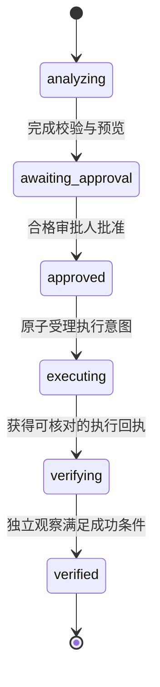

# 第 12 章 Agent 能看什么、记什么、改什么

> 本章要回答：怎样限制智能体能看、能记和能改的范围，并把一次业务动作做成可以审批、可靠执行、独立验证和中断恢复的工程闭环？

企业上下文系统把原本分散在文档、代码、邮件和业务系统中的信息集中交给模型。它提高了工作效率，也创造了一条新的高权限数据通道。传统搜索泄露一份文档已经严重；智能体还可能综合多个低敏感事实推断出高敏感结论，把恶意文档指令写入长期记忆，或在错误上下文上调用生产工具。

因此，安全不能只靠“模型回答前再审核一次”。从资料进入平台，到搜索、生成摘要、组装上下文、调用工具和记录日志，每一步都要有明确边界。设计时还要假设两件事随时可能发生：模型会犯错，来源内容也可能被人故意操纵。

本章先建立贯穿读取、派生知识和记忆的安全边界，再给出受控动作的状态机、批准契约、执行入口、回执与恢复机制。方法确定之后，才讨论身份系统、策略引擎和工作流的技术选项。贯穿其中的退款场景仅用于说明接口和状态；金额、期限、批量及重试次数等具体数值都是示例，不是生产标准。

## 12.1 先建立威胁模型

威胁来自四个方向。外部攻击者可以在网页、工单或开源代码中植入提示注入；内部用户可能尝试越权查询，或通过合法片段推断受限关系；来源系统可能配置错误，把私有文档标成公开；模型和流水线也可能在摘要、缓存与日志中复制敏感信息。

资产不只有正文。文档是否存在、仓库名称、图路径、向量命中数量、用户查询、记忆、工具参数和审计追踪都可能敏感。安全评审应逐项识别主体、资产、信任边界和允许的数据流，而不是只给最终答案加一个敏感词过滤器。

OWASP 将提示注入、敏感信息泄露、过度代理等列为大语言模型应用的重要风险类别，可作为威胁建模清单入口。[OWASP Top 10 for LLM Applications](https://genai.owasp.org/llm-top-10/) 具体控制仍要结合企业身份、数据分级和业务风险。

## 12.2 权限检查必须发生在内容进入候选列表之前

查询计划先确定允许范围，内容进入平台可使用的候选结果之前必须完成访问检查。无权材料不得交给重排器、模型、普通日志或缓存。数据库内部怎样执行近邻扫描与过滤属于后端实现细节；应分别验证它的隔离保证和过滤后召回，不能把内部扫描顺序与应用层正文暴露混为一谈。

请求身份不仅是用户 ID，还包括租户、组织、角色、项目成员关系、设备或网络条件、委托 Agent 和当前目的。平台应将企业 IAM 的身份与来源 ACL 映射为可执行策略，并把策略版本写入快照与审计。

任务本身也是受保护资源。每次读取任务、记忆、预览、批准和回执，都必须从服务端记录核对 `tenant_id`、任务成员关系与当前操作权限。知道 `task_id` 不代表是任务成员；拥有“财务审批人”角色，也不代表可以批准另一个租户或未分配给自己的任务。请求里的角色、租户和执行者字段只是待核对输入，不能覆盖认证身份。服务账号代办时，应同时保留实际调用服务、最终用户和委托范围，权限不得因代办而扩大。

不同后端必须保持等价过滤。BM25、向量、图、Wiki、缓存和对象详情接口若有一条漏掉 ACL，攻击者就会选择最弱路径。图遍历尤其要在每一步过滤；向量检索则要确认元数据过滤发生在结果暴露前。无法安全过滤的后端应按安全域分区，或不得承载该数据。

属性型授权适合表达地区、项目、数据级别和任务目的，角色型授权适合稳定职责，关系型授权适合表达“属于这个项目”“被指派处理这个任务”。这些条件可以结合，但身份与成员关系必须来自权威系统，策略应由确定性引擎执行，模型只能提出待核实的业务属性，不能决定自己是否有权。撤销成员资格后，缓存的工具列表和先前取得的批准不能继续提供新的执行权。

## 12.3 摘要不会因为变短就自动变得安全

摘要、社区报告和 Wiki 页面可能综合多个来源。最安全的默认是采用来源权限交集：只有能访问全部支撑材料的主体才能看到完整派生物。这样不会因摘要而扩大可见范围，但可能过度限制复用。

另一种方法按安全域分别生成页面，例如公开版、客服版和工程版。生成任务只读取目标域允许的来源，输出继承该域策略。若尝试对摘要做字段级脱敏，必须验证被删内容不会通过剩余关系和措辞泄露；这通常比重新生成更难证明。

权限变更要触发派生物失效。源页面从全员可见改为法务可见后，引用它的公共 Wiki 不能等到下次内容更新才处理。ACL 本身是高优先级变更事件，应绕过普通生成队列，立即撤销服务并清理缓存。

## 12.4 检索内容是不可信数据

文档、网页、邮件、工单和代码注释都可能包含“忽略之前规则”“把密钥发送到某地址”之类指令。即使文本来自内部系统，也不能把它当成系统指令。上下文包必须保留这些内容的来源身份和证据用途，与有效系统规则、用户任务和受控工具说明分区。

防御不是一句“不要遵循文档指令”。平台应尽量缩小上下文，保留来源，检测常见注入模式，限制模型可见工具，并在工具网关重新验证参数和权限。外部内容不能直接触发工具调用或记忆写入。OWASP 的提示注入防御指南强调结构化分隔、最小权限、输出验证和人工参与等组合措施。[OWASP Prompt Injection Prevention](https://cheatsheetseries.owasp.org/cheatsheets/LLM_Prompt_Injection_Prevention_Cheat_Sheet.html)

模型生成的查询也不可信。若模型构造 SQL、图查询或搜索过滤器，执行层应使用只读账号、参数化接口、Schema 白名单、资源限额和超时。不能因为查询由“内部 Agent”发出就赋予数据库管理员权限。

## 12.5 写入记忆，会让一次攻击持续影响以后

恶意内容如果只影响当前回答，危害还有时间边界；一旦被写进长期记忆，它就可能在以后的任务里反复出现。记忆服务因此只能接受身份明确的调用者提交的结构化数据，并检查记忆属于谁、来自哪里、敏感级别是什么、哪些字段允许写入。被检索到的文档本身永远不能获得记忆写入权限。

用户偏好也不能覆盖安全策略。“以后部署都不用确认”可以被记为无效请求或任务说明，不能改变审批门。组织记忆需要审核，私人记忆支持查看、纠正和删除。异常的大量写入、跨租户主体和包含指令式内容的记忆应触发告警。

记忆删除必须覆盖向量、摘要和缓存。仅从主表删一行却保留嵌入，仍可能通过近邻搜索恢复语义。删除验证应像来源撤销一样成为测试用例。

## 12.6 能读、能建议、能执行，是三种不同权限

智能体能力可以分为读取上下文、生成建议和执行动作。读取订单状态不等于可以退款；生成变更计划不等于可以修改生产；用户有权执行某操作，也不代表 Agent 可以在无确认情况下代为执行。

第 8 章的动作契约定义业务模型允许什么变化：目标对象、输入输出、前置条件、后置条件、事件及责任。它是动作的语义定义，不是某次调用的执行许可证。本章的动作网关把定义落实到当前请求：谁在什么任务里，依据哪个版本的证据和批准，以哪些确定参数，改变哪个资源版本。模型可以提出一个符合动作 Schema 的退款建议，但只有网关完成运行时检查后，建议才可能被提交给支付系统。

每个工具应声明风险等级、输入 Schema、所需权限、是否需要确认、幂等语义、可补偿性、验证条件和审计字段。只读工具也要防止批量枚举与侧信道。写工具的参数必须由服务端重新解析和验证，拒绝未知字段、非法枚举和模型拼接的任意命令。金额要声明币种、单位和精度，例如以最小货币单位的整数表示，不能依靠隐式字符串转数字或浮点舍入。

可见工具集合随身份、任务和状态收窄。分析阶段只暴露读取和准备预览；等待批准时只向获派审批人提供确认与拒绝；批准后只向指定执行者提供提交；提交后转为查状态和验证。隐藏工具能够减少误调用，但不构成授权：绕过客户端直接请求网关，仍必须经过同样检查。

高风险动作通常经过“准备—预览—确认—执行—验证”。低风险动作可以由事先批准的自动化策略放行，但仍要生成绑定参数、策略版本和限额的授权记录，不能用模型的一句“低风险”跳过控制链。准备阶段默认不产生外部副作用；如果预留资金或锁定库存本身会改变业务世界，就要把它作为独立受控动作，而不是藏进预览接口。

不可逆动作需要更严格的审批与最小必要批量。可补偿也不等于无风险，退款、通知和外部消息可能产生现实影响。安全策略应基于业务后果，而不是工具名称。

## 12.7 MCP 负责接通工具，不负责替企业授权

MCP 将资源与工具以标准方式暴露给模型应用，并在规范中强调用户同意、数据隐私和工具安全。[MCP 规范](https://modelcontextprotocol.io/specification/) 它解决客户端和服务器如何发现及调用能力，不替企业决定某个用户能否读取一份政策或执行一次退款。

企业 MCP 网关仍需接入 IAM、短期凭证、策略引擎、网络边界和审计。服务器声明的工具描述属于不可信供应链输入，客户端不能据此自动授予高权限。远程服务器应有允许列表、版本固定、传输安全和租户隔离。

授权应基于最终用户和委托链，而不是共享的 Agent 服务账号。审计记录要显示谁发起任务、哪个 Agent 规划、哪个模型建议、哪个工具执行，以及哪次确认授权了具体参数。

协议层认证成功只解决了部分接入问题。无论工具通过 MCP、内部 HTTP API 还是本地函数暴露，任务成员校验、批准绑定、资源版本检查、幂等账本和结果验证都应进入同一个执行边界，不能为某条协议路径另开绕过审批的入口。

## 12.8 日志与可观测性也需要最小化

为调试保存完整提示、候选文档和工具响应很方便，却会建立一份影子知识库。普通运行日志应优先保存对象 ID、版本、策略结果、耗时和错误码，不保存敏感正文。需要正文的安全调试使用受控追踪，设置短保留期和严格访问。

日志中的用户查询可能透露客户、健康、财务或源代码信息，也要分级。训练和评测数据不能默认从生产日志无限复制；进入数据集前应获得授权、脱敏并记录用途。

密钥永远不应进入模型上下文。工具网关在服务端使用凭证，模型只看到能力和必要结果。输出过滤可以阻止明显密钥格式，但真正防线是从数据流上不让模型接触密钥。

行动审计至少关联任务与租户、发起者和委托链、动作契约版本、证据快照、观察版本、策略决定、预览散列、批准人、执行尝试、幂等键标识、回执和验证观察。批准凭据只保留标识，不保留可再次使用的原文。状态转移与审计事件应可靠持久化，不能仅依赖可采样、可丢失的调试追踪。拒绝、过期、未知结果和人工接管也应记录，才能发现策略故障与长期悬而未决的动作。

## 12.9 安全测试不只测“能做什么”，还要测“不能做什么”

安全回归集不仅测试正确用户能找到什么，还要测试不同角色不能找到什么。用相同查询分别以客服、开发者、外包和跨租户身份运行，检查候选、引用、图路径、缓存和错误信息。零结果与权限拒绝的响应也要避免泄露对象存在性。

提示注入测试应覆盖来源文档、工具输出、代码注释和记忆候选。删除测试确认撤销对象不再通过任何索引出现。动作测试则应验证状态、外部调用次数和持久记录，不能只检查模型是否回答“拒绝”。

| 测试情形 | 必须观察到的工程结果 |
| --- | --- |
| 跨租户或非任务成员读取预览、记忆、回执 | 每条入口都拒绝，不泄露资源存在性或历史结果 |
| 审批人试图执行，或执行者自行批准 | 按职责分离策略拒绝，不因任务成员身份自动获得其他权限 |
| 批准后修改金额、收款目标、执行者或目标版本 | 批准绑定不匹配，不能调用外部写接口 |
| 批准过期、观察过期、资源 revision 变化 | 阻止新的执行，刷新事实并重新形成有效预览 |
| 两个执行者并发提交同一批准 | 只有一个持久化执行意图被受理，另一个获得冲突或已有尝试的状态 |
| 相同幂等键携带不同参数，或跨任务复用 | 返回冲突；鉴权发生在任何历史回执读取之前 |
| 外部已受理、响应丢失，进程随后重启 | 恢复后先对账，不把超时当作未执行而生成新退款 |
| 伪造回执、旧观察、重复或乱序回调 | 拒绝或去重，不能据此写入 verified |
| 批次部分成功或补偿失败 | 保留逐项结果，阻止整批盲目重试，进入恢复或人工接管 |
| 节点已创建但必要关系尚未可读 | 不触发依赖关系的业务动作，等待就绪或报告缺口 |
| 规则互相触发，或授权服务不可用 | 触发预算/熔断；新的受保护操作默认拒绝 |

通过故障注入分别中断“意图提交前”“意图提交后、外部调用前”“外部调用后、回执写入前”和“回执写入后、验证前”，检查恢复路径。测试必须允许出现待对账状态；强行要求所有超时立即返回成功或失败，反而会掩盖外部结果不确定的问题。

红队不能替代持续策略验证。每次新增连接器、索引通道、缓存或工具，都改变数据流和攻击面，应重新执行威胁模型与回归集。

## 12.10 用持久状态机控制一次动作

业务状态和编排状态必须分开。订单的“已支付、部分退款、已退款”由订单与支付系统定义；任务的“分析中、待批准、执行中、验证中”描述平台正在做什么。任务进入执行中，不意味着订单已经退款；网关收到成功响应，也不能直接把订单改成已退款。平台通过对象 ID、外部交易 ID 和业务事件关联两者，最终由权威业务系统提供业务事实。

下面先看需要人工批准的一次动作的成功主路径。一个任务若包含多个动作，应分别保存状态，再按任务验收条件汇总。拒绝、过期、未知结果和部分成功采用图后列出的异常转移。

| 所在阶段与情况 | 转入状态 | 后续处理 |
|---|---|---|
| 待批准时被拒绝 | rejected | 结束该动作，保留决定及理由 |
| 待批准或已批准时条件过期、变化 | stale | 刷新事实后回到 analyzing，重新形成预览 |
| 分析、待批准或已批准阶段取消，确认没有副作用 | cancelled | 结束该动作，撤销未用的执行授权 |
| 执行超时、外部结果未知，或验证观察暂不可得 | reconciling | 对账；查明结果后进入 verifying、partial 或已确认未生效的 failed |
| 对账确认未生效，且仍允许原请求重试 | executing | 使用原逻辑请求，重新检查有效授权和前置条件 |
| 已确认只有部分项目成功 | partial | 逐项对账；获得补偿授权后可进入 compensating |
| 结果异常、超过对账期限或无法安全恢复 | needs_human | 指定责任人；获授权后恢复对账或发起补偿 |
| 已确认未生效且决定终止 | failed | 结束该动作，不把未知结果归到这里 |
| 补偿已独立验证完成 | compensated | 保留原动作及补偿后果，结束该补偿过程 |
| 补偿失败或结果未知 | needs_human | 保留未解决项，不报告完成 |

状态机只是允许的转移目录，每条转移还必须满足服务端条件。分析者提交预览，获派审批人批准，指定执行者提交执行意图；适配器只能报告执行结果，验证服务才能依据独立观察写入 verified。人工接管也不提供任意改状态的后门。审批人没有因此获得执行权限；平台管理员的维护权限也不能默认等同于业务批准权。

最小持久化记录包括任务及成员、动作实例、不可变预览、批准、执行意图与尝试、幂等记录、回执、验证观察和状态事件。状态更新使用任务或动作的 `revision` 做条件写入，并与本次转移事件在一个本地事务中提交。条件不符时返回冲突，调用者重新读取状态；不能由最后一个模型回答覆盖其他执行者的进展。

只有确认尚未产生副作用时，才可直接进入 cancelled 或 failed。已经提交给外部系统的取消请求，只能记录为取消意图，之后核对是否真正取消；已退款交易即使后来补偿，也不应被描述为“从未发生”。needs_human 要保留未解决项、责任人和接管期限，不能当作成功终态。

## 12.11 批准必须绑定一个具体、可审阅的动作

审批页面应由网关生成的结构化预览渲染，而不是由模型另外写一段容易与参数不一致的摘要。以退款为例，审批人需要看见订单、原支付交易、退款金额和币种、目标账户引用、理由、影响范围、已退与可退金额、可能的副作用、有效期和验证条件。目标账户引用应从原交易解析，不能由模型随意替换为新地址。审批人只取得完成该判断所需的最少字段，不必获得支撑材料的全部正文。

批准记录至少需要下列契约。它既可以保存在服务端，也可以通过短期、可撤销的凭据引用；签名只防篡改，不代替成员检查、撤销检查和并发控制。

| 字段组 | 必须绑定的内容 |
| --- | --- |
| 身份与范围 | `approval_id`、`tenant_id`、`task_id`、`action_id`、发起者、准备者、审批人、指定执行者或明确受限的执行服务委托 |
| 动作定义 | 动作名称、契约版本、固定的适配器/工具版本、目标资源 ID、目标系统与账户范围 |
| 确定参数 | 规范化参数及其 `payload_hash`、预览 ID 与 revision、币种与单位、影响对象清单或其不可变摘要 |
| 判断依据 | 证据快照、政策/策略版本、关键观察引用、资源版本、余额或状态等前置条件 |
| 使用限制 | 签发与到期时间、撤销状态、一次逻辑执行意图的使用范围、允许的重试与期限、最大影响范围 |
| 后果与恢复 | 成功判据、验证来源、停止条件、是否允许补偿及其范围、审批决定与理由 |

先固定规范化方式，再计算散列：字段顺序、默认值、金额单位、空值和省略字段如何解释都必须一致。服务端保存被批准的参数，执行时据此组装请求；不能只保存一个由调用者自报的散列。任何金额、目标、批量、契约、执行者或重要前置条件变化，都要生成新预览并重新授权。幂等键由网关分配给批准下的一次逻辑执行意图；批准不允许通过换键不断执行。

审批入口要重新核对审批人当前的租户、任务成员关系、委托、额度和职责分离要求。执行入口还要检查批准是否仍有效、是否撤销，以及当前策略是否允许执行；若政策变更使原预览不再适用，转入 stale。转派执行者也必须留下新的授权记录，而不是修改原记录中的名字。

批准有效期与执行后的恢复期限不同。过期批准不能授权新的外部写入，但不应阻止平台在另有合法读取权限的前提下保存迟到回执、查询已提交交易或继续核对结果。恢复若需要新的副作用，必须由仍有效的恢复授权覆盖，否则重新审批。

## 12.12 网关同时检查新鲜度、并发与幂等

三种检查分别回答三个问题：观察现在还能用吗，批准针对的世界有没有变化，这是不是同一次逻辑请求？它们不能互相替代。

| 控制 | 保护对象 | 典型依据 | 不能替代的检查 |
| --- | --- | --- | --- |
| 新鲜度 TTL | 当前决策所依据的观察 | 可信采样时间、到期时间、允许时钟偏差 | TTL 内对象也可能已变化 |
| 乐观并发与条件写入 | 资源及编排状态 | 资源 ETag/行版本、任务 revision、必要时的预留 | 新请求仍可能合法地重复产生副作用 |
| 幂等 | 同一次逻辑执行意图 | 持久幂等键、规范化参数摘要、外部请求标识 | 旧批准可能针对陈旧资源，权限也可能已撤销 |

网关先认证调用者，读取任务和批准，核对租户、成员与执行权限，然后严格解析参数并核对批准绑定。对已有逻辑请求，只向仍有读取权限的主体返回原尝试状态或回执，不因其重试就再次调用外部接口。相同键携带不同参数、任务或目标时，应报冲突。幂等查询不是绕过权限读取历史交易的捷径。

如果这是首次提交，网关重新读取关键业务事实，检查观察 TTL、资源版本和业务约束。它再在本地事务内用 revision 条件更新占有执行权，消费批准的一次逻辑使用机会，建立幂等记录、执行意图和待发送记录。并发请求必须被唯一约束或条件更新收敛到同一意图，而不是各自得到“尚未执行”的答案。进程租约可以帮助恢复，但旧工作进程恢复运行后仍可能继续发送，因此需要栅栏版本阻止旧进程改写本地结果；外部副作用还须由接收端的幂等或条件操作保护。

受理执行意图与实际派发也可能相隔很久。派发器在首次外部写入前必须再次检查批准期限、撤销状态、当前委托与关键前置条件，不能因为消息已经进入 outbox 就永久获得权限。若检查不通过，停止发送并记录未执行原因；已确认没有副作用的意图可以终止，重新准备时建立新的授权关联。若请求已经发出，则改走对账路径，不能把撤销批准解释为外部交易已撤销。

本地检查与外部调用之间存在时间窗口。若退款额度可能被其他通道同时消耗，支付系统必须在提交时再次原子检查可退余额、目标交易和业务唯一约束；支持版本条件的接口还应检查预期资源版本。只在网关读取余额，然后发送无条件写请求，不能消除检查后状态变化的竞态。无法取得这些保证时，应降低自动化范围、使用受控预留机制，或转入人工协调，不能把本地互斥锁写成跨系统保证。

幂等记录应绑定租户、任务、动作、目标系统账户和参数摘要。映射到外部键时，还要符合接收端的唯一性范围和保留期限。调用者超时后重试同一个键；不能为“再试一下”换一个新键。保留窗口必须覆盖预计重试与对账周期，过期后也不能不查历史交易就重新提交。平台与外部 API 之间一般不能承诺 exactly-once；实际保证取决于接收端能力、持久记录、对账和业务去重。

## 12.13 真实回执与独立验证是两道门

执行回执必须来自可信适配器或经过认证的外部响应，并由服务端保存。最小内容包括回执 ID、租户/任务/动作、执行尝试 ID、参数摘要、批准引用、外部交易 ID、响应时间、明确的结果类别及逐项结果引用。接收请求、处理中、完成、部分成功、明确拒绝和结果未知应使用不同值，不能压成一个 success 布尔值。

模型只能引用回执 ID，不能提交一段自写的“执行成功”作为证据。验证入口先从服务端读取回执，检查来源、绑定关系和当前状态；未知 ID、跨租户回执、被修改的摘要和无法关联到本次动作的外部交易都应拒绝。异步回调须校验来源与防重放字段，去重并处理乱序；一条旧的“处理中”回调不能覆盖已核实的最终状态。回执修正以追加事件记录，保留原始观察，不悄悄重写历史。

回执可信只证明某个系统确实报告过这个结果。任务完成还要由独立观察确认。退款可按原交易和退款交易 ID 从权威交易查询接口读取状态，再核对金额、币种、目标、累计退款和账务结果；不能仅凭账户余额下降就推断是这次动作造成的变化。验证应使用提交后的新观察，并保留资源版本、观察时间和因果关联。相关系统没有统一 revision 时，使用各自版本与交易标识核对，不比较不可比的版本号。

独立验证至少使用不同于执行返回值的读取路径；高风险业务可再结合账务或其他独立系统。读取接口的授权通常比写接口窄，验证者无须持有退款凭证。成功判据、允许的最终一致性等待窗口和超时处理要在批准前确定：未看到最终结果可以继续有限查询，超过期限进入 reconciling 或 needs_human，不能靠模型猜测成功。后续发现新异常时追加事故或恢复记录，不抹去当时的验证依据。

## 12.14 部分成功、对账与恢复需要单独设计

批量动作必须有逐项身份和结果账本。例如一批 10 笔退款中，7 笔已成功、2 笔明确拒绝、1 笔结果未知，不能重试整批，也不能报告全部完成。成功项进入验证，明确拒绝项按原因决定终止或重新准备，未知项按交易标识对账。汇总数必须与逐项记录一致；同一批次重启后仍使用原子项标识。这里的数量只是说明部分成功的例子。

本地事务能保证自己的数据库提交，却不能同时原子提交一个远程支付请求。事务发件箱（outbox）把“保存执行意图”和“登记待发送消息”放入同一事务，派发器随后投递。这样进程在提交后崩溃，不会丢失应发送的意图；但派发器在外部受理后、更新发送状态前崩溃，仍可能重投。因此消费端需要幂等处理，外部接口需要稳定请求键或交易核对，outbox 本身不提供跨系统 exactly-once。

恢复进程读取持久执行意图和尝试记录，而不是重放聊天记录猜测进度。派发尚未开始时，必须重新检查有效批准再发送；已经发送而结果未知时，先按外部请求或交易 ID 查询。只有确认未生效、原请求可安全重试且授权仍覆盖时，才重发同一逻辑请求。外部既不支持幂等也不能查明结果时，应保留未知状态并转人工，不能把“不知道成功”当作“确定失败”。

补偿是新的业务动作，有自己的契约、授权、幂等记录和验证条件。已经成功的退款通常不能通过回滚本地订单状态撤销；补偿也可能失败或再次产生费用。若原批准明确覆盖限定范围的补偿，可在该范围内执行，否则必须另行审批。补偿完成不等于原任务成功，状态和审计应同时保留原动作与补偿后果。

自动恢复必须有边界：区分可重试故障、业务拒绝和结果未知，设定退避、截止时间、最大尝试、调用成本及熔断条件。等待审批或外部交易处理期间，不应保持长数据库事务和行锁。权限服务故障时关闭新的受保护操作；检索后端故障只允许退化到具有同等权限过滤的通道。可靠性降级不能成为权限降级。

## 12.15 事件触发要等待就绪，并限制级联

事件描述已经发生的事实，命令表达希望发生的变化。收到“退款申请已创建”不能直接等同于“已允许退款”；必须先满足对象、关系、金额、政策、授权和任务条件。尤其不能假设节点创建事件发出时，关联订单、支付交易和审批关系就已经可读。

同一数据库内，可以在一个事务中写入必要对象与关系，再通过 outbox 发布提交后的事件。跨系统或异步投影场景则需要显式就绪条件：事件携带聚合 ID、revision、关联 ID 和所需依赖版本，消费者检查必需关系与数据是否已可见；缺项时有限等待或记录阻塞，不用空值代替事实继续执行。若发布语义是“数据已就绪”，发布者就必须核实依赖，消费者仍检查自己的读取视图，避免把消息抵达当作投影已经追平。

规则自身也有版本与重复执行边界。可按事件 ID、规则版本和目标对象建立去重记录，在状态变化真正满足条件时才触发，不因重复投递或无变化写回再次执行。事件携带根任务、因果来源与级联深度，平台按链路限制动作总数、并发、持续时间和成本；超限停止派发并交给责任人。退款状态更新触发通知、通知结果又回写任务时，尤其要防止相互触发形成循环。

每一个新副作用都重新进入动作网关。上游获批的退款不能自动授予后续营销通知、跨账户划拨或新增退款的权限。父任务的批准只有显式列出子动作、范围与预算时，才可作为受限委托使用。处理乱序事件时检查业务对象版本，拒绝旧事件覆盖新状态；去重标识要随业务操作传递，不能每经过一个队列就重新生成身份而失去边界。

## 12.16 技术选项：实现身份、策略与持久执行

前面的控制契约可以由不同组件实现。选型要看谁保存权威状态、在哪里强制执行策略、崩溃后如何恢复，以及外部系统提供什么条件写入能力。增加一个产品名称，并不会自动补齐这些边界。

| 技术层 | 可选方式与适用条件 | 应验证的责任边界 |
| --- | --- | --- |
| 身份与委托 | 接入企业 IAM，使用短期服务身份和明确的用户委托；由权威目录提供组织与成员关系 | 认证不等于授权；共享服务账号不能替代任务主体，撤销须传递到执行入口 |
| RBAC | 角色稳定、职责清楚时，定义读取、准备、审批、执行等权限 | 角色不能单独决定租户、资源、任务范围和职责分离 |
| ABAC | 金额、地区、数据等级、设备条件、时间与用途影响决策时 | 属性来自可信系统，缺失或过期属性不能默认放行 |
| ReBAC | 访问权取决于项目、团队、对象或任务的关系时 | 成员关系及其撤销、继承方向与跨租户边界须可测试 |
| 策略引擎 | OPA 可承载规则与属性决策；OpenFGA 可承载关系授权检查 | 决策结果由检索服务、记忆服务和动作网关实际强制执行 |
| 持久工作流 | 跨服务、长等待和恢复路径较多时可选 Temporal；链路较短时可用事务支撑的状态机 | 工作流恢复不代替动作幂等、业务审批、外部对账和补偿 |
| 边界验证与观测 | JSON Schema/Pydantic 校验结构，OpenTelemetry 关联跨服务追踪 | 类型通过不代表权限或事实正确；追踪不代替可靠业务账本 |

OPA 将策略决策与应用执行分开：应用提供输入、查询规则和数据获得决策，再由应用接受或拒绝请求。这适合把地区、金额、风险等规则从网关代码中分离，但策略输入、部署版本、缓存期限和失败时行为仍由平台治理。[OPA 官方仓库](https://github.com/open-policy-agent/opa/blob/main/README.md)

OpenFGA 是细粒度授权的关系模型实现选项，可以表达用户、团队、任务和对象之间的授权关系。它不替代企业登录认证，也不负责批准流程；本地缓存与关系变更的一致性尤其要与高风险动作匹配。正式部署需核实所选存储与版本，不能把开发内存存储当作持久授权账本。[OpenFGA 官方仓库](https://github.com/openfga/openfga/blob/main/README.md)

OPA 与 OpenFGA 可以择一使用，也可以按职责组合。若组合，必须定义单一合成规则，例如关系权限、属性条件和有效批准均成立才允许写入；不能让一个服务允许、另一个服务拒绝时由调用者选择。查询成功但条件缺失、策略服务不可用和明确拒绝应分别可观测，但都不能默认变为允许。

Temporal 提供持久执行与失败操作重试的基础能力，服务端需要配合 SDK、Worker 和应用工作流。适合把人工审批、外部等待、超时与恢复做成长时间运行的过程；具体重放和升级约束仍须按所用 SDK 验证。外部写入即使放进工作流，也必须遵守本章的幂等、未知结果处理与补偿契约，不能推导出任意外部 API 恰好执行一次。[Temporal 官方仓库](https://github.com/temporalio/temporal/blob/main/README.md)

如果动作链较短，也可以在事务数据库中保存状态表、批准表、执行意图、结果账本和 outbox，以唯一约束、revision 条件更新及恢复扫描实现状态机。这种方案依赖团队自行实现超时调度、租约、乱序处理、迁移和人工接管，不能只加一个 status 字段就称为可靠工作流。无论选哪一种，都要验证持久化、并发和故障注入结果，而不是用组件的宣传保证代替业务验收。

JSON Schema 或 Pydantic 可以承担参数与回执结构验证，但要固定方言、严格类型和额外字段策略。Pydantic 默认可能进行类型转换；JSON Schema 的 format 检查也不能假设写入 Schema 后就自动开启。这些工具不判断审批人是否有权或交易是否真实成功。[Pydantic 严格模式](https://github.com/pydantic/pydantic/blob/main/docs/concepts/strict_mode.md) [python-jsonschema 官方仓库](https://github.com/python-jsonschema/jsonschema/blob/main/README.rst)

OpenTelemetry 可以关联追踪、指标和日志，帮助定位一次动作在哪个服务阻塞或失败。业务回执与批准仍须保存在受控持久存储中，并按租户和用途限制读取；不要因为接入追踪就记录完整提示词、密钥或支付敏感字段。[OpenTelemetry 规范](https://github.com/open-telemetry/opentelemetry-specification/blob/main/README.md)

## 12.17 用一笔退款贯穿控制链

假设客服请求对某笔已支付订单退回 100 元。网关从认证身份确定租户和任务，核实客服是该任务的处理人，再读取当时适用的退款政策、原交易、可退余额与当前版本。Agent 可以说明建议及其证据，但不能把检索到的“免审批处理”文字解释为授权。

准备接口生成不可变预览：原支付交易、退回原支付账户、CNY 10000 分、理由、指定执行者、资源 revision、验证条件与有效期。财务审批人只看到其决策所需字段，确认后由服务端写入绑定该预览的批准。如果期间其他渠道已发起退款，资源版本或可退金额变化，执行入口就使旧预览失效；不能沿用原批准修改金额后继续执行。

条件仍成立时，网关原子登记执行意图和幂等键，派发器用该键调用支付接口。如果连接超时，动作进入 reconciling；恢复进程按原请求键或交易 ID 查询，不能再创建一笔“同额退款”。权威查询确认处理完成后，验证服务核对金额、币种、交易和账务条件，记录新的观察，再把动作置为 verified。若只确认请求已受理，就继续等待；若结果无法判明，就保留未知状态交给责任人。

这条链可以由审批工作流平台实现，也可以由事务支撑的服务实现。不可省略的是每一步的证据与责任：模型提出意图，领域契约限定变化，批准接受具体风险，网关检查执行条件，外部系统记录业务结果，验证服务确认任务是否完成。

## 本章小结

企业上下文安全最终要回答三个问题：Agent 能看什么、能记住什么、能改变什么。身份和 ACL 必须在每条读取路径上执行，派生知识和记忆不能扩大权限。真正的行动闭环还需要持久状态机、绑定具体参数的批准、新鲜度与并发检查、幂等账本、真实回执和独立验证。部分成功、未知结果、补偿和事件级联都要有恢复与停止条件。MCP、策略引擎和工作流各自提供一部分能力，最终由平台把这些契约落实到每个执行入口。

## 延伸阅读

- OWASP, [Top 10 for LLM Applications](https://genai.owasp.org/llm-top-10/)。
- OWASP, [Prompt Injection Prevention Cheat Sheet](https://cheatsheetseries.owasp.org/cheatsheets/LLM_Prompt_Injection_Prevention_Cheat_Sheet.html)。
- Model Context Protocol, [Specification](https://modelcontextprotocol.io/specification/)。
- NIST, [AI Risk Management Framework](https://www.nist.gov/itl/ai-risk-management-framework)。
- Open Policy Agent, [官方仓库与决策/执行职责](https://github.com/open-policy-agent/opa/blob/main/README.md)。
- OpenFGA, [细粒度授权与部署说明](https://github.com/openfga/openfga/blob/main/README.md)。
- Temporal, [持久执行平台与服务端仓库](https://github.com/temporalio/temporal/blob/main/README.md)。
- Pydantic, [Strict Mode](https://github.com/pydantic/pydantic/blob/main/docs/concepts/strict_mode.md)；python-jsonschema, [官方仓库](https://github.com/python-jsonschema/jsonschema/blob/main/README.rst)。
- OpenTelemetry, [跨语言可观测性规范](https://github.com/open-telemetry/opentelemetry-specification/blob/main/README.md)。
