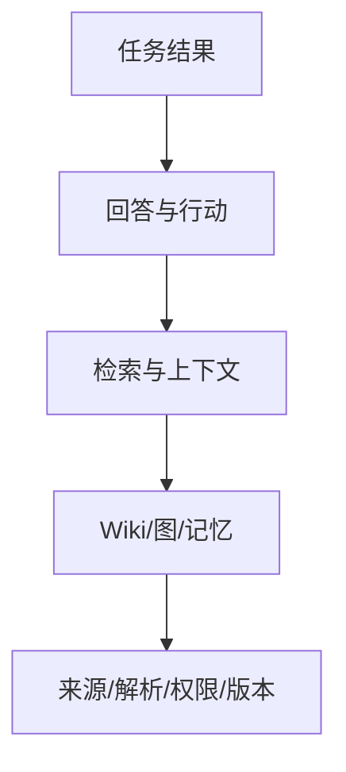

# 第 13 章 评测、可观测性与运营

> 本章要回答：如何证明企业上下文系统改善了真实任务，而不是只让答案看起来更流畅？

一个演示系统只要回答几道准备好的问题就显得聪明，生产系统却会同时面对新文档、权限变化、模型升级、索引延迟、模糊问题和恶意输入。端到端评价“答案看起来不错”既无法定位失败，也无法判断一次架构升级是否真的有价值。

企业上下文评测需要沿数据生命周期分层，并把质量、安全、时效、成本与业务结果放在同一张运营图上。最终任务成功最重要，但只有中间指标能告诉团队该修解析器、检索器、知识页面、模型还是工具。

## 13.1 建立质量树

质量可以拆成五层。数据层检查来源覆盖、解析准确、版本和 ACL；知识层检查分块、实体、图边、Wiki 与记忆；检索层检查候选和排序；生成层检查忠实度、引用和拒答；任务层检查用户是否完成工作以及行动结果。

上层失败可能由任何下层引起。回答遗漏政策例外，可能是 PDF 表格解析丢失、正确片段未召回、父块被裁剪，也可能是模型忽略证据。评测记录必须保留这些阶段产物，才能进行归因。

每层指标还应区分“能否工作”和“工作得多好”。权限泄漏、错误执行和无法回滚属于硬门槛，任何一次失败都可能阻止发布；Recall@10 从 0.82 到 0.84 则是渐进优化。把两者平均成总分会掩盖不可接受风险。

## 13.2 Golden Dataset 的最小单元

金标准不应只有问题和参考答案。一个企业任务样本至少包含用户身份、任务、查询、业务时间、知识快照、允许范围、必要证据、可接受声明、拒答条件、不应出现的证据以及期望工具行为。

同一句“退款规则是什么”应以不同地区、角色和时间形成多个样本。客服看到政策与处置流程，开发者可能看到实现说明，外部承包商则可能必须拒答。历史样本绑定旧快照，当前样本随规范来源更新。

证据标注比完整自然语言答案更稳定。措辞可以变化，只要关键声明由允许证据支持。对开放问题，可以标注必要事实集合和禁止断言；对影响分析，可以标注必需节点和允许的潜在路径；对行动任务，标注前置条件、审批和最终状态。

数据集应从真实工作采样，而不是只由架构师想象。搜索日志、支持问题、事故、代码评审和新人入职可以提供候选，经脱敏和业务所有者审核后进入集合。高频问题衡量价值，长尾和对抗问题衡量韧性。

## 13.3 逐层指标

来源与解析层可以测量连接成功率、对象覆盖率、字段解析准确率、版本定位率、ACL 映射正确率和删除传播时间。对 PDF 表格、代码符号和 API Schema 应分别抽样，因为平均解析率会掩盖困难类型。

检索候选阶段使用 Recall@K 判断必要证据是否进入前 K，MRR 衡量首个相关结果位置，nDCG 衡量多级相关性的排序。指标必须按查询类型和角色分桶；一个总体高分可能来自大量简单精确查询，而关系题全部失败。

图谱测量节点解析精度、边 precision/recall、实体合并错误率、路径覆盖和证据等级。Wiki 测量页面覆盖、关键声明引用率、陈旧窗口、冲突发现率与人工审核通过率。记忆测量应写入/不应写入判定、主体隔离、冲突更新、删除完成和跨任务污染。

生成层关注答案相关性、声明忠实度、引用精确率、引用覆盖率、冲突表达与正确拒答。RAGAS 提供上下文相关性、忠实度等自动化评估思路，可作为低成本信号，但模型裁判可能有偏差，不能替企业证据标注和人工抽检。[RAGAS](https://arxiv.org/abs/2309.15217)

任务层衡量解决率、人工接管率、完成时间、修复是否持久、错误动作率和用户复核成本。知识系统的价值最终体现在真实工作，而不是离线问答分数。

## 13.4 消融与回归

每增加向量、重排、图扩展、Wiki 或记忆，都要证明边际贡献。消融实验保持数据集和快照不变，比较 BM25 only、Vector only、融合、重排、图、Wiki 和完整系统。结果按题型展示，才能决定能力路由。

回归测试则保证新版本不破坏既有契约。解析器升级后检查对象和引用；嵌入模型升级后检查召回与索引兼容；策略修改后运行角色矩阵；模型升级后检查忠实度、拒答和工具计划。任何发布都应保存基线与差异，而不是只看新版本绝对分数。

统计结果要附样本量和置信区间。十道题提高一题不能证明稳定改进。对关键安全测试，采用零容忍而非统计平均；对质量指标，可用 bootstrap 或成对检验判断变化是否超出样本噪声。

## 13.5 离线、影子、金丝雀与在线反馈

离线评测可重复、便宜，适合快速迭代，却不能完全模拟生产查询和数据分布。影子模式让新系统读取真实请求但不影响用户，用于比较计划、候选和延迟。通过后再对少量低风险流量做金丝雀，观察质量和安全告警。

在线反馈应收集具体失败类型，而不只有赞踩。用户可以标记证据错误、版本过期、缺少来源、答案误读或权限异常。工具任务还应观察真实结果，例如积压是否下降、部署是否成功，而不是把 Agent 声称“已完成”当作成功。

反馈不会自动成为训练真相。它可能有偏差或恶意，需要与任务、身份、快照和证据绑定，经过聚类和审核后转化为测试样本、知识纠错或产品改进。

## 13.6 查询追踪

一次可诊断的查询追踪应记录 trace ID、主体与策略版本、Snapshot Manifest、查询计划、各通道耗时、候选对象及排名、重排结果、上下文选择、模型与提示版本、最终引用、工具调用和反馈。普通日志使用 ID 和摘要，不复制敏感正文。

追踪可以回答：正确证据是否被解析；在哪条通道召回；为何被重排器降级；是否因预算被裁剪；模型是否引用；工具是否基于同一任务状态执行。没有这条链，线上问题只能靠重新提问碰运气。

OpenTelemetry 定义了 traces、metrics 和 logs 等可观测性信号，并提供跨服务传播上下文的标准，可用于平台追踪基础。[OpenTelemetry 文档](https://opentelemetry.io/docs/) 企业实现还需对敏感字段做采样、脱敏与访问控制。

## 13.7 运营仪表盘与 SLO

数据新鲜度应按来源类别设 SLO。告警和运行状态可能要求秒级，服务目录与代码分钟级，政策在发布后规定时间内同步，历史档案可以更慢。一个全局“索引更新时间”无法表达这些差异。

运营指标包括连接器水位、失败队列、索引覆盖、过期 Wiki、未解析实体、图边增长、发布快照、查询 P50/P95/P99、各通道贡献、Token 与模型成本、缓存命中以及权限拒绝。所有者队列显示待审核页面、冲突、知识缺口和删除任务。

SLO 应连接用户后果。例如“95% 的代码提交在 15 分钟内可检索”“当前政策发布后 5 分钟内旧版本停止默认召回”“99.9% 查询执行正确 ACL”“高风险动作 100% 有有效确认”。错误预算帮助团队平衡新功能与可靠性。

## 13.8 成本与收益

成本按摄取、存储和查询拆解。全量模型生成 Wiki 可能在建设期便宜，却在每次变更重建时昂贵；在线重排提高质量，也增加延迟和模型费用。记录每条通道的候选贡献后，可以识别“经常调用却从未进入最终证据”的组件。

收益也不能只看查询量。可以比较新人完成任务时间、事故平均恢复时间、支持一次解决率、代码影响遗漏和知识维护成本。归因并不完美，但至少应建立任务基线和对照，而不是用模型调用次数代替价值。

平台运营最终是一个持续控制回路：生产失败生成可复现样本，样本定位层级，修复形成候选快照，回归与金丝雀证明改进，再发布到生产。

## 13.9 容量、吞吐与压测

延迟 SLO 不能替代容量设计。企业上下文的存储量首先由逻辑对象数、平均版本数和各投影放大倍数决定。一个可用于早期估算的模型是：`总量 = 来源 blob + 版本元数据 + 全文索引 + 向量数 × 单向量字节 + 图节点与边 + Wiki 派生物 + 历史保留`。其中最容易被低估的不是原文，而是多版本向量、全文位置表和高扇出关系。容量表应分别列当前热快照、历史冷层和可重建缓存，不能只报告数据库总大小。

写入吞吐由变化率而非文档总量决定。容量规划至少需要峰值变更对象数、单对象平均分块数、嵌入和摘要服务并发、图关系解析扇出、允许的新鲜度窗口。若一分钟进入 10,000 个新块，而嵌入服务每秒只能稳定处理 50 个，系统就需要超过三分钟才能清空队列；此时要么扩大批处理并发，要么延长该来源 SLO，要么先发布 `lexical-only` 快照。积压必须按来源和租户分队列，避免一个大型仓库更新阻塞政策同步。

查询容量则从峰值 QPS、每次查询的通道扇出和下游预算推导。假设入口为 100 QPS，每次并行调用 BM25、向量和图三条通道，那么候选服务面对的是接近 300 次下游请求，再加重排与证据解析。缓存可以减少重复读取，却不能作为容量计划的前提。规划器应限制每通道候选数、图遍历节点数和证据解析字节，并在达到队列或延迟阈值时触发限流、降级或异步任务，而不是继续扩大超时。

压测数据必须接近真实分布：短关键词与长问题、冷热租户、权限过滤后零结果、高扇出图种子、缓存命中与未命中、索引切换和单通道故障。测试分开报告摄取吞吐、查询 P50/P95/P99、错误率、降级率、队列深度、CPU、内存和下游调用数；只给平均延迟会掩盖尾部拥塞。安全断言在压测中仍然有效，不能为了吞吐绕过召回前 ACL。

背压必须沿流水线传播。嵌入服务过载时，连接器可以继续保存原始版本，但暂停派生任务并标记水位；图扩展超预算时，查询返回截断原因；重排服务不可用时，Context Package 标注降级通道。恢复后按来源权威度、新鲜度 SLO 和用户影响安排回填顺序。容量工程的目标不是让所有通道永不降级，而是让系统在超载时仍保持权限正确、版本一致和边界可见。

## 13.10 Northstar 的发布门

Northstar 教学原型为退款场景公开 24 条初始样本，覆盖精确定位、语义解释、跨来源综合、关系影响、历史时间、角色隔离、缺口与拒答、提示注入和工具审批。每条样本绑定任务模式以及必要或禁止证据；它用于验证契约覆盖，不足以估计生产准确率或统计显著性。

候选发布必须满足：所有权限和跨租户测试通过；版本化引用覆盖率 100%；关键证据 Recall@10 达到既定阈值；图确定边精度通过抽样；Wiki 无孤立关键声明；写工具确认与幂等测试全部通过。质量改进必须在至少一个任务分桶有统计支持，延迟和成本不能超过预算。

上线后，团队观察同步水位、角色拒绝、检索降级、无证据回答和退款任务结果。一次错误答案可以通过 trace 重放到 Manifest、候选和上下文包，并转化为新的回归样本。

## 本章小结

评测必须覆盖从来源到任务结果的完整质量树。Golden Dataset 需要身份、时间、快照、必要与禁止证据；分层指标负责定位，消融证明复杂度，回归保护契约，影子和金丝雀连接真实流量。可观测性保存一次上下文如何形成，SLO 则把新鲜度、安全、延迟和成本转化为运营责任。没有这一闭环，知识库只会随着数据和模型变化逐渐失去可信度。

## 延伸阅读

- Shahul Es et al., [RAGAS](https://arxiv.org/abs/2309.15217), 2023。
- OpenTelemetry, [Documentation](https://opentelemetry.io/docs/)。
- Percy Liang et al., [Holistic Evaluation of Language Models](https://arxiv.org/abs/2211.09110), 2022。
- NIST, [AI Risk Management Framework](https://www.nist.gov/itl/ai-risk-management-framework)。
