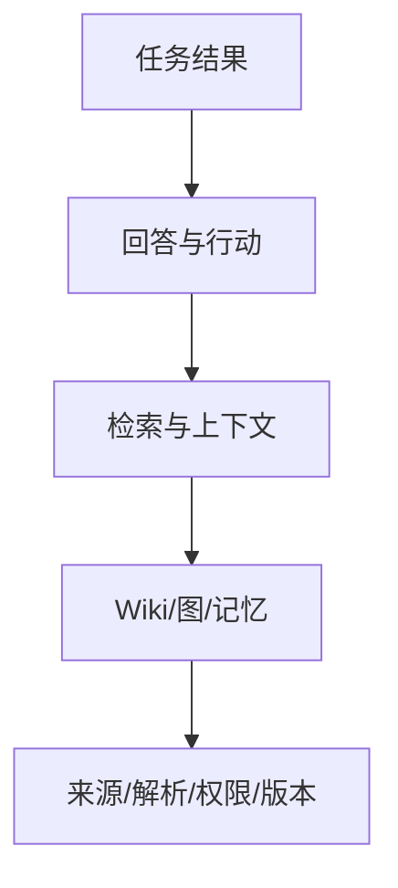

# 第 13 章 怎么知道知识系统真的有用

> 本章要回答：怎样证明企业上下文系统真的帮人完成了工作，而不只是让回答读起来更像那么回事？

一个演示系统只要回答几道准备好的问题就显得聪明，生产系统却会同时面对新文档、权限变化、模型升级、索引延迟、模糊问题和恶意输入。端到端评价“答案看起来不错”既无法定位失败，也无法判断一次架构升级是否真的有价值。

因此，评测不能只给最终答案打一个总分。它要沿着数据处理过程逐层检查，并把质量、安全、时效、成本和业务结果放在一起看。任务最终有没有完成当然最重要，但只有中间指标才能告诉团队：问题到底出在解析器、检索器、知识页面、模型，还是工具。

## 13.1 用质量树定位问题出在哪一层

质量树把系统拆成五层，目的不是画一张漂亮的架构图，而是让失败能够定位。数据层检查资料是否接全、解析是否准确、版本和 ACL 是否正确；知识层检查分块、实体、图边、Wiki 和记忆；检索层检查该找的材料有没有进入候选、排序是否合理；生成层检查回答是否忠于证据、引用是否正确、该拒答时有没有拒答；任务层检查用户是否真的完成工作，以及执行结果是否符合预期。

上层失败可能由任何下层引起。回答遗漏政策例外，可能是 PDF 表格解析丢失、正确片段未召回、父块被裁剪，也可能是模型忽略证据。评测记录必须保留这些阶段产物，才能进行归因。

每层指标还应区分“能否工作”和“工作得多好”。权限泄漏、错误执行和无法回滚属于硬门槛，任何一次失败都可能阻止发布；Recall@10 从 0.82 到 0.84 则是渐进优化。把两者平均成总分会掩盖不可接受风险。

## 13.2 Golden Dataset 不只是“问题加标准答案”

Golden Dataset（金标准测试集）不应该只有问题和参考答案。企业里的同一个问题，换一个用户、地区或时间，正确答案就可能不同。因此，一条测试样本至少要写明：谁在提问、要完成什么任务、查询内容、业务时间、知识快照、允许访问的范围、必须使用的证据、可以做出的判断、何时必须拒答、哪些内容绝不能出现，以及工具应该怎样行动。

同一句“退款规则是什么”应以不同地区、角色和时间形成多个样本。客服看到政策与处置流程，开发者可能看到实现说明，外部承包商则可能必须拒答。历史样本绑定旧快照，当前样本随规范来源更新。

证据标注比完整自然语言答案更稳定。措辞可以变化，只要关键声明由允许证据支持。对开放问题，可以标注必要事实集合和禁止断言；对影响分析，可以标注必需节点和允许的潜在路径；对行动任务，标注前置条件、审批和最终状态。

数据集应从真实工作采样，而不是只由架构师想象。搜索日志、支持问题、事故、代码评审和新人入职可以提供候选，经脱敏和业务所有者审核后进入集合。高频问题衡量价值，长尾和对抗问题衡量韧性。

战略问题还要增加一组专门的标注。样本必须记录指标名称、单位、口径、日历、场景（实际、目标或预测）、组织和业务范围、数据快照以及允许的分解维度。标准结果应分成四栏：已核算事实、与事实相符的分解、尚未证实的假设、必须补齐的数据。不能把“同时发生”标为根因，也不能把一个团队的责任归属直接标为下降原因。

因此，战略分析至少评估五件事：

1. 指标语义是否先被确认，错误口径能否被拒绝；
2. H1/H2 总额、目标差距和各维度分解是否能回到同一快照；
3. 每个分解是否能追溯到数据产品、刷新时间和负责人；
4. 业务能力、组织、应用和数据血缘是否组成可读的解释路径；
5. 缺少联合明细或对照组时，系统是否明确停在候选假设，而不是生成因果结论。

## 13.3 逐层指标

来源与解析层可以测量连接成功率、对象覆盖率、字段解析准确率、版本定位率、ACL 映射正确率和删除传播时间。对 PDF 表格、代码符号和 API Schema 应分别抽样，因为平均解析率会掩盖困难类型。

检索候选阶段使用 Recall@K 判断必要证据是否进入前 K，MRR 衡量首个相关结果位置，nDCG 衡量多级相关性的排序。指标必须按查询类型和角色分桶；一个总体高分可能来自大量简单精确查询，而关系题全部失败。

图谱测量节点解析精度、边 precision/recall、实体合并错误率、路径覆盖和证据等级。Wiki 测量页面覆盖、关键声明引用率、陈旧窗口、冲突发现率与人工审核通过率。记忆测量应写入/不应写入判定、主体隔离、冲突更新、删除完成和跨任务污染。

生成层关注答案相关性、声明忠实度、引用精确率、引用覆盖率、冲突表达与正确拒答。RAGAS 提供上下文相关性、忠实度等自动化评估思路，可作为低成本信号，但模型裁判可能有偏差，不能替企业证据标注和人工抽检。[RAGAS](https://arxiv.org/abs/2309.15217)

任务层衡量解决率、人工接管率、完成时间、修复是否持久、错误动作率和用户复核成本。知识系统的价值最终体现在真实工作，而不是离线问答分数。

评测还要覆盖整条 RAG 流水线。MLCommons 的 End-to-End RAG 基准把摄取、索引建立和多跳 retrieve-and-reason 问答放在同一个工作负载中，提醒我们单独测一个生成模型或一个向量召回器会漏掉系统瓶颈。[MLPerf End-to-End RAG](https://mlcommons.org/2026/08/endtoend-inference/) 对代码知识库，还应在生成前检查结构证据是否足够：RCL 预印本提出用调用图覆盖率和新颖性估计检索缺口，低于阈值时补检索或转人工复核。[RCL](https://arxiv.org/abs/2609.11023)

## 13.4 分别关掉组件，才能知道谁真正有用

每增加向量、重排、图扩展、Wiki 或记忆，都要证明它确实带来了额外收益。消融实验的做法很直接：保持测试集和知识快照不变，分别关掉某个组件，再比较 BM25 only、Vector only、融合、重排、图、Wiki 和完整系统的结果。还要按题型查看差异，才能知道哪类问题值得调用哪种能力。

回归测试则保证新版本不破坏既有契约。解析器升级后检查对象和引用；嵌入模型升级后检查召回与索引兼容；策略修改后运行角色矩阵；模型升级后检查忠实度、拒答和工具计划。任何发布都应保存基线与差异，而不是只看新版本绝对分数。

统计结果要附样本量和置信区间。十道题提高一题不能证明稳定改进。对关键安全测试，采用零容忍而非统计平均；对质量指标，可用 bootstrap 或成对检验判断变化是否超出样本噪声。

### 一次可以重复运行的小消融

在 `examples/enterprise-case/` 执行 `python3 src/tutorial_experiments.py ablation`。脚本固定对象快照和教学时钟，选取 27 道题中的 12 道检索题，分别运行 BM25、离线语义代理和融合，输出逐题证据召回与行为约束是否满足。战略题、图题和工具题不混进这张表，离线代理也不冒充嵌入模型。

本次代码上的 Top-5 结果为：BM25 平均证据 Recall@5 为 0.8056、约束通过 11/12；代理为 0.8056、10/12；融合为 0.8333、11/12。GQ-008 在三个配置中都未通过，说明融合没有自动补齐所有缺口。完整契约测试采用 Top-12，因而与这里的 Top-5 结果不同。十二个手工样本不能证明统计显著性或生产收益；这项实验的目的，是让“关掉一个组件后发生什么”可以被观察。

## 13.5 从实验室走到生产：离线、影子和金丝雀

离线评测可以反复运行，成本也低，适合快速修改，但无法完全模拟真实用户和生产数据。下一步可以使用影子模式：让新系统在后台读取真实请求并生成结果，却不把结果交给用户，用来比较查询计划、候选材料和延迟。影子测试通过后，再把少量低风险流量交给新版本，这就是金丝雀发布；团队据此观察真实质量和安全告警，再决定是否扩大范围。

在线反馈应收集具体失败类型，而不只有赞踩。用户可以标记证据错误、版本过期、缺少来源、答案误读或权限异常。工具任务还应观察真实结果，例如积压是否下降、部署是否成功，而不是把 Agent 声称“已完成”当作成功。

反馈不会自动成为训练真相。它可能有偏差或恶意，需要与任务、身份、快照和证据绑定，经过聚类和审核后转化为测试样本、知识纠错或产品改进。

## 13.6 查询追踪

一次可诊断的查询追踪应记录 trace ID、主体与策略版本、Snapshot Manifest、查询计划、各通道耗时、候选对象及排名、重排结果、上下文选择、模型与提示版本、最终引用、工具调用和反馈。普通日志使用 ID 和摘要，不复制敏感正文。

追踪可以回答：正确证据是否被解析；在哪条通道召回；为何被重排器降级；是否因预算被裁剪；模型是否引用；工具是否基于同一任务状态执行。没有这条链，线上问题只能靠重新提问碰运气。

OpenTelemetry 定义了 traces、metrics 和 logs 等可观测性信号，并提供跨服务传播上下文的标准，可用于平台追踪基础。[OpenTelemetry 文档](https://opentelemetry.io/docs/) 企业实现还需对敏感字段做采样、脱敏与访问控制。

## 13.7 用 SLO 把“应该多快、多可靠”写清楚

数据新鲜度应按来源类别设 SLO。告警和运行状态可能要求秒级，服务目录与代码分钟级，政策在发布后规定时间内同步，历史档案可以更慢。一个全局“索引更新时间”无法表达这些差异。

运营指标包括连接器水位、失败队列、索引覆盖、过期 Wiki、未解析实体、图边增长、发布快照、查询 P50/P95/P99、各通道贡献、Token 与模型成本、缓存命中以及权限拒绝。所有者队列显示待审核页面、冲突、知识缺口和删除任务。

SLO（服务等级目标）要写成用户能够感受到的结果。例如：“95% 的代码提交在 15 分钟内可检索”“当前政策发布后 5 分钟内，旧版本不再默认出现”“授权服务可用性达到 99.9%”。错误预算规定一段时间内最多可以偏离这些可用性或时效目标多少；预算快用完时，应优先修可靠性。授权正确性是另一条硬门槛：不允许把千分之一的越权放行当作正常预算。授权服务不可用时安全拒绝请求，可以计入可用性损失，但不能扩大访问权限；高风险动作始终必须带有效确认。

## 13.8 成本与收益

成本按摄取、存储和查询拆解。全量模型生成 Wiki 可能在建设期便宜，却在每次变更重建时昂贵；在线重排提高质量，也增加延迟和模型费用。记录每条通道的候选贡献后，可以识别“经常调用却从未进入最终证据”的组件。

收益也不能只看查询量。可以比较新人完成任务时间、事故平均恢复时间、支持一次解决率、代码影响遗漏和知识维护成本。归因并不完美，但至少应建立任务基线和对照，而不是用模型调用次数代替价值。

平台运营最终是一个持续控制回路：生产失败生成可复现样本，样本定位层级，修复形成候选快照，回归与金丝雀证明改进，再发布到生产。

## 13.9 容量、吞吐与压测

延迟 SLO 不能替代容量设计。企业上下文的存储量首先由逻辑对象数、平均版本数和各投影放大倍数决定。一个可用于早期估算的模型是：`总量 = 来源 blob + 版本元数据 + 全文索引 + 向量数 × 单向量字节 + 图节点与边 + Wiki 派生物 + 历史保留`。其中最容易被低估的不是原文，而是多版本向量、全文位置表和高扇出关系。容量表应分别列当前热快照、历史冷层和可重建缓存，不能只报告数据库总大小。

写入吞吐由变化率而非文档总量决定。容量规划至少需要峰值变更对象数、单对象平均分块数、嵌入和摘要服务并发、图关系解析扇出、允许的新鲜度窗口。若一分钟进入 10,000 个新块，而嵌入服务每秒只能稳定处理 50 个，系统就需要超过三分钟才能清空队列；此时要么扩大批处理并发，要么延长该来源 SLO，要么先发布 `lexical-only` 快照。积压必须按来源和租户分队列，避免一个大型仓库更新阻塞政策同步。

查询容量则从峰值 QPS、每次查询的通道扇出和下游预算推导。假设入口为 100 QPS，每次并行调用 BM25、向量和图三条通道，那么候选服务面对的是接近 300 次下游请求，再加重排与证据解析。缓存可以减少重复读取，却不能作为容量计划的前提。规划器应限制每通道候选数、图遍历节点数和证据解析字节，并在达到队列或延迟阈值时触发限流、降级或异步任务，而不是继续扩大超时。

压测数据必须接近真实分布：短关键词与长问题、冷热租户、权限过滤后零结果、高扇出图种子、缓存命中与未命中、索引切换和单通道故障。测试分开报告摄取吞吐、查询 P50/P95/P99、错误率、降级率、队列深度、CPU、内存和下游调用数；只给平均延迟会掩盖尾部拥塞。安全断言在压测中仍然有效，不能为了吞吐绕过召回前 ACL。

过载信号必须沿整条流水线向上传递，这就是背压。嵌入服务忙不过来时，连接器仍可先保存原始版本，但应暂停后续加工并标明处理到哪里；图扩展超过预算时，查询要说明为什么被截断；重排服务不可用时，Context Package 要注明已经降级。服务恢复后，再按来源权威性、新鲜度 SLO 和用户影响安排补算顺序。容量工程并不要求所有通道永不降级，而是要求系统即使过载，权限仍然正确、版本仍然一致、用户也看得见能力边界。

Northstar 的发布门现在同时覆盖原有退款、代码和权限题，以及 C7 的战略题。战略题必须通过指标确认、分解对账、对象引用、权限拒绝和禁止因果结论测试，不能只依赖 C7 的单元测试。

## 13.10 Northstar 的发布门

Northstar 教学原型为公开 27 条初始样本，覆盖精确定位、语义解释、跨来源综合、关系影响、历史时间、角色隔离、缺口与拒答、提示注入和工具审批、战略上下文。每条样本绑定任务模式以及必要或禁止证据；它用于验证契约覆盖，不足以估计生产准确率或统计显著性。

候选发布必须满足：所有权限和跨租户测试通过；版本化引用覆盖率 100%；关键证据 Recall@10 达到既定阈值；图确定边精度通过抽样；Wiki 无孤立关键声明；写工具确认与幂等测试全部通过。质量改进必须在至少一个任务分桶有统计支持，延迟和成本不能超过预算。

上线后，团队观察同步水位、角色拒绝、检索降级、无证据回答和退款任务结果。一次错误答案可以通过 trace 重放到 Manifest、候选和上下文包，并转化为新的回归样本。

## 本章小结

评测必须覆盖从原始来源到任务结果的整条链。Golden Dataset 要写清身份、时间、快照，以及必须出现和禁止出现的证据；分层指标用来定位问题；消融实验判断新增组件是否真有价值；回归测试守住已有规则；影子和金丝雀测试再把新版本带到真实流量旁边。查询追踪记录一份上下文怎样形成，SLO 则把新鲜度、安全、延迟和成本变成明确责任。少了这个持续纠错的循环，知识库会随着数据和模型变化越来越不可信。

## 延伸阅读

- Shahul Es et al., [RAGAS](https://arxiv.org/abs/2309.15217), 2023。
- OpenTelemetry, [Documentation](https://opentelemetry.io/docs/)。
- Percy Liang et al., [Holistic Evaluation of Language Models](https://arxiv.org/abs/2211.09110), 2022。
- NIST, [AI Risk Management Framework](https://www.nist.gov/itl/ai-risk-management-framework)。
