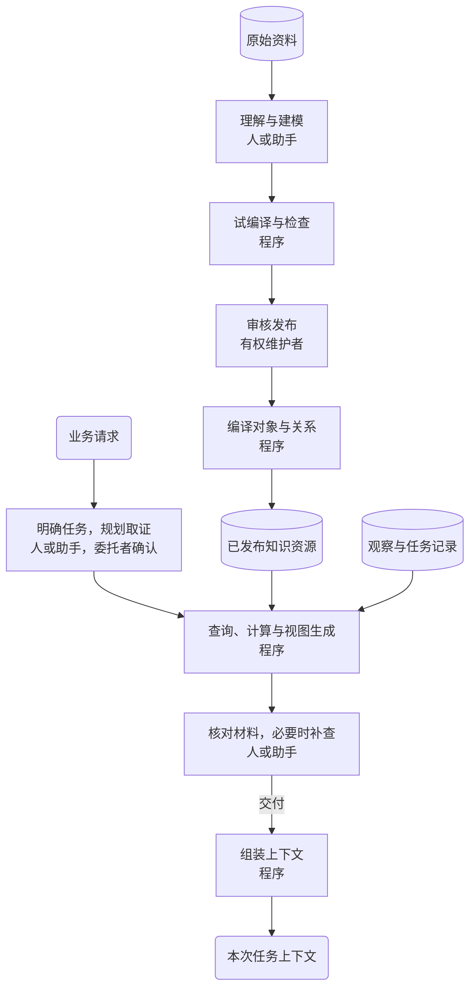
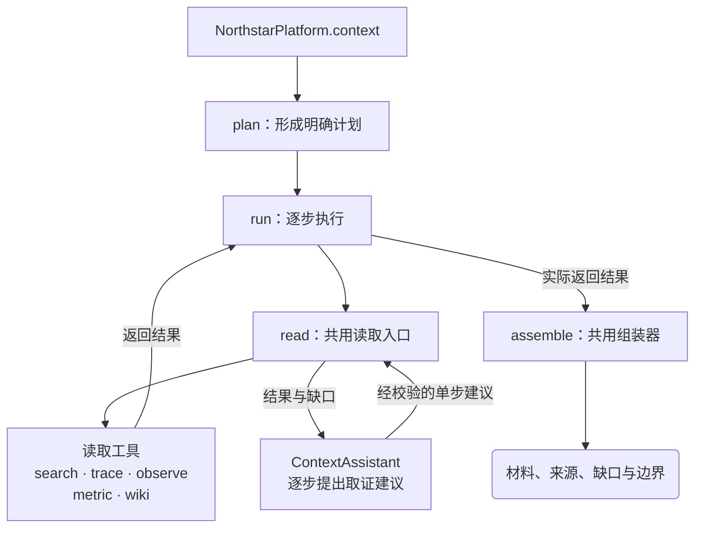

# 第 14 章 先看见案例，再开始构建

> 本章要回答：Northstar 怎样把企业资料整理成资源，又怎样围绕不同任务准备上下文？哪些步骤由程序完成，哪些需要人或助手判断？

前十三章介绍了企业上下文的范围、组织方法和实现技术。本部分用 Northstar 把这些内容连成一套能运行的小系统。我们先看它要支持什么工作，再顺着两条流程理解设计：一条建设和维护资源，一条围绕任务调查和组织材料。第15—17章逐步实现这些能力。

Northstar Commerce 是一家虚构的在线零售企业。随书提供政策、代码、运行手册和经营数据，读者可以在本机检查资料、修改示例并观察结果。退款操作使用模拟队列。

## 14.1 先看企业里要完成什么工作

案例围绕三条工作线展开：

| 工作线 | 谁提出问题 | 希望得到什么 |
|---|---|---|
| 经营分析 | 经营负责人问“H2 的销售为什么比 H1 差？” | 弄清指标和可比较的数据，定位差异，再调查可能原因 |
| 变更影响分析 | 开发者准备修改 `order.cancelled` 事件 | 找到消费者、相关测试和版本依据，确定评审范围 |
| 退款积压处置 | 值班工程师（SRE）收到队列告警 | 核对手册与当前状态，准备有限重放，经负责人批准后执行并验证 |

三项工作都要先明确目标，取得有出处的材料，再形成判断。差别在于查什么、怎样组织结果，以及后续是否需要改变业务状态。经营分析要核对指标口径；变更分析要沿事件关系查代码；退款处置需要读取实时观察，并在准备动作时检查批准条件。

用第一章的问题类型来看，前两项主要帮助人弄清情况，为决策提供依据；退款处置还会进入执行。创造新成果的过程由[澄川设备 W2 案例](../cases/hardware-w2.md)补充：形成软硬件方案，再用预算计算、固件行为模型和测试检查设计。

## 14.2 Northstar 的整体设计

Northstar 包含第三章的三个部分。**企业上下文资源**保存原文、模型、对象、关系、观察和工作记录；**企业上下文平台**建设这些资源，并按任务查询和组装材料；**任务上下文**保存本次目标、选中的依据、调查进展与行动边界。

在资源建设和任务调查中，都有需要理解和判断的环节。人可以阅读资料、提出模型、选择查询路线，也可以让助手起草这些内容。程序负责按明确规则解析、校验、查询、计算和保存。需要有权人员确认的任务条件、知识发布和业务动作，仍由相应责任人决定。

### 14.2.1 把资源、处理过程和任务产物放在一起看

下面这张图是案例的总图。圆柱体表示长期维护的资源，矩形表示处理步骤，圆角框表示交给调用者的产物。括号标明主要由谁完成工作。


```mermaid
flowchart TB
  Raw[(原始资料)]
  Build[理解与建模<br/>人或助手]
  Check[试编译与检查<br/>程序]
  Review[审核发布<br/>有权维护者]
  Compile[编译对象与关系<br/>程序]
  Resources[(已发布知识资源)]
  Live[(观察与任务记录)]
  Request(业务请求)
  Plan[明确任务，规划取证<br/>人或助手，委托者确认]
  Read[查询、计算与视图生成<br/>程序]
  Assess[核对材料，必要时补查<br/>人或助手]
  Pack[组装上下文<br/>程序]
  Package(本次任务上下文)
  Raw --> Build --> Check --> Review --> Compile --> Resources
  Request --> Plan --> Read --> Assess
  Resources --> Read
  Live --> Read
  Assess -->|交付| Pack --> Package
```

图中的处理步骤共同组成平台能力，两条流程在资源处连接起来。资料维护者发布了一份新手册，后续任务就能按权限检索它，关系路径和 Wiki 则按需从已发布资源生成。核对材料时发现不足，就回到取证规划继续补查；发现指标定义不清，则可以提出资源维护请求。已经用于某次判断的旧材料仍保留在该任务记录中。

助手参与的是上述流程里的具体工作。资源助手读原文，提出怎样整理；上下文助手根据目标和已取得的材料，决定下一步查什么。它们调用平台已有能力，获得的结果也要经过相同的校验。

### 14.2.2 一份原始资料怎样成为可用资源

以退款限流核对说明为例，原文提到：排查 `refund-worker` 时，应先核对支付方限流窗口，再查看队列和消费者延迟。平台需要把这段话变成可以查找、理解和引用的材料。

| 步骤 | 人或助手要作的判断 | 程序完成的工作 | 产物 |
|---|---|---|---|
| 登记来源 | 维护者确认资料从哪里来、由谁负责 | 分配来源 ID，保留原文、版本和访问规则 | 有出处的原始材料 |
| 理解和建模 | 提出类型、业务含义、服务关系及能回答的问题 | 按约定接收候选字段 | 带原文引文的建模候选 |
| 检查候选 | 核对原文是否支持候选含义 | 检查类型、端点、引用和模型实例 | 校验结果与待修改项 |
| 审核发布 | 有权维护者决定是否采用 | 编译对象与关系，生成新资源版本 | 已发布的知识对象和模型 |
| 构造视图 | 确定阅读主题和使用目的 | 按权限生成检索结果、关系路径和模板 Wiki | 面向使用者的知识视图 |

这份说明可以归入“排查说明”类型，并通过“材料描述服务”的关系连接到 `refund-worker`。查询时既能搜索正文，也能从服务沿关系找到它。Wiki 将它与同一系统的其他材料放到一起，并保留来源引用。

理解资料与可重复加工在这里分工合作：新概念和关系需要判断，已确定的映射则可交给程序反复执行。Northstar 的 Wiki 用模板整理已审核材料；原文修订后，重新编译即可更新页面内容。对于需要撰写解释的页面，第七章介绍了让助手起草、再审核发布的方法。

随书的初始模型和部分对象是作者已经完成的一次整理结果，读者可以直接打开检查。C8 则把同一流程中的“读原文—提出候选—检查—审核—发布”做成可运行练习。读者手工编写建模文件与助手提出候选，最后都进入相同的编译器和校验器。

### 14.2.3 一项任务怎样通过系统

三条工作线采用同一条主流程：**明确任务 → 规划取证 → 执行查询 → 检查材料 → 组装上下文**。其中，任务理解、查询选择和材料判断可由人或助手承担；程序负责检查和执行具体步骤。

以退款积压为例，先把“处理告警”说成明确要求：调查哪条队列、要取得哪些依据、怎样判断这轮调查已经足够。随后提出查询计划：找运行手册和有关事故，读取当前队列，核对材料是否指向同一服务和适用版本。

平台按计划执行各个读取工具。手册命中带来源，队列读数带采样时间；无权限或已经过期的材料不能直接作为依据。人或助手检查返回结果，缺少关键条件时继续补查，或者向请求方说明缺口。

准备交付时，程序把任务身份、资源版本、证据、观察、工作记录和缺口组织成上下文包。人或业务 Agent 使用这些材料形成诊断。若决定重放消息，再进入独立的“预览—批准—执行—验证”流程；准备上下文本身不改变队列。

经营分析和变更影响分析经过相同阶段。经营问题的计划包含指标读取与计算，遇到未确认口径先暂停；变更问题的计划包含事件关系导航。它们共享流程，专用工具分别处理自己的数据和规则。

### 14.2.4 将上述流程对应到代码与技术

示例核心使用 Python 标准库、结构化文件和内存计算。`NorthstarPlatform` 提供入口，具体工作分到下列模块：

| 核心职责 | 对应实现 | 使用的技术或方法 |
|---|---|---|
| 原文解析与对象编译 | `build_baseline.py`、`build_knowledge.py` | Markdown / JSON 读取、Python AST 提取函数、SHA-256 检测内容变化 |
| 模型与实例检查 | `modeling.py` | 编译术语、类型、关系和源映射；核对能力问题与实际实例 |
| 资源建设与调查判断 | `intelligence.py`、`model_gateway.py` | 结构化候选、任务确认、逐步工具选择；可接模型 HTTP 接口 |
| 统一上下文流程 | `context_flow.py` | `plan()` 形成计划，`read()` 执行读取，`assemble()` 汇总材料，`run()` 串起流程 |
| 资料检索 | `retrieval.py` | BM25、同义词与词集合重合度、RRF 排名融合 |
| 关系与阅读视图 | `knowledge_views.py` | 内存邻接表、有界广度优先遍历、模板 Wiki、架构声明与证据对照 |
| 经营数据取证 | `strategy.py` | 指标契约确认、结构化快照读取、差异计算及分解对账 |
| 当前观察、记忆与动作 | `northstar.py`、`TaskMemory` | 权限和新鲜度检查、任务事件、动作状态机与参数绑定 |


```mermaid
flowchart TB
  Entry[NorthstarPlatform.context]
  Plan[plan：形成明确计划]
  Loop[run：逐步执行]
  Read[read：共用读取入口]
  Tools[读取工具<br/>search · trace · observe<br/>metric · wiki]
  Assemble[assemble：共用组装器]
  Assistant[ContextAssistant<br/>逐步提出取证建议]
  Package(材料、来源、缺口与边界)
  Entry --> Plan --> Loop --> Read
  Read --> Tools
  Tools -->|返回结果| Loop
  Loop -->|实际返回结果| Assemble --> Package
  Assistant -->|经校验的单步建议| Read
  Read -->|结果与缺口| Assistant
```

图中的 `plan()` 是把调用方已经明确的选择变成计划，不调用模型猜测意图。读者可以手工指定事件起点、队列或经营模式；也可以使用 C9，由助手先提出任务理解，再根据每步结果选择读取工具。两种方式复用 `ContextFlow.read()`。固定计划由 `assemble()` 组装业务任务包；C9 将每次读取结果保留在调查包中，并附上待复核的解释。

经营分析在计划中使用 `metric` 工具，与 `search`、`trace` 和 `observe` 处于同一层。`strategy.py` 保留指标特有的校验与计算，任务身份、资源版本和结果汇总则由共同流程处理。字段随材料而异：经营任务增加 `performance` 和指标契约，退款任务加入 `observations`，变更任务突出 `relations`。

界面使用 VitePress 和 Vue 3，本地服务用 HTTP 连接这些 Python 函数；SQLite 保存读者的实验进展。这些属于运行案例的工具。正文中的源码面板优先展示上述核心模块，工作台的启动和保存说明集中在[工作台页面](../lab.md)。

### 14.2.5 资料变化后，继续走资源维护流程

维护者修改原文后，人或助手重新检查它对类型、关系和视图的影响。程序试编译并校验，审核后发布新资源版本。后续检索和 Wiki 使用新对象，旧任务仍保留当时采用的材料，并提示需要重新取证。

Northstar 提供两种修改练习：给已有政策增加说明，或修订 C8 登记的资料并重新审核。前者便于观察正文变化，后者还能观察模型和关系随候选一起更新。已有动作批准绑定的是当时的依据；资料变化后，应重新诊断和准备动作。

## 14.3 三类任务怎样使用同一套流程

统一流程的含义，是共用组织工作的方式，让不同材料进入同一任务。它不要求每个问题都先做全文检索，也不要求所有资料采用同一种结构。

| 共同阶段 | 经营分析 | 变更影响分析 | 退款积压处置 |
|---|---|---|---|
| 明确要求 | 指标、期间、组织范围与要解释的问题 | 变更对象、版本和需要检查的范围 | 队列、告警与本轮调查目标 |
| 规划取证 | 指标定义、企业背景、可比较期间数据 | 事件说明、消费者、测试与责任人 | 手册、历史事故和当前观察 |
| 执行读取 | `metric`：确认口径后读取并计算 | `search` + `trace`：搜索并沿关系查证 | `search` + `observe`：查资料并核对状态 |
| 检查材料 | 数字是否同口径，分解能否对账，解释还缺什么 | 路径有无来源，哪些依赖尚未核实 | 读数是否新鲜，历史条件是否适用 |
| 组织交付 | 差异、企业背景、假设和缺口 | 影响路径、测试依据和评审事项 | 诊断依据、当前观察和可用工具 |
| 后续业务工作 | 经营负责人继续调查和决策 | 开发者评审并实施变更 | SRE 提出动作，负责人批准后执行并验证 |

经营资料覆盖的企业范围更广。商业模式说明销售什么、面向谁；目标给出比较标准；产品、客群、区域和渠道帮助定位差异；组织说明由谁核查；应用、数据产品和指标定义则说明数字怎样产生。这些资料共同支撑经营问题，而不是为经营任务另建一套上下文平台。

例如，净确认订单额从 H1 的1200降到 H2 的840，单位为千美元。程序计算出差额，再按四个维度分别分解。读者沿数据引用核对结果，根据关联事件提出下一轮调查。差异计算由程序完成，解释是否成立仍要结合材料判断；缺少客户级明细时，应将它写入下一轮取证要求。

## 14.4 看懂案例中的人和责任

“由人或助手提出建议”描述的是工作方式；“谁能读取、确认或发布”描述的是权限。用助手代替手工阅读，不会改变后者。

| 主体 | 主要责任与可用能力 |
|---|---|
| 资料维护者 `product` | 维护政策、登记原文、审核并发布资源候选 |
| 客服 `support` | 使用客服政策与本租户可见材料 |
| 开发者 `developer` | 查代码、事件、测试和工程资料，评审变更影响 |
| 值班工程师 `sre` | 调查运行问题，准备并执行获准的重放，检查结果 |
| 事故负责人 `incident_commander` | 查看具体动作预览，决定批准或拒绝 |
| 经营角色 `executive` / `strategy` / `revops` / `product` | 确认指标口径，查经营资料，复核分析 |
| 平台内部助手 | 在受委托的身份范围内提出建模、澄清与取证建议 |

退款动作的交接是 `SRE → 事故负责人 → 原 SRE`。批准绑定具体队列、条数、任务、有效期和执行者。资源发布同样绑定具体候选和原文版本。系统按这些记录检查后续操作，避免一句笼统的“同意”被用于另一项变更。

## 14.5 打开资源文件，找到每类材料

程序文件位于 `examples/enterprise-case/src/`，输入材料位于同级的 `data/`。可以沿下面这份清单对照总图阅读：

| 资源 | 文件或模块 | 内容与用途 |
|---|---|---|
| 原始政策、手册、事件、代码与测试 | `data/raw/` | 五份可读来源，是解析与对象编译的起点 |
| 来源登记信息 | `data/raw/manifest.json` | 解析方式、对象身份、版本、权限及引用；由接入规则与已确认的建模决定形成 |
| 已整理的知识对象 | `data/knowledge.json` 与 raw 编译结果 | 初始19个对象，其中五个采用 raw 的最新编译结果，其余十四个提供有关背景 |
| 领域模型 | `data/modeling/` | 能力问题、术语、类型与关系契约、来源映射 |
| 关系实例和架构声明 | `data/relations.json`、`data/architecture-claims.json` | 初始13条关系及单独保存的架构意图，用来导航和核对 |
| 企业结构与经营资料 | `data/strategy-context.json` | 49个对象、38条关系，以及指标定义、目标、经营观察和数据来源 |
| 运行观察 | `data/runtime.json` | 模拟队列和错误率初值，读取时核对采样时间和权限 |
| 阅读与查询视图 | `knowledge_views.py` 的输出 | 带来源的关系路径、Wiki 和架构核对结果 |
| 调查记录与任务材料 | `ContextAssistant` 的记录、`TaskMemory` 与上下文包 | 已确认条件、读过的材料、笔记、缺口及动作记录 |

上表中的初始资料常被代码称为 fixture，即一组可以反复核对的样例输入。它们展示了资料经过人工整理后的样子；C8 让读者从新原文亲手走完整理过程。

经营资料保留结构化数据，文本和代码按各自格式解析。前者通过指标与企业关系校验，后者通过领域模型和实例校验；合格材料都可被平台的读取工具使用。这种按资料性质选择处理方式的做法，对应第四章的资料准备和第八章的知识建模。

## 14.6 按流程逐步构建

阅读顺序沿着“准备来源—建立模型和视图—围绕任务使用”推进。需要判断的环节始终存在：初始材料给出了人工整理的结果，读者先学会检查，再让助手参与起草。C0—C9 是练习编号，可以在同一流程的不同位置使用。

| 阅读位置 | 本章要做的工作 | 对应练习与核心代码 |
|---|---|---|
| 第15章：资料准备 | 理解来源、编译对象，按权限、时间和相关性检索 | C0—C2；`build_baseline.py`、`build_knowledge.py`、`retrieval.py` |
| 第16章：模型与资源建设 | 明确问题、词义、身份、关系和来源；从原文提出候选并审核 | C3、C8；`modeling.py`、`ContextAssistant.resource_candidate()` |
| 第16章：视图与维护 | 生成关系路径、Wiki、架构核对视图，检查修订的影响 | C4；`knowledge_views.py`、`materialize_resources()` |
| 第17章：上下文调查 | 确认任务、形成查询计划、逐步取证并整理材料 | C5、C7、C9；`ContextFlow`、`ContextAssistant.query_step()` |
| 第17章：任务交付与动作 | 保存进展，复核分析，按批准执行并检查业务结果 | C5、C6；`TaskMemory`、`northstar.py` 的动作方法 |

助手练习默认使用手写脚本，便于不配置模型也能检查输入、输出和程序规则。切换为真实模型后，由模型提出候选或下一步建议；校验器和工具执行器保持不变。配置方法见[工作台说明](../lab.md#接入真实模型)。

## 14.7 用具体结果检查构建是否正确

随书的27道初始验收题覆盖定位、解释、跨来源综合、关系影响、时间、权限、缺口、提示注入、工具审批和经营分析。新增助手测试则检查候选审核、任务确认、取证记录和模型错误。

检查时优先看实际材料。例如，事件变更应找到三个消费者及其测试依据；退款诊断要分清手册、历史事故和当前队列；经营分析在指标确认前不计算，确认后能将每个分解维度与总额对账。资源修订后，检索、关系和 Wiki 应使用相互一致的版本。

第13章介绍怎样进一步评测模型是否提出了合适的概念、选择了有效的查询路线。这里先把可重复验证的处理步骤做清楚，再比较人工选择和模型建议的结果。

## 14.8 运行与阅读方式

安装 Node.js 22 和 Python 3.10 或更新版本，在仓库根目录执行：

```bash
npm ci
npm run lab
```

打开终端显示的地址，即可在章节旁查看真实源码、输入参数和执行结果，也可以到[工作台](../lab.md)集中操作。首次运行需要新建实验空间，它用于保存你的练习进展。公开站提供阅读和构建时示例，实际运行在读者本机。

正文按核心处理过程讲解，源码面板可以直接对照相关函数；命令行入口适合脱离网页运行。工作台的连接、保存位置、重启和模型配置集中放在工作台页面，不影响按本章主线阅读示例。

下一章从原始资料开始，弄清一个对象怎样获得身份、版本和可追溯的正文，再实现可信检索。

## 延伸阅读

- Patrick Lewis et al., [Retrieval-Augmented Generation for Knowledge-Intensive NLP Tasks](https://arxiv.org/abs/2005.11401), 2020。
- W3C, [PROV-O: The PROV Ontology](https://www.w3.org/TR/prov-o/)。
- OWASP, [Prompt Injection Prevention Cheat Sheet](https://cheatsheetseries.owasp.org/cheatsheets/LLM_Prompt_Injection_Prevention_Cheat_Sheet.html)。
