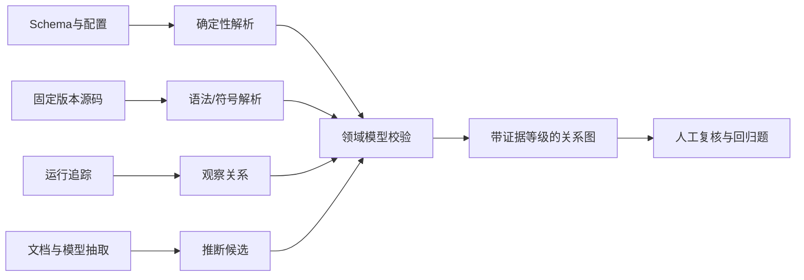
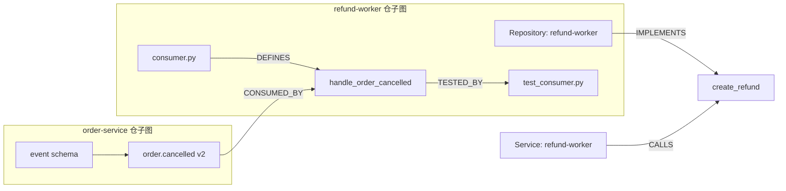
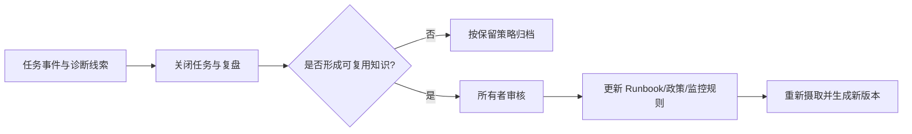

# 第 16 章 从检索结果到可导航的知识

> 本章要回答：为什么检索到一组正确对象仍不足以理解企业，以及图、Wiki、记忆和企业架构怎样在同一证据基础上协同？

第 15 章解决了“找到可信对象”。但开发者检索到事件 Schema、三个消费者和三份测试后，仍要自己判断它们如何连接；SRE 检索到 Runbook、历史事故和服务信息后，也仍要区分稳定经验、当前状态与本次任务已经做过的工作。

这说明检索结果只是材料，不是理解。企业上下文还需要四种组织能力：图把关系变成可查询路径，Wiki 把重复阅读编译成解释层，任务记忆保存一次工作的进展，企业架构声明则提供“系统应该怎样”的规范视角。它们不是四套独立知识库，而是同一批版本化对象的不同投影。

本章先解释这四层为何存在、怎样生成和如何保持一致，再在末尾映射到 Northstar 的 C3 实现。

## 16.1 四种组织方式回答不同问题

同一个 `order.cancelled` 对象可以出现在四种视图中：

| 视图 | 典型问题 | 主要产物 | 不能替代什么 |
|---|---|---|---|
| 关系图 | 谁消费事件？谁测试消费者？ | 有类型、有方向、有证据的边 | 不替代原始代码和 Schema |
| Wiki | 退款系统负责什么？从哪里开始阅读？ | 系统页、仓库页、主题摘要 | 不替代规范来源和实时状态 |
| 任务记忆 | 这次事故已检查什么？谁确认了动作？ | 任务事件、假设、回执、待办 | 不自动成为组织长期知识 |
| 架构声明 | 设计上允许哪些调用？实际是否一致？ | 声明与实现、运行证据的差异 | 不把“应该”冒充“现在确实如此” |

把这四者混在一个向量集合里，会丢失它们的信任差异。例如架构图上的连线可能是设计意图，运行追踪中的调用才是一次观察事实；事故对话中的猜测属于任务记忆，审核后的 Runbook 才是可复用处置知识。系统必须保留这些类型，而不是让模型从措辞中猜。

## 16.2 先从能力问题设计关系

知识图谱很容易从“把能抽取的实体都抽出来”开始，最终得到大量无法服务任务的节点。更稳妥的顺序是从能力问题反推：

1. 修改事件时，哪些消费者和测试需要检查？
2. 某个 API 由哪个服务实现，运行时谁在调用？
3. 当前事故涉及哪些服务、Runbook 和历史事件？
4. 架构声明与代码、运行观察有哪些差异？

能力问题决定所需实体、边方向和证据。为了回答第一题，Northstar 需要 `EventSchema -> CodeSymbol` 的 `CONSUMED_BY`，以及 `CodeSymbol -> Test` 的 `TESTED_BY`。如果只建一个无方向的 `RELATED_TO`，系统无法区分“事件被代码消费”与“代码产生事件”，更无法写出稳定查询。

领域模型在 `data/domain-model.json` 中声明关系的主客体类型、基数、时间性和可接受证据等级：

```json
{
  "CONSUMED_BY": {
    "from": "EventSchema",
    "to": "CodeSymbol",
    "cardinality": "one_to_many",
    "allowedEvidence": ["deterministic", "resolved"],
    "temporal": true
  }
}
```

实例边则必须说明这次关系依据什么成立：

```json
{
  "from": "event-order-cancelled",
  "type": "CONSUMED_BY",
  "to": "code-refund-consumer",
  "evidence_tier": "resolved",
  "evidence": "code://northstar/refund-worker@abc123/consumer.py#handle_order_cancelled"
}
```

模型约束边能表达什么，实例证据说明某条边为什么存在。只有模型没有实例，系统不能回答问题；只有实例没有模型，边的方向、语义和质量会随抽取器漂移。

## 16.3 图是怎样生成的

“生成知识图谱”不是一个单步骤模型调用。不同来源应走不同的证据路径：



确定性来源包括 API Schema、构建配置和显式服务目录；代码解析可以产生定义、引用和候选调用；运行追踪只证明某段时间里观察到调用；模型从文档抽出的关系则应先作为候选。它们不能被压成一个不透明的“置信度 0.87”。证据类型会决定边可用于什么风险等级的任务。

Northstar 使用四类主要等级：

- `deterministic`：由结构化来源直接确定；
- `resolved`：通过符号、代码或受约束解析完成实体解析；
- `observed`：在运行数据中实际观察到；
- `asserted`：由企业架构或其他规范资产声明“应该如此”。

更完整的生产模型还可以保留 `inferred` 或 `candidate`，但不应让它们直接支持高风险动作。边进入图之前要校验节点类型、方向、证据 URI、版本和时间范围；无法解析的实体宁可进入复核队列，也不要错误合并到同名对象。

## 16.4 代码仓为什么天然是子图

代码知识库不是把 README、源码和摘要放进向量库。一个仓内部至少包含仓、目录、文件、符号、测试、构建目标和提交；仓与仓之间还通过 API、事件、包、部署产物和所有者连接。



横向上，BM25 定位符号和路径，语义检索找到 Wiki 中的职责解释，图回答调用与影响关系；纵向上，查询从系统页进入仓库页、模块、符号，最后回到固定提交的源码。两条轴共同工作，才形成第 5 章所说的代码仓知识库。

Tree-sitter 适合提取语法结构，SCIP 或编译器索引提供更精确的符号导航，LSP 适合在线定义跳转与引用查询。它们的输出都应回到 ArtifactFS 中的固定源码版本。语法上可能的调用不能冒充编译解析后的关系，单次运行追踪也不能冒充所有可能路径。第 18 章会在 Linux eBPF 子系统上展开这套方法。

Northstar 只用三个消费者和一个逻辑仓表现上述结构。它的目的不是模拟大型代码索引，而是让读者能逐条检查边方向、证据和权限。

## 16.5 图检索应受任务和边界约束

Northstar 的影响分析从 `event-order-cancelled` 出发，沿 `CONSUMED_BY` 到三个消费者，再沿 `TESTED_BY` 到测试。这个查询看起来只是两跳，但生产图中“任意两跳”可能扩展到成千上万节点。

图检索至少要约束：

- 起点必须在主体已授权的对象集合内；
- 只允许与任务相关的边类型和方向；
- 限制跳数、节点数、路径数与执行时间；
- 边必须满足版本、有效时间和最低证据等级；
- 返回路径时保留每条边的来源，而不只返回终点名称。

`trace_dependency()` 先用 `visible_ids` 构造安全邻接表，再执行有界广度优先遍历：

```python
for edge in edges:
    if edge["from"] in visible_ids and edge["to"] in visible_ids:
        adjacency[edge["from"]].append(edge)
```

support 无权看到事件和代码，因此不是“路径末端被打码”，而是起点和相关边根本不会进入其可查询子图。这与第 15 章的 ACL-first 是同一个原则在图投影上的实现。

图也不应对所有问题固定启用。政策解释题通常不需要代码依赖扩展；影响分析题则高度依赖图。是否使用图应由查询规划和消融评测决定，而不是成为每次请求的固定成本。

## 16.6 Wiki 是阅读视图，不是第二份事实

图适合机器沿关系导航，却不是大多数读者理解系统的最佳入口。Wiki 将对象和关系组织成系统页、仓库页或主题页，提前完成反复发生的阅读与综合。

一个有用的系统页可以回答：系统负责什么，边界在哪里，对外接口和事件是什么，由谁值班，常见故障如何诊断，关键代码仓和规范来源在哪里。页面中的每项声明仍应链接回对象或边证据。

Northstar 的 `build_role_scoped_wiki()` 使用确定性模板，先按角色得到可见对象，再按系统分组生成页面。页面的 `inputs` 保存所有版本化引用。这种设计有三层意义：

1. 页面不是规范来源，输入仍可追溯；
2. 输入版本变化时，可以精确标记哪些页面过期；
3. 不同安全域分别编译页面，避免先生成高权限页面再做文本删减。

生产中可以让模型把模板内容改写成更流畅的说明，但模型输出必须通过页面 Schema、引用覆盖、事实一致性和权限检查。模型不能因为文字流畅就提升声明权威性。

### 什么不应写入 Wiki

当前队列深度、账户余额、正在审批的动作和即时部署状态变化太快，不适合被复制到静态页面。Wiki 可以解释指标定义、查询入口和处置原则，具体数值应由实时工具读取。

未经确认的事故猜测也不应直接发布。它可以留在任务记忆或候选区，经过复盘和所有者审核后再更新 Runbook。这样能避免一次偶然关联被写成长期因果结论。

## 16.7 任务记忆保存“这次工作进行到哪里”

任务记忆与聊天历史不同。聊天是交互记录，任务记忆应是可查询、可审计的工作状态，例如：

- 谁开始了诊断；
- 已检查哪些证据和指标；
- 哪些假设被排除，依据是什么；
- 准备了什么动作，谁确认或拒绝；
- 执行产生什么回执，验证是否通过。

Northstar 的 `TaskMemory` 以 `task_id` 保存有序事件。它足以证明任务隔离和状态恢复语义，但仍是进程内 fixture。生产任务服务还需处理并发写、事件版本、重试、保留期、敏感字段、人工更正与删除。

任务记忆进入长期知识要经过明确晋升：



这个过程保留组织知识的责任链。Agent 可以提出候选总结，但不能因为某条记忆被多次检索，就自动把它升级为企业事实。

## 16.8 企业架构提供“应该如此”的对照面

企业架构资产常被误解为过时文档，代码和运行数据又常被误解为唯一真相。两者回答的是不同问题：架构声明描述目标边界和允许关系，代码及运行观察描述当前实现或特定时间发生的行为。

Northstar 将架构关系保存为 `asserted`，再与 `resolved` 和 `observed` 证据比较，得到三类结果：

| 类别 | 示例 | 正确解释 |
|---|---|---|
| `declared_and_evidenced` | `refund-worker -> create_refund` | 声明得到当前证据支持 |
| `declared_not_evidenced` | `refund-worker -> legacy_refund` | 需要核验，不能直接断言死代码 |
| `evidenced_not_declared` | `refund-worker -> risk_check` | 可能是影子依赖，也可能是模型或观测误差 |

差异不是自动修复命令，而是治理队列。架构负责人可能更新声明，开发团队可能修正实现，平台团队也可能发现解析器误报。保留声明来源和实现证据，比压成一个“架构一致性得分”更有助于做出正确处置。

这使企业架构从偶尔绘制的静态图，变成持续接受代码和运行反馈的上下文来源；同时也避免用一次不完整扫描否定架构意图。第 8 章讨论的知识建模与 MEAF 等企业架构方法，在这里通过同一对象和关系契约发生连接。

## 16.9 变化怎样传播到图和 Wiki

派生知识的难点不是第一次生成，而是持续不陈旧。假设退款消费者在新提交中不再消费 `order.cancelled`：

1. 新源码版本产生新的 `content_hash` 和对象版本；
2. 旧 `CONSUMED_BY` 边不再属于当前快照，但仍保留在历史版本；
3. 以该边或代码对象为输入的 Wiki 页面被标记 stale；
4. 影响分析回归题在候选快照上重新运行；
5. 通过质量门后，新的 Manifest 原子发布为当前视图。

删除同样需要沿血缘传播。只从主数据库删对象而保留向量、图边或 Wiki 摘要，会让已撤销内容继续被召回。生产系统应维护反向依赖、删除标记和重建队列，并验证各投影最终都不再暴露撤销版本。

增量更新不意味着每次只做最少计算。对高风险小页面可以精确失效；对解析器大版本升级，建立完整候选快照再切换通常更容易审计。策略取决于来源变化率、派生扇出、成本和发布风险。

## 16.10 把设计映射到 Northstar 的 C3

理解四种组织方式之后，再运行实现：

```bash
cd examples/enterprise-case

# 影响分析：从事件遍历消费者和测试。
python3 src/northstar.py "修改 order.cancelled 会影响什么" \
  --role developer --graph-seed event-order-cancelled

# 对比不同角色编译出的 Wiki 安全域。
python3 src/northstar.py --wiki --role support
python3 src/northstar.py --wiki --role developer

# 比较架构声明与代码、运行证据。
python3 src/northstar.py --architecture-consistency --role developer

# 验证模型、边、权限、Wiki、记忆和架构差异契约。
python3 -m unittest \
  tests.test_domain_model \
  tests.test_architecture_consistency \
  tests.test_northstar -v
```

读者应验证的不是命令是否打印 JSON，而是：开发者看到三条消费者路径，support 无法穿过代码边界；Wiki 的每个输入都有版本化引用；任务记忆按任务隔离；架构差异不会把“缺少证据”误写成“声明错误”。

### 从教学实现走向生产

生产化不必一开始部署专用图数据库。若对象和边规模可控，关系表加有界查询已经足够验证任务价值。只有当多跳查询、关系密度、更新模式和延迟需求证明需要时，再引入图后端。无论存储是什么，领域模型、证据等级、ACL、版本和血缘仍是接口。

Wiki 也应先从少量高频页面模式开始，测量引用覆盖、陈旧时间和任务完成收益，再扩大生成范围。任务记忆先服务明确工作流，不要默认保存所有对话。企业架构对照先选择一两个关键系统和关系类型，建立处置责任后再扩展。

Tree-sitter、SCIP 和代码图工具解决的是结构提取；PROV-O 提供来源与派生关系的标准表达思路；它们都不能替代领域能力问题和组织治理。[Tree-sitter 文档](https://tree-sitter.github.io/tree-sitter/) [SCIP](https://github.com/scip-code/scip) [W3C PROV-O](https://www.w3.org/TR/prov-o/)

## 本章小结

可信对象解决“找到什么”，图、Wiki、任务记忆和企业架构共同解决“怎样理解并持续使用”。图把有证据的关系变成有界路径；Wiki 把重复阅读编译成按安全域生成的解释视图；任务记忆保存一次工作的进展，并通过审核晋升为长期知识；企业架构则把设计意图与实现、运行事实并列比较。它们都引用同一对象版本，继承相同权限，并沿血缘失效。下一章将把这些材料组装成 Agent 可消费的 Context Package，并讨论如何从建议安全地走向行动。

## 延伸阅读

- W3C, [PROV-O: The PROV Ontology](https://www.w3.org/TR/prov-o/)。
- Tree-sitter, [Documentation](https://tree-sitter.github.io/tree-sitter/)。
- SCIP contributors, [SCIP](https://github.com/scip-code/scip)。
- Andrej Karpathy, [LLM Wiki](https://gist.github.com/karpathy/442a6bf555914893e9891c11519de94f)。
- Thoughtworks, [现代企业架构框架（MEAF）V4 学习镜像](https://web3d.github.io/meaf-book/)；镜像标注版权归 Thoughtworks。
