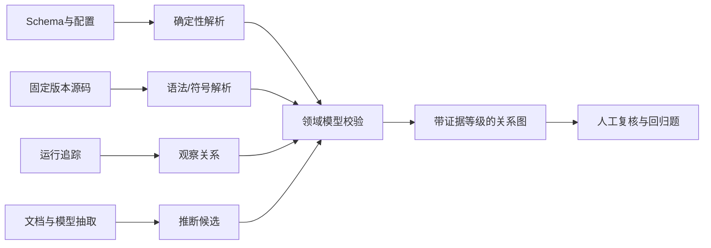
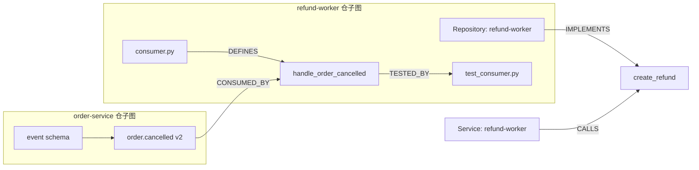
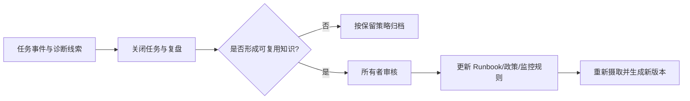

# 第 16 章 从企业语言到可导航的知识

> 本章要回答：怎样把业务问题和企业语言编译成可执行知识模型，再让图、Wiki、记忆和企业架构成为这个模型的可验证投影？

第 15 章解决了“找到可信对象”。但对象本身不会告诉系统 `Service` 与 `Repository` 是否是同一种东西，`RefundEvent` 与 `EventSchema` 能否互换，`ON_CALL_FOR` 的方向和有效期是什么，也不会说明哪些来源有资格产生一条 `CALLS` 关系。若跳过这些问题直接建图，平台得到的只是一批带连线的数据，而不是企业共同认可的语义。

因此，检索结果只是材料，知识模型才规定材料如何被理解。模型建立之后，企业上下文还需要四种组织能力：图把关系实例变成可查询路径，Wiki 把重复阅读编译成解释层，任务记忆保存一次工作的进展，企业架构声明提供“系统应该怎样”的规范视角。它们不是五套独立知识库，而是同一套企业语言、对象契约和证据规则的不同产物。

本章先完整走过 Northstar 的知识建模过程，再解释四种投影怎样生成和保持一致。C3 的完成标志不是“画出一张好看的概念图”，而是能从人工可评审材料编译出模型，并让错误术语、错误边方向、缺少源映射和无法回答的能力问题在构建时失败；C4 才开始生成图、Wiki、任务记忆和架构对照。

## 16.1 知识模型是对象与用途之间的控制面

第 15 章的统一对象契约回答“这份材料是谁、来自哪里、谁能看、何时有效”。知识模型继续回答“它在企业世界中是什么、与什么能建立哪种关系、关系凭什么成立、最终要支持哪个决策”。这两层不能合并：一份 Markdown 可以被编译成治理良好的对象，但其中的“服务”“消费者”仍可能只是未经消歧的文字。

Northstar 将建模产物分成五类：

| 产物 | 回答的问题 | Northstar 文件 |
|---|---|---|
| 能力问题 | 模型必须支持哪个判断或行动？ | `data/modeling/competency-questions.json` |
| 术语表与边界 | 同一个词在这里精确指什么，由谁负责？ | `data/modeling/glossary.json` |
| 概念与逻辑模型 | 有哪些对象类型、身份、生命周期和关系契约？ | `data/modeling/concept-model.json` |
| 源映射 | 哪个系统用什么身份规则产生对象或关系？ | `data/modeling/source-mappings.json` |
| 编译模型与验证报告 | 上述设计是否闭合，当前实例是否真的支持能力问题？ | `generated/domain-model.json`、`generated/model-validation.json` |

前四类是需要业务专家、架构师和平台团队共同评审的输入；最后一类是可删除重建的运行时产物。把它们分开很重要：直接手改编译产物，会让讨论过的业务语义与系统实际执行的契约重新分叉。

## 16.2 第一步：从决策写出可验收的能力问题

“建设企业知识图谱”不是能力问题，因为它没有可判定结果。Northstar 先选择三个需要真实决策的问题：

1. API 变化时，哪些服务、代码仓、值班团队和 Runbook 必须进入评审？
2. `order.cancelled` 变化时，哪些消费者和测试构成最低影响范围？
3. 一次退款事件发生时，哪一版政策在该地区有效？

每题除了自然语言，还记录所支持的决策、必需对象类型和关系类型。例如第二题不是要求系统“谈论事件影响”，而是要求模型至少能表达 `EventSchema -> CodeSymbol -> Test`，并在 fixture 中找到 `CONSUMED_BY` 和 `TESTED_BY` 的实例。第三题则迫使模型区分“政策发布时间”“事件发生时间”和“系统首次观察时间”。

能力问题在这里承担三种责任。它限制模型边界，防止把整个企业一次性本体化；它指导源接入优先级，避免先摄取与任务无关的数据；它也是验收入口，防止模型只有类型声明却没有可回答问题的实例。新增类型若不服务任何问题，应先解释未来用途；新增问题若依赖未建模关系，则应明确使构建门失败，而不是由模型在文本中猜测。

## 16.3 第二步：先统一语言，再定义类型

Northstar 的术语表不是同义词列表。每个术语记录规范名称、业务首选名、别名、定义、限界上下文和语义负责人，并通过反例划清边界。几个关键区分决定了后续模型是否可靠：

- `Service` 是可独立运行并承担运行责任的单元，`Repository` 是版本化源码容器；二者可能一对多或多对一，不能按名称合并。
- `EventSchema` 是事件类型及版本的契约，`RefundEvent` 是一次已经发生的业务事实；前者影响代码兼容性，后者参与时间政策判断。
- `Team` 是稳定组织主体，`ON_CALL_FOR` 是有有效期的值班关系；一次提交作者不自动成为服务负责人。
- `Runbook` 是经过审核的长期处置知识，`Incident` 是一次运行异常；事故中的暂时假设不能自动晋升为手册事实。

限界上下文进一步限制词义。Northstar 只设交易业务、软件工程和生产运行三个小边界，不追求复刻完整组织。术语负责人负责处理歧义，数据源负责人负责实例质量，两者不能混为一个“知识库管理员”。`modeling.py` 会拒绝同一限界上下文内由不同术语占用同一个规范名或别名；不同上下文可以保留同形词，但调用方必须携带上下文命名空间。这样既不假装全公司只能有一个词义，也不让边界内尚未裁决的歧义悄悄进入机器契约。

## 16.4 第三步：识别身份、生命周期和边界对象

确定语言后，才判断哪些概念值得成为独立对象。一个对象通常需要稳定身份、独立生命周期，或需要被权限、时间和关系单独引用。Northstar 因此把政策、事件契约、事件实例、服务、仓、API、团队、Runbook、代码符号、测试、ADR 和事故建成类型；“队列积压严重”则是观察或状态，不因为它是名词就创建永久实体类型。

每个类型必须声明身份规则。`Service` 使用服务目录 ID，`Repository` 使用规范 Git URL，`CodeSymbol` 使用仓、提交和符号三元组，`Policy` 使用政策 ID 与版本。身份规则的作用是阻止同名误合并，并让来源变化时仍能判断“同一对象的新版本”还是“另一个对象”。教学 fixture 的统一对象没有展开所有业务主键字段，但源映射必须写明这些键如何产生规范 ID；生产接入时还要保存解析失败和合并裁决。

生命周期决定哪些类型需要时间语义。政策、事件契约和 ADR 会版本演化；事件实例在某一时间发生；服务值班和调用关系也可能只在一段时间内成立。模型中的 `temporal: true` 不是自动实现历史查询，而是向物理层提出契约：实例和边必须能表达有效时间，查询不能默认把今天的关系投射到过去。

## 16.5 第四步：把关系写成可反驳的契约

知识图谱很容易从“把能抽取的实体都连起来”开始，最终得到大量无法服务任务的 `RELATED_TO`。Northstar 反过来从能力问题推导八种最小关系。每种关系都写明主语类型、宾语类型、方向、基数、时间性、允许证据，以及一个正例和反例。

例如事件影响题需要：

```json
{
  "CONSUMED_BY": {
    "from": "EventSchema",
    "to": "CodeSymbol",
    "cardinality": "one_to_many",
    "allowedEvidence": ["deterministic", "resolved"],
    "temporal": true,
    "meaning": "代码符号消费符合该事件契约的消息。",
    "negativeExample": "函数名包含 cancelled 但没有解析到订阅关系。"
  }
}
```

实例边必须进一步说明这一次关系为什么成立：

```json
{
  "from": "event-order-cancelled",
  "type": "CONSUMED_BY",
  "to": "code-refund-consumer",
  "evidence_tier": "resolved",
  "evidence": "code://northstar/refund-worker@abc123/consumer.py#handle_order_cancelled"
}
```

模型约束边能表达什么，实例证据说明某条边为什么存在。交换主客体后，边不再符合契约；仅凭名称相似得到的候选，也不能伪装成 `resolved`。同样，`GOVERNED_BY(RefundEvent, Policy)` 除类型约束外还要求地区匹配，以及**政策有效区间**覆盖事件发生时间。关系自身的有效区间表达另一件事：这条“事件映射到政策”的解析结论在哪段知识状态中成立。它的 `many_to_one_at_event_time` 因而不是“一个事件永远只能出现一条政策边”：同一事件可以保留先前映射和后续纠正，但两个不同目标的**关系有效区间**不能重叠。这样既能保存修订历史，又不会让同一解释时刻出现两份互相冲突的适用政策。不要拿事件发生时间去检查关系修订窗口，否则事后纠错会被误判为非法；事件时间用于选择政策版本，关系时间用于选择解析结论。关系因而不是图数据库里的任意三元组，而是可被来源证据反驳、按时间解释和重建的业务声明。

## 16.6 第五步：让每个模型元素都有来源和责任人

概念模型只说明企业希望怎样描述世界，源映射说明现实数据怎样进入这个世界。Northstar 为每个来源记录负责人、可产生的类型或关系、身份解析规则和刷新方式：服务目录产生 `Service`、`Team` 与 `ON_CALL_FOR`；代码索引产生仓、符号、测试和解析关系；文档系统产生政策、Runbook 与 ADR；运行追踪可以产生 `observed` 的 `CALLS`，却不能覆盖架构仓库中的 `asserted` 声明。

同一种关系允许多种来源，不代表它们权威性相同。代码解析说明当前固定提交中解析到调用，架构声明说明设计上应当调用，运行追踪只说明观察窗口中实际发生过调用。物理层可以把它们投影成同一种边类型，但必须保留证据等级、来源、版本和时间，使查询能够选择适当证据。

源映射还暴露建模空洞。如果模型声明 `Incident`，却没有任何系统能稳定提供事故 ID，那么这个类型尚不能实例化；如果能力问题需要 `TESTED_BY`，而代码索引只输出文件文本，则验收题不会被支持。C3 的构建门要求每个类型和关系至少有一个声明来源，但这只是最低闭合条件，生产系统还需验证源字段、规范 ID、冲突优先级、删除语义和负责人 SLA。

## 16.7 第六步：编译模型，并用实例证明它不是空壳

`build_domain_model.py` 完成两层验证。第一层检查模型本身：术语在各自边界内是否冲突，类型是否有身份、边界和术语，关系端点、基数与证据等级是否合法，能力问题是否引用已声明元素，每个模型元素是否有负责人明确的源映射。第二层读取 `knowledge.json` 与 `relations.json`：对象类型必须已声明，所有声明类型与关系都必须被 fixture 实际使用，边的方向、证据等级与时间信封必须符合关系契约，每道能力问题要求的类型和关系还必须落在同一个连通答案子图中。

```bash
cd examples/enterprise-case
python3 src/build_domain_model.py
```

摘要中的 `valid: true` 和 `supported_questions: 3` 表明三条能力问题在当前 fixture 中都有结构化支持。`generated/model-validation.json` 还为每道题列出样例对象和关系证据。读者可以把第一条 `CONSUMED_BY` 边的起终点交换，再运行测试，观察构建因“源类型必须是 EventSchema”而失败；也可以删除时间边的 `time`、移走一种关系实例，或在同一边界制造重复术语，观察这些不完整状态在图生成前被拒绝。

这里的“supported”有严格边界：它只证明所需类型和关系已经实例化，不证明最终答案召回完整，更不证明自然语言综合正确。后续图查询测试验证路径，Golden Questions 验证任务行为，人工评审验证业务定义。模型编译、实例契约、查询评测和答案评测是四个不同质量门，不能用其中一个替代全部。

Northstar 启动时会重新编译并验证模型，模型本身也参与 Manifest 内容散列。因此，修改术语、类型或关系契约会产生新的上下文快照；一份与实例不兼容的模型不会被运行时悄悄接受。Context Package 还会返回本次证据与路径所需的 `semantic_contract` 切片，让 Agent 知道对象类型和边方向，而不必从正文猜测。

## 16.8 模型的四种投影回答不同问题

同一个 `order.cancelled` 对象可以出现在四种视图中：

| 视图 | 典型问题 | 主要产物 | 不能替代什么 |
|---|---|---|---|
| 关系图 | 谁消费事件？谁测试消费者？ | 有类型、有方向、有证据的边 | 不替代原始代码和 Schema |
| Wiki | 退款系统负责什么？从哪里开始阅读？ | 系统页、仓库页、主题摘要 | 不替代规范来源和实时状态 |
| 任务记忆 | 这次事故已检查什么？谁确认了动作？ | 任务事件、假设、回执、待办 | 不自动成为组织长期知识 |
| 架构声明 | 设计上允许哪些调用？实际是否一致？ | 声明与实现、运行证据的差异 | 不把“应该”冒充“现在确实如此” |

把这四者混在一个向量集合里，会丢失它们的信任差异。例如架构图上的连线可能是设计意图，运行追踪中的调用才是一次观察事实；事故对话中的猜测属于任务记忆，审核后的 Runbook 才是可复用处置知识。系统必须保留这些类型，而不是让模型从措辞中猜。

## 16.9 图是怎样生成的

“生成知识图谱”不是一个单步骤模型调用。不同来源应走不同的证据路径：



确定性来源包括 API Schema、构建配置和显式服务目录；代码解析可以产生定义、引用和候选调用；运行追踪只证明某段时间里观察到调用；模型从文档抽出的关系则应先作为候选。它们不能被压成一个不透明的“置信度 0.87”。证据类型会决定边可用于什么风险等级的任务。

Northstar 使用四类主要等级：

- `deterministic`：由结构化来源直接确定；
- `resolved`：通过符号、代码或受约束解析完成实体解析；
- `observed`：在运行数据中实际观察到；
- `asserted`：由企业架构或其他规范资产声明“应该如此”。

更完整的生产模型还可以保留 `inferred` 或 `candidate`，但不应让它们直接支持高风险动作。边进入图之前要校验节点类型、方向、证据 URI、版本和时间范围；无法解析的实体宁可进入复核队列，也不要错误合并到同名对象。

## 16.10 代码仓为什么天然是子图

代码知识库不是把 README、源码和摘要放进向量库。一个仓内部至少包含仓、目录、文件、符号、测试、构建目标和提交；仓与仓之间还通过 API、事件、包、部署产物和所有者连接。



横向上，BM25 定位符号和路径，语义检索找到 Wiki 中的职责解释，图回答调用与影响关系；纵向上，查询从系统页进入仓库页、模块、符号，最后回到固定提交的源码。两条轴共同工作，才形成第 5 章所说的代码仓知识库。

Tree-sitter 适合提取语法结构，SCIP 或编译器索引提供更精确的符号导航，LSP 适合在线定义跳转与引用查询。它们的输出都应回到 ArtifactFS 中的固定源码版本。语法上可能的调用不能冒充编译解析后的关系，单次运行追踪也不能冒充所有可能路径。第 18 章会在 Linux eBPF 子系统上展开这套方法。

Northstar 只用三个消费者和一个逻辑仓表现上述结构。它的目的不是模拟大型代码索引，而是让读者能逐条检查边方向、证据和权限。

## 16.11 图检索应受任务和边界约束

Northstar 的影响分析从 `event-order-cancelled` 出发，沿 `CONSUMED_BY` 到三个消费者，再沿 `TESTED_BY` 到测试。这个查询看起来只是两跳，但生产图中“任意两跳”可能扩展到成千上万节点。

图检索至少要约束：

- 起点必须在主体已授权的对象集合内；
- 只允许与任务相关的边类型和方向；
- 限制跳数、节点数、路径数与执行时间；
- 边必须满足版本、有效时间和最低证据等级；
- 返回路径时保留每条边的来源，而不只返回终点名称。

遍历方向与关系语义要分开。无任务约束的通用追踪只沿声明方向前进，否则从事件走到消费者后，还可能顺着一条入边误入与本题无关的历史事故。API 变更影响分析则需要从 `API` 沿 `CALLS` 和 `IMPLEMENTS` 的反向导航找到服务与仓，但返回的边仍必须保持 `Service -> API`、`Repository -> API` 的声明方向，不能为了查询方便把语义翻转。Northstar 只有在选中能力问题后才允许这种双向导航，同时把该问题编译为本次允许的关系集合；`CQ-IMPACT-001` 只允许 `CALLS`、`IMPLEMENTS`、`ON_CALL_FOR` 和 `DOCUMENTED_BY`。教学遍历器禁止同一路径重复同一种关系，避免从目标 API 经服务横向扩展到另一个 sibling API；生产规划器应进一步使用明确的路径模式、基数和预算。

`trace_dependency()` 先用 `visible_ids` 和能力问题允许的边类型构造安全邻接表。默认只登记声明方向；查询计划明确允许反向导航时，才登记另一个入口。无论从哪个入口抵达，函数始终返回原始有向边：

```python
for edge in edges:
    if edge["from"] in visible_ids and edge["to"] in visible_ids:
        adjacency[edge["from"]].append((edge, edge["to"]))
        if allow_inverse_navigation:
            adjacency[edge["to"]].append((edge, edge["from"]))
```

support 无权看到事件和代码，因此不是“路径末端被打码”，而是起点和相关边根本不会进入其可查询子图。这与第 15 章的 ACL-first 是同一个原则在图投影上的实现。

图也不应对所有问题固定启用。政策解释题通常不需要代码依赖扩展；影响分析题则高度依赖图。是否使用图应由查询规划和消融评测决定，而不是成为每次请求的固定成本。

## 16.12 Wiki 是阅读视图，不是第二份事实

图适合机器沿关系导航，却不是大多数读者理解系统的最佳入口。Wiki 将对象和关系组织成系统页、仓库页或主题页，提前完成反复发生的阅读与综合。

一个有用的系统页可以回答：系统负责什么，边界在哪里，对外接口和事件是什么，由谁值班，常见故障如何诊断，关键代码仓和规范来源在哪里。页面中的每项声明仍应链接回对象或边证据。

Northstar 的 `build_role_scoped_wiki()` 使用确定性模板，先按角色得到可见对象，再按系统分组生成页面。页面的 `inputs` 保存所有版本化引用。这种设计有三层意义：

1. 页面不是规范来源，输入仍可追溯；
2. 输入版本变化时，可以精确标记哪些页面过期；
3. 不同安全域分别编译页面，避免先生成高权限页面再做文本删减。

生产中可以让模型把模板内容改写成更流畅的说明，但模型输出必须通过页面 Schema、引用覆盖、事实一致性和权限检查。模型不能因为文字流畅就提升声明权威性。

### 什么不应写入 Wiki

当前队列深度、账户余额、正在审批的动作和即时部署状态变化太快，不适合被复制到静态页面。Wiki 可以解释指标定义、查询入口和处置原则，具体数值应由实时工具读取。

未经确认的事故猜测也不应直接发布。它可以留在任务记忆或候选区，经过复盘和所有者审核后再更新 Runbook。这样能避免一次偶然关联被写成长期因果结论。

## 16.13 任务记忆保存“这次工作进行到哪里”

任务记忆与聊天历史不同。聊天是交互记录，任务记忆应是可查询、可审计的工作状态，例如：

- 谁开始了诊断；
- 已检查哪些证据和指标；
- 哪些假设被排除，依据是什么；
- 准备了什么动作，谁确认或拒绝；
- 执行产生什么回执，验证是否通过。

Northstar 的 `TaskMemory` 以 `task_id` 保存有序事件。它足以证明任务隔离和状态恢复语义，但仍是进程内 fixture。生产任务服务还需处理并发写、事件版本、重试、保留期、敏感字段、人工更正与删除。

任务记忆进入长期知识要经过明确晋升：



这个过程保留组织知识的责任链。Agent 可以提出候选总结，但不能因为某条记忆被多次检索，就自动把它升级为企业事实。

## 16.14 企业架构提供“应该如此”的对照面

企业架构资产常被误解为过时文档，代码和运行数据又常被误解为唯一真相。两者回答的是不同问题：架构声明描述目标边界和允许关系，代码及运行观察描述当前实现或特定时间发生的行为。

Northstar 将架构关系保存为 `asserted`，再与 `resolved` 和 `observed` 证据比较，得到三类结果：

| 类别 | 示例 | 正确解释 |
|---|---|---|
| `declared_and_evidenced` | `refund-worker -> create_refund` | 声明得到当前证据支持 |
| `declared_not_evidenced` | `refund-worker -> legacy_refund` | 需要核验，不能直接断言死代码 |
| `evidenced_not_declared` | `refund-worker -> risk_check` | 可能是影子依赖，也可能是模型或观测误差 |

差异不是自动修复命令，而是治理队列。架构负责人可能更新声明，开发团队可能修正实现，平台团队也可能发现解析器误报。保留声明来源和实现证据，比压成一个“架构一致性得分”更有助于做出正确处置。

这使企业架构从偶尔绘制的静态图，变成持续接受代码和运行反馈的上下文来源；同时也避免用一次不完整扫描否定架构意图。第 8 章讨论的知识建模与 MEAF 等企业架构方法，在这里通过同一对象和关系契约发生连接。

## 16.15 变化怎样传播到模型、图和 Wiki

派生知识的难点不是第一次生成，而是持续不陈旧。变化首先要区分“企业语义变了”还是“语义下的实例变了”。前者例如把 `Service` 的身份规则从名称改为服务目录 ID，需要模型版本、迁移规则和所有投影重验；后者例如退款消费者在新提交中不再消费 `order.cancelled`，模型契约不变，只需更新对象和边实例：

1. 新源码版本产生新的 `content_hash` 和对象版本；
2. 旧 `CONSUMED_BY` 边不再属于当前快照，但仍保留在历史版本；
3. 以该边或代码对象为输入的 Wiki 页面被标记 stale；
4. 影响分析回归题在候选快照上重新运行；
5. 通过质量门后，新的 Manifest 原子发布为当前视图。

删除同样需要沿血缘传播。只从主数据库删对象而保留向量、图边或 Wiki 摘要，会让已撤销内容继续被召回。生产系统应维护反向依赖、删除标记和重建队列，并验证各投影最终都不再暴露撤销版本。

增量更新不意味着每次只做最少计算。对高风险小页面可以精确失效；对解析器大版本升级，建立完整候选快照再切换通常更容易审计。策略取决于来源变化率、派生扇出、成本和发布风险。

## 16.16 把设计映射到 Northstar 的 C3-C4

理解建模过程和四种投影之后，再运行实现。先完成 C3；只有编译模型和实例报告同时有效，才进入 C4：

```bash
cd examples/enterprise-case

# C3：从能力问题、术语、概念和源映射编译模型，并验证实例。
python3 src/build_domain_model.py

# C4：从事件遍历消费者和测试。
python3 src/northstar.py "修改 order.cancelled 会影响什么" \
  --role developer --graph-seed event-order-cancelled \
  --competency-question CQ-EVENT-001

# C4：从 API 反向导航到调用服务、实现仓、值班团队和 Runbook；边方向保持不变。
python3 src/northstar.py "退款网关 API 变化会影响什么" \
  --role developer --graph-seed api-create-refund \
  --competency-question CQ-IMPACT-001

# 对比不同角色编译出的 Wiki 安全域。
python3 src/northstar.py --wiki --role support
python3 src/northstar.py --wiki --role developer

# 比较架构声明与代码、运行证据。
python3 src/northstar.py --architecture-consistency --role developer

# 验证建模输入、模型实例、权限、Wiki、记忆和架构差异契约。
python3 -m unittest \
  tests.test_modeling \
  tests.test_domain_model \
  tests.test_architecture_consistency \
  tests.test_northstar -v
```

读者应验证的不是命令是否打印 JSON，而是一条因果链：能力问题决定所需类型和关系；术语、身份、关系反例和源映射组成可评审模型；模型拒绝错误实例；通过验证的边才能进入图；开发者看到三条消费者路径而 support 无法穿过代码边界；Wiki 的每个输入都有版本化引用；任务记忆按任务隔离；架构差异不会把“缺少证据”误写成“声明错误”。

### 从教学实现走向生产

生产化首先要为模型建立评审、版本、兼容性和迁移流程，而不是让平台代码中的 JSON 永久充当企业语义治理。之后也不必立即部署专用图数据库。若对象和边规模可控，关系表加有界查询已经足够验证任务价值。只有当多跳查询、关系密度、更新模式和延迟需求证明需要时，再引入图后端。无论存储是什么，领域模型、证据等级、ACL、版本和血缘仍是接口。

Wiki 也应先从少量高频页面模式开始，测量引用覆盖、陈旧时间和任务完成收益，再扩大生成范围。任务记忆先服务明确工作流，不要默认保存所有对话。企业架构对照先选择一两个关键系统和关系类型，建立处置责任后再扩展。

Tree-sitter、SCIP 和代码图工具解决的是结构提取；PROV-O 提供来源与派生关系的标准表达思路；它们都不能替代领域能力问题和组织治理。[Tree-sitter 文档](https://tree-sitter.github.io/tree-sitter/) [SCIP](https://github.com/scip-code/scip) [W3C PROV-O](https://www.w3.org/TR/prov-o/)

## 本章小结

可信对象解决“找到什么”，知识模型解决“这些对象在企业中意味着什么、允许怎样连接”，图、Wiki、任务记忆和企业架构共同解决“怎样理解并持续使用”。Northstar 从能力问题出发，经术语、身份、关系契约和源映射编译模型，再用真实对象与边证明模型不是空壳。图把有证据的关系变成有界路径；Wiki 把重复阅读编译成按安全域生成的解释视图；任务记忆保存一次工作的进展，并通过审核晋升为长期知识；企业架构把设计意图与实现、运行事实并列比较。它们都引用同一对象和模型版本，继承相同权限，并沿血缘失效。下一章将把语义契约与这些材料一起组装成 Agent 可消费的 Context Package，并讨论如何从建议安全地走向行动。

## 延伸阅读

- W3C, [PROV-O: The PROV Ontology](https://www.w3.org/TR/prov-o/)。
- Tree-sitter, [Documentation](https://tree-sitter.github.io/tree-sitter/)。
- SCIP contributors, [SCIP](https://github.com/scip-code/scip)。
- Andrej Karpathy, [LLM Wiki](https://gist.github.com/karpathy/442a6bf555914893e9891c11519de94f)。
- Thoughtworks, [现代企业架构框架（MEAF）V4 学习镜像](https://web3d.github.io/meaf-book/)；镜像标注版权归 Thoughtworks。
