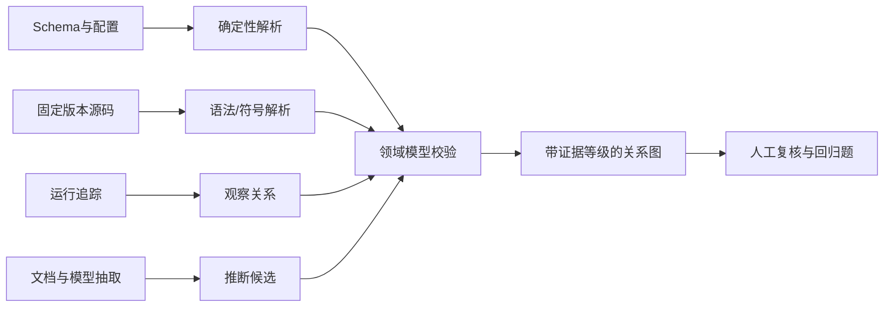
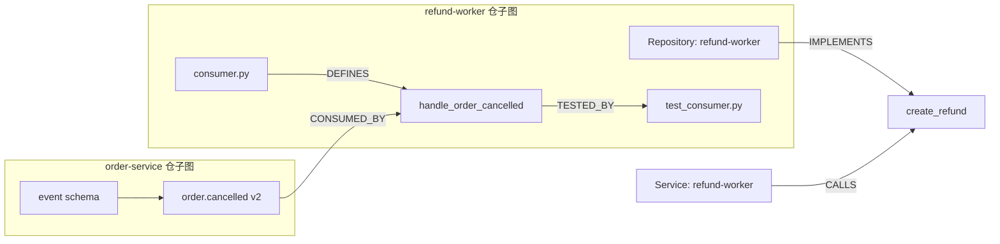

# 第 16 章 让系统按企业的含义连接知识

> 本章要回答：怎样用企业模型说明对象与关系，再生成可查询的路径和阅读视图，并让它们随来源更新？

第 15 章解决了“找到可信对象”。但对象本身不会告诉系统 `Service` 与 `Repository` 是否是同一种东西，`RefundEvent` 与 `EventSchema` 能否互换，`ON_CALL_FOR` 的方向和有效期是什么，也不会说明哪些来源有资格产生一条 `CALLS` 关系。若跳过这些问题直接建图，平台得到的只是一批带连线的数据，而不是企业共同认可的语义。

因此，检索结果只是找到的材料，知识模型才规定这些材料在企业里是什么意思。对象与关系可以形成供机器导航的图，也可以组织成供人阅读的 Wiki。任务记忆来自工作过程中留下的事件，企业架构声明来自经过评审的设计资产；它们各有来源，再通过共同的对象身份、业务含义和证据规则连接起来。

第 6—8 章已经说明结构导航、知识视图和建模的方法。本章将它们落实为 Northstar 的模型输入、编译器、关系查询和验证报告。C3 从人工可评审材料编译领域模型；C4 使用通过校验的对象做关系导航、Wiki 和架构对照。经营模型则把范围延伸到商业模式、战略意图、经营结构和指标语义。任务条件、记忆和持久恢复将在第17章集中实现。

## 16.1 知识对象说明“它是谁”，知识模型说明“它是什么意思”

第 15 章的统一对象规则回答“这份材料是谁、来自哪里、谁能看、何时有效”。知识模型继续回答“它在业务中代表什么、能和哪些对象建立什么关系、这条关系要有什么证据、最终帮助谁做什么决定”。这两层不能合并：一份 Markdown 即使已经带上完整的版本和权限，其中的“服务”“消费者”仍可能只是没有解释清楚的词。

Northstar 的 C3 将领域建模产物分成五类：

| 产物 | 回答的问题 | Northstar 文件 |
|---|---|---|
| 能力问题 | 模型必须支持哪个判断或行动？ | `data/modeling/competency-questions.json` |
| 术语表与边界 | 同一个词在这里精确指什么，由谁负责？ | `data/modeling/glossary.json` |
| 概念与逻辑模型 | 有哪些对象类型、身份、生命周期和关系契约？ | `data/modeling/concept-model.json` |
| 源映射 | 哪个系统用什么身份规则产生对象或关系？ | `data/modeling/source-mappings.json` |
| 编译模型与验证报告 | 上述设计是否闭合，当前实例是否真的支持能力问题？ | `generated/domain-model.json`、`generated/model-validation.json` |

阅读本章时可以按四组推进：§16.1–16.6 是建模输入，§16.7 是实例验证，§16.8–16.14 是查询和使用，§16.15–16.16 是变更与动手验证。先完成一组，再进入下一组。

前四类要由业务专家、架构师和平台团队共同评审；最后一类则由程序生成，可以删除后重建。两者必须分开。如果直接手改程序生成的文件，团队讨论确认的业务含义就会再次和系统实际执行的规则分叉。

## 16.2 第一步：从工作问题写出模型的验收题

“建设企业知识图谱”不是能力问题，因为它没有可判定结果。Northstar 的 C3 先选择三个具体问题：

1. API 变化时，哪些服务、代码仓、值班团队和 Runbook 必须进入评审？
2. `order.cancelled` 变化时，哪些消费者和测试构成最低影响范围？
3. 一次退款事件发生时，哪一版政策在该地区有效？

每题除了自然语言，还记录所支持的决策、必需对象类型和关系类型。例如第二题要求模型至少能表达 `EventSchema -> CodeSymbol -> Test`，并在 fixture 中找到 `CONSUMED_BY` 和 `TESTED_BY` 的实例。第三题则要求区分政策的生效时间、事件发生时间和平台记录时间。

C7 另外回答经营问题：H2 销售为什么低于 H1，目标、业务分解、组织责任和数据缺口是什么？它依赖指标定义和企业经营模型，由 `StrategicContext` 独立校验，不计入 C3 的三条能力问题。§16.14.1 会从原始快照逐步解释这条路径。

能力问题在这里有三个作用。第一，它限制建模范围，避免团队试图一次描述整个企业。第二，它决定先接入哪些数据源，避免先处理与任务无关的资料。第三，它直接成为验收题，避免模型只声明了一堆类型，却没有任何真实对象和关系可以回答问题。战略题还要求把“能算出差异”和“能解释原因”分开：分解事实可以由同一快照核算，因果假设必须有额外证据。新增类型如果不服务任何问题，应先解释未来用途；新增问题如果依赖尚未建模的关系，则应让构建明确失败，而不是让模型临时从文本中猜。

## 16.3 第二步：先统一语言，再定义类型

Northstar 的术语表不是同义词列表。每个术语记录规范名称、业务首选名、别名、定义、限界上下文和语义负责人，并通过反例划清边界。几个关键区分决定了后续模型是否可靠：

- `Service` 是可独立运行并承担运行责任的单元，`Repository` 是版本化源码容器；二者可能一对多或多对一，不能按名称合并。
- `EventSchema` 是事件类型及版本的契约，`RefundEvent` 是一次已经发生的业务事实；前者影响代码兼容性，后者参与时间政策判断。
- `Team` 是稳定组织主体，`ON_CALL_FOR` 是有有效期的值班关系；一次提交作者不自动成为服务负责人。
- `Runbook` 是经过审核的长期处置知识，`Incident` 是一次运行异常；事故中的暂时假设不能自动晋升为手册事实。

限界上下文进一步限制词义。Northstar 只设交易业务、软件工程和生产运行三个小边界，不追求复刻完整组织。术语负责人负责处理歧义，数据源负责人负责实例质量，两者不能混为一个“知识库管理员”。`modeling.py` 会拒绝同一限界上下文内由不同术语占用同一个规范名或别名；不同上下文可以保留同形词，但调用方必须携带上下文命名空间。这样既不假装全公司只能有一个词义，也不让边界内尚未裁决的歧义悄悄进入机器契约。

## 16.4 第三步：识别身份、生命周期和边界对象

确定语言后，才判断哪些概念值得成为独立对象。一个对象通常需要稳定身份、独立生命周期，或需要被权限、时间和关系单独引用。Northstar 因此把政策、事件契约、事件实例、服务、仓、API、团队、Runbook、代码符号、测试、ADR 和事故建成类型；“队列积压严重”则是观察或状态，不因为它是名词就创建永久实体类型。

每个类型必须声明身份规则。`Service` 使用服务目录 ID，`Repository` 使用规范 Git URL，`CodeSymbol` 使用仓、提交和符号三元组，`Policy` 使用政策 ID 与版本。身份规则的作用是阻止同名误合并，并让来源变化时仍能判断“同一对象的新版本”还是“另一个对象”。教学 fixture 的统一对象没有展开所有业务主键字段，但源映射必须写明这些键如何产生规范 ID；生产接入时还要保存解析失败和合并裁决。

生命周期决定哪些类型需要时间语义。政策、事件契约和 ADR 会版本演化；事件实例在某一时间发生；服务值班和调用关系也可能只在一段时间内成立。模型中的 `temporal: true` 不是自动实现历史查询，而是向物理层提出契约：实例和边必须能表达有效时间，查询不能默认把今天的关系投射到过去。

## 16.5 第四步：写清楚什么证据才能证明一条关系

知识图谱很容易从“把能抽取的实体都连起来”开始，最终得到大量无法服务任务的 `RELATED_TO`。Northstar 反过来从能力问题推导八种最小关系。每种关系都写明主语类型、宾语类型、方向、基数、时间性、允许证据，以及一个正例和反例。

例如事件影响题需要：

```json
{
  "CONSUMED_BY": {
    "from": "EventSchema",
    "to": "CodeSymbol",
    "cardinality": "one_to_many",
    "allowedEvidence": ["deterministic", "resolved"],
    "temporal": true,
    "meaning": "代码符号消费符合该事件契约的消息。",
    "negativeExample": "函数名包含 cancelled 但没有解析到订阅关系。"
  }
}
```

实例边必须进一步说明这一次关系为什么成立：

```json
{
  "from": "event-order-cancelled",
  "type": "CONSUMED_BY",
  "to": "code-refund-consumer",
  "evidence_tier": "resolved",
  "evidence": "code://northstar/refund-worker@abc123/consumer.py#handle_order_cancelled"
}
```

模型规定一种关系允许表达什么，实例证据则说明这一条具体关系为什么存在。交换主客体后，边不再符合契约；仅凭名称相似得到的候选，也不能伪装成 `resolved`。

`GOVERNED_BY(RefundEvent, Policy)` 除了限制两端类型，还要求地区匹配，并且**政策有效区间**要覆盖事件发生时间。关系自身的有效区间表达的是另一件事：这条“事件映射到政策”的解析结论，在系统的哪段知识状态中成立。

因此，`many_to_one_at_event_time` 并不表示“一个事件永远只能出现一条政策边”。同一事件可以保留先前映射和后续纠正，但指向两个不同政策的**关系有效区间**不能重叠。这样既能保存修订历史，也不会让同一个解释时刻出现两份互相冲突的适用政策。

不要用事件发生时间检查关系的修订窗口，否则事后纠错会被误判为非法。两条时间线各管一件事：事件发生时间用来选择当时适用的政策版本；关系有效时间用来选择系统在某个时刻采用的解析结论。因此，一条关系不是图数据库里随手连上的线，而是一项有来源证据、可以被纠正、能够按时间解释和重建的业务声明。

## 16.6 第五步：让每个模型元素都有来源和责任人

概念模型只说明企业希望怎样描述世界，源映射说明现实数据怎样进入这个世界。Northstar 为每个来源记录负责人、可产生的类型或关系、身份解析规则和刷新方式：服务目录产生 `Service`、`Team` 与 `ON_CALL_FOR`；代码索引产生仓、符号、测试和解析关系；文档系统产生政策、Runbook 与 ADR；运行追踪可以产生 `observed` 的 `CALLS`，却不能覆盖架构仓库中的 `asserted` 声明。

同一种关系允许多种来源，不代表它们权威性相同。代码解析说明当前固定提交中解析到调用，架构声明说明设计上应当调用，运行追踪只说明观察窗口中实际发生过调用。物理层可以把它们投影成同一种边类型，但必须保留证据等级、来源、版本和时间，使查询能够选择适当证据。

源映射还暴露建模空洞。如果模型声明 `Incident`，却没有任何系统能稳定提供事故 ID，那么这个类型尚不能实例化；如果能力问题需要 `TESTED_BY`，而代码索引只输出文件文本，则验收题不会被支持。C3 的构建门要求每个类型和关系至少有一个声明来源，但这只是最低闭合条件，生产系统还需验证源字段、规范 ID、冲突优先级、删除语义和负责人 SLA。

## 16.7 第六步：生成运行模型，再用具体实例验收

`build_domain_model.py` 完成两层验证。第一层检查模型本身：术语在各自边界内是否冲突，类型是否有身份、边界和术语，关系端点、基数与证据等级是否合法，能力问题是否引用已声明元素，每个模型元素是否有负责人明确的源映射。第二层读取 `compile_knowledge()` 合并的十九个对象与 `relations.json`：对象类型必须已声明，所有声明类型与关系都必须被 fixture 实际使用，边的方向、证据等级与时间信封必须符合关系契约，每道能力问题要求的类型和关系还必须落在同一个连通答案子图中。

```bash
cd examples/enterprise-case
python3 src/build_domain_model.py
```

摘要中的 `valid: true` 和 `supported_questions: 3` 表明三条能力问题在当前 fixture 中都有结构化支持。`generated/model-validation.json` 还为每道题列出样例对象和关系证据。读者可以把第一条 `CONSUMED_BY` 边的起终点交换，再运行测试，观察构建因“源类型必须是 EventSchema”而失败；也可以删除时间边的 `time`、移走一种关系实例，或在同一边界制造重复术语，观察这些不完整状态在图生成前被拒绝。

这里的 `supported` 只证明回答问题所需的类型和关系在教学数据中有连通实例。它不验证引用所指内容的真实性，也不证明检索已经找全或模型生成的答案正确。后续图查询测试验证路径，Golden Questions 验证任务行为，人工评审验证业务定义。模型编译、实例契约、查询评测和答案评测是四个不同质量门。

Northstar 启动时会重新编译并验证模型，模型本身也参与 Manifest 内容散列。因此，修改术语、类型或关系契约会产生新的上下文快照；一份与实例不兼容的模型不会被运行时悄悄接受。Context Package 还会返回本次证据与路径所需的 `semantic_contract` 切片，让 Agent 知道对象类型和边方向，而不必从正文猜测。

在下面的实验里，先阅读编译函数如何把四份建模输入连起来，再查看 `semantic_slice()` 怎样只取当前材料需要的含义。执行后，将一条 `CONSUMED_BY` 类型定义和它的实例边放在一起核对：两端是什么、方向是什么、证据是什么。要改变模型，请在本地编辑 `data/modeling/`，运行校验后重新构建书站；页面中的角色切换用于观察可见切片，不是修改企业词义。

<NorthstarLab lesson="C3" />

## 16.8 通过共同对象连接四种用途

同一个 `order.cancelled` 对象可以被四类使用方式引用；其中任务记忆来自执行事件，架构声明来自设计资产，不能误认为都由文档自动派生：

| 使用方式 | 典型问题 | 主要产物 | 不能替代什么 |
|---|---|---|---|
| 关系图 | 谁消费事件？谁测试消费者？ | 有类型、有方向、有证据的边 | 不替代原始代码和 Schema |
| Wiki | 退款系统负责什么？从哪里开始阅读？ | 系统页、仓库页、主题摘要 | 不替代规范来源和实时状态 |
| 任务记忆 | 这次事故已检查什么？谁确认了动作？ | 任务事件、假设、回执、待办 | 不自动成为组织长期知识 |
| 架构声明 | 设计上允许哪些调用？实际是否一致？ | 声明与实现、运行证据的差异 | 不把“应该”冒充“现在确实如此” |

把这四者混在一个向量集合里，会丢失它们的信任差异。例如架构图上的连线可能是设计意图，运行追踪中的调用才是一次观察事实；事故对话中的猜测属于任务记忆，审核后的 Runbook 才是可复用处置知识。系统必须保留这些类型，而不是让模型从措辞中猜。

## 16.9 图不是一次模型调用生成的

“生成知识图谱”不是一个单步骤模型调用。不同来源应走不同的证据路径：


```mermaid
flowchart LR
  S[Schema与配置] --> D[确定性解析]
  C[固定版本源码] --> P[语法/符号解析]
  T[运行追踪] --> O[观察关系]
  M[文档与模型抽取] --> I[推断候选]
  D --> V[领域模型校验]
  P --> V
  O --> V
  I --> V
  V --> G[带证据等级的关系图]
  G --> R[人工复核与回归题]
```

确定性来源包括 API Schema、构建配置和显式服务目录；代码解析可以产生定义、引用和候选调用；运行追踪只证明某段时间里观察到调用；模型从文档抽出的关系则应先作为候选。它们不能被压成一个不透明的“置信度 0.87”。证据类型会决定边可用于什么风险等级的任务。

Northstar 使用四类主要等级：

- `deterministic`：由结构化来源直接确定；
- `resolved`：通过符号、代码或受约束解析完成实体解析；
- `observed`：在运行数据中实际观察到；
- `asserted`：由企业架构或其他规范资产声明“应该如此”。

第 8 章还区分 `heuristic`（启发式匹配）与 `inferred`（推断）；它们应保留推导依据和复核状态。`candidate` 表示待复核状态，不是另一种证据来源。进入生产图之前，还要核验节点类型、方向、证据坐标、版本和时间范围；无法解析的实体应进入复核队列。

Northstar 的十三条关系由人写入 `relations.json`，上述等级表示样例所模拟的来源类型。当前程序检查标签是否符合关系契约、证据字段是否存在，但不验证引用真实性，也不执行跨仓符号解析或采集真实追踪。因此，读者可以用它练习证据规则，实际建图时仍需实现并验证相应的提取过程。

## 16.10 代码仓为什么天然是子图

代码知识库不是把 README、源码和摘要放进向量库。一个仓内部至少包含仓、目录、文件、符号、测试、构建目标和提交；仓与仓之间还通过 API、事件、包、部署产物和所有者连接。


```mermaid
flowchart LR
  subgraph RepoA[refund-worker 仓子图]
    R1[Repository: refund-worker]
    F1[consumer.py] -->|DEFINES| S1[handle_order_cancelled]
    S1 -->|TESTED_BY| T1[test_consumer.py]
  end
  subgraph RepoB[order-service 仓子图]
    F2[event schema] --> E[order.cancelled v2]
  end
  E -->|CONSUMED_BY| S1
  R1 -->|IMPLEMENTS| API[create_refund]
  SVC[Service: refund-worker] -->|CALLS| API
```

上图展示生产代码知识库的多仓组织方式；Northstar 只用一个逻辑仓和三个消费者练习关系契约。横向上，BM25 定位符号和路径，语义检索找到 Wiki 中的职责解释，图回答调用与影响关系；纵向上，查询从系统页进入仓库页、模块、符号，最后回到固定提交的源码。两条轴共同工作，形成第 6 章介绍的代码资源导航。

Tree-sitter 适合提取语法结构，SCIP 或编译器索引提供更精确的符号导航，LSP 适合在线定义跳转与引用查询。它们的输出都应回到 ArtifactFS 中的固定源码版本。语法上可能的调用不能冒充编译解析后的关系，单次运行追踪也不能冒充所有可能路径。第 18 章会在 Linux eBPF 子系统上展开这套方法。

Northstar 只用三个消费者和一个逻辑仓表现上述结构。它的目的不是模拟大型代码索引，而是让读者能逐条检查边方向、证据和权限。

## 16.11 图检索应受任务和边界约束

Northstar 的影响分析从 `event-order-cancelled` 出发，沿 `CONSUMED_BY` 到三个消费者，再沿 `TESTED_BY` 到测试。这个查询看起来只是两跳，但生产图中“任意两跳”可能扩展到成千上万节点。

图检索至少要约束：

- 起点必须在主体已授权的对象集合内；
- 只允许与任务相关的边类型和方向；
- 限制跳数、节点数、路径数与执行时间；
- 边必须满足版本、有效时间和最低证据等级；
- 返回路径时保留每条边的来源，而不只返回终点名称。

遍历方向与关系语义要分开。无任务约束的通用追踪只沿声明方向前进，否则从事件走到消费者后，还可能顺着一条入边误入与本题无关的历史事故。API 变更影响分析则需要从 `API` 沿 `CALLS` 和 `IMPLEMENTS` 的反向导航找到服务与仓，但返回的边仍必须保持 `Service -> API`、`Repository -> API` 的声明方向，不能为了查询方便把语义翻转。Northstar 只有在选中能力问题后才允许这种双向导航，同时把该问题编译为本次允许的关系集合；`CQ-IMPACT-001` 只允许 `CALLS`、`IMPLEMENTS`、`ON_CALL_FOR` 和 `DOCUMENTED_BY`。教学遍历器禁止同一路径重复同一种关系，避免从目标 API 经服务横向扩展到另一个 sibling API；生产规划器应进一步使用明确的路径模式、基数和预算。

`trace_dependency()` 先用 `visible_ids` 和能力问题允许的边类型构造安全邻接表。默认只登记声明方向；查询计划明确允许反向导航时，才登记另一个入口。无论从哪个入口抵达，函数始终返回原始有向边：

```python
for edge in edges:
    if edge["from"] in visible_ids and edge["to"] in visible_ids:
        adjacency[edge["from"]].append((edge, edge["to"]))
        if allow_inverse_navigation:
            adjacency[edge["to"]].append((edge, edge["from"]))
```

support 无权看到事件和代码，因此不是“路径末端被打码”，而是起点和相关边根本不会进入其可查询子图。这与第 15 章的 ACL-first 是同一个原则在图投影上的实现。

图也不应对所有问题固定启用。政策解释题通常不需要代码依赖扩展；影响分析题则高度依赖图。是否使用图应由查询规划和消融评测决定，而不是成为每次请求的固定成本。

## 16.12 Wiki 是阅读视图，不是第二份事实

图适合机器沿关系导航，却不是大多数读者理解系统的最佳入口。Wiki 将对象和关系组织成系统页、仓库页或主题页，提前完成反复发生的阅读与综合。

一个有用的系统页可以回答：系统负责什么，边界在哪里，对外接口和事件是什么，由谁值班，常见故障如何诊断，关键代码仓和规范来源在哪里。页面中的每项声明仍应链接回对象或边证据。

Northstar 的 `build_role_scoped_wiki()` 使用确定性模板，先按角色得到可见对象，再按系统分组生成页面。页面的 `inputs` 保存所有版本化引用。这种设计有三层意义：

1. 页面不是规范来源，输入仍可追溯；
2. 输入引用为追踪页面依赖提供依据；本例每次重新生成模板，增量失效队列需另行实现；
3. 不同安全域分别编译页面，避免先生成高权限页面再做文本删减。

生产中可以让模型把模板内容改写成更流畅的说明，但模型输出必须通过页面 Schema、引用覆盖、事实一致性和权限检查。模型不能因为文字流畅就提升声明权威性。

本例的 `--wiki` 生成按系统分组的运行与工程资料页。第 7 章的企业概览、能力、价值流和目标页面，需要使用 C7 这类企业模型选择输入、组织页面并检查引用；当前模板还没有生成这些页面。先理解模板怎样保持证据和权限，再扩展页面类型。

下面先从事件展开消费者与测试，再在“操作区域”中切换到 Wiki。两种视图使用同一批对象，分别解决路径查证和快速阅读。还可以切换“架构核对”，检查声明和证据是否一致。不要只看数量，要打开一条路径的依据和一个 Wiki 页的来源，核对它们指向什么版本。

<NorthstarLab lesson="C4" />

### 什么不应写入 Wiki

当前队列深度、账户余额、正在审批的动作和即时部署状态变化太快，不适合被复制到静态页面。Wiki 可以解释指标定义、查询入口和处置原则，具体数值应由实时工具读取。

未经确认的事故猜测也不应直接发布。它可以留在任务记忆或候选区，经过复盘和所有者审核后再更新 Runbook。这样能避免一次偶然关联被写成长期因果结论。

## 16.13 把共享知识与一次工作的记录接起来

图和 Wiki 可以服务很多任务；“本次已检查哪个消费者”“谁批准了动作”只属于某次工作。两者通过对象身份与版本相连：任务引用所采用的证据，后续复核才能找到当时依据。

这种连接不表示工作笔记会自动写入 Wiki。关于根因的猜测先保留为任务声明，经过复盘和责任人审核后，才可能进入新的 Runbook。第17章将实现任务事件、上下文快照与恢复，并让读者在页面上检查这个边界。本章继续完成共享资源的架构核对和更新过程。

## 16.14 用企业架构理解责任，并核对设计与实现

第 8 章的企业架构包含商业模式、目标、能力、价值流、组织以及应用和数据之间的联系，也需要区分现状与目标。本节先检查其中一个小切片：设计允许的服务关系与实现证据是否一致，再用经营问题展开更广的企业模型。架构声明表达经过评审的边界；代码和运行观察分别说明实现结构与特定时间发生的行为。

Northstar 将架构关系保存为 `asserted`，再与 `resolved` 和 `observed` 证据比较，得到三类结果：

| 类别 | 示例 | 正确解释 |
|---|---|---|
| `declared_and_evidenced` | `refund-worker -> create_refund` | 声明得到当前证据支持 |
| `declared_not_evidenced` | `refund-worker -> legacy_refund` | 需要核验，不能直接断言死代码 |
| `evidenced_not_declared` | `refund-worker -> risk_check` | 可能是影子依赖，也可能是模型或观测误差 |

这些差异不是要求系统自动修复，而是进入待处理队列。架构负责人可能更新声明，开发团队可能修正实现，平台团队也可能发现解析器误报。保留声明来源和实现证据，比压成一个“架构一致性得分”更有助于做出正确处置。

这使企业架构从偶尔绘制的静态图，变成持续接受代码和运行反馈的上下文来源；同时也避免用一次不完整扫描否定架构意图。第 8 章讨论的知识建模与 MEAF 等企业架构方法，在这里通过同一对象和关系契约发生连接。

### 16.14.1 战略分析怎样沿企业架构向下追踪

经营负责人问“H2 为什么比 H1 差”，第一步要先确认比较的是什么。C7 选择已确认订单净额，使用相同币种与半年度边界，明确折扣、撤销和退货的处理规则；收入、回款和 GMV 不能直接代入。然后才把这个指标接回企业经营模型。

打开 `data/strategy-context.json`，可以逐一找到第 1、8 章的六方面内容：

| 企业内容 | 快照中的对象 | 对这道题有什么用 |
|---|---|---|
| 外部环境与商业模式 | `enterprise_profiles`、`external_factors` | 了解企业靠什么创造收入，哪些外部信号值得核查 |
| 战略意图 | `strategic_objectives`、`metric_definitions` | 确定经营目标、指标口径和比较标准 |
| 业务能力与价值流 | `business_capabilities`、`value_streams` | 找到企业销售、渠道管理、定价等能力及其协作关系 |
| 经营与组织 | `business_units`、`products`、`market_segments`、`regions`、`channels` | 按业务范围分解差异，并找到复核责任人 |
| 应用与数据 | `applications`、`data_products` | 找到指标数据来自哪个应用，已有哪份快照 |
| 业务运行 | `business_processes`、`observations`、`events` | 核对实际金额、流程与候选事件，确定下一步需要什么证据 |

这些对象通过有含义的关系相连。下面是快照中可检查的几条路径：

```text
objective-h2-growth ──MEASURED_BY──> metric-sales-bookings
metric-sales-bookings ──USES_DATA_PRODUCT──> data-sales-facts
data-sales-facts ──SERVED_BY──> app-sales-dwh
data-sales-facts ──DERIVED_FROM──> app-erp / app-crm / service-order-ledger

value-stream-acquire-expand ──ENABLED_BY──> cap-enterprise-sales
cap-enterprise-sales ──OWNED_BY──> org-enterprise-sales
cap-enterprise-sales ──SUPPORTED_BY──> app-sales-dwh
```

第一组追踪指标和数据来源；第二组说明业务如何组织、由谁负责、依靠什么应用。沿着这些关系，可以找到该请谁核查、该补什么数据。它们本身不证明某个团队或应用造成销售下降。

再看 `data-pipeline-facts`：模型知道它由 CRM 提供，但 `snapshots` 为空。因此，系统知道下一步应该找销售漏斗数据，却不能把“已经定义数据产品”当成“已经取得数据”。`service-order-ledger` 则在 C7 中表示订单服务，预留与运行切片对接的业务身份；当前运行切片还没有同 ID 对象，也没有订单流水连接器或将退款队列条数转换成销售金额的计算规则。

最后看校验代码。`StrategicContext._validate()` 检查对象身份、关系端点类型、字段引用、指标定义、数据快照登记、期间和单位，并要求四个分解视图分别对齐同一总额。它还检查观察的业务范围与 `SCOPED_TO` 关系一致。C3 的通用编译器没有参与这一步；C7 也没有复用 C3 的能力问题连通子图验证。要扩展新经营问题，还需补充该问题必须具备哪些目标、责任和血缘路径的完整性检查。

运行时，`NorthstarPlatform.context(mode="strategic")` 为校验后的分析结果加上主体和快照，形成任务上下文。输出中的 `context_layers` 使用 L0—L5 导航企业内容，L6 保存本次只读分析边界；阅读时分别对照上表与第 17 章的任务字段即可。C7 目前只支持固定教学快照中的 H1/H2 销售问题。

如果 EMEA 销售下降和渠道冻结都发生在 H2，平台可以返回候选关联；只有补充客户级订单、时间序列、对照数据和责任人复核，才能继续讨论因果。这个模型既帮助找证据，也让缺少的证据有了明确名称和来源。

## 16.15 变化怎样传播到模型、图和 Wiki

派生知识的难点不是第一次生成，而是持续不陈旧。变化首先要区分“企业语义变了”还是“语义下的实例变了”。前者例如把 `Service` 的身份规则从名称改为服务目录 ID，需要模型版本、迁移规则和所有投影重验；后者例如退款消费者在新提交中不再消费 `order.cancelled`，模型契约不变，只需更新对象和边实例：

1. 新源码版本产生新的 `content_hash` 和对象版本；
2. 旧 `CONSUMED_BY` 边不再属于当前快照，但仍保留在历史版本；
3. 以该边或代码对象为输入的 Wiki 页面被标记 stale；
4. 影响分析回归题在候选快照上重新运行；
5. 通过质量门后，新的 Manifest 原子发布为当前视图。

删除同样需要沿血缘传播。只从主数据库删对象而保留向量、图边或 Wiki 摘要，会让已撤销内容继续被召回。生产系统应维护反向依赖、删除标记和重建队列，并验证各投影最终都不再暴露撤销版本。

增量更新不意味着每次只做最少计算。对高风险小页面可以精确失效；对解析器大版本升级，建立完整候选快照再切换通常更容易审计。策略取决于来源变化率、派生扇出、成本和发布风险。

Northstar 先实现一条可完整观察的政策更新链。`Workspace.update_policy()` 在当前空间记录新增说明，`_build()` 将它应用到临时资料副本、增加政策版本，再调用同一平台编译器。只有编译和校验成功，SQLite 才提交这个空间的新状态。检索和 Wiki 每次从当前对象重建，因此不会继续使用上一次生成的旧页面。

任务快照采用另一种处理：旧快照保留原样，任务被标为 `stale`，等待重新取证。本例保守地标记空间中的全部旧任务，没有按每个引用精确计算影响。已经准备动作的事故任务需要新建任务重新诊断，旧批准不会继承；只读任务可以重新构造上下文，留下第二份快照。旧资源版本目前只能从已保存的任务快照中查看，尚未实现任意历史版本查询和来源撤销流程。

先在工作台创建一个任务并构造上下文，再来运行下面的更新实验。随后回到原任务，比较更新前后的资源版本和快照。这样一次变化就能贯穿资料、对象、视图与任务，而不只是看到某个文件被改写。

<NorthstarLab lesson="update" />

## 16.16 把设计映射到 Northstar 的 C3-C4 与 C7

若要从编辑器构建和检查产物，可以用下面的 CLI 补充页面实验。先完成 C3；只有编译模型和实例报告同时有效，才进入 C4。C7 使用独立的经营模型校验，完整任务操作放在下一章：

```bash
cd examples/enterprise-case

# C3：从能力问题、术语、概念和源映射编译模型，并验证实例。
python3 src/build_domain_model.py

# C4：从事件遍历消费者和测试。
python3 src/northstar.py "修改 order.cancelled 会影响什么" \
  --role developer --graph-seed event-order-cancelled \
  --competency-question CQ-EVENT-001

# C4：从 API 反向导航到调用服务、实现仓、值班团队和 Runbook；边方向保持不变。
python3 src/northstar.py "退款网关 API 变化会影响什么" \
  --role developer --graph-seed api-create-refund \
  --competency-question CQ-IMPACT-001

# 对比不同角色编译出的 Wiki 安全域。
python3 src/northstar.py --wiki --role support
python3 src/northstar.py --wiki --role developer

# 比较架构声明与代码、运行证据。
python3 src/northstar.py --architecture-consistency --role developer

# C7：先看待确认的指标契约；确认后读取战略目标到运行事实的完整切片。
python3 src/strategy_demo.py "H2 的销售情况为什么比 H1 差这么多？"
python3 src/strategy_demo.py "H2 的销售情况为什么比 H1 差这么多？" \
  --confirm-definition

# 验证建模输入、模型实例、权限、Wiki、记忆和架构差异契约。
python3 -m unittest \
  tests.test_modeling \
  tests.test_domain_model \
  tests.test_architecture_consistency \
  tests.test_strategy \
  tests.test_northstar -v
```

读者应验证的不是命令是否打印 JSON，而是一条可检查链：能力问题决定所需类型和关系；术语、身份、关系反例和源映射组成可评审模型；模型拒绝错误实例；通过验证的边才能进入图；开发者看到三条消费者路径而 support 无法穿过代码边界；Wiki 的每个输入都有版本化引用；任务记忆按租户和操作者隔离；架构差异不会把“缺少证据”误写成“声明错误”；战略题在口径未确认时不计算，在确认后能把总额、目标差距、维度分解、组织责任和数据血缘放进同一个企业级包。

### 从教学实现走向生产

生产化首先要为模型建立评审、版本、兼容性和迁移流程，而不是让平台代码中的 JSON 永久充当企业语义治理。之后也不必立即部署专用图数据库。若对象和边规模可控，关系表加有界查询已经足够验证任务价值。只有当多跳查询、关系密度、更新模式和延迟需求证明需要时，再引入图后端。无论存储是什么，领域模型、证据等级、ACL、版本和血缘仍是接口。

Wiki 也应先从少量高频页面模式开始，测量引用覆盖、陈旧时间和任务完成收益，再扩大生成范围。任务记忆先服务明确工作流，不要默认保存所有对话。企业架构对照先选择一两个关键系统和关系类型，建立处置责任后再扩展。

Tree-sitter、SCIP 和代码图工具解决的是结构提取；PROV-O 提供来源与派生关系的标准表达思路；它们都不能替代领域能力问题和组织治理。[Tree-sitter 文档](https://tree-sitter.github.io/tree-sitter/) [SCIP](https://github.com/scip-code/scip) [W3C PROV-O](https://www.w3.org/TR/prov-o/)

## 本章小结

可信对象解决“找到了什么”，知识模型解决“这些对象在企业里是什么意思、可以怎样连接”。Northstar 的 C3 从能力问题、术语、身份规则、关系契约和源映射生成领域模型，再用教学实例检查结构是否支持这些问题。C7 则用独立校验把商业模式、目标、能力、组织、应用和经营事实联系起来，形成当前主体可使用的只读分析材料。二者共同演示第 8 章的方法，分别承担各自的验证责任。

图把有证据的关系变成有边界的路径，Wiki 将对象组织为按角色生成的阅读页面，企业架构为企业结构及设计与实现的比较提供依据。政策更新实验进一步展示了重编译、视图重建和旧任务失效。生产中还需加入来源真实性核验、精确依赖传播、模型迁移与审核流程。

下一章将把语义契约和这些材料组装成 Agent 可以直接使用的 Context Package，并讨论怎样从建议安全地走向行动。

## 延伸阅读

- W3C, [PROV-O: The PROV Ontology](https://www.w3.org/TR/prov-o/)。
- Tree-sitter, [Documentation](https://tree-sitter.github.io/tree-sitter/)。
- SCIP contributors, [SCIP](https://github.com/scip-code/scip)。
- Andrej Karpathy, [LLM Wiki](https://gist.github.com/karpathy/442a6bf555914893e9891c11519de94f)。
- Thoughtworks, [现代企业架构框架（MEAF）V4 学习镜像](https://web3d.github.io/meaf-book/)；镜像标注版权归 Thoughtworks。
