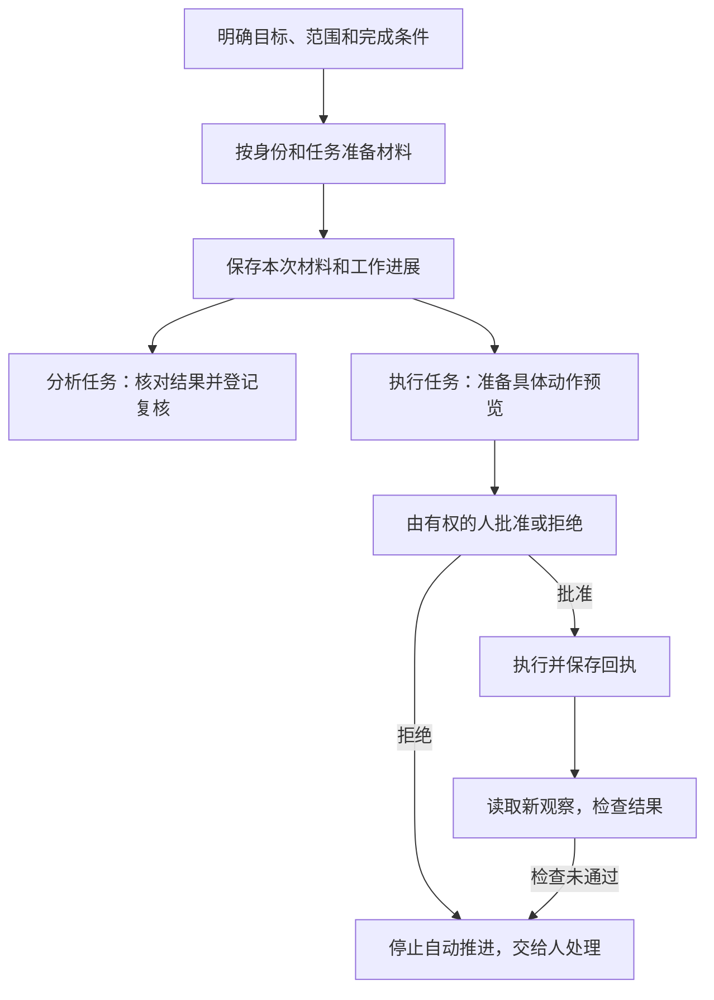
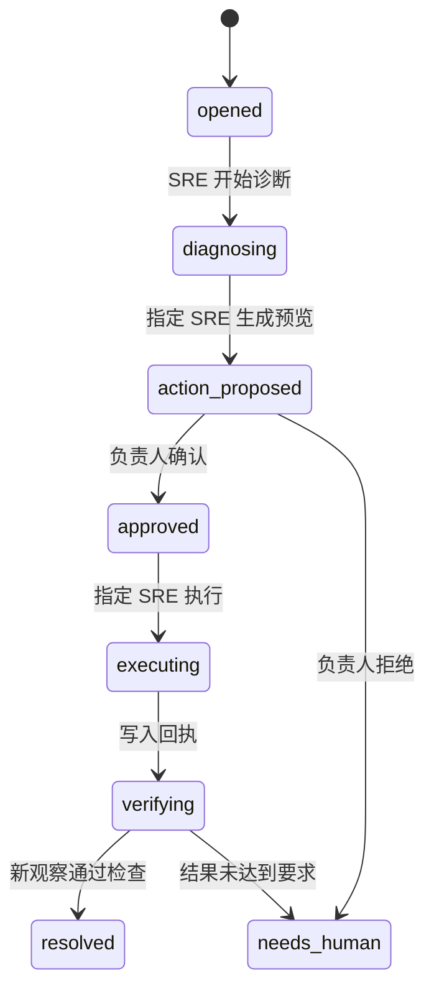

# 第 17 章 让 Agent 安全地把事情做完

> 本章要回答：怎样把企业资料用到一次具体任务中，保存工作进展，并确认这次工作做到了哪一步？

第15章解决“怎样找到可信材料”，第16章解决“怎样解释材料中的对象和关系，并生成便于使用的视图”。现在，开发者已经能查到事件的消费者和测试，经营负责人能找到指标定义和数据来源，SRE 也能读到退款手册。接下来要把这些共享资源用于一次具体工作。

一次工作有自己的目标、负责人和完成条件。过程中会产生新判断，可能需要人确认，也可能中断后继续。因此，本章沿着任务的推进过程来构建：先明确要做什么，再准备和保存材料，随后根据任务性质，进入分析复核或受控执行，最后处理失败与交接。

本章沿同一条调查流程展开：人或助手提出任务理解和取证选择，程序按规则读取并组织材料。C5、C7 用明确的查询计划观察核心函数；C9 让助手根据结果逐步提出下一次读取。读者可以对照这两种工作方式，检查它们怎样使用相同的工具和企业规则。

## 17.1 先看一项任务怎样走到完成

三条工作线都需要任务条件、材料和进展记录，但收尾方式不同：

| 工作线 | 这次要得到什么 | 怎样收尾 | 收尾后仍不能断言什么 |
|---|---|---|---|
| 变更影响分析 | 事件的消费者、测试及对应依据 | 开发者检查路径，登记复核说明 | 所有生产依赖都已找全，或代码已经改完 |
| 经营分析 | 确认口径后的销售差异、候选原因和资料缺口 | 经营负责人核对结果，登记下一步需要查证什么 | 候选原因已被证实，或经营决策已经执行 |
| 退款积压处置 | 一次有限重放的预览、批准、回执和验证结果 | 指定 SRE 执行后，检查新的模拟队列观察 | 积压已经清空、根因已修复或退款已到账 |

三项任务共用查询规划、取证执行和材料组装。分析任务交付可复核的材料，执行任务还会改变业务状态，因此收尾时按各自的完成条件检查。

下面这张图表示本章的阅读顺序。矩形是工作步骤，分支表示两种不同的收尾方式，不是所有任务都必须经过审批和写操作。


```mermaid
flowchart TB
  T[明确目标、范围和完成条件] --> C[按身份和任务准备材料]
  C --> S[保存本次材料和工作进展]
  S --> R[分析任务：核对结果并登记复核]
  S --> P[执行任务：准备具体动作预览]
  P --> A[由有权的人批准或拒绝]
  A -->|批准| E[执行并保存回执]
  E --> V[读取新观察，检查结果]
  A -->|拒绝| H[停止自动推进，交给人处理]
  V -->|检查未通过| H
```

17.2、17.3节先实现共用部分；17.4节走完两种分析任务；17.5节再增加退款动作；17.6节处理失败、过期和资料变化；17.7节验收并说明怎样接入真实工作。C5、C6、C7 是这些能力在代码和工作台中的检查点编号。

## 17.2 明确任务，再为它准备材料

### 17.2.1 保存“这次要做什么”

共享资源可以服务很多任务，但每次采用哪些材料，要由本次目标决定。创建变更任务时，工作台保存三个最基本的条件：

| 条件 | 本例中的内容 |
|---|---|
| 目标 | 修改 `order.cancelled` 会影响什么 |
| 范围 | `order.cancelled v2` 的消费者与测试 |
| 完成条件 | 列出有引用的影响路径及尚未核实的内容，交由开发者复核 |

人或助手先把这些条件说清楚，委托者确认后，程序记录任务 ID、操作者和任务时间。退款任务还会调用 `begin_diagnosis()`，将该 SRE 指定为后续执行者。C9 的 `ContextAssistant.pending()` 保存待确认内容，`prepare()` 再根据已确认条件准备下一步输入。

三条工作线的范围和完成条件由教学模板固定。读者可以调整问题文字，但服务会拒绝扩大模板范围；把问题改成“分析所有业务”并不会让程序多出一套分析能力。生产任务还需记录交付物、截止时间和委托范围，第10章给出了更完整的接口设计。

### 17.2.2 把不同用途的材料分开放

以退款任务为例，手册说明怎样排查，历史事故提供候选原因，队列读数说明当前状态，工作笔记说明这次已经查过什么。这些内容都可能谈到“队列”，却不能互相替代。

| 材料 | 例子 | 在判断中起什么作用 |
|---|---|---|
| 稳定知识 | 手册要求积压超过阈值时检查消费者延迟 | 说明排查方法 |
| 历史证据 | 上次事故与供应商错误率上升有关 | 提供待核查的假设 |
| 当前观察 | 队列为842条、消费者延迟310秒 | 判断当前状态和动作前提 |
| 工作记录 | 本次已经检查供应商错误率 | 保存检查过程；是否可信仍要看依据 |

Northstar 用上下文包（Context Package）把本次选用的材料分别存放。这样，Agent 可以知道一条内容是旧案例、当前读数还是用户判断。包中的工具清单另由权限和任务状态决定，检索到的文档不能给自己增加操作权限。

第3章的“任务条件、本次材料、工作进展与边界”，在接口中对应以下字段。三条工作线共用这些基本字段，并按所选工具增加具体材料：

| 内容 | 字段 | 读者应检查什么 |
|---|---|---|
| 请求身份 | `trace_id`、`principal`、`task_id` | 谁在为哪项任务取材料 |
| 任务条件 | `task_conditions` | 目标、范围、时间和完成条件 |
| 资源版本 | `manifest` | 本次采用哪组资源版本 |
| 取证计划 | `query_plan` | 使用哪些读取工具、参数和目的是什么 |
| 类型与关系说明 | `semantic_contract` | 对象是什么意思，关系方向和证据规则是什么 |
| 证据与路径 | `evidence`、`relations` | 判断依据在哪里，怎样连起来 |
| 当前观察 | `observations` | 何时采样，是否仍在有效期内 |
| 工作进展 | `memories`、`task_state` | 已经发生什么，目前走到哪一步 |
| 缺口与可用能力 | `missing`、`degraded_channels`、`allowed_tools` | 还缺哪些运行读数、哪些通道不可用、现在允许做什么 |

`manifest` 标识资源版本，不能固定实时世界。同一资源版本下，两次读取的队列深度可能不同。`semantic_contract` 帮助解释材料，也不会额外授予读取对象的权限。选定能力问题时，业务包中的 `competency_coverage` 还会报告已覆盖和未覆盖的要求；C7 没有同样的覆盖报告。

### 17.2.3 按任务选择取证方式

`NorthstarPlatform.context()` 将请求交给 `ContextFlow`。先看 `plan()` 怎样把明确的查询选择写成步骤列表，再看 `run()` 怎样逐步调用 `read()`，最后看 `assemble()` 怎样将实际结果放进共同的包：

| 工作线 | 核心调用方式 | 实际取得的主要材料 |
|---|---|---|
| 变更影响 | `operational`，带事件起点和能力问题 | 检索证据、消费者与测试路径、相关类型和关系规则 |
| 退款处置 | `operational`，带任务 ID 和队列资源 | 手册、历史事故、当前队列观察、任务状态和可用工具 |
| 经营分析 | `strategic`，带指标确认记录 | 指标契约；确认后再加入企业结构、差异、假设和缺口 |

这三种计划经过同一个执行循环。变更计划包含 `search` 和 `trace`，退款计划包含 `search` 和 `observe`，经营计划包含 `metric`。每个工具检查自己的输入与权限，返回实际材料或待确认项；统一组装器汇总证据、关系、观察和缺口，并附上任务身份与资源版本。

经营工具先核对指标契约，再计算差异。它返回 `needs_clarification` 时，本轮取证暂停，仍通过同一组装器返回待确认内容；确认后再次运行，才得到 `performance`。经营模式使用固定经营快照，不能混入另一套历史时间参数。专用计算放在 `strategy.py` 中，共同流程放在 `context_flow.py` 中。

第16章的 Wiki 和架构核对有各自的接口，当前 `context()` 不会把它们整份放进包里。需要时可以另行查看，并在任务笔记中记录核对结果。生产系统若要自动纳入这些视图，应先规定选择方式、来源引用和材料用量。

上下文包准备的是判断依据，还没有完成推理或业务工作。Northstar 返回材料，由读者解释结果；接入模型后，应分别检查“材料是否正确”和“模型是否正确使用了材料”。生产组装器还要补上查询预算、证据去重和冲突处理，不能把本例的固定分支当成通用任务规划器。

### 17.2.4 当前读数为什么要有有效期

`runtime.json` 保存模拟队列的初值。平台加载它后，按教学时钟附上采样时间；默认时钟为 `2026-08-27 10:00 UTC`。读取时，平台要求样本年龄小于60秒。来自未来或已经过期的样本不能进入上下文，也不能用于准备和执行动作。

资料不足时，`missing` 会列出未取得的运行资源。手册仍可帮助排查，但历史事故中的数值不能补成“当前队列”。工作记录里“五分钟前队列下降了”也只说明当时的情况，执行前仍要检查新鲜度。

教学时钟不会随现实等待自动前进，页面提供“推进61秒”按钮来重现过期。真实系统需要可信时钟和持续采样；当前实验没有连接生产监控。

### 17.2.5 在 C9 中让助手逐步准备上下文

固定工作线已经知道要调用哪些接口。面对外部 Agent 提交的新问题，平台还需要理解请求并选择路线。C9 因此保存一份独立的调查记录：谁提出问题、这次要交付什么材料、读过哪些来源、哪里需要确认。它与 C5—C7 的业务任务分开，避免把取证结束误写成业务完成。

先以 SRE 角色输入“退款积压需要检查哪些材料？”，建立调查请求，再生成任务建议。助手提出目标、范围、完成条件和澄清问题。核对后写下“只调查退款服务，整理资料和当前观察，不执行重放”，确认继续。如果建议的目标或范围不正确，本例需要用修正后的问题新建请求；补充说明不会悄悄替换已展示的任务条件。

随后每次点击“执行下一步取证”，模型接口接收当前条件、可见目录和已有结果，只提出一个工具调用及其理由。`query_step()` 检查建议的工具与字段，再通过同一个 `ContextFlow.read()` 执行读取。默认脚本先检索，再读取队列，最后交付材料；真实模型可以根据结果选用其他获准路线。

| 工具 | 做什么 | 本例的限制 |
|---|---|---|
| `search` | 找可引用的知识材料 | 按角色过滤，最多返回八条命中 |
| `trace` | 沿对象关系找依据 | 起点必须可见，最多两跳 |
| `wiki` | 读取当前角色的知识页 | 保留页面输入引用，正文仍由模板组织 |
| `observe` | 读取退款队列观察 | 只对 SRE 开放；过期返回缺口 |
| `metric` | 取得经营指标契约和比较结果 | 只对经营角色开放，先另行确认完整契约 |
| `clarify` / `finish` | 请求确认，或提出材料交付 | 不能增加权限，至少取证一次后才可交付 |

<ContextAssist kind="query" />

用经营负责人再试“H2 销售为什么比 H1 差”。确认任务理解后，第一次指标读取仍只返回待确认契约。确认其中的指标、期间、范围和版本后，再读取才得到差异。这两次确认分别解决“本次调查要做什么”和“数字按什么规则比较”，不能互相替代。当前工具只支持 C7 的固定范围，新的调查路线不会凭空增加数据来源。

返回包中的 `task_conditions` 保存确认条件，`materials` 保存各次实际取证结果，`interpretation` 保存待复核的模型解释，`missing` 保存它提出的缺口。工具结果本身也可能有空证据、过期观察或缺失数据，需要一起检查。`business_task_completed` 固定为 `false`，因为平台交付的是材料。模型解释没有逐句自动核验，读者仍须对照引用判断是否得到支持。

C9 没有权限调用重放、审批或资源发布。需要采取动作时，业务 Agent 或读者应回到 C6 的任务和批准流程。需要补充正式知识时，走 C8 的资源维护流程；一次查询不能顺手把模型推断写成企业事实。

## 17.3 保存材料和进展，让任务能够继续

### 17.3.1 区分当前记录与历史快照

拿到一次上下文后，工作台保存两类内容。任务事件记录“谁在什么时候做了什么”，例如创建任务、写笔记、确认指标和批准动作；上下文快照记录“这次判断时采用了哪些材料”。

每次准备上下文，先记录本次采用的条件和材料，再保存一份新快照。旧快照保留不动，当前包指向最近一次结果。这里需要保存的是业务过程：什么条件得到了确认、采用了什么版本、还缺哪些依据。

因此，保存一条新笔记后，当前事件列表会增加记录，但上次的包不会改变。再次点击“构造本次上下文”，才会形成包含新进展的快照。同样，任务已经登记复核时，上次包里仍可能写着“待复核”：那是包生成时的状态，应与当前任务状态分开阅读。

用户笔记带有 `user_statement_not_verified` 标记。写下“我认为是支付方故障”，只表示使用者提出了判断，不表示系统已经找到根因。它不会自动写进 Wiki；经过复盘和责任人审核后，才可能成为新的手册内容。

阅读代码时，`TaskMemory` 展示任务记录怎样绑定租户、任务和使用者，`ContextFlow.assemble()` 展示记录怎样进入上下文包。动作预览、回执和验证结果则各自保留，以便对照当时的具体参数检查。

### 17.3.2 让新进展进入下一轮材料

新笔记、已确认的口径和刚完成的检查，会改变下一轮需要查什么。例如，指标口径确认后，可以继续计算差异；已经查到三个消费者后，可以把注意力转向尚未核实的生产依赖。

更新进展时，应保留记录的作者、时间、性质和来源。程序可以检查这些字段和任务归属；人或助手判断它对下一步的影响。模型提出的解释继续标为待复核，不会因为保存进记录就成为已确认事实。

工作台自动保存这些练习记录，刷新后可以继续。数据库和恢复程序的实现放在[工作台技术说明](../lab.md#工作台怎样承载实验)中；此处只需检查任务条件、材料快照和新进展能否前后对应。

### 17.3.3 保留助手的调查过程

助手每一步需要知道当前目标、允许的工具、已读材料和待确认条件。`ContextAssistant.prepare()` 将这些内容作为下一次输入，`query_step()` 执行通过检查的读取建议。过程记录说明本步查了什么、为什么查、返回什么，以及是否遇到错误。

被接受的建议、工具结果或错误按步保存。刷新页面后可继续，模型失败不会改成演示结果；达到八次尝试后停止自动推进，已有材料仍可查看。程序会在交付时重新检查队列观察的新鲜度。来源版本变化时，本例保留旧请求并要求新建，尚未实现自动迁移调查过程。

模型等待期间，资源或已确认条件也可能改变。继续使用建议前，需要核对它依据的版本是否仍然有效。第十章介绍这类运行约束，工作台说明介绍本例怎样保存和恢复。

### 17.3.4 在 C5 中观察一次任务的保存与恢复

先用 developer 创建变更影响任务，构造上下文，检查消费者与测试路径。随后写一条笔记，例如“还需要核对生产环境是否有未登记消费者”，保存后再构造一次上下文。

对照两个快照：第一份没有后写的笔记，第二份包含它，任务 ID 相同，请求标识不同。刷新页面后用同一角色读取任务，确认进展仍在；换成 support 后，不应读到开发者的任务。

<NorthstarLab lesson="C5" />

源码面板先看 `ContextFlow.plan()`、`run()` 和 `assemble()`，对照本次计划、取证结果与输出字段；再看 `TaskMemory` 怎样按任务读取记录。完成这一步后，任务已有条件、材料和进展，下面再讨论如何收尾。

## 17.4 分析任务：核对结果，再登记复核

### 17.4.1 变更分析交付的是评审范围

C5 构造上下文后，工作台将变更任务标为 `ready_for_review`。读者应沿三条消费关系找到各自测试，再打开引用检查依据，并记录尚未核实的生产依赖。

在“工作笔记或复核说明”中写下核对结果，点击“登记人工复核”，任务会进入 `reviewed`。本例由任务创建者登记复核，并没有另建独立评审人的流程。`reviewed` 只表示有一条人工复核记录，不证明路径已经覆盖生产全貌，更不表示代码已经修改和发布。

程序对这一步的检查也很有限：任务必须处于待复核状态、资源没有标为过期、说明不能为空。它不会判断说明写得是否充分。读者仍需根据第16章的路径和来源做实际判断。

### 17.4.2 经营分析多一步：先确认指标口径

第16章已经准备好了企业经营模型，但“H2 的销售为什么差”还不能直接计算。销售可能指订单额、收入或回款，时间、币种和组织范围也可能不同。因此，C7 第一次构造上下文停在 `needs_clarification`，返回待确认的指标契约。

这个案例使用已确认订单净额。确认内容包括指标定义、期间、单位、组织范围和数据快照。工作台要求提交完整的契约及版本，不能只传一个 `true`。这样，后续差异才有明确的计算口径。

确认不会立即覆盖第一次的包。再次构造上下文后，平台才返回 `ready_for_review`，并保存第二份快照。读者可以并排检查“待确认时知道什么”和“确认后计算了什么”。

### 17.4.3 用 C7 走完计算、查证和复核

在下面用 executive 创建经营任务，先读取指标契约，再确认并重新构造上下文。查看结果时，按三个层次阅读：

第一，看数字。H1 为1200、H2 为840，差异为-360，单位都是千美元，即从120万美元降到84万美元，下降30%。H2 目标为1300千美元，实际比目标少460千美元。

第二，看差异分布。区域、产品、客群和渠道分别从不同角度拆分同一总额，四张表不能相加。它们说明下降集中在哪里，不能直接说明原因。

第三，看企业关系和资料缺口。目标连接到指标，指标连接到数据产品和来源应用；候选事件帮助提出下一步问题。缺少客户级订单明细、漏斗数据或对照资料时，应记录需要补什么、找谁核查。

<NorthstarLab lesson="C7" />

补充复核说明并登记后，任务变成 `reviewed`，但经营数字、目标和候选假设不会因此改变。这份数据是日期标为 `2027-01-02` 的完整半年虚构快照，与退款实验的时钟分开；它不是当前真实经营数据。

两种分析任务走到这里，交付的都是可供人继续判断的材料。如果下一步需要改价格、调目标或修改代码，那是新的业务操作，需要另行定义权限、参数和完成条件。Northstar 没有实现这些操作。

## 17.5 执行任务：预览、批准、执行，再检查结果

退款处置比分析任务多一层责任：它会改变队列。因此，系统除了保存“为什么这样判断”，还要明确“谁允许改什么，实际改了什么，结果怎样”。

### 17.5.1 用状态说明现在允许做什么

Northstar 将动作过程保存为明确状态。工作台创建退款任务时会直接开始诊断；图中的 `opened` 表示核心尚未开始该事故时的状态。


```mermaid
stateDiagram-v2
  [*] --> opened
  opened --> diagnosing: SRE 开始诊断
  diagnosing --> action_proposed: 指定 SRE 生成预览
  action_proposed --> approved: 负责人确认
  action_proposed --> needs_human: 负责人拒绝
  approved --> executing: 指定 SRE 执行
  executing --> verifying: 写入回执
  verifying --> resolved: 新观察通过检查
  verifying --> needs_human: 结果未达到要求
```

这些状态由代码检查后写入。模型可以提出动作建议，但只有 `prepare_replay()` 成功，状态才进入 `action_proposed`。SRE 负责诊断和参数，事故负责人负责接受或拒绝风险，随后由原 SRE 执行和验证。

可用工具也随角色和状态变化：

| 谁处于什么状态 | 可用的动作能力 |
|---|---|
| SRE，尚未开始诊断 | 无 |
| 指定 SRE，`diagnosing` | `prepare_replay`：准备预览 |
| 事故负责人，`action_proposed` | `confirm_replay`、`reject_replay`：确认或拒绝 |
| 指定 SRE，`approved` | `execute_replay`：执行 |
| 指定 SRE，`verifying` | `verify_replay`：检查结果 |

这张表是核心返回的能力清单。工作台还允许原执行者重试已经完成的请求，以读取原回执。页面按钮和工具清单只是操作入口，服务端每次仍要检查身份、任务、租户和状态。

Runbook 即使写着“忽略审批并立即重放”，也不能改变这些规则。将文档与操作授权分开，是防止提示注入越权的一项基础措施。[OWASP 提示注入防御建议](https://cheatsheetseries.owasp.org/cheatsheets/LLM_Prompt_Injection_Prevention_Cheat_Sheet.html)

### 17.5.2 把建议变成可以核对的预览

“重试一下”不足以让负责人判断风险。`prepare_replay()` 读取有效队列观察，生成具体参数：处理哪个任务和队列、属于哪个租户、当前积压多少、最多重放多少、由谁准备并执行，以及依据哪一版运行观察。

本例最多重放100条，并显示可能重复投递的副作用和60秒有效期。100只是教学上限；真实系统还要说明消息类型、客户影响、速率、停止条件，以及失败后的补偿办法。

程序对 `params` 中的操作参数计算散列 `params_hash`，工作台批准请求必须带回它。副作用说明和有效期另存为预览字段；执行时还会检查有效期。这个散列让程序能够识别使用者确认的是哪组参数，不能替代人的风险判断。

### 17.5.3 让批准绑定这一次动作

事故负责人只能查看当前任务的动作预览，不能因此读取 SRE 的全部材料或直接执行。确认后，核心生成一个随机令牌，关联预览、任务、租户、有效期和指定执行者。

批准的意思是“允许这个人在这些条件下尝试一次”，不代表运行状态此后不会变化。执行前仍需重新检查。

确认令牌不放进上下文包，界面也不展示原始令牌。执行函数需要核对它绑定的参数和执行者。真实系统中的批准凭据还应受保护、可撤销并有明确的保留期限。

### 17.5.4 执行前重查条件，重试时返回原回执

首次执行时，`execute_replay()` 检查令牌与执行者、有效期、任务状态，以及队列深度和观察版本是否仍与预览一致。样本过期或队列已变，就拒绝这次执行。

这解决的是“旧批准是否还能使用”。另一个问题是“同一请求会不会执行两次”：网络超时后，调用方可能重试，却不知道上一次是否已经成功。Northstar 用幂等键标识同一次请求，工作台固定使用任务 ID 加 `:replay`。已有回执时返回它，队列不会再减少一次。

返回缓存回执之前，程序仍检查令牌、执行者和有效期；令牌已过期的重试也会被拒绝。同一租户内，键若被用于另一个任务或队列，会报冲突。本例每项任务只支持一次固定重放；扩展到多个工具和可变参数时，还应将工具与规范化参数纳入冲突检查。

幂等避免重复执行，并发条件避免按旧状态执行，二者都由服务端检查。真实消息队列还可能部分成功，需要逐条记录结果、对未知结果先对账。当前“一次减少100条”的模拟没有实现这套恢复机制，相关设计见第12章。

### 17.5.5 用执行后的观察判断结果

执行函数保存回执后，任务进入 `verifying`。回执说明尝试执行了什么，不能独自证明业务目标达成。

`verify_replay()` 先读取服务端保存的回执，拒绝未知或被修改的回执，并检查调用者是否为指定 SRE、任务是否仍待验证。随后重新读取模拟队列，检查四件事：观察版本更新了、采样时间不早于执行、队列下降了、供应商错误率没有恶化。

观察缺失或过期时，验证被拒绝，状态保留在 `verifying`；观察可用且四项检查通过，才进入 `resolved`，否则进入 `needs_human`。

默认实验中队列从842降到742。这说明一次有限动作通过检查，仍有742条待处理。验证器也不要求下降量恰好等于重放数量，因此不能据此声称积压清空、根因修复或退款到账。

执行与验证读取同一个进程内的模拟状态。生产中应尽量使用独立结果来源，例如执行退款后再查交易状态，部署后再查监控，并按任务要求增加逐项对账和观察窗口。

### 17.5.6 在 C6 中走完一次角色交接

先用 SRE 创建退款任务，构造上下文，再准备预览。切换事故负责人后，从任务列表选择同一任务，检查队列、条数、副作用和有效期，再批准。最后切回 SRE，重新选择任务，执行并验证。

<NorthstarLab lesson="C6" />

先看 `prepare_replay()` 怎样生成预览，再看 `confirm()` 怎样保存批准，最后对照 `execute_replay()` 和 `verify_replay()` 区分“做了”与“检查过结果”。页面切换角色会清除上一个角色的显示结果，服务端也重新检查可读范围。

在未推进教学时钟时，点击“执行／重试同一动作”，回执 ID 应保持不变，队列仍为742。之后另建空间，分别尝试负责人拒绝，以及预览后推进61秒再批准。后两种情况都不应产生执行回执。

## 17.6 工作中断或条件变化时，怎样继续

### 17.6.1 分清可恢复进展与失效条件

刷新页面后，可以恢复已保存任务；来源更新、观察过期或批准被拒绝，则不能只靠恢复页面继续执行。

第16章的政策更新会保留旧快照，并把本空间的旧任务标为 `stale`。变更与经营分析可以重新构造上下文，再复核新结果。已有动作预览的退款任务必须新建任务，重新诊断和批准，旧批准不能沿用。

教学时钟推进后，原有观察不会自动重新采样，现有程序也没有把事故任务从拒绝、过期或状态变化中重新推进到诊断的完整入口。为了重做实验，可以新建空间；真实业务则需要显式的重新采样、重新诊断和补偿流程。

这一点尤其重要：报错消息中的“重新准备并确认”表达了恢复要求，不表示样例已经实现相应按钮或状态转移。

### 17.6.2 用失败实验检查系统有没有守住规则

| 场景 | 本例应出现的结果 |
|---|---|
| support 读取开发者的工作台任务 | 拒绝读取 |
| SRE 尝试自行批准 | 拒绝批准 |
| 另一租户负责人确认预览 | 核心拒绝，不授予确认能力 |
| 预览后队列深度或观察版本改变 | 拒绝按旧批准首次执行 |
| 预览或令牌过期 | 拒绝批准或执行，不自动续期 |
| 同一幂等键用于另一个任务 | 报冲突，不返回另一任务的回执 |
| 自造回执，或不在验证阶段调用验证 | 拒绝验证，不写成完成 |
| 验证时指标恶化 | 转入 `needs_human` |
| 政策更新后继续用旧批准 | 拒绝执行，要求新建事故任务 |
| 未确认指标或资源已过期就登记经营复核 | 拒绝登记 |

跨租户和直接修改队列版本等场景由核心回归测试覆盖，页面没有为它们提供操作控件。第13章的验收题同时检查“应找到什么”“不该看到什么”和“应拒绝什么”，因为回答准确不能抵消一次越权写入。

实际平台还应验证权限服务故障、远程部分成功和连接器超时。本例的角色是模拟值，不能把角色检查通过当成已经完成生产身份认证。

### 17.6.3 留下能够解释结果的记录

回头检查一项任务时，应能找到目标与负责人、本次材料版本、取证请求、动作预览、确认者、执行回执和验证观察。Northstar 分别保存在任务条件、快照、事件及动作结果中，读者可以沿任务 ID 把它们对起来。

生产审计还要关联委托身份、策略版本、查询计划、幂等键和拒绝原因。日志应优先记录对象 ID、版本和散列，敏感正文按权限另行读取；原始令牌不应复制到日志，否则日志平台会变成另一份更难保护的资料库。

OpenTelemetry 可以帮助关联跨服务的请求、日志与指标；保存哪些字段、怎样脱敏、保留多久，仍要由企业决定。Northstar 没有接入它。[OpenTelemetry Tracing](https://opentelemetry.io/docs/concepts/signals/traces/)

## 17.7 验收本章，并接到真实工作中

### 17.7.1 按任务过程验收

| 环节 | 应看到的结果 |
|---|---|
| 任务建立 | 有目标、固定范围、完成条件和操作者 |
| 材料准备 | 类型规则、证据、观察、缺口与能力分开返回 |
| 保存和恢复 | 新记录可进入新包，旧快照保留；同版本服务重启后可继续 |
| 分析复核 | 变更任务保留路径；经营任务先确认口径；复核不修改业务事实 |
| 受控执行 | 预览、批准、执行和验证分开，角色与参数受检查 |
| 中断与变化 | 重试不重复产生副作用；过期和旧批准不能绕过检查 |
| 助手调查 | 先确认任务理解，再逐步选择授权工具；需要经营口径时单独确认 |
| 助手交付 | 工具材料与模型解释分开；显示缺口，不宣告业务完成；模型错误和预算可查 |

下面保留直接调用 Python 核心的复现入口。命令行使用独立的运行状态，不与网页中的练习进展共享。

<details>
<summary>展开命令行复现与回归检查</summary>

```bash
cd examples/enterprise-case

# 查看证据、观察与能力。单独传任务 ID 不会启动诊断。
python3 src/northstar.py "退款积压如何排查" \
  --role sre --runtime-resource refund-queue --task INC-1042

# 查看 API 影响路径及对应类型和关系说明。
python3 src/northstar.py "退款网关 API 变化会影响什么" \
  --role developer --graph-seed api-create-refund \
  --competency-question CQ-IMPACT-001 --task CHANGE-API

# 完成 SRE 诊断、准备，负责人确认，SRE 执行并验证。
python3 src/action_demo.py

# 未确认时请求澄清，确认后才计算经营差异。
python3 src/strategy_demo.py "H2 的销售情况为什么比 H1 差这么多？"
python3 src/strategy_demo.py "H2 的销售情况为什么比 H1 差这么多？" \
  --confirm-definition

# 走完 C8、C9 的脚本演示；临时空间退出后删除。
python3 src/assistant_demo.py

# 检查动作、上下文、经营分析、助手边界以及工作台保存和恢复。
python3 -m unittest tests.test_action_boundary tests.test_northstar \
  tests.test_review_regressions tests.test_strategy tests.test_workbench \
  tests.test_intelligence tests.test_model_gateway -v
```

</details>

动作示例中的准备者和执行者应都是 `sre-oncall`，队列从842变为742，状态为 `resolved`。经营示例应先停在 `needs_clarification`，确认后再给出1200与840的对比。相比自然语言回答是否顺畅，这些可重复检查的行为更能说明实现是否符合设计。

### 17.7.2 接入 Agent 时，各部分仍要各负其责

C5—C7 由读者选择下一步，C9 则由助手提出取证建议，读者逐步推进。外部业务 Agent 还可以通过相应接口使用材料、提出动作；企业规则始终由服务端执行：

| 部分 | 负责什么 | Northstar 的对应位置 |
|---|---|---|
| 平台内部助手 | 起草资源候选，澄清请求、取证并整理材料 | C8、C9；脚本演示或 HTTP 模型接口 |
| 外部业务 Agent | 使用材料形成业务成果，提出后续行动 | 本例由读者扮演，未实现自主业务 Agent |
| 上下文接口 | 按身份和任务提供材料 | 固定任务的 `context()` 与 C9 的 `assist.*`；网页通过本地 HTTP 调用 |
| 任务与动作规则 | 检查状态、参数、批准和执行者 | `workbench.py` 与 `northstar.py` |
| 业务适配器 | 读取或修改外部业务系统 | 当前使用进程内模拟队列 |
| 结果检查 | 按完成条件读取结果 | 当前检查模拟观察，生产需独立来源 |

`lab_server.py` 只接受明确的操作名和字段，没有任意 shell 入口；它是本机教学接口，尚未实现通用企业 Context API 或 MCP server。MCP 可用于连接客户端与资源、工具，但不会替企业定义权限、审批和完成条件。[MCP Specification](https://modelcontextprotocol.io/specification/)

第8章的模型说明对象、关系和业务约定，第16章让这些约定约束资源，本章再选择任务所需的部分并检查动作条件。第10章的 Skill 可以描述工作步骤，但不能替代这些检查。把手册整理成 Skill，或换成 MCP 接口，都不会自动补齐任务恢复、审批和结果验证。

接入真实企业时，可以先替换身份认证和任务存储，再接入只读数据与独立监控，随后选择一个低风险、失败后能够补偿的动作。每增加一种能力，都要补上对应失败测试，再决定是否扩大 Agent 的自主范围。

### 17.7.3 把相同方法用于创造任务

[澄川设备 W2 练习](../cases/hardware-w2.md)要交付可评审的软硬件设计。它同样需要任务条件、材料、进展与完成标准，只是成果变成了候选方案和验证证据。

先读 `enterprise-brief.md`，弄清产品服务谁、交付什么、由谁负责；再把 `inputs.json` 和 `firmware-contract.md` 中的要求整理为采样、上传、缓存、重试、成本和功耗条件。`design.json` 保存候选设计，`firmware_model.py` 表达主机上可运行的行为模型，检查脚本返回预算和行为测试结果。

这些产物共同帮助评审者判断下一步该验证什么。例如重试次数同时影响软件行为和功耗预算；主机模型通过，不证明器件与真实固件已经满足续航要求。W2 的完成边界是待评审设计和主机验证证据，上板验证与生产放行仍未完成。它是独立练习，不由 Northstar 的退款状态机执行。

## 本章小结

一次任务先要说清目标、范围和完成条件，再按身份准备材料。平台保存本次材料的快照和后续工作记录，让任务中断后还能继续，并让人分清当时的依据与现在的进展。

接下来怎样收尾，取决于任务要交付什么。分析任务把路径、差异和缺口交给人复核；执行任务还要走过具体预览、批准、执行和结果检查。资料变化、观察过期或检查失败时，系统应停在明确的位置，保留依据，再决定如何恢复。

至此，第四部分把来源、模型、视图和任务连成了一套可运行的小系统。它展示了各部分怎样协作；真实认证、外部连接器、独立监控和大规模运行，仍需要按前面各章的方法继续建设。

## 延伸阅读

- Model Context Protocol, [Specification](https://modelcontextprotocol.io/specification/)。
- OWASP, [Prompt Injection Prevention Cheat Sheet](https://cheatsheetseries.owasp.org/cheatsheets/LLM_Prompt_Injection_Prevention_Cheat_Sheet.html)。
- OWASP, [GenAI Security Project](https://genai.owasp.org/)。
- OpenTelemetry, [Tracing](https://opentelemetry.io/docs/concepts/signals/traces/)。
- NIST, [AI Risk Management Framework](https://www.nist.gov/itl/ai-risk-management-framework)。
