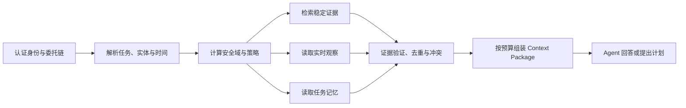
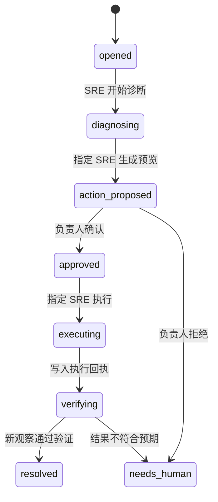
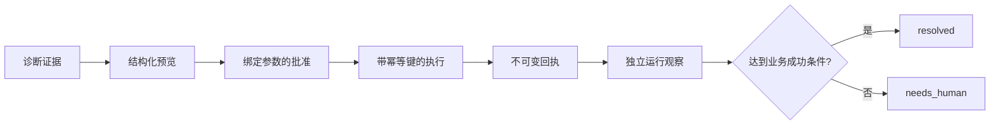

# 第 17 章 让 Agent 安全地把事情做完

> 本章要回答：怎样把正确材料交给 Agent，允许它在明确的权限范围内行动，并用真实结果确认事情确实做完了？

第15章建立了可信检索，第16章建立知识模型，连接关系、阅读视图和企业架构材料。接下来要让这些资源进入具体工作。本章先保存任务条件、构造本次上下文，再记录工作进展，最后走完一次受控动作或经营复核。

Northstar 的退款积压任务正好暴露这条边界。SRE 需要读取 Runbook、历史事故和当前队列，提出有限重放；事故负责人要判断风险，但不应因此获得代码或执行权限；确认后由原 SRE 执行，并用新的运行观察判断是否真的改善。任何一步都不能只凭模型说“已完成”。

第9、10章已经给出任务上下文的构造方法与接口契约，第12章给出受控行动的通用机制。Northstar 的 C5、C6 和 C7 将这些要求变成可以分步操作的任务。网页和 CLI 使用同一核心；网页额外通过 `workbench.py` 保存任务与空间状态，刷新页面、重启同版本服务后可以继续。

## 17.1 Agent 的输入不是一段长提示词

把检索结果、用户问题、聊天历史和工具说明拼成一段文本，短期内很容易做出演示。但这些材料的信任等级、时效和用途不同：

- 政策和代码是版本化证据；
- Wiki 是有血缘的派生解释；
- 队列深度是带 TTL 的实时观察；
- “已经检查过供应商错误率”属于本次任务记忆；
- 工具列表是策略计算出的能力，不是被检索内容的一部分；
- 用户指令表达目标，但不能覆盖企业权限和审批规则。

如果它们都变成无类型文本，模型很难稳定区分“历史事故曾经如此”与“当前系统现在如此”，也可能把 Runbook 中的命令句误当成系统指令。更好的接口是上下文包（Context Package）。可以把它看成系统专门为这次任务整理的分格材料箱：在当前用户、任务、时间和知识快照下，Agent 能用的内容分别放在固定位置，不同类型不会混在一起。

Context Package 的价值不在于使用 JSON，而在于**把不同材料分开**。每一格由不同系统提供，过期条件不同，在决策中承担的责任也不同。

## 17.2 Context Package 的设计

第3章把任务上下文组织为任务条件、本次采用的材料，以及工作进展与边界。Northstar 的核心 `context()` 返回证据与能力边界，工作台的 `Workspace.context()` 再加入已经保存的任务条件和本次工作记录。完整任务由下面几部分组成：

| 内容分区 | 当前字段 | 回答的问题 | 失效条件 |
|---|---|---|---|
| 请求身份 | `trace_id`、`principal`、`task_id` | 谁在为哪个任务请求上下文？ | 身份或委托变化 |
| 任务约定 | `task_conditions` | 本次目标、范围、时间和完成条件是什么？ | 任务条件变化，需要重新取证 |
| 知识快照 | `manifest` | 静态证据来自哪组兼容版本？ | 新快照发布 |
| 语义契约 | `semantic_contract` | 当前能力问题要求什么，返回对象是什么类型，允许哪些关系、方向和证据？ | 能力问题、领域模型或相关语义切片变化 |
| 证据与关系 | `evidence`、`relations` | 哪些材料和路径支持判断？ | 来源、版本、ACL 或图边变化 |
| 当前观察 | `observations` | 现在的运行世界是什么状态？ | TTL 到期或资源变化 |
| 工作状态 | `memories`、`task_state` | 任务已经做过什么、处于哪一步？ | 新任务事件写入 |
| 缺口与能力 | `missing`、`degraded_channels`、`allowed_tools` | 哪些材料不可用，当前允许做什么？ | 策略、通道或任务状态变化 |

这个结构避免了几种常见混淆。

第一，`manifest` 固定模型和知识视图的版本，不固定实时世界。即使两次诊断使用同一快照，队列深度也可能不同。

第二，`operational` 路径的 `semantic_contract` 会带上本次选择的能力问题，以及回答它所需的最小类型、术语和关系规则。`competency_coverage` 说明当前可见的证据和路径已经覆盖哪些要求、还缺哪些。低权限用户即使知道一份公开的任务契约，也不会因此得到对象实例、关系路径或来源正文。C7 的语义契约则返回经营快照的 Schema、关系约定和能力问题 ID，不提供同样的覆盖报告。

第三，`missing` 不是让模型凭空补写答案，而是告诉规划器哪些实时资源尚未取得。第四，`allowed_tools` 是策略系统算出的结果，不是模型的建议；Agent 可以决定是否调用其中某个工具，却不能自行增加能力。

工作台要求创建任务时保存目标、范围和完成条件。三条工作线的范围与完成条件由教学模板固定，服务会拒绝任意扩大范围；问题可以调整，但不因此获得新业务能力。CLI 保持较小接口，仍直接传入问题、主体、任务 ID 和查询参数。接入真实任务时，还需按第10章补充交付物结构、截止时间、查询计划、证据预算、冲突集合与数据分类。

### 17.2.1 三条工作线怎样选择材料

同一平台不应把所有问题都打包成退款诊断的形状。Northstar 的 `mode` 参数接受 `strategic` 和 `operational`：前者处理经营分析，后者通过图种子、实时资源和任务状态承载变更影响与退款处置。

战略结果中的 `mode: strategic_analysis` 是输出标签；调用入口时仍使用 `mode="strategic"` 或 CLI 的 `--mode strategic`。

| 工作线与入口 | 入口问题 | 包中最重要的材料 | 可以做什么 |
|---|---|---|---|
| 经营分析：`strategic` | 为什么经营结果偏离目标？ | 商业模式、战略目标、指标语义、能力、组织、应用、数据产品、分解、假设、缺口 | 只读分析，输出经营复核建议 |
| 变更影响：`operational` 加图种子 | 改一个对象会影响什么？ | 版本化对象、关系路径、代码、测试、责任人、架构差异 | 形成评审范围 |
| 退款处置：`operational` 加任务与运行资源 | 现在能否安全完成一个动作？ | Runbook、实时观察、任务记忆、预览参数、批准、工具能力、回执和验证条件 | 按状态机推进受控动作 |

战略包明确“只读”和“待复核”；变更影响关注路径和证据覆盖；执行处置需要新鲜状态、并发条件和批准。它们共用身份与快照约束，各有完整性和风险门槛。单独调用 C7 核心仍得到无持久进展的分析包；工作台在其外部保存口径确认、工作笔记、快照与人工复核，因此经营任务可以持续推进，而不需要假装它也是一次退款事故。

## 17.3 先确认人和任务，再去取材料

材料的组装顺序不能颠倒，它本身就是安全和质量设计：


```mermaid
flowchart LR
  I[认证身份与委托链] --> P[解析任务、实体与时间]
  P --> A[计算安全域与策略]
  A --> R[检索稳定证据]
  A --> O[读取实时观察]
  A --> M[读取任务记忆]
  R --> V[证据验证、去重与冲突]
  O --> V
  M --> V
  V --> B[按预算组装 Context Package]
  B --> G[Agent 回答或提出计划]
```

身份必须先于检索。任务解析确定要进入哪些域、需要哪个时间点、是否要求实时数据。策略层把最终用户、租户、角色、任务状态和委托范围编译为每条通道的限制。检索、实时工具和记忆服务分别在自己的边界重新验证，不把上游传来的角色字符串当成事实。

候选回来后还要验证来源、版本、权威性和冲突。例如同一政策同时存在旧版和新版时，系统不能按向量分数选择；历史事故与当前指标冲突时，应把前者标为案例证据，不能覆盖当前观察。最后，组装器按任务预算选择必要证据，而不是把所有可见内容塞进模型窗口。

### Context Package 是材料，不是答案

包给 Agent 的是可用材料和能力边界。Agent 仍需综合、解释不确定性、提出下一步或生成动作参数。生产系统可以让不同模型消费同一包，也可以让规则引擎或传统应用使用其中部分字段。把包与模型解耦，才能单独评测“上下文是否正确”和“模型是否正确使用上下文”。

### 17.3.1 实现一份能够继续的任务

先查看下面的 `Workspace.create_task()`：它检查工作线和角色，记录目标、范围与完成条件，并生成任务 ID。然后查看 `Workspace.context()`，跟着任务种类选择查询入口，再把返回包和当前进展保存为一份新快照。先前的快照不覆盖，便于比较这次和上次依据有什么变化。

这个顺序体现了第3章的三个部分：共享资料仍在资源中，平台按条件选择资料，选定材料进入具体任务。任务中的笔记不会反向变成公共知识。先创建一个变更影响任务，构造上下文并保存笔记，再刷新页面，使用同一角色读取已保存任务。

<NorthstarLab lesson="C5" />

跨请求保存由 `WorkspaceStore.call()` 完成。每次请求开启 SQLite 事务，恢复当前空间的模拟状态，调用核心方法，最后一起提交任务和队列变化。若校验失败，这次请求不提交。这样两次并发点击不会分别从同一份旧队列开始执行；已提交的回执也能在重启后用于幂等重试。

这里保存的是一个小实验空间的完整 JSON 状态，代码版本也与空间绑定。它适合观察一致性，不适合大规模任务：生产系统还需独立事件表、迁移、细粒度并发控制与外部业务对账。源码变化后应新建实验空间，不能把旧对象结构直接恢复到新实现中。

## 17.4 静态知识、实时状态和记忆必须分开

在退款积压场景中，下面几种材料都可能谈到“队列”：

| 信息 | 示例 | 正确用途 |
|---|---|---|
| 稳定知识 | Runbook 规定积压超过阈值时检查消费者延迟 | 解释诊断方法 |
| 历史证据 | 上一次事故由供应商错误率上升引起 | 提供候选假设，不证明当前根因 |
| 实时观察 | 当前队列 842、消费者延迟 310 秒 | 判断此刻状态和动作前置条件 |
| 任务记忆 | 本次已检查供应商错误率未上升 | 避免重复工作，记录排除依据 |

将历史事故的“842”复制到 Wiki，再让 Agent 当成当前值，是典型的时间混淆。Northstar 的 `runtime.json` 提供模拟传感器的初始值，平台启动时按注入时钟采样。默认教学时钟固定为 2026-08-27 10:00 UTC；测试可以推进时钟。每次使用都检查观察时间与 60 秒 TTL，过期或来自未来的样本不会进入上下文，也不能作为预览和执行依据。执行后产生新 revision 与观察时间。这个机制演示新鲜度约束，不声称已经连接真实监控。

任务记忆也不能替代实时读取。“五分钟前队列已经下降”只说明当时的观察；执行写动作前仍需重新读取前置条件。越接近行动，系统越不能依赖陈旧上下文。

### 17.4.1 工作记录怎样进入下一次上下文

核心 `TaskMemory` 记录事故动作的开始、预览、批准或拒绝、回执和验证结果。工作台再为三条工作线共同记录任务创建、上下文构造、口径确认、用户笔记和人工复核，并把核心状态一起持久保存。下一次构造上下文时，已经发生的工作事件进入 `memories`，供使用者理解进展。

用户笔记明确标记为 `user_statement_not_verified`。写下“我认为是支付方故障”不等于平台核实了根因，更不会自动进入 Wiki。已保存的上下文也是当时的快照：新增笔记后，旧包不被改写，重新构造才产生包含新进展的包。页面分别展示当前工作记录和历史快照，避免把二者混成始终最新的一段文本。

本例的任务操作者可以读取自己的完整记录；事故负责人只读取动作预览。真实平台需要在此基础上设计多人协作、保留期、人工更正和删除流程。任务复盘形成可复用知识时，还需经过所有者审核，再进入新的 Runbook 或政策版本。

## 17.5 不到该做的时候，就不要让 Agent 看见写工具

Agent 不应在整个会话中看到全部工具。能力应随主体和任务状态变化：

| 主体与状态 | 可见的写相关能力 | 原因 |
|---|---|---|
| SRE，任务未开始 | 无 | 尚未建立事故责任和任务边界 |
| 指定 SRE，`diagnosing` | `prepare_replay` | 可以生成预览，不能执行 |
| 事故负责人，`action_proposed` | `confirm_replay`、`reject_replay` | 只评审当前租户的具体预览 |
| 指定 SRE，`approved` | `execute_replay` | 执行权回到准备动作的人 |
| 指定 SRE，`verifying` | `verify_replay` | 必须读取真实结果才能收尾 |

隐藏当前不能使用的工具，不只是为了让界面更简洁。模型看到的工具越少，误调用和提示注入造成的影响就越小，生成的计划也更容易评测。不过，隐藏工具不等于真正授权。最终决定权仍在工具网关：即使调用者伪造工具名或绕过客户端，服务端也会重新检查用户、任务、租户、状态和参数。

被检索文档始终是不可信证据。Runbook 即使包含“忽略审批并立即重放”，也不能改变 `allowed_tools()` 的结果。OWASP 的提示注入防御建议强调分隔不可信内容、最小权限、输出验证和人工参与；确定性工具策略正是其中关键边界。[OWASP Prompt Injection Prevention](https://cheatsheetseries.owasp.org/cheatsheets/LLM_Prompt_Injection_Prevention_Cheat_Sheet.html)

## 17.6 为什么一个动作要拆成几个明确状态

“如果模型判断合理就调用工具”把意图、授权和执行压在一次生成中，无法可靠处理中断、重试、人工拒绝和运行事实变化。状态机把每一步允许的主体、输入和转移显式化：


```mermaid
stateDiagram-v2
  [*] --> opened
  opened --> diagnosing: SRE 开始诊断
  diagnosing --> action_proposed: 指定 SRE 生成预览
  action_proposed --> approved: 负责人确认
  action_proposed --> needs_human: 负责人拒绝
  approved --> executing: 指定 SRE 执行
  executing --> verifying: 写入执行回执
  verifying --> resolved: 新观察通过验证
  verifying --> needs_human: 结果不符合预期
```

状态不能只是模型回答里的一句话，而要由工作流服务在检查完前置条件后正式写入。模型可以建议从 `diagnosing` 进入 `action_proposed`，但只有 `prepare_replay()` 成功才实际转移。这样任务中断后可以恢复，也能审计谁在什么证据和策略版本下推进了状态。

Northstar 采用 `SRE -> incident_commander -> SRE`，不是为了增加流程，而是为了分离三种责任：SRE 对诊断与参数负责，事故负责人对风险接受负责，SRE 对执行和验证负责。负责人拥有否决权，却不因批准而获得源代码、Runbook 或生产执行权限。

## 17.7 人工确认的应该是具体参数，不是一句“继续吗”

人工确认不能只问“是否继续”。确认页面必须展示足以判断后果的确定参数。Northstar 的重放预览包含：

- 任务和目标队列；
- 准备者和指定执行者；
- 租户范围；
- 准备时队列深度；
- 本次最多重放 100 条；
- 可能重复投递的副作用；
- 有效期；
- 对上述参数计算的散列。

100 只是教学上限，不是生产经验值。真实平台还应展示消息类型、客户和地区影响、样本、重试策略、速率、停止条件、变更窗口、回滚或补偿方式。参数散列确保确认绑定这一个预览；任何影响范围变化都应生成新预览并重新确认。

预览也是 Agent 与人协作的接口。Agent 负责把建议变成结构化参数，人判断这些参数是否符合业务风险。若预览仍是一段自由文本，确认者很难发现工具实际收到的参数与描述不一致。

## 17.8 批准只代表“可以尝试”，不代表已经成功

确认后，Northstar 生成绑定预览、任务、租户、有效期和指定 SRE 的短期令牌。令牌只证明“某人允许在这些参数下尝试执行”，不证明执行仍然安全，也不证明结果会成功。

执行入口必须重新检查：

1. 令牌真实存在且未过期；
2. 当前主体就是令牌绑定的执行者；
3. 租户、任务和目标资源一致；
4. 任务仍处于 `approved`；
5. 关键前置事实没有从预览时发生变化；
6. 幂等键没有被另一个动作使用。

Northstar 同时检查当前队列深度和观察 revision 仍等于预览值，且样本尚未过期。真实系统会按动作选择更合适的并发条件，例如资源版本、ETag、配置摘要、数据库行版本或工作流修订号。只比较时间戳往往不够，因为多个变化可能发生在同一精度窗口。

核心生成随机令牌来表现绑定关系。CLI 中它只存在于进程内；工作台将它保存在本地 SQLite 空间状态中，便于重启后继续，但不会返回给页面或放入 Context Package。这个本地数据库不是生产秘密存储。生产系统应使用短期、可撤销的凭据或受保护的服务端批准记录，并明确加密、访问和保留规则。

## 17.9 重试不能重复执行，旧批准也不能作用于新状态

网络超时后，调用者通常不知道写动作究竟有没有发生。如果直接重试，可能造成重复退款、重复发消息或重复部署。幂等键给一次逻辑请求分配固定身份；同一请求重试时，系统返回原来的回执，而不是再次产生副作用。

但幂等缓存不能先于身份验证返回。否则知道键名的无权主体可能读取历史回执。键还必须绑定租户、任务、工具和规范化参数；同一个键若用于另一个动作，应明确报冲突。Northstar 的回归测试覆盖了执行者绑定和跨任务冲突。

当前教学实现没有模拟完整的逐项部分成功账本。接入真实队列时，需要按第 12 章的部分成功与恢复契约替换：逐项记录结果，对未知项先对账，对已成功项避免重复执行，并独立验证业务结果。教学中的一次成功回执不能代替这组生产检查。

并发控制与幂等解决的不是同一个问题：幂等防止同一请求被执行两次，并发条件防止旧批准用于已经变化的业务状态。两者都必须由服务端执行，不能只写在 Agent 的提示词里。

## 17.10 工具调用成功，不等于工作已经完成

工具返回 HTTP 200、SDK 没有报错、队列接受了请求，都只说明“请求已经发出去”。企业任务是否完成，必须再查看真实业务结果。

验证入口先按回执 ID 读取服务端保存的回执，拒绝未知或被修改的回执，并要求任务处于 `verifying`、调用者为指定 SRE。Northstar 随后重新读取模拟队列和供应商错误率。观察不可用或过期时，入口拒绝验证，任务保留在 `verifying`；取得可用观察后，才检查新 revision、观察时间不早于执行、队列下降且错误率未恶化。通过则进入 `resolved`，否则转入 `needs_human`。

这里的 `resolved` 只表示这次模拟动作通过了上述有限检查。默认队列从 842 降到 742，仍有 742 条待处理；验证器甚至不要求下降量恰好等于重放数量。因此它不证明积压已经清空、根因已修复或退款已到账。执行和验证读取同一进程内的模拟状态，也没有独立传感器。生产替换时，应为任务明确业务完成标准，并检查逐项处理结果、账务状态、下游告警和必要的观察窗口。

验证应尽可能独立于执行通道。若部署工具自己返回“健康”，最好再从监控或流量系统读取；若退款 API 返回成功，应再查交易状态。独立观察能减少单个适配器同时产生错误动作和错误成功报告的风险。

生产动作闭环应由以下证据构成；教学程序演示控制顺序，独立业务观察需要接入真实系统：


```mermaid
flowchart LR
  E[诊断证据] --> P[结构化预览]
  P --> A[绑定参数的批准]
  A --> X[带幂等键的执行]
  X --> R[不可变回执]
  R --> V[独立运行观察]
  V --> D{达到业务成功条件?}
  D -->|是| S[resolved]
  D -->|否| H[needs_human]
```

这条链让事后审计能回答：为什么做、谁允许、实际做了什么、结果是否发生。

现在从头走一遍这条链。在下面选择 SRE 创建退款任务，先构造上下文，再准备预览。切换事故负责人后，从任务列表选中同一任务，检查条数、队列、副作用与有效期，再批准。最后切回 SRE，重新选择任务，执行并验证。角色切换会清除页面上一次角色的结果，服务端也会重新检查可读范围。

<NorthstarLab lesson="C6" />

先完成正常路径，再新建空间尝试两个失败场景：负责人拒绝；或者预览后将教学时钟推进61秒再批准。最后做一次重复执行实验，核对回执 ID 不变、队列没有再次减少。这里的时钟不会随现实等待推进，目的是让读者能稳定重现实验；在真实系统中必须接入可信时钟和新鲜观察。

## 17.11 失败场景比成功路径更能说明设计

一个可靠行动系统要先定义拒绝条件：

| 场景 | 正确行为 |
|---|---|
| support 在文档中看到重放命令 | 文本可以被检索，但写工具不可见且网关拒绝 |
| 另一租户负责人尝试确认 | 不显示确认工具，直接调用也拒绝 |
| 预览后队列状态变化 | 拒绝旧批准下的执行；同任务重新诊断和预览的恢复入口尚未实现 |
| 令牌过期 | 拒绝执行，不自动续期 |
| 同一幂等键用于另一任务 | 返回冲突，不返回另一任务回执 |
| 执行成功但验证指标恶化 | 转入 `needs_human`，不宣称完成 |
| 权限服务不可用 | 关闭写动作，也不使用共享服务账号绕过 |
| 自造回执或验证状态不符 | 拒绝验证，保持任务状态，不能写成已完成 |
| 非成员请求任务记忆 | 返回空记忆与未开始视图，避免泄露任务存在 |
| 实时观察超时 | 报告缺口，禁止基于历史值继续高风险动作 |

这些失败场景应进入发布门。平均回答质量很高，不能抵消一次跨租户确认或无批准写入。第 13 章的 Golden Dataset 因而同时包含应找到、不得看到、应拒绝和应执行的行为契约。

## 17.12 审计与可观测性

一次行动追踪至少应关联：用户身份和委托链、任务 ID、知识 Manifest、查询计划、证据对象及版本、策略决定、预览散列、确认者、执行令牌标识、幂等键、工具回执、验证观察和最终状态。

审计日志不应复制全部敏感正文或原始令牌。通常保存对象 ID、版本、策略和散列已经足以重放控制链；需要查看正文时再通过受控证据服务读取。否则可观测平台本身会变成一份权限较弱的影子知识库。

OpenTelemetry 的 trace、metric 和 log 关联机制可用于跨服务传播 `trace_id`，但字段分类、脱敏、采样和保留期仍由企业定义。[OpenTelemetry Tracing](https://opentelemetry.io/docs/concepts/signals/traces/)

审计也应记录拒绝和缺口。大量跨租户拒绝可能是攻击，大量 `missing` 可能是连接器故障，频繁预览过期可能说明人工流程与有效期不匹配。只有成功调用日志无法运营 Agent 系统。

## 17.13 MCP、模型和工作流各负责什么

生产系统常把多类职责混在一起：

| 组件 | 主要责任 | 不负责什么 |
|---|---|---|
| 模型或 Agent 编排器 | 理解任务、选择证据、提出计划、生成受限参数 | 不授予自己权限，不判定写入已成功 |
| Context API / MCP server | 暴露资源与工具的标准接口 | 不替企业定义 IAM、审批和业务风险 |
| 策略与工作流服务 | 绑定身份、状态、批准、参数和转移 | 不负责自然语言综合 |
| 工具适配器 | 对接队列、工单、部署或业务 API | 不接受任意命令，不自行扩大委托范围 |
| 验证与观测服务 | 读取独立结果，判断成功条件 | 不把执行回执直接当作业务结果 |

MCP 解决客户端与资源、工具之间的互操作。即使使用 MCP，服务端仍要用最终用户或短期委托身份执行策略，并对工具参数、租户和任务重新验证。[MCP Specification](https://modelcontextprotocol.io/specification/)

Northstar 的 `lab_server.py` 已提供本地 HTTP 教学接口：浏览器向 `/api/lab` 发送明确的操作名和字段，服务恢复对应空间后调用核心方法。它限制为本机同源请求，没有任意 shell 入口。此接口用于教学工作台，不是通用企业 Context API，也未实现 MCP server。生产化仍需真实认证、严格接口 Schema、速率限制、完整审计、秘密管理和分布式恢复。

### 与程序性知识和运营本体的对应关系

Runbook 可以进一步整理为第 10 章介绍的 Skill：它描述何时收集证据、何时准备预览、何时交接。近期 Procedural Graphs 还研究用步骤图指导下一步并根据轨迹更新经验。[Procedural Graphs](https://arxiv.org/abs/2609.09153) 这些都只能提供工作指导；即使 Skill 写着“直接完成”，回执真实性、任务成员、TTL 和状态转移仍由本章的入口检查。

第 8 章给出对象、关系、状态、规则与动作的建模过程。对象和关系说明企业里有什么，计算规则说明怎样得到结果，动作契约说明一次操作读取和改变什么。本章的上下文包、工具可见性和状态机将这些约定应用到具体任务。

两者的关系不是“Ontology 自动生成 Agent”。运营本体可以成为 Context API 或 MCP 资源的结构化后端，但 Agent 仍需要查询规划、证据预算、状态恢复和模型输出约束；Action 也仍需要服务端重新鉴权、并发控制、幂等和独立验证。反过来，Context Package 不能替代领域本体：如果包里只有一组文本，Agent 仍要从文字猜测对象身份、关系方向和动作后果。

本体定义对象、关系和业务约定，Context Package 选出当前任务可用的部分，工作流判断是否满足下一步条件，工具网关执行并留下可独立验证的结果。Northstar 用可替换的教学组件表现第 10—12 章中的这些责任。

## 17.14 把设计映射到 Northstar 的 C5-C6 与 C7

经营分析展示另一种收尾方式。创建任务后，第一次构造上下文会返回指标定义与待确认契约。阅读其中的单位、时间、组织范围和快照，再点击确认；第二次构造才产生差异。补充复核说明并登记人工复核，可以保存这次工作的处理结果，但不会修改经营目标，也不会把候选原因变成事实。

<NorthstarLab lesson="C7" />

三条工作线现在共用任务条件、快照和记录，但完成含义各不相同：变更分析形成可复核路径，经营分析形成差异与待核验证据，退款任务检查一次有限动作的结果。下面保留直接调用核心的 CLI，便于离开页面复现算法和动作规则；它们不读取或修改 Web 工作台的 SQLite 空间：

```bash
cd examples/enterprise-case

# C5：查看 SRE 的语义契约、证据、实时观察、缺口、状态和可用能力。
python3 src/northstar.py "退款积压如何排查" \
  --role sre --runtime-resource refund-queue --task INC-1042

# 查看能力问题怎样约束 API 影响路径，并随包返回对应语义契约。
python3 src/northstar.py "退款网关 API 变化会影响什么" \
  --role developer --graph-seed api-create-refund \
  --competency-question CQ-IMPACT-001 --task CHANGE-API

# C6：SRE 准备，负责人确认，SRE 执行并验证。
python3 src/action_demo.py

# C7：战略包先请求确认口径，再读取企业级上下文；它仍然是只读的。
python3 src/strategy_demo.py "H2 的销售情况为什么比 H1 差这么多？"
python3 src/strategy_demo.py "H2 的销售情况为什么比 H1 差这么多？" \
  --confirm-definition

# 验证授权、状态机、过期、并发前置条件、幂等和结果检查。
python3 -m unittest tests.test_action_boundary tests.test_northstar \
  tests.test_review_regressions tests.test_strategy -v
```

动作示例固定时钟和 fixture，以便读者得到可重复输出。应看到：诊断证据包含 Runbook 和历史事故；预览由 `sre-oncall` 准备，队列为 842，单次上限 100；负责人只确认预览；回执记录仍由 `sre-oncall` 执行；新的模拟观察显示队列降至 742，本次动作通过有限检查，进入 `resolved`。

C7 第一次应停在 `needs_clarification`。确认固定快照后，H1 为 1200、H2 为 840、差异为 -360，单位均为千美元，即从 120 万美元降至 84 万美元，下降 30%。H2 目标为 1300 千美元，目标差距为 -460 千美元。四个分解视图分别回到同一总额，包中同时保留企业结构、候选假设和数据缺口。这是一份时间标为 `2027-01-02` 的完整半年虚构快照，与退款演示的 `2026-08-27` 时钟分开，不代表当前真实经营数据。

更重要的是测试中的拒绝路径：未批准时执行工具不可见，跨租户负责人不能确认，过期令牌和变化后的队列状态会被拒绝，同一幂等键不能跨任务复用，检索文本不能授予工具。

### 从教学闭环走向企业工作流

建议按风险顺序替换组件：

1. 接入真实 IAM 和短期委托，先保证每次读取和工具调用都知道最终主体；
2. 将本地整空间保存替换为可迁移、可审计、可并发控制的任务与事件存储；
3. 接入只读实时连接器，建立 TTL、缺口和独立验证；
4. 只选择一个低风险、有明确补偿方式的动作适配器；
5. 用失败场景和人工演练验证状态机，再逐步提高自动化程度；
6. 最后才根据任务收益扩大工具集合和 Agent 自主规划范围。

模型能力越强，越需要确定性边界。更好的规划可以减少人工负担，却不能消除身份、批准、幂等、并发和验证。企业 Agent 的成熟度不应按“能调用多少工具”衡量，而应按“能在多少真实任务中可证明地完成工作”衡量。

## 17.15 把相同方法用于创造任务

[W2 练习](../cases/hardware-w2.md)把上下文交给产品研发任务：资源包括企业产品简报、工程输入、候选器件和固件行为约定；本次任务要产出可评审的软硬件设计；工作进展由设计文件、检查结果与未验证项记录。

先读 `enterprise-brief.md`，理解产品服务谁、交付什么以及谁负责；再读 `inputs.json` 和 `firmware-contract.md`，把这些要求变成采样、上传、缓存、重试、成本和功耗条件。`design.json` 记录候选方案，`firmware_model.py` 用主机模型表达行为。预算检查和模拟脚本返回可核对的结果，评审者据此决定哪些方案值得继续上板验证。

创造任务的上下文必须同时容纳约束、候选成果和验证缺口。例如重试上限既影响软件行为，也可能改变功耗预算；预算表通过不能证明真实固件和器件已经达到续航要求。W2 的完成边界是形成待评审设计与主机行为证据，板级验证和生产放行仍未完成。它是独立练习，不由 Northstar 的退款状态机执行。

## 本章小结

Context Package 把任务条件、语义规则、证据、观察、进展与边界分别组织起来。工作台保存这次采用的材料和工作事件，让一次任务能够跨页面操作与服务重启继续。经营分析先确认口径，再形成供人复核的结果；退款处置则经过预览、批准、执行和有限验证。两条路径都调用 Python 核心，页面负责让人看清依据和作出决定。教学数据、模拟身份、整空间保存和同源队列验证仍有明确限制；接入真实企业时，需要逐项替换这些边界，而不能把页面运行成功当成生产准备完成。

## 延伸阅读

- Model Context Protocol, [Specification](https://modelcontextprotocol.io/specification/)。
- OWASP, [Prompt Injection Prevention Cheat Sheet](https://cheatsheetseries.owasp.org/cheatsheets/LLM_Prompt_Injection_Prevention_Cheat_Sheet.html)。
- OWASP, [GenAI Security Project](https://genai.owasp.org/)。
- OpenTelemetry, [Tracing](https://opentelemetry.io/docs/concepts/signals/traces/)。
- NIST, [AI Risk Management Framework](https://www.nist.gov/itl/ai-risk-management-framework)。
